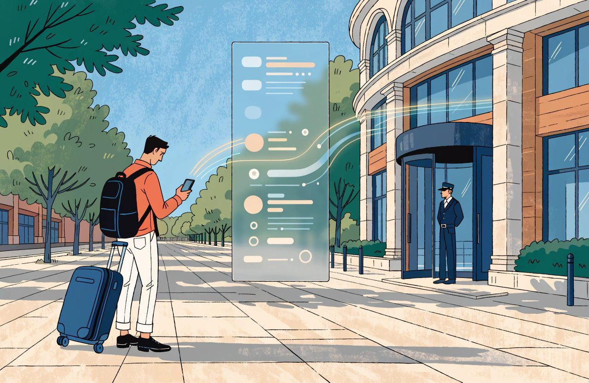
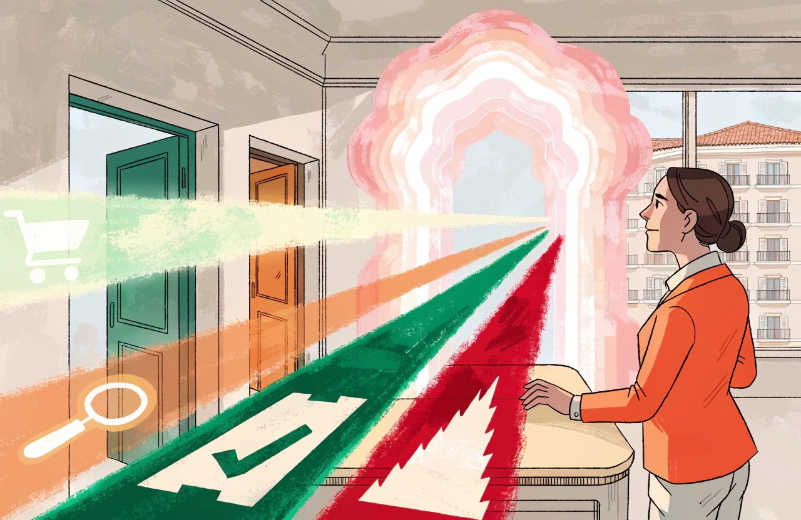

# The Complete Guide to AI, Automation and Agents in Hotels

*AI in hotels is not a robot at reception. It is a decision layer sitting on top of the commercial data you already keep.*

Two things are true at once.

Most conversations about artificial intelligence, or AI, in hotels manage to hold only one of them.

The first is that a machine cannot want anything.

It will never fall in love with your sea view, remember the duty manager who found a dry room on a wet Tuesday, or taste the difference between a good breakfast and a resentful one.

The second is that a machine very often stands between your hotel and the human who might have felt all of those things. It reads your prices, your booking rules, your room descriptions and the rooms you have left. From that reading it helps decide what a traveller is shown. **Machines cannot fall in love with your hotel. They decide whether a human ever gets the chance to.**

*Machines cannot fall in love with your hotel. They decide whether a human ever gets the chance to.*

One correction before we go further, because it changes where you spend. Clean data is not the only thing that moves your position on a big platform. Money moves it too, and the platforms say so themselves. Expedia states that it may put properties offering more commission higher in its results. Booking.com's Visibility Booster works by moving a commission slider. Where you land in Google Hotel Ads depends partly on what you bid. So treat your data as the thing that gets you listed and turns a look into a booking. Treat paid position as a separate cost you measure. How ranking works belongs to the Distribution and Connectivity guide and the Market Intelligence and Analytics guide. This domain is about the decisions.

That is the gap.

Most of what you are sold under this heading is a decision layer. It sits on top of your commercial data and makes choices out of it. So it inherits the quality of that data. **Garbage in, garbage out, at scale.** Take a hotel with forty-seven rate plans, which are the priced packages it sells its rooms under. Twelve are dormant. Three are the same product under different names. That hotel does not get a better outcome by putting clever software on top. It gets a confident wrong answer, faster, and with a better vocabulary.

There is a second question about your data that nobody asked five years ago.

It is not about quality at all.

It is about **whose data it is**. Public information, your own confidential information and your competitors' confidential information are three different things in law. By August 2026 that difference has regulators and courts attached to it. That gets its own section below.

This is written by a practitioner, not an evangelist. What follows is the mechanics. What these systems are. Why a price you cannot explain is a price you cannot defend. And how to tell an agent shopping for a guest from one helping itself to your rates.

## The Short Version

- Machines cannot fall in love with your hotel. They decide whether a human ever gets the chance to.
- Most of what is sold as AI is a decision layer sitting on your commercial data, so it inherits the quality of that data. Garbage in, garbage out, at scale.
- Every serious revenue management system runs forecast, then optimiser, then price. Your own commercial rules set the optimiser up. They do not replace it.
- Being right earns trust; explanation calibrates it. A price the system cannot justify is a price the revenue manager cannot defend, and cannot learn from.
- Consultation and autopilot are two honest operating models, not rungs on a ladder. Set floors, ceilings, scope limits and a stop control before you let anything run.
- Whose data goes into your pricing engine is now a legal question. Published competitor rates are ordinary. Confidential figures pooled with competitors are what regulators are looking at.
- Agents are shopping your hotel at real volume and buying very little. Plan for shopping now. Watch for booking.

## AI Fundamentals for Hotels

### Rules, Models, Generative AI and Optimisation Are Different

Several quite different things get sold to you under one word.

Telling them apart is the first thing to learn, because each fails differently.

- Rules. A person writes the logic. If a date gets fuller than a set level, and the arrival is fewer than a set number of days away, close the discounted rate. Rules are fixed and, in the honest sense, stupid. They do exactly what you said, including when what you said stopped making sense in April. You can read them back and check them, though a few hundred interacting rules that nobody has read since 2019 are not being checked in any useful sense.
- Statistical models. This is what machine learning usually means in a commercial hotel setting. You feed them your history, they find the patterns in it, and they produce a number. They do not know why anything happens. Only what has tended to follow what.
- Generative models. These produce language, images or code that reads well. Superb at fluency, weak on truth, and a well-written wrong answer is the dangerous kind.
- Optimisation. This is the one almost nobody explains to you, and it is the one that actually sets your price. It takes the forecast. It adds how many rooms you have, the limits you have set and what you told it to aim for. Then it works out the best decision available. It is maths. Not a rule, and not a prediction.

**Confusing them is expensive.** You do not want a generative model setting your price. You do not want a rule about booking volumes writing to a guest whose flight has been cancelled. That is a judgement about who holds authority, not a ban on the technology. A generative model reading event listings, or writing out the reasons behind a recommendation, is a reasonable thing. The question is always which part of the system is allowed to write a price, and under what controls.

### Forecast, Optimiser and Price Are Separate

A prediction is not a decision.

*A prediction is not a decision. Forecast, optimiser and price are three separate steps, and the middle one is what sets your rate.*

Software that says thirty-two rooms will be booked for the fourteenth has not told you what to charge.

But be careful how you finish that thought, because the obvious ending is wrong. The gap between the forecast and the price is not empty, and it does arrive in the box. It is the optimiser. Every serious revenue management system, meaning the software that works out what you should charge, runs forecast, then optimiser, then price. Your own commercial rules set the optimiser up. They do not replace it.

That is not a fussy point.

It is the difference between understanding your system and being baffled by it. Believe the system runs forecast, then your policy, then price, and three ordinary things it does will make no sense at all:

- It declines a three-night stay at a rate you would happily take, because two of those nights are worth more to somebody else.
- It protects rooms it has not sold and shows no sign of selling. The arithmetic says a later, higher-paying booking is likely enough to be worth the risk.
- You override one date and the recommendation on a neighbouring date moves, because the two dates are competing for the same rooms.

None of that is policy. All of it is the optimiser doing its job. If your supplier cannot describe this part in plain language, you are being sold a product nobody in the room understands.

### Data Foundations Decide the Quality of the Output

And let us be honest. Most disappointment traces back to the foundation. Consider two hotels. One has four room types, one main rate that the others are worked out from, and booking rules applied the same way everywhere. It applies them in whichever system is in charge of its prices and its free rooms. That might be the property management system, the PMS, which holds the rooms and the bookings. It might be the channel manager, which pushes prices and availability out to the booking sites. It might be a central reservation system sitting above both. The other hotel has rate plans built for a tour operator who no longer exists, and two room types that are physically identical. Give both the same software. The first gets a sharper answer. The second gets a fluent one.

**This is not an AI problem. It is a data-foundation problem.**

Solve it before you buy anything.

### Cleaning the Data Can Damage the History

One warning, because the standard version of this advice, mine included, is too breezy. Working out what a cleaner set of rooms and rates should look like takes a fortnight. Actually doing it is a change programme. And it has a cost the brochures do not mention. Tidying up often destroys the history the software needs.

The vendor documentation is blunt about this. Delete a room type in some systems and the occupancy history of those rooms is erased with it. Move rooms between types and your reports compare a period before the change with a period after it, which is not a comparison at all. Rate codes often cannot be deleted while future reservations or dependent codes exist. In one major property system, room type is simply not changed on reservations for past dates, so a permanent seam runs through your history. And at least one revenue system carries a warning. Shift fifteen per cent or more of your capacity between room classes and its forecast and its decisions may change significantly.

So sequence it properly instead of doing it in a rush. Stop creating new mess first. Close what is dormant rather than deleting it. Merge duplicates deliberately, on a date you record, with a written note of what changed. Expect your year-on-year comparisons to carry a scar for a year. That is still worth doing. It is just not a fortnight, and anyone who tells you the trade-off does not exist has never done it on a live system.

## Forecasting and Machine Learning

A forecast is a statement about the future.

A good one says how sure it is.

You will hear a stronger version of that, and I have said it myself. A number without a range is not a forecast at all. That is wrong, and the forecasting textbooks are clear about it. A single number is called a point forecast, and it is a forecast. Insist otherwise and you rule out almost all the forecasting done anywhere in the world. When a definition does that, the definition is broken, not the practice.

The useful version is sharper and more annoying for suppliers. Serious revenue systems already work demand out as a range inside themselves. They have to. Holding a room back for a better booking only adds up if you know how likely each outcome is. What they mostly do not do is show you that range. So the question to ask is not whether they know how uncertain they are. It is why you cannot see it.

### Constrained Demand, Unconstrained Demand and the Decision

Three numbers get muddled constantly, and the muddle costs money:

- What you will actually sell. Held down by how many rooms you have, the rules you set and the price you charge.
- What people would have bought if nothing had stopped them. The trade calls this unconstrained demand. It includes the bookings you turned away by being closed, by being sold out, or by demanding a minimum stay. Harder to work out. More useful.
- What you should sell. That is a decision, not a forecast.

Note what is not in the second one. Demand you lost because you were expensive does not belong in unconstrained demand. That is people reacting to your price, and it belongs somewhere else. It belongs in the picture the optimiser holds of how many people buy at each price. This sounds like vocabulary and it is not. Put price-lost demand into your unconstrained forecast and watch what happens. The software learns that demand is lower than it is. It prices down to meet it. It sees the lower demand confirmed. It prices down again. Revenue management researchers named this the spiral-down effect twenty years ago, and the better systems are built deliberately to avoid it. **Keeping the two ideas apart is how you stop your system talking itself into a discount.**

### Booking Curve, Pickup and Pace

Three words worth getting right, because your supplier will use them and you should not nod along. Bookings for an arrival date pile up over the weeks before it, and that shape is the booking curve. Pickup is the bookings added over a period, say the last seven days. Pace is how your curve compares with something else, usually the same point in a comparable period. Three different words. In academic papers pickup is also the name of a family of forecasting methods, which is a fourth meaning nobody needs on a Monday.

A revenue manager reads the curve against a comparable period. Software does something related, holding more things in view at once. Day of the week. How far ahead people are booking. What is on in town. What competitors have done. Which sources cancel most. How long people are staying. It is not doing the same thing a person does, and it is not thinking. But it holds all of that at three in the afternoon in a busy August without getting tired, and a person does not.

### Modern Revenue Systems Use More Than Your Own History

Now the thing almost everybody in this industry believes about these systems, which was true and is not any more. Modern revenue systems do not run on your own booking history alone. That was accurate about a decade ago. Read what the suppliers publish now and you find much more going in. How fast the whole market is booking, bought from a data company. How full your market expects to be, up to a year ahead. Rate shopping, which is the automated checking of what your competitors charge. Your reviews and your reputation. What each channel costs you to sell through. All of it feeds the forecast and the optimiser. Your own history is now one ingredient among several.

That matters in two directions. It means a supplier can genuinely help a hotel with thin history, which the old story said was impossible. It also means you should ask a question the old story never prompted. **Which outside data goes in? Where does it come from? Is it public, or is it pooled from your competitors?**

*Modern revenue systems no longer run on your own booking history alone. Ask which outside data goes in, and where it comes from.*

Hold on to that question. It comes back in the legal section, and it is the most important question in this article.

### Models Struggle Outside the Range They Have Seen

What software does not add is judgement about anything it has never seen. Take a model built on your own history with nothing in it about how people react to price. That describes most of what is on sale. It cannot tell you what happens above a rate you have never charged. Inside the range it has seen, it fills the gaps confidently. Outside it, it guesses badly.

Two honest qualifications. Some models are built as an actual formula linking price to demand. Ask one of those about any price and it will give you a number, because that is what a formula does. Whether the answer still means anything up there is the real question. And there is research on systems that try unfamiliar prices deliberately, to find out. As of August 2026 I can find no commercial hotel revenue system that says it does this. So the warning holds for the market you can actually buy from. It is a limit of the products, not a law of mathematics.

The same goes for a thirty-room hotel in a shoulder month, meaning one of the quiet months either side of your season. With one correction. More clever software does not create more of your history. It can borrow patterns from somewhere else, and that is exactly what the low-data end of the market sells. Demand across the market as a whole. What people are searching for. What events are coming. Methods that carry patterns across from hotels like yours. Work published in 2025, and checked by other researchers, shows this beating the standard benchmarks where local data is thin. So do not dismiss it. Ask where the borrowed patterns come from, and whether that market genuinely resembles you. In my experience no supplier documentation explains how the thin-data case is handled, and a supplier who cannot explain it is selling rather than advising.

### Measure Forecast Error Deliberately

Forecasts also go stale. A refurbishment, an airline route that changes, a type of guest that grows or dies, and the pattern the software learned is not the pattern you live in. So measure the errors deliberately, and ask your supplier how they measure them.

The industry's working answer is a measure called mean absolute percentage error. Say it out loud slowly, because it is built from three ideas and every one of them matters. Take one date. The forecast said forty rooms and you sold fifty, so the miss is ten. Absolute means you ignore whether you were over or under, so a miss of ten counts the same either way. Percentage means you divide that miss by what actually happened. Ten out of fifty is twenty per cent. Mean means you do that for every date and take the average.

Get the definition right, because the detail is where the traps live. That division by the actual is the whole mechanism, and it is also where every one of the measure's failures comes from:

- You cannot divide by zero. So the measure gives no answer at all when you sold nothing, and it swings wildly when you sold one or two. Which is precisely your shoulder season, your smallest room types and the dates still a long way off.
- It punishes forecasting too high harder than forecasting too low. So a supplier chasing a good headline number is quietly rewarded for forecasting low. Read that sentence twice before your next contract renewal.

So ask about the alternatives too. A weighted version copes better with the zeros and suits seasonal properties. A scaled version is what forecasting statisticians recommend as the general standard. Whichever you use, do this one thing. Insist on seeing the error split by how far ahead the forecast was made, rather than as one headline figure. That tells you where the system is reliable and where it is not, which is the only version of the answer you can act on.

## Explainability and Trust

### Explainability Turns a Number Into an Argument

Consider the difference between two outputs for the same night.

"Recommended rate: EUR 214."

"Recommended rate: EUR 214. Bookings for this date are running ahead of the same point in a comparable period, and the extra is corporate. Two of the three hotels you compare against moved up in the last published rate check. The rooms you have left are in the type that historically sells last. This would reverse if the next three days of bookings come in flat."

Identical number. Completely different thing.

The first is an instruction.

The second is an argument, and an argument is something a professional can accept, reject or improve.

Note the words "published rate check" in there. They are doing legal work as well as commercial work, and the legal section explains why.

**A price the system cannot justify is a price the revenue manager cannot defend, and cannot learn from.** Both halves matter. Nobody wants to sit in a Monday meeting explaining a rate they did not choose. The learning half is quieter. If you never see the reasoning, you cannot separate a decision that was right for the right reasons from one that was right by accident.

### What a Useful Explanation Contains

A usable explanation contains five things:

- The main reasons, in order, in business language rather than software language.
- The comparison base. Ahead of what, exactly.
- How sure the system is, and on how much data.
- What would change the answer. Most tools leave this out, and it is what turns a recommendation into a conversation.
- Somewhere to push back. Can you change it, does the system record that you did, and does it tell you what your change did to the dates around it.

That fifth one has better evidence behind it than most of the list. Give people a way to adjust what the software says, and their willingness to use it at all roughly doubles. Take that away and you do not get discipline. You get abandonment.

### Accuracy Builds Trust; Explanation Calibrates It

Now for the part everybody gets backwards, including me for years.

The line you will hear is that trust in automation is earned through explanation, not accuracy. **Being right earns trust. Explanation calibrates it.**

*Identical number, completely different thing. A bare rate is an instruction. A rate with reasons is an argument a professional can accept, reject or improve.*

The research is not close. If you want to know whether people will trust a system, how reliably it performs matters far more than how much it shows them. A 2025 review across ninety studies found a real link between explanation and trust, but a weak one, and concluded explanation is not the main factor. Explanation is what turns trust into good judgement about when to trust. It is not the thing that creates the trust.

The related claim needs the same treatment. A system that gives answers and no reasons, and is right nine times out of ten, does often get switched off after the tenth. That is real and well documented. People drop these systems after watching them get one wrong, even when they have just watched them beat a human. But the cause is not that nobody could explain it. The cause is that we forgive machines less than we forgive ourselves. The fix that tested best was not a better explanation. It was letting people adjust the answer, which more than doubled how many used it. Where the adjustment was kept inside limits, it improved accuracy too.

One finding in that research is aimed squarely at the readers of this article. Ordinary audiences tend to over-trust advice from software. Experienced professionals do the opposite. They lean on it less than beginners do, and in the study their accuracy suffered for it. If you have twenty years in revenue management, that is you. It is me too.

One caution before you demand explanations of everything. An explanation makes a person more likely to accept a recommendation, whether or not it is correct. In controlled work, a bare score of how sure the system was did about as well as a full explanation. Explanations help most when they make checking cheap. So pair every explanation with something you can verify in a minute, or you have bought confidence rather than judgement.

### Overrides Are Evidence, Not Automatically Failure

Then there are overrides, meaning the times a person changes what the system recommended. Here the received wisdom has the sign wrong.

You will hear that a system overridden constantly has stopped being a system and become an expensive opinion. It is a good line and it is not reliably true. One study looked at more than twenty million forecasts across 1,752 hotels. More user overrides improved accuracy on group business. They improved it during special events too. On transient business, meaning individuals booking for themselves rather than groups, they damaged it. An override is the human filling in what the software cannot see. With groups and around events, that is most of the value in the room.

**Read a high override rate as a symptom to investigate, not a verdict.** It means one of three things, and you can tell which. The system is set up wrong and needs fixing. Or the people are correctly supplying knowledge the software does not have, in which case the overrides will cluster on groups and events. Or people are overriding out of habit and discomfort, which shows up as overrides scattered evenly, with no pattern and no better outcome. Only the third one is the failure the line was reaching for.

Whichever it is, capture the overrides with a reason attached. And be more precise than the usual complaint, because the software is better than its reputation here. Major systems do capture a note against an override, and at least one tells its users always to write one. What almost nobody does is analyse them. The note is typed in freely rather than picked from a list, so it cannot be counted. No vendor I have found ships a report showing overrides by user, by reason, against what actually happened. That is a gap you can fill yourself with a spreadsheet, and it will make you better at this than your software.

## Automation and Guardrails

### Consultation and Autopilot Are Different Operating Models

There are two honest ways to run this.

Choosing between them is a strategic decision, not a rung on a ladder.

**Consultation:** the system proposes, a person disposes.

**Autopilot:** the system acts, a person reviews the exceptions. Both names are mine, used as general labels. Note that autopilot is also a product name, or a named setting, at several vendors. When a salesperson says it, check whether they mean the idea or the button.

The industry presents these as stages, with autopilot as the destination and consultation as a phase you outgrow. That framing is wrong.

It pressures hotels into automating decisions they should still be arguing about. A resort whose shoulder season turns on one event, with an owner who holds firm views on positioning, is not a less mature business for staying in consultation. A high-volume city hotel with steady individual bookings has the stronger case, because the number of trivial decisions is more than a person should spend a career on.

Two things have happened recently, and both make that argument stronger than it looks.

The evidence on behaviour is above. Removing the ability to override does not produce discipline. It produces people quietly working around the system. And the competition authorities have arrived on the same side. One of them settled with a pricing software company, and the terms of that settlement are the interesting part. Automatic acceptance of recommended prices had to be switchable hotel by hotel, and a person had to be able to change the price. The software could not be built to lean towards price rises by default, and it could not reward hotels for taking its advice. I am not naming the authority or the case, because a settlement in one country is not a rule in yours. Read the terms as a design brief instead. They describe consultation.

In between the two sit the arrangements most hotels actually run. Automate the next thirty days and manage the rest by hand. Automate individuals and never groups. Freeze specific dates. Automate the calendar but not the weekend of the marathon. **That is not a compromise. It is scope.**

Then ask the question that settles it:

**What will your team do with the time?**

*Consultation and autopilot are two operating models, not rungs on a ladder. Set the guardrails before you let anything run.*

If the honest answer is "nothing we have identified", you have built a case for cutting jobs rather than for automation. You will get neither the saving nor the judgement. That is my judgement rather than a finding. I could not find research either way on automation and revenue headcount in hotels. The closest hotel-specific evidence points to roles reshaping towards group and event exception work, rather than a clean block of freed-up time.

### Guardrails Need to Be Specific

Whichever model you choose, you want the same guardrails, meaning the limits you set before you let anything run. Split them into three groups, though, because presenting them as one list sets you up to be told no in a demo.

These exist, widely, and you should expect them:

- Floor and ceiling prices, per room type and per season, set by a human and respected absolutely. Check how they are held. In at least one major system they are a one-off override rather than a standing rule for the season. That works very differently from what you probably have in mind.
- Scope limits. Which channels, room types and date ranges the automation may touch, and which it may not. Freezes on single dates as well as on ranges.
- A stop control somebody can reach at eleven at night without a support ticket. This exists, and you can do it yourself, in the products I have seen.

These half exist:

- A log you can read. What changed, when, and on whose authority is generally there. Why it changed is generally not. Some systems will explain the current recommendation on screen, which is not the same as a record you can read back three weeks later. Assume you will have to build the why yourself.

And these two are the ones everyone recommends, including me. As of August 2026 I cannot find either documented by any major revenue system:

- A cap on how far a price can move in one run, so no overnight sequence can wreck a week. The nearest thing on the market is the opposite: a minimum change size, below which the system does not bother. A narrow gap between your floor and your ceiling is the practical substitute, and it is not the same control.
- Sign-off limits, where anything outside a defined range goes to a person first. Property systems do have sign-off steps for setting up rate codes. Sign-off on a single price, triggered by how big the change is, is not something I can show you in a product.

Ask for both anyway. Ask in writing. A vendor who hears the request from thirty hotels builds it.

One argument you should expect from your own side of the table. Your financial controller will object to a duty manager being able to touch pricing automation at eleven at night, and they are right to raise it. Keeping the two jobs in different hands is not bureaucracy. Resolve it by separating the two powers. The night manager can stop the automation. The night manager cannot set a price. Stopping is a safety control. Pricing is an authority. Write it that way in the permissions and the objection goes away.

### Monitor for Silence

The failure nobody plans for is the silent one. A feed breaks, the system stops updating, and nothing visibly goes wrong because nothing goes at all. Rates sit frozen through a rush of demand. **Set an alarm for nothing happening, not only for something happening.**

I have looked for a vendor that offers this and I have not found one. That makes it more important, not less. It means the alert is yours to build, out of a report and a calendar reminder if that is all you have. You run a night audit, the nightly check of the day's figures, even when the system is reliable. Automation should free people to do the judgement work, not replace the judgement.

## Automated Pricing and the Law

Of everything in this domain, this is the part that moved most in the last year, and it is now the part I would read first. I am not a lawyer and none of this is legal advice. Get advice for the countries you trade in. What I can do is tell you which questions decide the answer, because most of the risk comes from two of them.

### Whose Data Goes Into the Pricing Engine?

The first question is the most important one:

**Whose data goes into your pricing engine?**

*Looking up published competitor rates is ordinary practice. Pooling confidential figures with your competitors and letting one system price all of you is a different thing entirely.*

Looking up your competitors' published rates is ordinary practice and has been for thirty years. Now put your own confidential figures into a shared system, alongside your competitors' confidential figures. Then let that system tell all of you what to charge. That is a different thing entirely. That is the line the whole current wave of enforcement runs along, and almost nobody in a hotel commercial meeting knows the line is there.

Here is where things stood in August 2026.

- A national competition regulator opened an investigation into hotels in early 2026. It is looking at whether they have been competing properly. What it suspects is that competing hotels passed commercially sensitive information to each other through a company that handles hotel data. It was still open in August 2026, and still gathering evidence. Nobody has been formally accused and nobody has been found to have broken the law, and neither should be assumed. I am not naming the regulator or the businesses, because nothing is settled and none of it is a ruling anybody can rely on. But note the shape of who gets drawn in. It is not only the software company. It is the data business and the hotel groups feeding it.
- In one large market, two appeal courts looked at hotels using the same pricing software and reached opposite conclusions within a year of each other. One threw a claim out, because each hotel had bought the software on its own. The other let a claim carry on. I am not naming the courts or the cases, because a judgment in one country decides nothing in yours. What separated them was the facts, and the facts are the part worth memorising. In the claim that survived, the hotels put their own confidential prices and occupancy into the shared system. The system worked on data from all of them. Each hotel knew its competitors were feeding the same system. And they accepted the recommendations roughly nine times out of ten. Those four facts make a useful checklist for your own arrangement, wherever you trade.
- The settlement mentioned in the last section reads like a design brief, and that is how I would use it. No confidential competitor data used at the moment a recommendation is made. Any competitor data used to train the software to be at least a year old. Automatic acceptance switchable, and a person able to change the price. No leaning towards price rises by default. Floors and ceilings set by the operator, and set the same way in both directions. None of that binds a supplier outside the country it came from. It is still the clearest published description of what a cautious design looks like.
- Some places have gone further and written the point into a statute. One has a law in force from the start of 2026 covering any pricing method used by two or more businesses which draws on competitor data to influence a price. It is not limited to one industry. It also makes it easier for someone to bring a claim. A hotel there, using an outside revenue system fed with competitor data, falls inside it. I am not naming the place, because the only version that matters to you is the one where you trade. Ask a local lawyer whether anything similar exists near you.

I have not seen a comparable body of enforcement aimed at hotels anywhere else yet. Whether one follows in the EU is not something anybody can tell you today.

What to do about it is less dramatic than it sounds.

1. Ask your revenue system supplier one question in writing. When your software works out my price, does it use competitor data that is not public, and if so, whose? Published rates, looked up the ordinary way, is a good answer. Confidential data pooled from my direct competitors is an answer you take to a lawyer.
2. Ask the same of your benchmarking provider, about what you put in and who else can see it, in what form. Added together with others and stripped of names is a real distinction, and it is worth understanding how yours works.
3. Notice the sting in the tail about following the advice. A very high acceptance rate was one of the facts that kept a claim against a hotel group alive. So a record of your overrides, with reasons, is no longer just good management. It is evidence that you priced independently, and evidence is exactly what you will want if anybody ever asks.
4. Notice the irony, because it is the strongest argument in this article. What all of these interventions have in common is a person in the loop, a price anybody can change, and no automatic drift upwards. That is consultation. The model I have been defending as a legitimate destination rather than a phase is now the one with a legal case behind it.

### Dynamic Pricing and Personalised Pricing Are Different

The second question is different:

**Is the price the same for everybody, or tailored to a person?**

Dynamic pricing means the price for a given room on a given date moves with demand, competitors and the rooms you have left. Everybody who looks sees the same number. That is the ordinary business of this domain. As long as no personal data is used to set the number, data protection rules do not generally come into it.

Personalised pricing means a different price or offer for one named individual. It is based on their profile, their loyalty history, their device, or a guess at what they will pay. That is a different regime, and crossing into it is easier than you think. It usually starts with somebody suggesting you feed the guest database into the pricing model.

If you cross that line, two obligations arrive that a revenue manager would never think of.

- In the EU, you must tell the customer, before they are committed, that the price was set for them personally by an automated system. This one has a proper reference. Directive (EU) 2019/2161, the Omnibus Directive, inserted point (ea) into Article 6(1) of Directive 2011/83/EU, the Consumer Rights Directive. The wording is that the trader must inform the consumer, where applicable, that the price was personalised on the basis of automated decision-making. Member states have applied it since 28 May 2022. It is not new and it is widely ignored.
- Elsewhere the duty goes further than simply telling somebody. At least one market has required a specific worded notice since late 2025, saying in terms that the price was set by an algorithm using personal data. Hotels are not exempt from it. I am not naming the market or quoting the wording, because a notice written for one place is no defence in another. If you sell into a market like that, get the exact wording locally.

European data protection law may come into it too. Regulation (EU) 2016/679, the General Data Protection Regulation, carries its own rules for decisions made about an individual by machine. There is also a point running through the case law that is worth knowing, without leaning on any one judgment. Where a score effectively settles the outcome, it can be treated as the decision itself, even where a person formally signs it off. A rubber stamp is not automatically a human decision. So if someone proposes personalised pricing, involve a lawyer. Do not build a trial version first.

### The EU AI Act Matters in Specific Places

Then there is the EU AI Act, the European law on artificial intelligence, which people worry about in the wrong place. Its proper name is Regulation (EU) 2024/1689, of 13 June 2024.

The part that matters to a hotel is Article 50, headed transparency obligations for providers and deployers of certain AI systems. It has applied since 2 August 2026. Article 50(1) puts the duty on providers. They must design systems that interact directly with people so that those people are informed they are dealing with an AI system. That duty falls away only where it is obvious anyway. So your web chat, your WhatsApp handler and your voice agent need to say what they are. Strictly the duty sits with whoever built the system, not with you as the buyer. But put your own name on it, or change it substantially, and you can inherit it. Either way it is your guest who has to be told. So check it is happening. If you run software that reads emotion in guest calls, or you publish AI-generated images or video, there are further transparency duties in the same part of the Act. I am not setting them out here, because the detail matters and it runs longer than a bullet. Ask which of them apply to what you actually run. A separate duty in the same Regulation has been in force since February 2025. It asks you to make sure the staff who use these systems understand them well enough to use them properly. That one is easy to meet and easy to forget. Write down what training you gave, and when.

And now the reassuring half, which nobody selling compliance services will tell you. Hotel revenue management and dynamic pricing are not on the EU's high-risk list. The pricing entry on that list covers life and health insurance. So your revenue system does not need to be formally certified. If somebody tells you it does, ask them to point at the clause in Regulation (EU) 2024/1689. That list can be amended, so it is worth rechecking once a year. A later EU package pushed some of the high-risk duties back into late 2027. The transparency duties above were not pushed back. They apply now, and that is the part to act on.

If you take one thing from this section, take this: **The mechanics of pricing automation did not change in 2026. What changed is that whose data goes in, and how obediently you follow what comes out, now have legal consequences.**

## Agents and Agentic Booking

### Shopping Is Here; Booking Is Still Small

An agent is software acting on someone's behalf, with some freedom to decide for itself. It reads, it compares, and sometimes it buys. That last one is where hotels need to pay attention, and it is also where the honest answer is that it is not happening much yet.

Put a date on this, because it will change. In August 2026, agents are shopping your hotel at real volume and buying very little. The largest online travel group reported bookings sent to it by AI at under one per cent of room nights in the second quarter of 2026. Google began limited testing in the United States of assistants that book hotels directly, in early August 2026. One large AI company moved checkout out of its chat product in March 2026. Several assistant features that look like booking are really a handover. The assistant shows you the hotel, then sends you to the partner's site to finish. Meanwhile travel is a substantial share of the traffic coming from browsers that act for you. Individual sites report agent traffic in the high single digits as a share of visits.

So the load is here and the revenue is not, yet. Nobody knows when that flips, or which of them wins when it does. Anybody who tells you they know is guessing with a straight face. **Plan for shopping now. Watch for booking.**

### Four Kinds of Agent Traffic

**Not every agent is a guest.**

*Not every agent is a guest. Four different things arrive at your door wearing similar clothes, and they deserve genuinely different treatment.*

At minimum, four different things arrive at your door wearing similar clothes:

- Shopping agents acting for a real traveller with real intent. Genuine demand, arriving through an unfamiliar door.
- Research and scraping agents gathering your rates for somebody else's database. Load on your systems, no revenue.
- Buying agents that mean to complete a booking. They need your payment terms, your deposit rules and your cancellation policy in a form they can act on.
- Abusive traffic. Card testing, poking at your availability, pretending to be something they are not.

Those four cost you very different amounts and deserve genuinely different treatment.

Tell them apart, then decide what each is permitted to do.

### Identity Works Better in Contracted Channels Than on the Open Web

But be honest about where you can actually tell them apart, because it depends entirely on which door they came through.

Inside a channel you have a contract with, it works. Your booking API. An API, an application programming interface, is the structured door into your systems that other software connects through. Your payment provider is another such channel, and so is a platform's own set of rules for agents. In all of those, an agent can be identified, held to one purpose, and given a spending limit. The card networks have shipped exactly this kind of machinery through 2025 and 2026: signed passes that expire, and that work for one purpose only.

On your public website, as of August 2026, it mostly does not work. The identity standard people point to as the answer is one person's draft with no formal standing. Around four in five AI agents carry no identity you can check. One security firm faked the label a well-known assistant uses and sent it at nearly 700,000 sites. Roughly four-fifths let it through. Browsers that act for a user look like ordinary Chrome and are hard to tell apart from it. The file people add to their sites to instruct AI crawlers is almost entirely ignored. One study of 137,000 domains found 97 per cent of those files received no requests at all. And one major provider states plainly that when a person asks for a page, its crawler rules may not apply.

There is a deeper limit that will not be fixed by better plumbing. **Even a perfect signature proves which software is calling. It never proves that a human asked it to.**

So say which of the two you mean when you write your policy. In your contracted channels, per-agent permissions are real and worth setting up now. On the open web, work with whoever serves and protects your website. Accept that you are managing traffic rather than working out what anybody wants. And revisit it every quarter, because this is the fastest-moving thing in the article.

Blocking everything is a decision.

Allowing everything is also a decision, usually an unexamined one. Make it yourself, in writing, with a review date. One footnote for anyone tempted to organise a joint response. Competitors agreeing among themselves how to treat a channel is the kind of arrangement competition law looks at hardest. An industry-wide agreement to block agents would sit squarely in that territory. Whether it crosses a line where you trade is a question for a competition lawyer, and it is worth the fee. Decide for your own hotel.

### What an Agent Actually Needs

What an agent needs from you is unromantic. It is also not all in your hands, whatever you have been told. For an independent hotel most of this list belongs to a supplier, which changes what you should do about it:

- Complete commercial detail, held in separate labelled fields rather than buried in prose. What the rate includes. What the room contains. The deposit rule. The cancellation deadline. This one is genuinely yours.
- Prices and free rooms fresh enough to be honoured. How that behaves is set by whichever system is in charge of your prices and rooms, and by the route out to each channel. Yours to specify and to test, not yours to build.
- A sane API. It should not choke off legitimate shopping by capping how often anyone can ask. Its labels for your rooms and rates should stay the same. Its answers should be predictable. That door belongs to your booking engine or your central reservation system supplier. All you can do is choose them well and lean on them.
- Clear permissions on who may look, who may quote a price and who may buy. Real inside a contracted channel, as above. Note that in the versions that have actually shipped, the spending limit is usually set by the traveller's bank or wallet, not by you.

What is fully in your hands is this. Whether your content is complete. Whether your rate plans are tidy. Whether your policies are held as separate fields. And which suppliers you buy from and lean on. That is still a strong list. It is just a different one from the list usually given.

### Stored Prices Are Normal; Commitment Needs a Live Check

Now the requirement everybody states and almost nobody examines. You will read that an agent needs live rates and availability, not a stored copy.

The worry underneath that is right and important. An agent must not quote a price you will not honour. But the picture of the plumbing is wrong. Almost nothing in hotel distribution is live, including Google's. Its own documentation says stored prices stay in place until you update them, or until its systems judge them too old. It stores the answer to a live pricing question like any other message. The whole system for prices and free rooms is built to be pushed into a store. You send messages. The platform holds them. Online travel agents store prices for minutes and descriptions for days. And agent traffic is pushing the industry further into stored copies rather than out of them. A shopping agent looks far more often than a human does before it buys. The distribution firms are answering that by working out answers in advance and storing them, not by making more live calls. The published figures on that are from the airline side, and hotel availability behaves differently, so do not carry the numbers across.

**The requirement is that you will honour the price, not that the price is live.** Which gives you two things to actually ask for:

- Push changes out fast enough that the stored price stays a price you will honour. Then measure how long that takes in practice, per channel.
- Insist on a live check at the moment of commitment. This is what Google's lodging protocol does, meaning the set of rules a hotel must follow to sell there. Before it enables the Book button, it checks price and availability against your API in real time. That is the right pattern, and it is the one to ask your booking engine about.

### Facts Matter More Than AI-Specific Markup

Which brings you back to content, where the usual diagnosis is wrong even though the advice mostly survives. Consider two descriptions of the same room.

"Our Deluxe Sea View rooms offer a truly memorable escape, where comfort meets tranquillity."

"Deluxe Sea View. 28 square metres. Sea facing, private balcony. King bed, or twin on request. Sleeps two adults plus one child."

The first is written for a person who has decided to read. The second is written for anybody, human or machine, who wants to know what they are buying.

The usual claim is that the difference is whether a machine can read it, and that the structured version decides whether the human version is ever shown. The evidence does not support that. Language models read prose perfectly well, which is the entire point of them. Some sites add hidden labels in their page code to tell machines what each item is. A controlled study of nearly 1,900 pages added those labels and found no meaningful lift in how often AI quoted them, against a control group. In one test, an address placed only inside deliberately broken labels was still extracted correctly, which tells you the labels were being read as text. And Google, as of mid-2026, publishes no special hotel or lodging listing format at all.

The real difference between those two descriptions is facts. The first one contains none that anybody, human or machine, could act on. **Write facts and you serve both readers.**

Notice what is not in that second description, because the version you normally see makes the mistake this article opens by criticising. Breakfast included, and free cancellation until 14:00 two days before arrival, are not facts about the room. They are facts about the rate plan. The same physical room sells under a flexible rate, a non-refundable rate and a package, with different answers for each. Putting them in the room description is exactly the muddle that produces a messy set of rooms and rates. It is also the error that breaks your connections out to the booking sites. A room with a cancellation policy baked into it cannot be matched cleanly to anything. Keep the room facts with the room and the commercial terms with the rate plan.

Where structure genuinely is mandatory is one layer down, and it is not on your website. It is the feed carrying your prices and free rooms, and your booking API. Google's lodging protocol will not work at all without a live pricing API. As one distribution executive put it this year, it is standards, not sentences.

**If you can only fund one thing, fund the wiring rather than the labels.** And write the facts anyway, because they cost nothing and they serve the human who is going to read them.

## Common Questions

### What is the difference between a forecast and an optimiser?

A forecast says what is likely to happen. An optimiser decides what to do about it. Every serious revenue management system runs forecast, then optimiser, then price. Your own commercial rules set the optimiser up rather than replacing it.

### Can AI set hotel prices without a human?

Software can set prices, and there are two honest ways to run it. Consultation means the system proposes and a person disposes. Autopilot means the system acts and a person reviews the exceptions. Choosing between them is a strategic decision, not a rung on a ladder.

### Is using revenue management software anti-competitive?

Looking up your competitors' published rates is ordinary practice. Putting your own confidential figures into a shared system alongside your competitors' figures is different. Competition regulators and courts in more than one country are examining exactly that pattern, and none of it is settled yet. Ask your supplier in writing whose data sets your price. Then take the answer to a competition lawyer where you trade.

### What is the difference between dynamic pricing and personalised pricing?

Dynamic pricing moves the price for a room and date with demand, competitors and the rooms you have left. Everybody who looks sees the same number. Personalised pricing sets a different price for one named individual. That brings disclosure duties. In the EU the duty comes from Directive (EU) 2019/2161, which added point (ea) to Article 6(1) of Directive 2011/83/EU and has applied since 28 May 2022. Some other markets have their own worded notices, so check where you sell.

### Does the EU AI Act apply to hotel revenue management?

Hotel revenue management and dynamic pricing are not on the EU high-risk list. The pricing entry on that list covers life and health insurance. What does apply is disclosure. Article 50 of Regulation (EU) 2024/1689 has applied since 2 August 2026. Under Article 50(1), a person dealing with your chat or voice agent has to be informed it is a machine, unless that is obvious.

### How do I measure whether my hotel forecast is any good?

Mean absolute percentage error is the industry's working answer. Take the miss on each date, ignore the direction, divide by what actually happened, then average. Watch two traps. The measure breaks near zero, and it punishes forecasting high harder than forecasting low.

### Is a high override rate a sign the system is failing?

Overrides are evidence, not automatically failure. One study of more than twenty million forecasts across 1,752 hotels found overrides improved accuracy on group business and around special events. On transient business they damaged it. Read a high rate as a symptom to investigate.

### Do AI agents actually book hotel rooms yet?

Agents are shopping at real volume and buying very little. The largest online travel group reported bookings sent to it by AI at under one per cent of room nights in the second quarter of 2026. Several assistant features that look like booking are really a handover.

### Do AI agents need live rates, or is a stored price acceptable?

Stored prices are normal across hotel distribution, including Google's. The real requirement is that you will honour the price, not that the price is live. Push changes out fast enough to keep the stored price honest. Insist on a live check at the moment of commitment.

### Does structured markup help AI find my hotel content?

Facts matter more than AI-specific markup. A controlled study of nearly 1,900 pages added hidden labels and found no meaningful lift in how often AI quoted them. Language models read prose perfectly well. Where structure is genuinely mandatory is your pricing feed and your booking API.

## Key Terms

- **Optimiser.** The part of a revenue system that turns a forecast into a decision. Optimisation is maths, not a rule and not a prediction. It is the part that actually sets your price.
- **Generative model.** A model that produces language, images or code that reads well. Superb at fluency, weak on truth. A well-written wrong answer is the dangerous kind.
- **Unconstrained demand.** What people would have bought if nothing had stopped them. Includes bookings turned away by a closure, a sold-out date or a minimum stay. Demand lost to your price does not belong in it.
- **Spiral-down effect.** The loop that starts when price-lost demand goes into the forecast. The system learns demand is lower, prices down, and sees the lower demand confirmed. Revenue management researchers named it twenty years ago.
- **Booking curve, pickup and pace.** Bookings pile up over the weeks before an arrival date, and that shape is the booking curve. Pickup is the bookings added over a period. Pace is how your curve compares with a comparable period.
- **Mean absolute percentage error.** The industry's usual measure of forecast error. Divide each date's miss by what actually happened, ignore the direction, then average. Ask to see it split by how far ahead the forecast was made.
- **Consultation.** An operating model where the system proposes and a person disposes. Consultation is a legitimate destination, not a phase you outgrow.
- **Autopilot.** An operating model where the system acts and a person reviews the exceptions. Autopilot is also a product name at several vendors, so check whether a salesperson means the idea or the button.
- **Guardrails.** The limits you set before you let automation run. Floors and ceilings per room type, scope limits, date freezes, and a stop control somebody can reach at eleven at night.
- **Override.** A change a person makes to what the system recommended. Capture every one with a reason attached. A record of your overrides is also useful evidence that you priced independently, if a competition question is ever raised.
- **Agent.** Software acting on someone's behalf, with some freedom to decide for itself. Agents read, compare and sometimes buy. Not every agent is a guest.
- **Personalised pricing.** A different price or offer for one named individual, based on their profile, loyalty history, device or a guess at what they will pay.

## How This Connects to the Wider Hotel Technology Stack

AI and automation sit on top of almost every other hotel technology domain, so the boundaries matter.

- **[Hotel Operations and PMS](../hotel-operations-and-pms/)** holds much of the operational record: arrivals, no-shows, room status and the in-house stay. AI can use that record, but it cannot repair inconsistent source data after the fact.
- **[Distribution and Connectivity](../distribution-and-connectivity/)** is where automated decisions are carried into market through rates, availability and restrictions. Agent traffic may enter through many different doors, not only the distribution layer.
- **[Direct Booking and E-commerce](../direct-booking-and-e-commerce/)** owns the conversion journey. What an agent needs from the booking engine to complete a purchase, including the final live check of price and availability, sits on that border.
- **[Revenue Management](../revenue-management/)** is the discipline; this domain is the machinery. Revenue decides who to target and what commercial strategy to pursue. AI determines who or what makes the decision and under which guardrails.
- **[Market Intelligence and Analytics](../market-intelligence-and-analytics/)** supplies rate shopping, benchmarking and demand signals. This domain determines how automated systems use those inputs and raises the question of whether the underlying data is public, pooled or confidential.
- **[Guest Technology and CRM](../guest-technology-and-crm/)** owns the guest relationship. Machine-written communication, personalisation and disclosure that a guest is interacting with AI sit on the boundary between the two.
- **[Payments and Financial Technology](../payments-and-financial-technology/)** contains some of the hardest unresolved questions around agent-initiated transactions, seller risk, authentication and disputes.
- **[Sales, Groups and MICE](../sales-groups-and-mice/)** is no longer a purely manual world. Structured group pricing, instant-bookable meeting space and automated proposal responses already exist, while large complex business still needs negotiation and judgement.
- **[Data, APIs and Integration](../data-apis-and-integration/)** is the foundation. Labels, interfaces, rate limits, event notifications and data quality all determine whether the decision layer can work at all.
- **[Hotel Technology Strategy](../hotel-technology-strategy/)** owns the buying decision and the prior question of whether a process should be automated in the first place.
- **[Emerging Hotel Technology](../emerging-hotel-technology/)** is where immature categories sit until they become stable enough to operate a hotel on. Agentic booking is currently crossing that boundary.

## Related Reading

- **Agentic AI Is Already Booking Your Rooms. Not Every Agent Is a Guest.**

As the wider article library grows, the most relevant supporting pieces can be added here in batches.

The technology here will keep changing shape, and most of what is written about it will be written by people selling something. The mechanics underneath change far more slowly. Get your commercial data clean. Know whose data is going into your pricing. Insist on explanations you can repeat to an owner. Set the guardrails before you set anything free. And decide deliberately what an agent arriving at your hotel may do.

I would rather be corrected than agreed with. If something here does not match what you see in your own hotel, tell me, and tell me what you saw.
