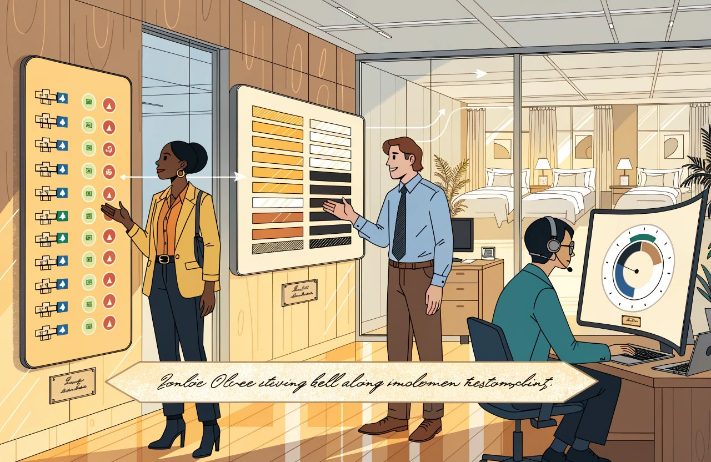

# The Complete Guide to Hotel Data, APIs and Integration

*Every system around the hotel is passing data to the others. Whether those pipes carry the same meaning at both ends is the whole subject.*

Hotels buy systems on the strength of a demo.

Then they live with the wiring.

The demo shows a feature working on clean data that somebody prepared.

The wiring decides whether that feature will ever see correct data at all. Most of the disappointment in hotel technology sits in that gap. The forecasting tool that cannot forecast, because nobody ever paired up your segment codes with its own. The report that disagrees with another report. The rate that reached one channel and not another. The meeting where four people with four screens all give a different occupancy figure for last Tuesday.

The trade word for a link between two systems is an integration.

That is all it means: a pipe that carries data from one system to another.

This guide is about those pipes.

Nothing here is glamorous, and no guest ever sees any of it.

But every ambition in every other article in this series is capped by it. A pricing model. A tool that tailors offers to each guest. A rate feed a machine can read. All of them rest on the same two questions. **Does the data mean the same thing in both systems? And does it get there reliably?**

*The demo runs on clean data somebody prepared. The wiring underneath decides whether the feature ever sees correct data at all.*

What follows is practical. Not how to write code. What to ask, what to insist on in a contract, and which of these choices are costly to undo.

## The Short Version

- Hotels buy systems on the strength of a demo and then live with the wiring. The demo runs on data somebody prepared. The wiring decides whether the feature ever sees correct data.
- Ownership has to be written down field by field. Availability alone means three things with three owners. Two systems writing on purpose is fine. Two writers nobody declared is the usual root cause.
- Mapping is the actual link, not the format. Your room and rate codes are yours, so no standard can ever pair them up for you.
- Freshness should follow what breaks. Availability and restrictions move in seconds. Opt-outs and delete-me requests belong in the fast group too, because a campaign can go out inside the hour. That one is a legal duty as well as a courtesy, and the detail of it is set in your own country.
- Failed messages need a named owner and a set time to review them. Add a scheduled comparison of both sides, because a deletion never shows up in a list of changes.
- History is the reason a hotel builds a warehouse. Recording is cheap and perishable, so start now. Modelling is expensive and repeatable, so do it later against named questions.
- Links are a running cost rather than a project. Ask for the API guide, a sandbox, a readable integration record, and how long that record is kept.

## Integration Fundamentals

Hotels run a set of separate systems, each good at one job. I expect that to hold for the rest of my working life, because the jobs really are that different. The one system that does everything has been promised for as long as this industry has had software.

That is my expectation, not a law of nature, and the market does push the other way. Several of the bigger suppliers now sell the lot on one contract. The property management system, the PMS. The booking engine. Payments. Revenue management. And business intelligence, which is a grand name for reporting.

Fewer suppliers is a real gain. But it does not remove the joins. It hides them inside one supplier's product, where you can see them less well. So accept that you have joins, and manage them either way.

### The Main Integration Patterns

Links come in a small number of shapes:

- Point to point. Each system wired straight to each other system. Fine with three systems, painful with ten, because the number of possible wires grows much faster than the number of systems. Real hotels are rarely wired to everything. Treat that as a strong pull rather than a cliff you fall off at a set count.
- Through a hub. Everything plugs into one middle layer that translates between them. More work to set up, far less to extend, and it gives you one place where the meaning of things is settled.
- Native or certified. The supplier has built and tested a link to one named partner. Cheapest to take up, and the least flexible, because you get what they built. Note the words take up. Cheap effort for you is not the same as cheap. Some platforms charge the partner doing the linking for each event or each transaction. That cost comes back to you inside a subscription price. Certification, meaning the channel's own test that the link works, can carry a fee, and more if testing runs over. Ask whose cost it is and where it shows up.
- An event feed. Instead of asking, or being called, you sign up to a running list of things that happened and read it at your own pace. This is now a mainstream hotel pattern rather than an exotic one. The biggest PMS in the branded market chose it on purpose instead of being called. It cuts across the old list rather than sitting inside it, which is why the traditional list of shapes is no longer complete.
- A file drop. A scheduled export that something else picks up. Old-fashioned, entirely respectable for reporting, and no use for anything that has to be current. What matters is how often it runs, not the method.
- Typing it in by hand. That is a link too. It has a cost, an error rate and a person's name on it. It should be on the diagram rather than quietly left off.

Before any of that, settle the question that rules all the others:

**For each thing you pass between systems, which system is in charge, and in charge of which part of it?**

The instinct is to say each thing has one owner and everywhere else holds a copy. As a discipline that instinct is right. As a description of how hotel systems really work it is wrong, and believing it word for word will make you misread real problems.

### One Word Can Hide Several Owners

Availability proves the point, because the trade uses one word for three different things:

- The rooms that exist. How many there are and what state they are in. Your PMS is in charge here in almost every setup.
- The rooms you are willing to sell. That is the count after three adjustments. Take out rooms that are out of order. Add what you are willing to overbook by. Then apply any cap you have set on the house or on a room type.
- The rooms one channel is allowed to sell. That is the count after blocks held for a partner and caps set per channel. It also allows for free sell, where a channel is told it may sell without any count going down.

Those three have different owners at the same time, on purpose. One big distribution system reads the house and room-type caps from the PMS and cannot change them. It owns the per-channel caps and the overbooking cover itself. Then it publishes a number that on purpose matches none of the numbers it started with. Google's published hotel standard splits the two by name. Inventory is the count of rooms you can book. Availability is whether a given room and rate may be booked at all. Rooms that are pooled, or worked out from another number, have no owner worth naming, because they are the result of a sum. And free sell is a normal contract term, not a fault.

So the rule to work with is simple:

**Nobody is in charge unless it is written down.**

*Availability is three different things at once, and each part has its own owner. Write down which system decides, and what happens when two disagree.*

For each field, and for each thing that can happen, write down which system decides and what you do when two of them disagree. Sometimes you split it on purpose. A block of rooms held for one partner until a set release date. A rate you have chosen to keep managing by hand on a channel's own website. That is a design, not a fault, as long as it is written down.

It is tempting to say that no software in the middle can settle a fight between two systems that both think they own availability. That is half right, and the wrong half matters. Two owners nobody declared really cannot be settled. It is the most common root cause of the row where two screens show two numbers and nobody can say which is right. But two systems writing on purpose, with a written rule for settling it, are settled by machine every day. The tools are dull and well proven. Number the messages in order. Keep a marker at your place in a list. Tag each message so a repeat can be spotted. Resend the whole picture from scratch every so often. Sorting that out is exactly what a channel manager sells. **The failure is not two writers. The failure is two writers nobody declared.**

Then set the direction and the timing for each thing you pass. One way is simpler and safer, and in my experience it is enough far more often than people assume. Two way needs a rule for what happens when both sides change the same record.

### Freshness Depends on What Breaks

*Part of what follows is data protection law. These rules vary by country and they move. This is how I read the general position, not legal advice for your hotel. Check where you stand before acting on it.*

Not everything has to be instant.

The honest question is:

*What breaks if this is ten minutes old?* Availability and restrictions, meaning rules like a two-night minimum stay, usually have to move in seconds. Get those wrong and you either oversell or lose a sale. Much of what you hold about a guest does not.

Marketing consent is where most people get this the wrong way round, and it is worth getting right. Signing somebody up can wait an hour and do no harm. Taking them off cannot. When a guest withdraws consent, or says stop marketing to me, that is an order to stop, not a tweak to their record. Two European instruments sit behind that. Marketing by email and other electronic messages is covered by Directive 2002/58/EC, the ePrivacy Directive, at Article 13. Consent is one of the lawful bases listed in Article 6 of Regulation (EU) 2016/679, the General Data Protection Regulation. Neither of them sets a number of minutes. The general reading is that an objection to direct marketing has to stop it, and that a withdrawal has to be acted on quickly. How quickly your own regulator means is a question for your own country. Say your systems take an hour to pass that message on. A campaign goes out inside the hour. You have emailed somebody who opted out. Sort your data into fast and slow by all means. Opt-outs and delete-me requests go in the fast group.

### Duplicate Protection and Failure Handling

Two things are worth demanding by name. Without them you get the failures that destroy trust.

The first is this. Send the same message twice and you should get one result, not two. A network hiccup while a booking is being handed over must not create a second booking.

One common way to do that is to give each message a reference number. The receiving system remembers the numbers it has seen and ignores a repeat. It is not the only way, and the difference is a real buying question rather than a technicality. The main method in hotel distribution is to send the whole answer rather than a change. Not "add one room", but "the limit for this room type on this date is four". Send that twice and the answer is still four, with no reference number needed anywhere. Where reference numbers are used, the memory runs out. Big payment platforms keep them for as little as twenty-four hours. Others promise a week. A retry that lands after that is a fresh message again. And there is still no agreed internet standard for any of this. The draft ran out in April 2026 without being published, so each supplier does it their own way. Ask which method you are getting. If it is reference numbers, ask how long the memory lasts.

The second is sensible handling of failure. When a message fails, the sender should wait a little longer before each retry rather than hammering a system that is already struggling. And messages that fail for good must land somewhere a person can look at them. That pile needs a named owner and a set time to review it. Failed messages nobody reads are the reason a hotel finds out in November that its rates stopped reaching a channel in September.

Then add the check most designs leave out, because it catches the failure the pile cannot see. Compare both sides on a schedule. Nothing failed. No message errored. And the two sides no longer agree. Deletions are the classic case. Ask a system what has changed since Tuesday. It cannot tell you about a record that was removed, because there is nothing there to report. The fix is routine in distribution and should be routine everywhere else. Resend the whole picture on a schedule, or compare both sides on a schedule. And have somebody look at the differences.

**Budget for links as a running cost, not a project.** They shift under you. Partners bring out new versions, retire fields and add demands. Some platforms now bill you for the link by usage, monthly in arrears, which makes the point in cash rather than in theory. A link is a relationship you keep up, and the keeping up is the part that never appears in the business case.

One more contract point, recent and European. The EU Data Act is Regulation (EU) 2023/2854, and it has applied since 12 September 2025. Its switching provisions put duties on cloud and software suppliers directly: let you switch, let you take your data with you, help you leave. That is now law rather than something you have to win in a haggle. The same regulation also winds switching charges down over time. The date I have for those charges stopping altogether is 12 January 2027. Dates in a regulation can be amended, so check the current text before you lean on either date in a negotiation. If you are buying or renewing in Europe, some of the exit terms you were bracing to fight for may already be yours. Whether it bites on a given contract depends on how that contract is built. So have yours read by a lawyer rather than taking it from an article.

## APIs and Webhooks

An API is the agreed way one system asks another to hand something over or do something. The letters stand for application programming interface, and everybody says the letters rather than the words. Instead of a person typing into a screen, one program sends a set request and gets back a set answer. Everything in modern linking is a version of that exchange.

A handful of things decide whether an API is a pleasure or a misery to live with.

You can check all of them before you sign.

### Authentication Is a Security Control

First, how the other system knows it is you. In practice that will be one of four things. A key. A token, which is a temporary pass you are given in exchange for a login and which has to be renewed. A username and password sent with every call. Or a signed request backed by a certificate. All four are in use in hotel connections today. At least one large channel is dropping its older method in favour of tokens. That is exactly the kind of change that lands on your budget without warning. Whatever form it takes, treat it like a key to the building. Never emailed. Never pasted into a shared document. Never left in a spreadsheet of settings. And never typed into a script or a settings file, where it gets copied along with the file.

Two separate controls get confused here, and keeping them apart makes both easier to enforce. When a person leaves, you cut off that person's access, the same day. An API key is usually not a person. It is a key shared between two machines. The card industry has its own security standard for this, PCI DSS. It is not a law. It is a set of rules the card schemes impose through your acquirer. That changes who enforces them, not whether you have to follow them. The standard has moved away from changing machine keys on a fixed calendar. What it asks for now is a schedule you can justify, plus an immediate change the moment you suspect a key has leaked. The standard gets revised, so check the current version with your acquirer rather than working from an article. So the honest version is this. Cut people off the day they go, and change machine keys on risk and on leaks. Keys passed around casually between a hotel and a supplier are one of the weak points I see most often. They are entirely avoidable. That is what I see in the work, not a published figure.

### Rate Limits Are Part of the Product

Next, rate limits. That is a cap on how often you are allowed to call. It protects the supplier, and anybody who asks too often will hit it. The market has settled down more than its reputation suggests. Every platform I have checked refuses you out loud, with a "too many requests" reply and usually a hint about how long to wait. What still catches people is the part nobody writes down. Some suppliers count over a rolling window rather than a tidy minute by minute. So you can be refused while your own sums say you are inside the limit. At least one warns that the hint about how long to wait is not always there. Ask for the limit, how they count it, and what comes back when you cross it. Then test it in a sandbox, which is a practice copy of the system with fake data in it. Test it there, not at four o'clock on a busy afternoon.

### Polling, Webhooks and Event Feeds

Then there is the question of how you find out that something changed.

*Asking, being told and reading a list are three patterns, not two. A hotel that walks into a buying meeting with two options asks the wrong question.*

This gets sold as a straight choice between asking and being told. It is not, and a hotel that walks into a buying meeting with two options will ask the wrong question. There are at least three shapes in use, and some suppliers offer all of them.

You can ask, over and over. The trade word is polling. It is simple, it gets through a firewall, and it is wasteful. Most calls come back with nothing. And whatever gap you set between calls is close to your worst delay, before you add time on the wire and time to process.

Or they can call you. The supplier rings your system the moment something happens. The trade word is a webhook. It wastes nothing and is usually quick, though quick is not instant. One major platform states a normal delay of two to five minutes for its own webhooks. The price is that you must run an address on the open internet that is always up and always listening. That is why some suppliers have refused to offer them at all.

Or there is the middle way, the event feed. The supplier writes down what happened, in order, and you read the list when you are ready, keeping a marker at your place. You are not asking over and over, and you are not running an address on the open internet. This is what the biggest branded-market PMS built instead of webhooks. The catch is how long the list is kept. That platform holds unread items for seven days, and anything you have not read by then is gone for good. If your side is down for eight days, you have a hole you cannot fill.

### Delivery Must Assume Failure

Three habits make delivery reliable, whichever of the three you use.

Say "got it" at once, then do the work. Do the work first and a slow job makes the sender think you never answered, so it sends again. Some suppliers give you only a few seconds to say "got it".

Expect things to arrive twice, and out of order. Use the reference number and the time stamp on each one to work out which is really the newest. A system that assumes each item arrives once, in order, will one day write an old room count over a new one. Some suppliers do promise the right order, and the feed style usually does, because only one reader is allowed on each feed. But assuming the worst costs little and works everywhere.

Check that a message really came from who it says. A webhook address sits on the open internet and takes orders about your rooms and your guests. Suppliers sign their messages with a shared secret for exactly that reason. They expect you to check the signature, to insist the connection is encrypted, and to throw out an old message somebody has sent again. This is not exotic security. It is part of the basic build of a working address. If your supplier cannot tell you how it is done, that tells you something.

### Versioning and Deprecation Matter More Than the Demo

Last comes what happens when the supplier changes the API. Ask how they handle new versions. Ask how much notice you get before an old one is switched off. And ask whether changes that will break your link are announced, or simply shipped. That answer tells you more about the next three years than the feature list does.

Expect the answer out loud rather than in writing. Most hotel suppliers publish a list of changes and a list of things being retired. Very few publish a notice period you could hold them to. That is not a reason to skip the question. It is a reason to write the answer into the contract. A notice period in a contract beats one on a web page.

Two practical buying points follow from all of this, and both are worth more than they sound.

### Read the API Guide Before You Sign

**Read the API guide before you buy the system.** How good that guide is tells you, in my judgement, how seriously a supplier takes any of this. Reading it costs you an afternoon. Two catches. You may not be able to read it without a conversation. Several substantial suppliers keep their guide and their sandbox behind a customer login or a confidentiality agreement. And a locked door is not proof of a bad supplier. One of the best-documented platforms in the industry sits behind a paid login. Open and good are two different things. Ask for the guide and for a sandbox you can test against. If both need paperwork, do the paperwork before you sign rather than after.

**Insist on an integration record you can read yourself.** When a rate does not show up on a channel, the question is always the same. What did we send, what came back, and when? That is a fair demand, not a dream. I know of at least two mainstream platforms that show the hotel exactly this, with times, status and the message itself in readable form. Then ask the half most hotels never reach. How long is that record kept? One of the suppliers that does this best keeps thirty days. Fine for an argument about last Tuesday. No use at all for an argument about last quarter. That puts you back on a support ticket at exactly the moment the money at stake is biggest.

## Data Models and Standards

Systems fall out over meaning far more than over technology.

The formats are usually easy.

**The meanings are where links quietly go wrong.**

A short list covers nearly everything a hotel passes between systems. The hotel itself. Room types. Rate plans. Prices. What is left to sell. Restrictions. Blocks of rooms held for a partner. Bookings. Guest records. Money in and out. Every system holds each of those slightly differently, and the differences are exactly where the work is.

### Room Types Do Not Mean the Same Thing Everywhere

Room type is the classic example. In one system it means a category you sell. In the next it means a real room with a number on the door. In a third it can be either, depending on how it was set up. Ten rooms available means something different in each. Settle which meaning you are passing before you match anything up.

If anything that understates it. One current platform keeps two things apart. There is the real thing, which has a housekeeping state and can sit inside a bigger one. And there is the category you sell. Its sellable categories include beds and parking spaces as well as rooms. Another ties every rate plan to exactly one room category. It warns anybody building a link that this may not match their own way of doing it. Then it adds combined categories on top. The thing you are selling may not be a room at all. And the system at the other end may have nowhere to put the idea you are sending it.

### Rate Plans Flatten Easily Across Systems

Rates differ even further. A rate plan in one system is a price list in another and a derived rate in a third. A derived rate is one worked out from another rate. Ten per cent off the flexible rate. A price that moves with the number of guests. A supplement for breakfast. Those rules often cannot be written down on both sides. Where they cannot, in my experience the link flattens them rather than refusing them. A percentage change that behaves one way in your own system behaves another way once it has travelled. I flag that as what I have seen rather than as published behaviour. No supplier prints a note saying "we quietly water down your derived rates". Which is the practical point. Nobody will tell you, so test a derived rate the whole way through before you rely on it.

### Restrictions Are Standardised Better Than Policies

Restrictions and cancellation terms get lumped together in conversation, and they should not be, because they sit at opposite ends of the problem.

Restrictions are among the most standard data in the industry. Shortest and longest stay. No arrivals on this date. No departures on this date. Must stay through. How far ahead you may book. These travel in a shared set of named terms. Channels and suppliers with no connection to each other have built it in almost the same way for twenty years. The wording is not the problem. What is not standard is whether they are obeyed. Whether a system applies a restriction the same way at the same moment, and whether the receiving side handles that restriction at all. It happens often that a restriction your PMS holds quite happily is not supported on a channel link. The result is a rule you believe is switched on and is not.

Cancellation and deposit terms are the genuinely non-standard part. Deadlines, charges, part-charges, what you take when a guest never turns up, and when the money is due: all close to free text. Every channel holds them its own way, usually as a short menu you must pick from. A policy your PMS states perfectly often has no match on the other side, so it drops to the nearest thing on that menu. You need to know where that happens, because the guest sees the watered-down version. As a general matter, consumer contract law leans towards the terms the customer was actually shown. So the safe working assumption is that whatever showed at the point of sale is the version you will be held to. Whether that is how it falls out in your own country, on your own contract, is a question for a lawyer there. Design as though the displayed version binds you, and you will rarely be caught out.

### Mapping Is the Real Link

Then there are codes. Your code for a room type and your partner's code for the same room type are different. The table that pairs them up is called the mapping, and the mapping is the actual link. It needs an owner, a proper process for changing it, and a review. In my experience one of the leading causes of a feed dying overnight is simple. Somebody adds a rate code or a market segment and does not add it to the mapping. I have no data saying it is the most common. It is the first thing I check.

Why you can never escape mapping is worth saying plainly. It is built into the shape of the thing, not a symptom of sloppy suppliers. The codes for your rooms and your rate plans are yours. You made them up, and no standard sets them. Channels take them as meaningless text. At least one platform tells anybody building a link not to try to read meaning out of the letters. No standard can ever remove that.

### Standards Help, but They Do Not Remove Mapping

There are industry standards for passing this data around. The older, message-based ones are still widespread in distribution, and the large channels and Google still name them for rates and availability. Newer, lighter formats run most of what the cloud platforms have built lately. Both are worth knowing about.

Be precise about what standards settle and what they do not, because the usual shorthand is not quite true. That shorthand says standards fix the shape and not the meaning. They do fix meaning in places, and quite a lot of it. The main hotel messaging standard publishes about 150 code lists holding several thousand agreed values. Meal plans, types of guarantee and types of rate plan all have agreed words, with published notes on how to use them. What no standard can settle is the meaning you give your own codes, because your room and rate codes belong to you. So the sharper version is this. Standards give you shared words for shared ideas, and they cannot give you words for your own rooms. **A link that follows every standard, with the mapping wrong, is wrong on time and in the right format.**

*A link that follows every standard, with the mapping wrong, is wrong on time and in the right format.*

Two things to watch here rather than bet on. The body behind the main hotel messaging standard signalled a move to a new home with the Linux Foundation in 2025. Who runs a format you may already depend on is in motion. And the live standards argument in 2026 is not really about message formats at all. It is about artificial intelligence assistants, AI for short, and the agents that act for a guest. Do they get a way to read your rates by machine and make a booking? And whose way wins? That runs straight into the machine-readable content question in the Direct Booking and E-commerce guide and the agent question in the AI, Automation and Agents guide. It is the reason this article deliberately does not pick a winner yet. The Emerging Hotel Technology guide tracks it.

### Dates, Timestamps and Money Need Explicit Rules

Three small habits prevent a shocking share of the bugs.

A stay date belongs to the hotel, not to a clock. An arrival on the fourteenth is the fourteenth, and nobody's time zone should move it. But the hard version of that rule, never convert, is wrong. It is wrong in a way that causes the exact bug it means to prevent. At least one mainstream platform holds the start and end of a booking as an exact moment in world time, called UTC. It does not hold them as dates. Getting "the fourteenth" out of it means converting into the hotel's own time zone. The rule that survives is this. Convert once, at the door, using the hotel's own time zone, and never again anywhere after that.

A time stamp is the opposite. It must say which zone it is in, or nobody can work out the order things happened in.

And money must be held as an exact figure, not a near one. Otherwise a long report will not add up and nobody will know why. This is the least arguable line in the whole article. The usual way a computer stores a number with a decimal point cannot hold many everyday money values exactly, so small errors pile up. While you are there, pin down the three things that cause the same symptom. Which currency each amount is in. How it is rounded. And which day's exchange rate was used.

## Data Quality and Governance

**Rubbish in, rubbish out, at scale.** Every layer built on top of hotel data magnifies whatever sits underneath it, errors included. That holds whether the layer forecasts, tailors an offer, reports or automates. And it serves the errors up with more confidence than a person would.

### Six Dimensions of Data Quality

Quality is not one thing.

It is six, and naming them one by one makes the problem workable. Is the data complete? Does it agree between systems? Is it fresh enough to act on? Is each thing there once and once only? Does it obey its own rules? And is it actually right? Those six have a formal home. Completeness, consistency, timeliness, uniqueness, validity and accuracy are the standard data quality measures published by DAMA, the professional body for data management. So if you want to put them in a policy document, you are not inventing anything.

**Governance sounds like a committee. It should be a name.**

*Governance sounds like a committee. It should be a name. Every data set that matters needs one person who answers for it.*

Every data set that matters needs one person who answers for it. Room and rate data. Market segment codes. Guest records. The pairing of hotel codes to accounting codes. Where there is no name, there is no governance, however many policies exist.

### Adopt Standards Before Local Definitions

Two reports that disagree usually turn out to be two meanings that disagree. Until the meanings are settled, the row comes back every month. That diagnosis I stand behind completely. The usual prescription, write your own definitions down, is the wrong first move.

Most of what a hotel argues about is already defined. The Uniform System of Accounts for the Lodging Industry moved to its 12th Revised Edition, which took effect on 1 January 2026. It is published by HFTP, the Hospitality Financial and Technology Professionals body, with the American Hotel and Lodging Association and the Global Finance Committee. It is an industry standard rather than a statute, so no regulator makes you use it. What makes it feel compulsory is everybody else. Owners, lenders, brands and management agreements all ask for accounts in this form. Read your own agreements to see which edition you have promised, because that is where the obligation actually sits. STR and CoStar, the firms that benchmark the industry, publish the sums in plain arithmetic. Occupancy is rooms sold divided by rooms available. Rooms available is your number of rooms times the number of days in the period. Rooms sold leaves out free rooms. So the "rooms available or rooms sellable" argument has a published answer, for benchmarking. Rooms sellable is your own working idea, after taking out rooms that are out of order. It is not a benchmarking term.

The right order, then, is this. Tie your definitions to the published standards. Pair each field in your own system to those measures, in writing. Then write down only the things that are genuinely unclear at your own hotel. There are plenty of those, and they are where the arguments actually live. How you treat rooms that are out of order or out of service in your own occupancy figures. Whether your own revenue numbers are before or after commission. Whether a booking made and cancelled the same day shows up anywhere. What counts as a room night inside a package. Which of your market segments feeds which reported category. That list is shorter than the one most governance projects start with. Every line on it is a real decision, rather than a rebuild of an accounting standard your owner and your bank already use.

### Code Lists Need Change Control

Your code lists need particular discipline, because they are the words everything else speaks. Room types, rate codes, market segments, source codes, charge codes. Adding one has knock-on effects. Add a charge code and pair it to nothing in the general ledger, which is the main set of books in the accounting system. Or add a segment that no report knows about. Either one shows up weeks later as a number nobody can explain. Treat adding one as a change that needs approval, not as a setting anybody can flick on quickly.

Then the dull housekeeping. Test bookings made in a live system and never taken out. Guest records made up to try something. Duplicate guest records. Rate codes left behind by an offer three seasons ago. None of it is urgent, and all of it drags down every piece of analysis run over it. The first two are more than a tidiness problem. A guest record that looks real, made up to test something, is data that looks personal. Regulation (EU) 2016/679, the General Data Protection Regulation, requires a lawful basis for processing personal data. Article 6 is where those bases are set out. A record invented for a test was created for no stated purpose, and none of those bases fits it comfortably. It then sits in a live system for years. Use obviously fake data, and clear it out.

### Governance Includes Privacy and Retention

Data about people carries duties beyond quality. In Europe those duties sit in Regulation (EU) 2016/679, the General Data Protection Regulation, and most countries outside Europe now have something of their own that rhymes with it. Collect what you need for a purpose you have stated, which is a stricter test than collecting what you think you will use. Set how long you keep things, and enforce it. Control who can see what, including in reporting tools, where access is often far wider than anybody intended. The detail differs from one country to the next, so read your own rules rather than assuming Europe's. The people with that access frequently have no instruction about what they may do with it.

And remember what a data warehouse is: a separate store you copy data into for reporting. A copy sitting in one is still data about a person. The right to erasure is Article 17 of Regulation (EU) 2016/679, and nothing in it stops at the system where the data was first typed in. So a delete-me request honoured in the PMS and ignored in the reporting layer has not been honoured. Regulators have generally taken the same view about backups, where no exemption applies. How far that reaches, and how fast, is read differently in different countries. Read your own regulator's published guidance rather than borrowing somebody else's.

That sentence needs a second half, and the half that usually goes missing points at a different and worse mistake. Deletion is not absolute. Article 17 carries its own exceptions, including where the data has to be kept to meet another legal duty. So a hotel that wipes everything on request can breach one law while honouring another. Think of it as three tiers, not one.

- Live copies, in the systems you run on and the systems you report from. Delete, where the request is valid and no exemption applies. This is the tier people forget, and it is the one your reporting sits in.
- Records the law makes you keep. Keep them, because a legal duty to hold a record generally outranks a request to erase it. Guest registration duties are a national matter rather than a European one, and they vary a great deal. In some countries the traveller register has to be kept for a set number of years. In others, guest details have to be passed to the police. Invoices and accounting records carry their own periods, often several years and sometimes longer. I am not naming countries or figures here, and that is deliberate. A retention period carried across a border is worse than no number at all. Find out what applies in each country you trade in, and write it into your retention schedule. That is the point where you want your own lawyer rather than an article.
- Backups that cannot be edited. The usual approach is to let them age out on the normal cycle, with the data put beyond use rather than surgically cut out. That is how I have seen regulators treat it in practice, and it is not written the same way everywhere. Write down the cycle you use and the reasoning behind it, so you can show your working if you are ever asked.

One more duty belongs here, and almost nobody raises it in a reporting project. Start with what these rules are. The card industry standard, PCI DSS, is not law. It is imposed by the card schemes through your acquirer, which changes who enforces it rather than whether you have to follow it. As a general principle, wherever card data goes the standard tends to follow it, whatever the reason it got there. So a reporting system holding card data is very likely in scope. The security code on the back of the card is sharper still. The PCI Security Standards Council states in its published FAQ that card verification codes may not be retained once the transaction has been authorised. Those codes are sensitive authentication data, and PCI DSS Requirement 3 is the part that deals with storing it. Scrambling the code does not turn it into something you may keep. This is the most expensive accident a reporting project can have, because being in scope brings an audit and an audit brings cost. Before you copy live data anywhere, ask which payment fields are in the copy. Get them dropped at source, or swapped for a harmless stand-in. The trade word for that swap is tokenised. Whether a given design is in scope is a call for a qualified assessor rather than for an article, which is itself the point. Find out before you build, not after.

## Warehousing and Pipelines

The systems you run on are built to answer what is true now.

Reporting has to answer what was true then.

*Your live systems answer what is true now. Reporting has to answer what was true then. That gap is why hotels end up wanting a warehouse.*

That difference is the main reason a hotel eventually wants a data warehouse, and it is worth being clear about before anybody builds one. There are other reasons: putting several sources side by side, keeping heavy queries off the live system, one agreed set of meanings. But the question about the past is the one that cannot be solved any other way.

### History Is the Real Reason to Build a Warehouse

The most valuable thing a warehouse does for a hotel is also the most commonly missed. It records where you stood on each past day. How much business you held for a future date, as it stood on each earlier date. Without that you cannot report pace, meaning how bookings for a date are building compared with the same point last year. Or you can report it only when somebody else finds it convenient.

Avoid the strong version of that argument, because it is not true. You will hear it said that a live system knows only what is true today and cannot tell you what it looked like eight weeks ago. Plenty of them can. One of the most widely used PMS products in the branded market ships a booking pace report as standard. It stores the daily count of bookings on the books for fourteen months back and fourteen months forward. Another version of the same product rebuilds pace from its own log of changes. If you run one of those, you already have some of this. A revenue manager who ran that report this morning will not take the absolute version seriously.

### Four Questions to Ask About History

So the useful question is not whether history exists.

It is four narrower questions, and these are the ones to put to your supplier.

1. What can be rebuilt after the fact? More than people assume. Pace in room nights can usually be rebuilt from the bookings themselves. You ask which bookings had been made by a given past date and had not yet been cancelled by it. Any system that shows when a booking was created, changed and cancelled can do this. It is how most reporting products draw a booking curve. If nobody has ever produced a pace report at your hotel, do not assume it cannot be done. Ask.
2. What is truly gone? A short and specific list. Anything a later change wrote over: the rate, the length of stay, the room type as they stood at the time. The rooms-available figure as it was then, which moves with rooms out of order and is almost never kept. Where a group block stood on a past date, meaning how much of it had been taken up, how much fell away, and how much was still held. Rows deleted under a retention rule. And unread items on an event feed, which some platforms throw away after seven days and cannot replay.
3. What does somebody else hold, in how much detail, and for how long? This is the question that changes decisions. Your revenue management system probably holds years of pace. So may your reporting supplier. But that history is held in their detail, usually by segment rather than by booking. It usually cannot be exported in a form you could load somewhere else. It sits under their retention rules. And it ends when the contract ends. Changing supplier is the moment you find this out. If you buy in Europe, the switching duties in Regulation (EU) 2023/2854 may help you get a copy out. Ask about it before you sign rather than after you have given notice.
4. How long do you keep your own? Fourteen months of built-in history is genuinely useful, and it is not the same as a permanent record. Fourteen months from now, this month is gone.

Which turns the advice into something sharper and more usable than "take snapshots or lose everything". Get your own copy, in your own detail, kept for as long as you choose, starting now. You can do that as a daily snapshot table, as a log of changes, or as a full booking-by-booking history with dates on everything. That is an engineering choice. All three work. What you cannot fix is starting late. A hotel that starts recording today has a year of clean, comparable pace in a year's time. A hotel that keeps meaning to has whatever its suppliers happen to hold, in their detail, for as long as the contracts run.

### Pipelines Need Clear Stages

Moving data into a warehouse is called a pipeline. It has three steps. The trade names are extract, transform and load: pull the data out, tidy it up, put it in. What matters day to day is that the three stay separate, so a failure can be found and re-run without redoing the lot.

### Transform Before or After Load Is a Governance Choice

*This choice has a legal side to it. The rules differ by country and they change. What follows is the general shape of the problem rather than advice for your own build.*

Whether you tidy before or after you load is not merely a technical preference. This is one place where a data specialist will pull you up. Tidy first and you can hide, swap out or drop sensitive fields before anything lands. Load raw and tidy afterwards, and raw guest data sits in your warehouse from the moment the pipeline runs. So does payment data, if any is in the copy. That widens your exposure under data protection law, which in Europe means Regulation (EU) 2016/679. And if card numbers are involved, it widens what a card assessor has to look at, because the card industry standard follows the data. Microsoft's own design guidance lists compliance as a reason to tidy first. So ask the question, and ask it as a governance question rather than letting it be settled by whoever is building the thing.

### Grain, Change Tracking and Freshness

A few other decisions shape whether the result is trusted:

- Load only what changed, rather than everything, once the volume grows. That needs each source to say reliably what changed, and it comes with two warnings. A "changed since" flag tells you a record moved, not which field moved, so it will not rebuild history for you. And deleted records are invisible to it entirely, because there is nothing left to report. So load what changed, and compare the whole lot every so often.
- State what one row means, for every table. The trade word is grain. Most reporting confusion comes from a grain nobody ever stated.
- A plan for what happens when a code changes. Rename a rate code, and do past bookings show the old name or the new one? Either is defensible. Not deciding is not. Your technical people will call this the slowly changing dimension decision, and knowing the phrase will save you an hour in the meeting.
- Watch three things: how fresh the data is, how much of it arrived, and whether it still matches the source. A pipeline that fails loudly is a nuisance. A pipeline that quietly loads yesterday's data again is a month of decisions taken on stale numbers.

### Storage Is Cheap; Retention Is Still a Governance Decision

How long you keep things deserves a decision rather than a default. But do not take that decision on the old belief that keeping the fine detail is expensive. At hotel size it is not, and the numbers have moved a long way. Ordinary cloud storage runs at a few cents per gigabyte per month, and the cheap archive shelf is a fraction of a cent. Take a 150-room hotel. It produces something like 38,000 room nights, 20,000 to 25,000 bookings and a few hundred thousand lines on guest bills a year. Squeezed down for analysis, that is comfortably under a gigabyte. A daily snapshot of business on the books adds perhaps 50 to 150 megabytes a year. That is a few dollars a year to keep the lot.

So keep the detail, and take the retention decision for the right reasons. The cost of running queries and the effort of modelling are both real. They argue for summary layers on top, not for throwing the detail away. Limits on storing data about people are real too. Data protection law generally expects personal data to go once the purpose it was collected for has run out. That argues for deleting it, which is not the same thing as summarising it. How long is long enough is set by your own retention rules and by the duties in your own country. Those are two different decisions and they should be taken separately.

The last point is the one that saves the most money.

**Do not build a warehouse before you can name the questions it must answer.**

*A warehouse ordered up to help us make better decisions has no finish line. One ordered up to produce pace by segment has a scope and a test.*

A warehouse ordered up to help us make better decisions is a project with no finish line and no owner. Now order one up to produce pace by segment, what each channel earns after cost, and a comparison with the same time last year you can trust. That has a scope. It has a test. And it has a day on which it is done.

That sits in obvious tension with the advice to start recording your position now, before you know what you will ask. The two settle, because they are about different costs. **Recording is cheap and perishable, so do it early. Modelling is expensive and repeatable, so do it later against named questions.** Warehouse projects do not die of storage bills. They die of endless modelling with nobody answerable for the result.

## Common Questions

### What is an integration in hotel technology?

An integration is a pipe that carries data from one system to another. Hotels run separate systems for rooms, bookings, payments, pricing and reporting. Each link is one of these pipes. Buying the lot from one supplier does not remove the joins. It hides them inside one product.

### Who owns availability when several hotel systems can change it?

Availability is three things with three owners. The PMS holds the rooms that exist. A distribution system usually owns the per-channel caps and the overbooking cover. Write down which system decides each part, and what you do when two of them disagree.

### What is the difference between polling, a webhook and an event feed?

Polling means asking over and over. It is simple, wasteful and as slow as the gap you set. A webhook means the supplier calls you, which is quick but needs an address on the open internet. An event feed means the supplier writes an ordered list you read at your own pace.

### Why do standards not remove the need for mapping?

Standards give shared words for shared ideas. The main hotel messaging standard publishes about 150 code lists holding several thousand agreed values. What no standard settles is the meaning of your own room and rate codes, because you made those up yourself.

### How fresh does hotel data need to be?

Freshness should follow what breaks if the data is ten minutes old. Availability and restrictions usually have to move in seconds, or you oversell or lose a sale. Much of what you hold about a guest can wait. Marketing opt-outs cannot. Electronic marketing sits under Directive 2002/58/EC, and consent is one of the lawful bases in Article 6 of Regulation (EU) 2016/679. Check how quickly your own regulator expects an opt-out to take effect.

### What should a hotel ask about an API before signing?

Ask how the other system knows it is you. Ask what the rate limit is and how it is counted. Ask how new versions are handled and how much notice you get before an old one is switched off. Then ask for the guide and a sandbox, and do the paperwork before you sign.

### How do you stop a retried message creating a duplicate booking?

Send the same message twice and you should get one result, not two. One method gives each message a reference number the receiver remembers. The main method in hotel distribution sends the whole answer rather than a change, so a repeat changes nothing. Ask which method you are getting.

### Why do two hotel reports disagree with each other?

Two reports that disagree usually turn out to be two meanings that disagree. Most of what a hotel argues about is already defined. Tie your definitions to the Uniform System of Accounts for the Lodging Industry, 12th Revised Edition, which took effect on 1 January 2026, and to the published benchmarking sums. It is an industry standard rather than a law, and your owner and your bank will expect it anyway. Then write down only what is genuinely local to you.

### Does a hotel need a data warehouse to report booking pace?

Pace can often be rebuilt from the bookings themselves, and some PMS products ship a pace report as standard. One widely used product stores fourteen months back and fourteen months forward. A warehouse earns its place by keeping your own copy, in your own detail, for as long as you choose.

### What history is truly lost if a hotel keeps no record of its own?

Anything a later change wrote over is gone: the rate, the length of stay and the room type as they stood then. The rooms-available figure as it was on the day is almost never kept. Where a group block stood on a past date goes the same way. Unread feed items can expire.

## Key Terms

- **Integration.** A pipe that carries data from one system to another. Hotels have joins whether or not one supplier sells the whole stack.
- **Mapping.** The table that pairs your code for something with a partner's code for the same thing. Mapping is the actual link, and it needs an owner and a change process.
- **Polling.** Asking another system over and over whether anything has changed. Simple and firewall-friendly, and the gap you set between calls is close to your worst delay.
- **Webhook.** A call the supplier makes to your system the moment something happens. Quick, but it needs an address on the open internet that is always up and listening.
- **Event feed.** An ordered list of what happened, read at your own pace while keeping a marker at your place. Unread items expire, on one platform after seven days.
- **Rate limit.** A cap on how often you are allowed to call an API. Ask for the limit, how it is counted, and what comes back when you cross it.
- **Sandbox.** A practice copy of a system with fake data in it. Test rate limits and derived rates there, not at four o'clock on a busy afternoon.
- **Derived rate.** A rate worked out from another rate, such as ten per cent off the flexible rate. Links often flatten those rules rather than refusing them, so test one all the way through.
- **Restriction.** A rule such as a minimum stay, no arrivals on a date, or how far ahead a guest may book. Wording is standard. Whether a channel obeys the rule is not.
- **Data warehouse.** A separate store you copy data into for reporting. A copy sitting in one is still data about a person. The right to erasure in Article 17 of Regulation (EU) 2016/679 does not stop at the system the data came from. So deletion requests reach the warehouse too, unless an exemption applies.
- **Pace.** How bookings for a future date are building compared with the same point last year. Pace needs a record of where you stood on each past day.
- **Grain.** What one row in a table means. Most reporting confusion comes from a grain nobody ever stated.

## How This Connects to the Wider Hotel Technology Stack

This domain serves every other one. The subject being moved belongs to the domain it serves; how it moves, and whether it means the same thing at both ends, belongs here.

- **[Hotel Operations and PMS](../hotel-operations-and-pms/)** anchors most integrations, but not every system of record. Room state and in-house folios usually live in the PMS; bookings and rates may be mastered centrally in a group; statutory accounts live in the accounting system.
- **[Distribution and Connectivity](../distribution-and-connectivity/)** places the greatest real-time demands on integration: rates, availability, restrictions, blocks and partner-specific selling limits moving to many external systems.
- **[Direct Booking and E-commerce](../direct-booking-and-e-commerce/)** needs live pricing and availability, plus content that can be published consistently to guest-facing and machine-readable channels.
- **[Revenue Management](../revenue-management/)** depends on clean, timely input data and on pricing decisions reaching every selling channel intact. Automation there is capped by integration here.
- **[Market Intelligence and Analytics](../market-intelligence-and-analytics/)** depends on history that somebody deliberately retained. Any analysis of what the hotel looked like on a past date needs a reliable historical record somewhere.
- **[Guest Technology and CRM](../guest-technology-and-crm/)** depends on matching one person across systems and on opt-outs, deletions and profile changes travelling fast enough to remain compliant.
- **[Payments and Financial Technology](../payments-and-financial-technology/)** needs stable references and accurate mapping between bookings, payment records and the general ledger. It also determines whether sensitive payment data enters downstream reporting systems at all.
- **[Sales, Groups and MICE](../sales-groups-and-mice/)** depends on event, reservation and inventory systems sharing one view of the same bedrooms and blocks.
- **[AI, Automation and Agents](../ai-automation-and-agents/)** inherits every weakness in the data layer and magnifies it. Clean commercial data is the price of entry for pricing, forecasting and contribution analysis.
- **[Hotel Technology Strategy](../hotel-technology-strategy/)** is where integration capability, documentation, exit terms and supplier portability should be judged before purchase.
- **[Emerging Hotel Technology](../emerging-hotel-technology/)** tracks new machine-to-machine and agent interfaces before the standards settle enough to commit to.

## Related Reading

No supporting articles have been published in this section yet.

As the wider article library grows, the most relevant supporting pieces can be added here in batches.

Integration is the part of hotel technology nobody sees when it works and everybody blames when it does not. That is why it is so thinly specified at the point of purchase. The questions in this article cost nothing to ask before you sign and a great deal to answer afterwards.

Write down who decides each thing, and what happens when two systems disagree. Tie your definitions to the standards that already exist, and write down only what is genuinely local to you. And get your own copy of where you stood on each past day, in your own detail, while you still can.

I would rather be corrected than agreed with. If something here does not match what you see in your own hotel, tell me, and tell me what you saw.
