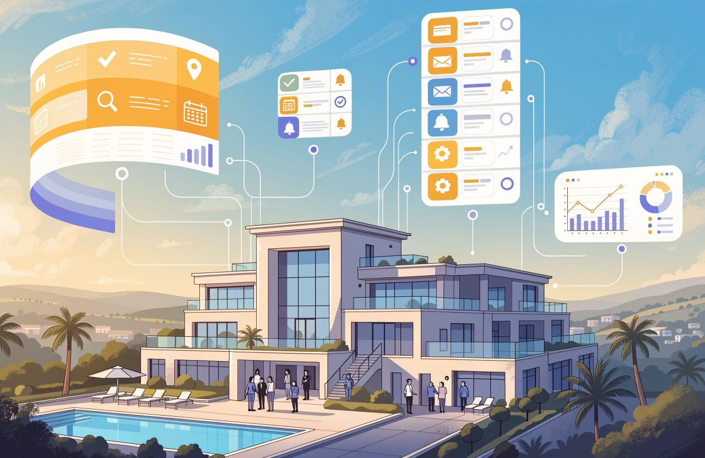
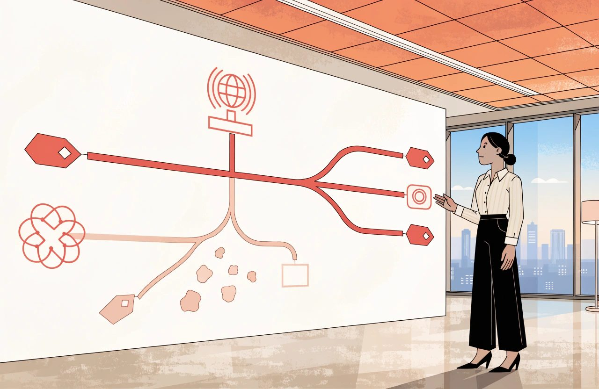

# The Complete Guide to Hotel Distribution and Connectivity

*Every route into your hotel is also a system. Distribution either carries your commercial decisions faithfully or corrupts them quietly.*

Most distribution arguments inside hotels are about commission.

Almost none of them are about mapping.

That is the wrong way round. In my experience, mapping mistakes cost more than the commission argument ever will.

Commission is visible. It arrives on an invoice with a percentage attached, and it is easy to resent.

A room sold on the wrong rate plan is invisible.

Nothing in your own systems complains. The mapping is valid. It is just wrong. So the wrong room sells at the wrong price all season, and the first person to notice may be the guest at reception who paid for a sea view.

That is the gap.

Distribution is discussed as a commercial subject and delivered as a technical one. The commercial half gets the meetings. The technical half gets a spreadsheet and a go-live date.

Then the two hold each other up for years, and nobody checks the join.

They are one subject.

**A strategy your connectivity cannot express is not a strategy. It is a wish.**

*The mapping is valid. It is just wrong, and the first person to notice is the guest who paid for a sea view.*

## The Short Version

- Distribution is argued as a commercial subject and delivered as a technical one. A strategy your connectivity cannot express is not a strategy.
- Mapping mistakes cost more than the commission argument ever will. A room sold on the wrong rate plan is invisible, because nothing in your own systems complains.
- Fully loaded cost per booking counts commission, payment and currency costs, cancellations, paid visibility and the cost of walking a guest. Measure profit, not revenue.
- The billboard effect has not been tested on an OTA since 2008. Measure it yourself, or leave it out of the business case.
- A channel manager shares one pool of availability across every connected channel. It makes overselling much less likely, not impossible.
- Certification proves the software connection works. It does not prove your mapping is right, and only you can check that.
- Rate parity law has fragmented by market, by platform and by the kind of clause. Where you stand depends on your own contract and your own country, so check both. Wholesale leakage is often the real cause of a price you cannot explain.

## Distribution Strategy

Distribution is every route by which somebody can buy a night in your hotel, plus the rules governing each route. Strategy is deciding which routes stay open, what each is for, and what you will pay for it.

Direct versus OTA is the wrong fight. An online travel agency, an OTA, is a demand aggregator. It reaches people in markets where you have no brand and no advertising. Some of that demand you would never have won. Some of it you could have won yourself, more cheaply. The mix is the whole question. You cannot answer it from a commission percentage.

Consider the difference between two versions of the same board report.

- "OTA commission was too high again. We need to push direct harder."
- "This channel delivered bookings from three source markets where we run no marketing, at a fully loaded cost per booking of X. Our paid search cost there is Y. Here is which is cheaper, and in which months."

The first is a complaint.

The second is a decision.

But "fully loaded" has to mean something, or the second report is only the first one in better clothes. Count all of it. The commission. The cost of taking the money, including card processing fees and currency conversion. The difference in cancellations and no-shows compared with your other channels. Anything you spend on that channel's paid visibility. And what it costs you if you have to move a guest to another hotel.

Then measure profit, not revenue. This matters more than it sounds. A 2025 study of 644 US hotels found that hotels paying more travel agency commission had higher occupancy and higher RevPAR. But budget hotels showed something else. Their RevPAR went up while their profit per room went down. A channel can raise your revenue and lower your earnings at the same time. A cost-per-booking test will call that a win.

### The Billboard Effect: Measure It, Do Not Assume It

The billboard effect is the idea that being listed on a big OTA lifts your direct bookings. An OTA sales team will tell you this is settled. Ask them when it was last measured.

The study everyone quotes is from 2008. It covered four hotels, and it was produced together with an OTA. That is before metasearch, before phones took over booking, and before AI answered anybody's travel question. Nobody has run that experiment on an OTA since. The only well-controlled test in recent years was published in 2025, and it looked at metasearch rather than an OTA, at hotels under thirty rooms.

So nobody can currently tell you what this effect is worth at a hotel like yours. That is not a reason to dismiss it. It is a reason to stop treating it as a fact in a business case, and to measure it yourself if the money involved is worth the effort.

If you do measure it, measure it properly. Comparing direct bookings before and after you list is not a test. Too much moves at once: the season, your own marketing, your rates, demand in the market. A new listing also builds slowly rather than switching on. A test that weak will usually show you nothing, and you will conclude there is nothing.

Do one of these instead. Switch the listing on and off in blocks and compare the periods. Or leave one country out and compare it against the rest. Or compare yourself against similar hotels that changed nothing. These are the methods current research uses, for the same reason: they are the only ones that survive everything else moving at the same time. And measure profit, not room nights. If you cannot run one of them, leave the effect out of the business case, and be honest that the reason is you never measured it.

Give every channel a written role. Base demand. Shoulder dates. A market you cannot reach alone. Distressed inventory late. A channel with no stated job is one nobody can justify closing or defending.

Then build the distribution checklist: every live channel, its commission or margin, its model, its payment terms, the demand it reaches, and when somebody last reviewed it. Very few hotels I have worked with can produce that on one page.

## Channel Management

Start by drawing the diagram, because almost everything that follows depends on picturing the flow correctly.

### What the Distribution Flow Actually Looks Like

Here is the common one for an independent hotel. In the middle sits the hotel and its property management system, the PMS. It holds the rooms and the reservations. Beside it sits the channel manager. Out from the channel manager run the connections to your booking engine and website, to the OTAs and to your wholesalers.

That is one setup. It is not the only one. It is worth knowing which one you have, because sooner or later a supplier will describe a different one. Some PMS platforms handle distribution themselves, with no separate channel manager. Some work the other way round: the PMS holds the data and the channel manager comes and takes it. Booking engines sit in different places too. On the channel manager. On the PMS. Or on a central reservation system.

That last one is the piece most hotel writing leaves out entirely. A central reservation system, a CRS, sits above the hotel. It holds the rates, often the reservations, and one shared view of availability across several properties. You probably have one if you run more than one hotel, belong to a brand or a franchise, have a central reservations office, or sell through the GDS. If you do, your rates are built there, and bookings are created there before your PMS ever sees them. Without knowing that, half the supplier conversations you have will describe something you believe does not exist.

The direction of flow matters more than the boxes.

Rates, availability, restrictions and stop sales flow **out** to the channels. Bookings, modifications and cancellations flow **back** into the PMS.

Keep two things apart here: where the data is created, and where it is carried.

*Rates and availability flow out to the channels. Bookings, changes and cancellations flow back. The channel manager is the courier, not the calculator.*

In a group with a CRS, the rate is built centrally. The channel manager is the courier, not the calculator.

Here is the worked example that makes it land. You set five rooms available for a date. The channel manager pushes five to every connected channel, so each shows five. One sells, on any channel. The booking comes back and the channel manager pushes four to all of them. Every channel shows four. Nobody was allocated two rooms, and nobody sold a room out of a block that had already gone.

That shared pool is what a channel manager is for.

It makes overselling much less likely.

It does not make it impossible, and it is worth understanding why.

Your system is not told about a new booking the moment it happens. It asks the channel for new bookings every so often, and thirty seconds is a common interval. In that gap the room is still for sale everywhere. Systems also go down. Cancellations sometimes put rooms back on sale when they should not. And a rate you never mapped never receives your close-out. The channels publish guides on fixing exactly this, which is not something anybody writes for a problem that cannot happen.

So build the habits the diagram does not suggest. Watch for failed updates. Check availability against the PMS every night. Hold a buffer on your busiest dates.

### Shared Pool, Caps and Allocations

The alternative to a shared pool is not simply allocation. There is a range in between. You can cap what each channel is allowed to sell while still sharing one pool. You can give a partner a block that comes back to you on a set date. You can sell freely and close when you are full. You can guarantee a block that releases gradually.

Pure allocation, where each channel holds a fixed block, does carry the old problem. You turn away business on one channel while another sits unsold, or you oversell. But it is not out of date. It is still the right tool whenever the other side is buying certainty: tour operator contracts, group and corporate blocks, GDS and consortia deals. You will meet it again in the wholesale section.

One more thing the diagram hides. Bookings come in. Your changes do not go out. If you need to move or refuse a booking that came from a channel, there is no button that does it. Both major OTAs require you to honour confirmed bookings. You cannot simply reject one. If you cannot accommodate the guest, moving them to another hotel is at your cost. That duty is not law. It comes from the terms you signed with the platform. That changes who enforces it, not whether you have to do it. Read your own agreement, because the wording differs by platform and by market. That is a phone call, not a system update.

A channel manager is not a revenue management system. Treat that as a rule you enforce, not a fact about the software, because prices are increasingly worked out in the connectivity layer. Derived rates, occupancy-based pricing and length-of-stay pricing all calculate the final guest price after your PMS has sent its number.

A channel manager is not a PMS either. It does not run your night audit.

Think of it as a switchboard.

Vendor names will change. The criteria below are much more durable. Judge one on:

- Certified two-way connections to the channels you sell through, not a logo wall. Most channels now run tiered partner programmes. Ask which tier your provider holds.
- Restriction depth: minimum and maximum stay, closed to arrival and departure, release periods, stop sales at room and rate level.
- Rate derivation and mapping visibility. Can you build dependent rates, and change mapping yourself, or is every change a support ticket?
- Error behaviour. When a push fails, does it retry, does it queue, does it tell you?
- Booking delivery. Does the reservation reach the PMS complete, with correct occupancy, tax and payment details, and an audit trail?

## OTAs and Marketplaces

An OTA is not simply a website that takes commission.

It is a merchandising surface with a ranking algorithm sitting on a very large advertising budget.

You are not merely listed there.

**You are competing there.**

*You are not merely listed on an OTA. You are competing there, against a ranking machine that rewards what the marketplace needs.*

### Commercial Model and Collection Model Are Different

Learn the commercial models, because they change your cash, not only your margin. Learn them as two separate questions, not one. Collapsing them into a single choice is the most common mistake in this subject, and it produces wrong answers about your own cash flow.

The first question is who sells, and who is paid what. On commission terms you set and own the rate, and the OTA bills you a percentage afterwards. On merchant or net-rate terms the OTA buys from you at a net price and decides the guest price itself.

The second question is who takes the guest's money, and when you get it. This is separate from the first. A hotel on ordinary commission terms can still use the OTA's payment service. It never touches the card, refunds come out of a later payment, and in some countries the money arrives already net of commission. A hotel on merchant terms paid by virtual card may find that the card can be charged on the day the guest books, months before arrival, rather than after checkout.

Everything you actually care about follows from the second question.

When does the cash arrive? Who carries the risk? Where does a chargeback land? How is a refund handled? One large OTA runs both collection methods on the same listing at the same time, so "are we agency or merchant?" may not even have one answer for your hotel.

Tax can differ too, but not because of the agency or merchant label. In the EU it generally depends on whether the platform is treated as the seller for VAT, and that turns on your own VAT position. Those rules are changing, with a long lead time. Separately, platforms in the EU have for several years reported what they pay you to the tax authorities, whichever model you use. I am not naming the instrument here. Tax rules are national in their detail and they move. Get advice for your own country rather than guessing from the commercial model.

### How Marketplace Ranking Actually Works

Ranking is not magic. It is a machine that rewards what the marketplace needs.

EU rules require the largest platforms to publish the main factors that drive ranking. Those published pages are the best source you have, and they beat anything I could summarise here. Read the page for the platform you actually sell on, because each one words it differently.

They list conversion, complete content, competitive pricing, wide availability, low cancellations and good reviews. They also list two factors that hotels routinely leave off their own list. How well you match what the guest searched for, including where you are. And how much the platform earns from your booking, including any extra commission you have agreed to pay for more visibility.

Which is why the comforting version of this, that you cannot buy your way past it, only half survives. You cannot buy past a bad review score, thin content or an empty calendar. But position itself is for sale. One major OTA offers a commission slider that shows you how many more views a higher rate should buy. Another sells sponsored listings that guarantee a top three or top fifteen place. So treat the unpaid factors as the ones you must not lose on, and treat the paid ones as a cost you measure like any other.

Content is the cheapest and the most neglected. Consider the difference:

- "Double Room. Comfortable double room with all the usual amenities."
- "Double Room, 22 square metres, first floor, one double bed, walk-in shower, private balcony over the courtyard, quiet side of the building."

The second answers the questions that stop a booking. The first is wallpaper. Complete content is one of the published ranking factors, and the platforms score you on it. That it also converts better is my experience rather than a published finding, but I have never seen the opposite.

### Beyond the OTA

Marketplaces are wider than OTAs. Metasearch compares prices and, for now, mostly passes the click on. Google closed its own hotel checkout in 2022, and Tripadvisor's instant booking is now legacy. But put a date on that sentence. In August 2026 Google confirmed live testing in the US of AI assistants that book hotels directly, with the big OTA groups, several chains and a GDS taking part.

The global distribution systems, the GDS, still serve travel agents and corporate bookers. Hotel volumes through them have grown rather than collapsed. They now also feed corporate booking tools, OTA supply and, this year, AI booking agents.

Bed banks sell to other sellers. The largest bed banks now sit inside the OTA groups themselves, which matters for the wholesale section below.

Each of these has its own content requirements and its own kind of buyer. Treating them as one bucket called "third party" is how a rate ends up on a site you cannot explain.

One warning before you close any of them. Wide availability feeds visibility. My experience is that visibility takes longer to come back than it takes to lose. No platform publishes how it behaves when you reopen, so treat that second half as my experience rather than as policy.

## Connectivity and Certification

Distribution rarely breaks loudly.

It breaks silently, in mapping.

And mapping is one of the least glamorous but most commercially important parts of the whole distribution stack.

Mapping is the agreement about which thing on one side equals which thing on the other.

*Mapping is the agreement about which thing on one side equals which thing on the other. One crossed line sells the wrong room all season.*

At least three layers must agree. Your PMS room types and rate codes. The room types and rate plans in your channel manager. And the room and rate plan identifiers held by each channel, which are that channel's records, not yours.

Three is the minimum, not the count. A CRS adds a fourth set of identifiers. Content feeds and metasearch feeds are separate again. And on several major channels the thing you map is not the room and the rate separately. It is the room and rate together, as one combination. That is where the number of things to check gets out of hand.

When the layers agree, a price you set once appears correctly everywhere. When one disagrees, nothing in your own systems complains. The system does exactly what it was told.

Some channels will catch you. Google checks your prices against your own website continuously, and can switch your listings off if they do not match. Other platforms check your content automatically. But that is the channel policing itself. It arrives late, and from outside.

### The Mapping Failures That Cost Money

Three failures cause most of the damage I have seen.

- The wrong room. Your Superior Sea View is mapped to the channel's Standard Double, so your best room sells at your cheapest price and reception either downgrades a guest or absorbs the loss.
- The wrong rate plan. A non-refundable discount derived from the wrong parent, so a cancellable room sells at the non-refundable price for months.
- The wrong pricing model. Per-room pricing mapped to a per-person channel. Single occupancy is where this shows up first.

Certification is the channel's test that a connection behaves: that rates, availability and restrictions go out, and that bookings and cancellations come back. Understand how narrow that is.

### Certification Is Not Your Mapping Check

Certification belongs to the software connection, not to your individual hotel. It may have happened years before your property ever appeared on the platform. Some channels grant it after the supplier tests itself and then runs a trial on two or three other hotels. What your hotel goes through is not certification. It is onboarding: mapping, required content, checks, switch-on.

That makes the distinction stronger, not weaker.

**Certification proves the pipe works. It does not prove your mapping is right.**

Only you can check your mapping.

A safe go-live sequence:

1. Freeze rate and inventory changes and export the mapping table.
2. Have a second person check it against the PMS, line by line.
3. Push a distinctive price to one quiet date and check the channel's front end, as a guest would.
4. Make a real test booking. Check it reaches the PMS with the correct room type, rate, occupancy and tax.
5. Modify it, then cancel it. Confirm both flow back.

Then build the connectivity workbook: one tab per channel, listing every identifier on every layer you have, the derivation rules, the pricing model and the person who owns it. Unglamorous, and the artefact that turns an outage from a week of guessing into an hour of checking.

## Rate and Inventory Parity

*Parity is part law and part contract, and both halves move. What follows is how I read the general position, not legal advice for your hotel. Check where you actually stand before acting on any of it.*

Rate parity means the same room, on the same dates and conditions, at the same price across channels.

Availability parity is its neglected twin: enough of the same rooms genuinely open on each.

### Before You Call Something a Parity Breach

Two things to get right before you use those definitions in an argument.

First, parity rules usually work one way only. The standard wording is "the same or better". It stops you offering better terms somewhere else. Nothing obliges the platform's price to be the lowest. So a higher price on another site is usually not a breach. Usually is doing real work in that sentence. Your own clause is the thing that decides it. Read the wording you signed rather than the version everyone repeats.

Second, there are two kinds. A narrow rule limits only what you publish on your own website. A wide rule limits what you give every other channel as well. Almost every legal question in this area turns on which of the two you signed, so use the words.

Start with the word conditions, because in my experience most parity alarms are false. A comparison means something only when cancellation policy, occupancy, inclusions, currency and tax display all match. A flexible rate with breakfast is not the same product as a non-refundable room-only rate.

The same applies to availability. Deliberately giving different channels different rooms or different restrictions is a strategy, not a failure. The problem is the disparity you did not intend.

Parity is two things at once.

*Parity is a commercial policy and a technical outcome at once. The rate you never intended is often the one that travels furthest.*

It is a commercial policy.

It is also a technical outcome your systems either produce or fail to produce.

### The Legal Position Has Fragmented

The legal position is no longer one question.

It is three:

**Which market? Which platform? Which kind of parity rule?**

The instrument that changed this is the Digital Markets Act, Regulation (EU) 2022/1925. Since November 2024 it has stopped the largest OTA group using parity rules with hotels in the European Economic Area. The argument that such clauses are simply a normal part of the bargain has also been losing ground. Treat that as contested rather than settled. But the Digital Markets Act binds only the platforms it formally designates as gatekeepers. In the same EEA, a smaller OTA can still hold you to a narrow rule, quite lawfully. Outside the EEA the picture runs from banned to completely unregulated. Know the rules where you trade, and check them platform by platform. Where real money turns on the answer, get it checked locally.

The more useful point is this. The clause went away. The pressure did not. Competition authorities in Europe have looked hard at whether platforms still limit hotels' pricing freedom by other means. I am not summarising any single decision here, because the detail is national and it moves. Watch the mechanisms instead. Eligibility for a platform's programmes. Performance scores. Discounts the platform funds and applies without your approval, triggered by watching your prices elsewhere. Your prices on other sites can still cost you visibility, even where no contract says they must.

### When the Real Problem Is Wholesale Leakage

There is another major source of apparent undercutting, and it is often less deliberate.

Wholesale leakage. A net rate you agreed with one partner has been resold down a chain until it appeared on a site you never contracted with.

The scale is real. A 2025 survey of just over 2,000 hoteliers reported an average of 6% of revenue lost to rate misuse. About half of wholesale sales reached partners the hotel did not intend. But read it carefully. It was published by a company that is itself one of the largest wholesalers. The same survey blames a similar share of problems on rate-loading mistakes made by hotel staff. Parity monitoring firms publish figures pointing at the OTAs instead. Nobody has published a neutral study splitting the causes. So treat leakage as a large and under-appreciated share rather than a proven majority, and find out which it is for your own hotel.

Diagnose the problem in order, and stop guessing:

1. Confirm it is the same product on the same conditions.
2. Check your own push. Did the rate you intended actually arrive?
3. Check whether you opted into a channel discount, or whether one was applied for you.
4. If none of those, book it yourself. The confirmation will usually name the seller, and often one company above it. It will rarely show the whole chain. You get the answer by matching what you find against your own contracts and net rates.

Consider the difference between two escalations. "We are cheaper on another site, fix it" produces a week of email. "Our Deluxe Double, flexible, two adults, breakfast included, sits on site X below our rate; conditions and tax match; our push is correct; the price matches wholesaler Y's net rate plus a thin margin" produces one phone call and a fix.

## Wholesale and B2B

Wholesale is where control becomes difficult.

A rate can leave your hotel through one contracted partner and reappear on channels you never contracted with, sold by companies you have never spoken to.

### How Wholesale Distribution Travels

The mechanics are simple. A wholesaler or bed bank buys from you at a net rate. That is either a static contracted rate agreed in advance, or a dynamic net feed derived from your live pricing. It resells to tour operators, retail agents, other OTAs and, if the contract allows it or nobody polices it, straight to consumers. B2B, business to business, means selling to a reseller rather than a guest.

Note that the line between wholesaler and OTA has largely gone. The biggest bed banks now sit inside the OTA groups, and the same company can be your commission partner and your net-rate buyer.

The trade-off is straightforward.

Static rates are easier to police and harder to yield because the price is fixed long before you know the demand.

Dynamic net rates yield better, but they also travel further and faster because every price move can be redistributed downstream in minutes.

### Contract for the Channel, Not the Resale Price

Control lives in the contract. Write it with competition law in mind, because the most obvious clause is the one that does not work. What follows is how I would frame it. It is not legal advice, and a wholesale contract should be checked by a competition lawyer in your country before you sign it.

- Package only. The rate may be sold only bundled with flights or other components, never as a room on its own. This is standard drafting, including at the big chains. It restricts how your buyer may sell rather than what price it may charge, which is why it is usually the safer shape. Know one side effect. Bundling a room with transport can turn the reseller into a package organiser in law across much of Europe. That brings duties around performance and insolvency cover. Smaller resellers often cannot meet them. That is one reason this clause gets broken rather than followed. The test and the duties are set nationally, so have the clause checked where your buyer trades.
- Approved sellers, rather than open resale. Write down the standards a seller has to meet, and apply them to everyone the same way. That is much safer than either banning online sales outright or keeping an informal list of names. EU competition law treats a flat ban on a buyer selling online as a serious problem. Agreements of this kind sit under the vertical agreements regulation, Regulation (EU) 2022/720. A restriction that effectively shuts your buyer out of the internet is the sort of term that regulation is built to catch. The UK takes a broadly similar approach. Whether your own wording crosses that line is a question for a competition lawyer, not for a template. Quality standards applied evenly are a very different thing from a ban.
- No minimum price. This is the clause to drop. You may suggest a price. You may set a maximum. Setting a floor under what a buyer may charge is treated seriously in EU competition law. The vertical agreements regulation, Regulation (EU) 2022/720, covers agreements like yours. Article 4(a) lists restricting the buyer's ability to determine its sale price as a hardcore restriction. A maximum sale price is allowed, and so is a recommended one. Neither may turn into a fixed or minimum price through pressure from either party, or through incentives offered by either party. That is the regulation's own wording, and it is the part people miss. Where that analysis applies, the clause will usually be unenforceable. Being a small business is generally no help. It can also put the clauses sitting next to it at risk. That large chains use the clause is not a reason to assume it is safe. Whether any of this catches your contract is a question for a competition lawyer in your own country, and it is worth the fee. Watch the indirect version as well. Monitoring a "recommended" price, then threatening to cut supply if it is not held, is generally analysed the same way. Pressure and incentives are exactly what Article 4(a) names.
- Audit and takedown, with a stated timescale and the right to withdraw inventory if breaches continue. Write it against where the rate is sold, not what it is sold for. Controlling where and to whom your rate may be sold is generally treated very differently from controlling the price. That difference is the whole reason this bullet exists. Policing the price is what turns the rest of your contract into a problem. Have someone check that your audit wording has not quietly become a price control.

Contracts are half the job.

Enforcement is the half that gets skipped.

A clause nobody monitors is a clause your partner can reasonably assume you do not care about.

So run a routine. Keep a leak log: where each stray rate was found, and which net rate it traces back to. Review every B2B account each quarter against the revenue it produced. And let no wholesale account go live until it has passed the same mapping review as an OTA.

**If a partner cannot tell you where your rate ends up, you have not sold inventory. You have released it.**

*If a partner cannot tell you where your rate ends up, you have not sold inventory. You have released it.*

## Common Questions

### What does a hotel channel manager actually do?

A channel manager carries rates, availability and restrictions out to your channels. Bookings, modifications and cancellations flow back into the PMS. Think of it as a switchboard. A channel manager is not a revenue management system. It does not run your night audit.

### How does a channel manager stop overselling?

A channel manager shares one pool of availability. You set five rooms and every connected channel shows five. One sells on any channel, and four is pushed back out to all of them. Nobody sells a room out of a block that had already gone.

### Why can a hotel still oversell when a channel manager is connected?

Updates are not instant. Your system asks each channel for new bookings every so often, and thirty seconds is a common interval. In that gap the room is still for sale everywhere. Systems also fail, cancellations can reopen rooms wrongly, and an unmapped rate never receives your close-out.

### What is a central reservation system in a hotel?

A central reservation system, or CRS, sits above the hotel. It holds the rates, often the reservations, and one shared view of availability across several properties. You probably have one if you run more than one hotel, belong to a brand, or sell through the GDS.

### How does OTA ranking work?

Ranking rewards what the marketplace needs. EU rules require the largest platforms to publish the main factors, and those pages are the best source you have. Read the page for the platform you actually sell on. They list conversion, complete content, competitive pricing, wide availability, low cancellations and good reviews. They also list how much the platform earns from your booking.

### Is the billboard effect real?

The billboard effect is the idea that an OTA listing lifts your direct bookings. The study everyone quotes is from 2008, covered four hotels, and was produced with an OTA. Nobody can currently tell you what the effect is worth at a hotel like yours. Measure it or leave it out.

### What is the difference between commission and merchant rates?

On commission terms you set and own the rate, and the OTA bills you a percentage afterwards. On merchant or net-rate terms the OTA buys at a net price and decides the guest price itself. Who takes the guest's money is a separate question. That question moves your cash.

### What is rate parity, and what counts as a breach?

Rate parity means the same room, on the same dates and conditions, at the same price across channels. Parity rules usually run one way only, so a higher price on another site is usually not a breach. Your own clause decides it, so read the wording you signed. Compare cancellation policy, occupancy, inclusions, currency and tax display first. Most parity alarms are false.

### Is rate parity still legal?

Rate parity law has fragmented into three questions: which market, which platform, and which kind of clause. Since November 2024 the Digital Markets Act, Regulation (EU) 2022/1925, has stopped the largest OTA group using parity rules with hotels in the European Economic Area. It binds only the platforms it formally designates. A smaller OTA there can still hold you to a narrow rule. The clause went away, and the pressure did not. Know the rules where you trade, check them platform by platform, and take local advice where real money turns on the answer.

### What is wholesale leakage, and how do you trace it?

Wholesale leakage is a net rate you agreed with one partner, resold down a chain until it lands on a site you never contracted with. Diagnose it in order. Confirm the same product on the same conditions, check your own push, then check whether a channel discount was applied. If none of those explain it, book the room yourself.

## Key Terms

- **Distribution.** Every route by which somebody can buy a night in your hotel, plus the rules governing each route.
- **Channel manager.** The system that pushes rates, availability and restrictions out to your channels and brings bookings back. A switchboard, not a calculator.
- **Central reservation system, or CRS.** A system above the hotel holding rates, often reservations, and one shared view of availability across several properties.
- **Shared pool.** One set of availability offered to every channel at once. Each sale reduces what all the others can sell.
- **Allocation.** A fixed block of rooms held for one channel or partner. Still the right tool whenever the other side is buying certainty.
- **Mapping.** The agreement about which thing on one side equals which thing on the other. At least three layers must agree.
- **Certification.** The channel's test that a software connection behaves. Certification belongs to the connection, not to your individual hotel.
- **Onboarding.** What your own property actually goes through to go live: mapping, required content, checks and switch-on.
- **Rate parity.** The same room, on the same dates and conditions, at the same price across channels.
- **Narrow parity.** A rule limiting only what you publish on your own website.
- **Wide parity.** A rule limiting what you give every other channel as well. Use the words, because the legal answer usually turns on which one you signed, and on where you trade.
- **Wholesale leakage.** A net rate agreed with one partner, resold down a chain until it appears on a site you never contracted with.

## How This Connects to the Wider Hotel Technology Stack

Distribution touches almost every other part of hotel technology.

- **[Hotel Operations and PMS](../hotel-operations-and-pms/)** owns the stay itself: room assignment, the folio, the night audit and the record of who is in the house. Where a booking is first created may instead be the CRS in a centrally managed setup, and the channel contract still determines what you owe the guest.
- **[Direct Booking and E-commerce](../direct-booking-and-e-commerce/)** covers the website, booking engine and metasearch. Your own website is another distribution channel, but making it convert belongs there.
- **[Revenue Management](../revenue-management/)** decides the price. Distribution carries it. Derived, occupancy-based and length-of-stay pricing can calculate the final guest price inside the connectivity layer, which is why the boundary needs to be explicit.
- **Market Intelligence and Analytics** owns rate shopping, parity monitoring and channel-production reporting. Distribution creates the outcome; analytics helps you diagnose it.
- **Guest Technology and CRM** inherits whatever guest data the channel gives you. Masked email addresses, channel messaging and missing consent are distribution facts with CRM consequences.
- **Payments and Financial Technology** owns virtual cards, settlement, chargebacks and commission reconciliation. The commercial model chosen here and the collection model handled there are related, but they are not the same decision.
- **Sales, Groups and MICE** brings corporate rates, group blocks and event business into the distribution stack through GDS and corporate booking tools. It is also where allocations and blocks remain the right instrument.
- **Data, APIs and Integration** sits underneath all of this. Mapping and certification are the hotel-facing expression of the deeper integration layer.
- **AI, Automation and Agents** matters because AI booking assistants are becoming another marketplace. As of August 2026, hotel booking through AI remains unsettled, which is exactly why content quality, live availability and post-booking handling still matter.
- **Hotel Technology Strategy** weighs a channel-manager change against every other technology priority, while **Emerging Hotel Technology** covers connectivity models that are not yet settled enough to plan around.

## Related Reading

Distribution Strategy - Great Hotel Distribution Starts With You

Channel Management - Choosing a Hotel Channel Manager: What Actually Matters

OTAs and Marketplaces - The Booking.com Ranking Playbook (That Also Grows Direct)

This list grows. New Knowledge Articles are added in batches rather than one at a time.

Distribution is not a fight between your website and somebody else's. It is a system that either carries your commercial decisions faithfully or corrupts them quietly, and the difference is mostly mapping, monitoring and contracts nobody finds interesting. Build the checklist and the workbook, give every channel a written job, and know where your net rates end up. Then commission becomes a calculation rather than a grievance.

I would rather be corrected than agreed with. If something here does not match what you see in your own hotel, tell me, and tell me what you saw.
