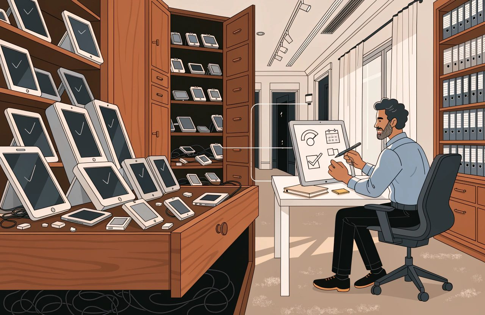
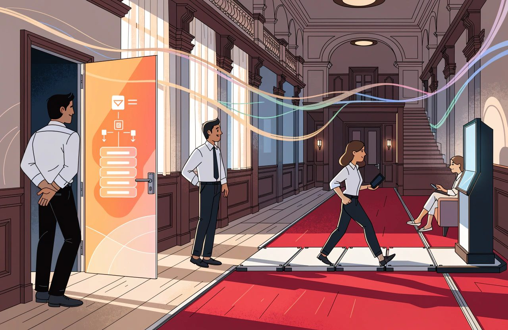
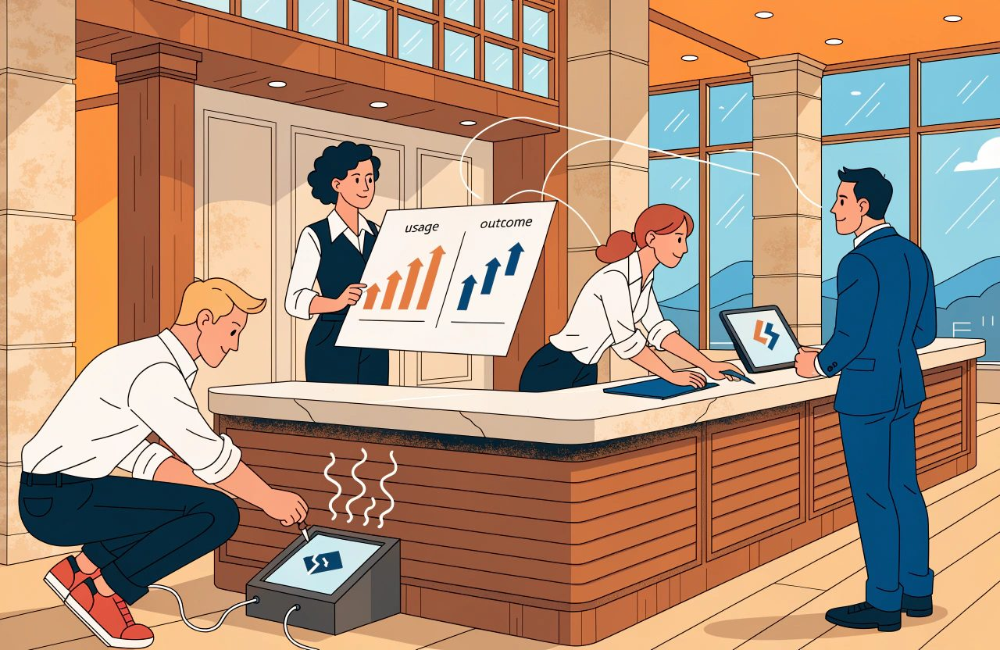
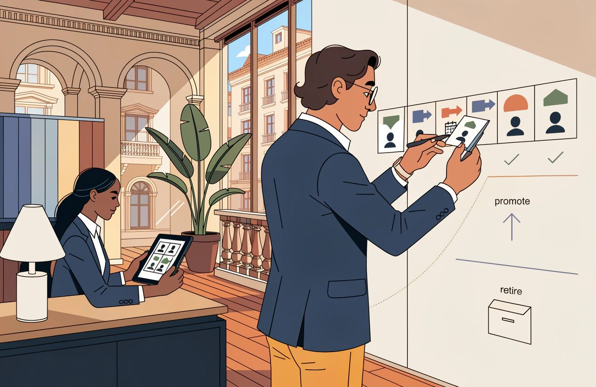
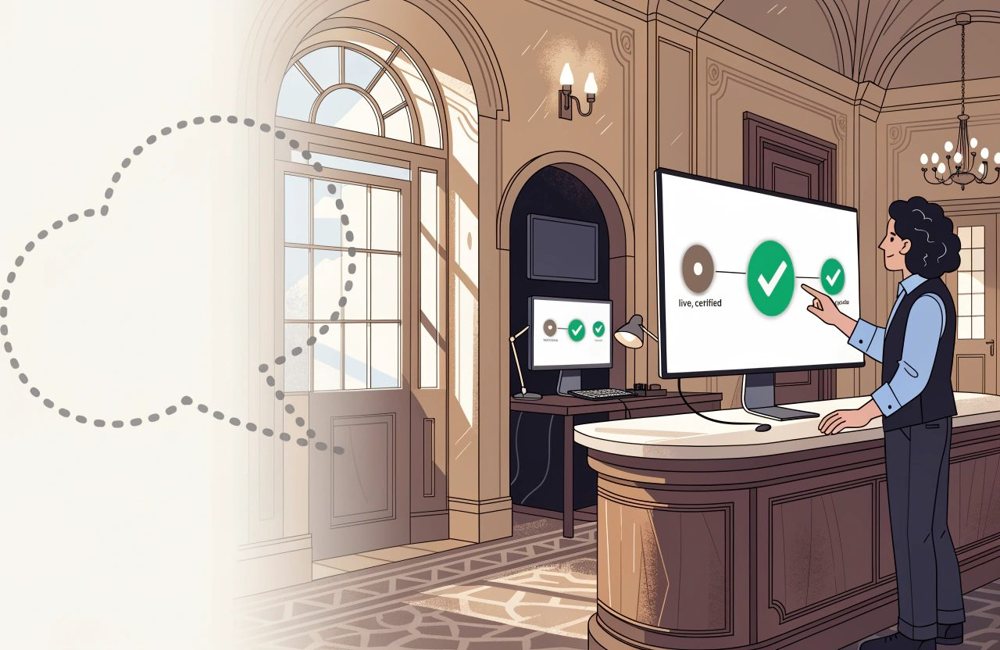

# The Complete Guide to Emerging Hotel Technology

*Being early is not the risk. Having no method for judging what is new is the risk.*

Every hotel has a drawer of things that were going to change everything.

A few of them did.

They are so ordinary now that nobody remembers they were once a fight to get approved.

A few were swallowed by systems the hotel already owned, which made the separate product pointless within two years of buying it.

Most simply stopped being mentioned. The only trace is a line in a budget and a login nobody has used since.

That pattern is not a failure of judgement.

It is what the leading edge of any industry looks like from the inside.

**The mistake is not backing something that did not work out. The mistake is having no method.**

*Most of what was going to change everything left behind a budget line and a login nobody has used since.*

Without one, the same enthusiasm produces the same result again and again, and nobody remembers how the last three attempts ended.

So this article is written differently from the others.

The rest of this series explains a subject.

**This one explains a discipline.** How to judge something genuinely new. How to test it without betting the hotel on it. And how to keep track of what is not ready yet, without buying it too early or losing it altogether.

Be clear about what you are reading.

This is not a tour of what is exciting in August 2026.

It is a guide to judging what is exciting, whenever you happen to read it. The list of what is new sits in one marked section at the end, with a review date on it, and nowhere else. Everything above that section should still be true after the list has been replaced twice.

That does not mean the method never ages. It ages more slowly, which is a different claim. The law and the buying rules underneath it moved twice in the last year alone. The EU Data Act, Regulation (EU) 2023/2854, started to apply to software services on 12 September 2025. And the US standards body, the National Institute of Standards and Technology, NIST, published its guide to checking suppliers. The final version landed in July 2026. That is guidance rather than law. It reaches most hotels through contracts and audits rather than through a regulator. The way tests are run moved too. So treat the sections above as an annual review rather than a permanent settlement, and the section below as a quarterly one.

Where I am giving you my own judgement rather than something I can point at, I say so.

There is more of that here than in any other article in the series, because the subject is technology that has not settled yet. On a few questions the honest answer is that nobody knows. I would rather say that than dress a guess up as a finding.

## The Short Version

- Every hotel has a drawer of things that were going to change everything. The mistake is not backing one that failed. The mistake is having no method.
- Technology new to the industry is not the same as technology only new to you. Three questions filter the genuinely early kind. Is the problem real and is it yours? Is it a category or a single product? Is it a feature waiting to be swallowed?
- Waiting for your existing systems to include the feature no longer wins by default. Platforms mostly buy the feature rather than build it. You get it later, priced inside a bundle, and only if you run the platform that did the buying.
- A pilot is an experiment with a decision at the end. Most hotel pilots are purchases carried out slowly. Six things go in writing first: the question, the measure, the duration, the decision rule, the decider and the size of change worth acting on.
- Adoption is the measurement everyone skips. Count take-up, count who genuinely met the thing, and count the workarounds. Without those numbers nobody can say whether the product failed or the hotel did.
- A watchlist exists so that ideas can be neither bought nor forgotten. Keep it to about eight items. Every entry needs a trigger somebody other than the enthusiast can check.
- Regulation sets the date and your capacity decides how badly it goes. Elective work waits for the hotel. Forced work arrives on somebody else's calendar, so keep some capacity in reserve.

## Emerging Categories

Start by separating two things that arrive looking identical.

Technology that is new to the industry.

And technology that is only new to you. The second is not emerging technology in the sense this article uses the word.

It is a normal buying decision. It belongs in Hotel Technology Strategy, and you can run it with the confidence that comes from other hotels having already made the mistakes.

That line is mine rather than an official definition, and it is worth knowing what it does and does not do. Taking on something well established elsewhere is still innovation in your hotel. The standard international definitions of innovation generally count it as such. That is a measurement convention rather than a rule anybody enforces against you. What the line buys you is a clean read on one risk. Will the supplier survive, and will this type of product survive. A product with thousands of hotels behind it carries far less of that risk than a product with eleven customers.

What the line does not buy you is any less risk in the project itself. Installing it. Moving the data across. Setting it up. Training people. Getting staff to actually use the thing. All of it is exactly as hard for a mature product as for a new one. That is where hotel technology projects mostly fail. The largest study of the question looked at 1,471 technology projects. It found costs running 27% over on average, and one project in six going to around 200% over. None of that is about how young the supplier was.

### Three Questions Filter Most Emerging Technology

For genuinely early technology, three questions do most of the filtering. They are mine, not an industry standard, and I ask them in this order because each one kills a proposal more cheaply than the next.

### 1. Is the Problem Real and Is It Yours?

**Is the problem real, and is it yours?** New categories are often a solution searching for a hotel. The honest test is whether you were complaining about this problem before anybody offered to sell you a fix. A problem you can name, roughly size and point at in your own operation is a real problem. A problem you first heard described in a conference session is a guess.

Be careful with that second half, though, because it is the part I have seen misused. Where you first heard about a problem tells you nothing about whether it is real. Plenty of genuine waste is invisible until somebody names it, and a conference or a demo is a perfectly respectable place to be told something useful. The test is not the source. The test is whether you can now go and find the problem in your own numbers, without the supplier's help. If you can, it counts, whoever mentioned it first. If you cannot, it does not count, even if you thought of it yourself.

### 2. Is It a Category or a Single Product?

**Is it a category or a single product?** A category means several serious suppliers attacking the same problem in similar ways. That suggests the problem is real enough for a market to form around it. One supplier with a compelling story may be brilliantly early or simply alone, and from the outside those look the same.

A crowd of suppliers is necessary. It is not enough. Hotel technology has taught that lesson twice in ten years. In-room tablets had six or more credible suppliers, which looked like a market. Then Intelity and KEYPR merged in 2018, and HCN bought Crave in June 2025. Standalone guest chatbots had a crowded field between roughly 2016 and 2019. That field did not so much shrink as get swallowed. Go Moment's Ivy now exists as the artificial intelligence layer, the AI layer, inside Revinate's platform. Hotel messaging is sold as part of a customer relationship management system, a CRM, rather than as a product you buy on its own. A crowd of suppliers fits a real market. It also fits a funding boom.

So add the test that actually tells them apart. Are the suppliers building the same connections and the same way of working, or only the same pitch deck? A real category shows up as suppliers solving the problem in ways that look alike from outside, because the problem is shaping the answer. A funding wave shows up as eleven different products described in identical language.

### 3. Is It a Feature Waiting to Be Swallowed?

**Is it a feature waiting to be swallowed?** This is the most useful question in the section and the one most often skipped. A great deal of what is sold as a new category turns out to be something the systems you already run will include as standard. Their customers keep asking for it. And it is easier for them to build it than to watch a rival give it away.

This one is not speculation. In its spring 2026 release, Cloudbeds pulled five things into the property management system, the PMS. The booking engine, business intelligence reporting, accounting, digital marketing and groups. All in a single go. SiteMinder bought GuestJoy. Cloudbeds bought Whistle and turned messaging into a module. Mews bought Atomize and made revenue management part of the platform. If you own a separate product in any of those areas, your PMS supplier is now in that business.

What I got wrong for years was the conclusion I drew from that. I used to say that when a big system looks likely to swallow something, waiting is usually the winning move. I no longer think that holds as a general rule. Three reasons.

First, the big systems mostly buy the feature rather than build it. Mews and Atomize. Cloudbeds and Whistle. SiteMinder and GuestJoy. Agilysys and Book4Time, at $150m in August 2024. Cendyn and Knowland in October 2024. Shiji and MyCheck. That changes the advice materially. The hotel that waited does not get the capability free in the next release. It gets it later, priced again inside a bundle, and only if it happens to be on the platform that did the buying. Mews' revenue management is built into Mews. A hotel on a different PMS that waited for it received nothing at all.

Second, this runs in years rather than review cycles. Mews partnered with Atomize in 2018. It bought the company in November 2024. The built-in version went on general sale in June 2026. That is around eight years from "this looks like a feature" to "it is a feature".

Third, the biggest supplier in the industry publicly rejects the model. Oracle's stated position, in May 2025, is that the future of hospitality is not one company owning everything. It is a marketplace, with more than 650 partner products around it. And both approaches live inside the same company. Cloudbeds shipped its own built-in groups and events tools in May and June 2026, then announced a partnership with a groups specialist on 15 June 2026. Which world you live in depends on whose PMS you run.

So the question survives and the answer does not.

Ask whether the systems you already run will plausibly make this product pointless.

Then ask the second question, which almost nobody asks:

**If I wait, can I get back what I gave up?**

*A delayed convenience comes back. Money you did not earn while you waited does not.*

That distinction does most of the work.

A delayed convenience comes back.

Money you did not earn does not. The clearest case against my old rule is revenue management itself, which looked like a feature for twenty years and never became one. IDeaS is live in more than 31,000 properties after 35 years. Duetto is in more than 6,000. Lighthouse raised $370m from KKR in November 2024. Mews already had its own built-in revenue product and still bought Atomize. That is a big supplier voting with its cheque book. A hotel that waited from 2018 to 2026 for built-in pricing gave up eight years of better prices it can never go back and collect.

I should be straight about the evidence here. I went looking for research on what adopting late actually costs a hotel against its competitors, and there is none of any quality. That cuts both ways. My old "waiting usually wins" had no evidence behind it, and neither does any confident claim that waiting is expensive. So treat the question of whether you can get the value back as a way of thinking rather than as a measured finding.

There is a standard warning attached to all of this, and it needs a date on it. Buying a separate product now also buys a connection you will later have to unpick. That was true of the previous generation of systems and it is only half true now. Some platforms publish an open application programming interface, an API, which is the documented way one system plugs into another. On those, adding and removing a separate product genuinely costs less. Mews advertises more than a thousand certified connections with no connection fee. Apaleo sells itself on having scrapped interface fees altogether. Oracle publishes its connection specifications, and ready-to-run Postman examples, openly. On an older PMS, the original warning stands.

But do not read that as the problem having gone away, because it moved rather than disappeared. Marketplaces standardise the plug, not the meaning. There is no shared industry definition of what a hotel's data means. So swapping supplier A for supplier B still means rebuilding your own logic from scratch. And you now depend more on the platform than on the product you bolted onto it. The trap moved up a level.

### Judge the Supplier, Not Only the Idea

**If something survives those questions, judge the supplier as hard as you judge the software.**

A young supplier carries risks a mature one does not, and pretending otherwise helps nobody. But that risk is not a simple line running from young and dangerous to old and safe. In hotel software today it mostly is not about going bust. The usual ending is being bought and then closed down. Atomize was a real company with its own brand, product and route to market. Type atomize.com today and you land on mews.com. That happens to successful suppliers, not failing ones, and hotel software is in the middle of an active buying spree funded by private equity.

Those are two different risks, needing two different sets of contract terms. Hotels routinely buy protection against the less likely one.

- If they go bust. A tested escrow arrangement, where a third party holds a copy of the software and the data, and somebody has actually checked that it works. Written promises to hand your data back, with deadlines attached. And the sober understanding that whoever is appointed over a failed company is generally not bound to perform your contract on your preferred terms. Insolvency rules are national and they differ a great deal. Where a company fails, the guest database is often treated as an asset that can be sold. Check how that works under the law that governs your own contract.
- If they are bought. Tell us when the owner changes. A cap on price rises. A minimum notice period before a product is switched off for good. And limits on handing your contract to somebody else.

Then ask who else of your size and type is running it for real. Not a pilot. Live, through a full cycle of demand, taking in your busiest weeks and your quietest. "A full season" is the phrase everybody uses. It means very little at a city centre, airport or long-stay hotel where demand barely moves across the year. Speak to those hotels without the supplier in the room. It is the single most useful hour in any buying process.

And notice the flaw in that process, because it is the same flaw this article warns about everywhere else. The supplier chooses the references. By definition they are the customers who did not leave. So ask for two more names, customers who left in the last twenty-four months. Or find your references yourself, through people you already know. A supplier who cannot produce a single departed customer either has none, which is remarkable, or is managing you.

Ask what happens to your data if the company is sold or fails. Can you get it out? In what format? And is that promise written into the contract, or was it simply said out loud in a meeting?

If you operate in the EU, check what you are negotiating for before you spend goodwill on it. A good deal of it is now law. The EU Data Act, Regulation (EU) 2023/2854, has applied to software services since 12 September 2025. Suppliers must remove obstacles to switching. The notice you have to give is capped at two months. The Regulation also requires a handover period, and a minimum window to pull your data out before it is erased. It states those periods in days, so read the current text rather than carrying a figure across from an article. Connections must be open and free of charge, and your data must come out in a structured format a computer can read. Switching charges disappear entirely from 12 January 2027. That is a European floor, not a global one. How it applies to any particular contract is a question for a lawyer rather than for me. The useful instruction is the one nobody acts on. Go and read your existing contracts, and look for switching, notice and data-return terms that the Regulation may already have overtaken. Whether a particular clause still binds you is not something an article can tell you.

### Price the Five-Year Reality

Then price the whole thing rather than the licence. Connecting it. Setting it up. Training. The changes to the way you work that make the tool worth having. And keeping the connection alive year after year. All of it belongs in the number.

You will often read that the licence is the smallest line on that list. I have said it myself and I have stopped, because I cannot support it and neither can anybody else. No credible benchmark exists for the split between licence, installation and running costs in business software, let alone in hotel systems. Under subscription pricing, five years of a per-room fee frequently costs more than a one-off installation. The answer also changes with how many years you count, which is what makes the comparison slippery.

What the available data does support is that running costs dominate. CBRE's work, taken from real hotel profit and loss accounts, shows technology cost dominated by staff and repeating services. Only 16.4% of properties report any dedicated technology staff at all. Hotel Technology's 2024 study found 63% of the technology budget going on maintaining and improving what already exists, against 30% on new installations. So build a five-year cost, line by line, and do not attach a ratio to it.

There is also a legal floor under all this that a checklist about references and exit costs never reaches. Say a supplier will handle guest personal data and you fall under the EU's data protection law, the General Data Protection Regulation, GDPR. Its full name is Regulation (EU) 2016/679. Article 28 sets out the list your contract with that supplier has to cover. Three items on that list matter most to the question in this section. Whether they may pass the data to anybody else. Your right to inspect and check them. And deleting or returning all personal data when the service ends. "Can I get my data out" covers none of that.

Now say a supplier will handle card data. The card industry's security standard is the Payment Card Industry Data Security Standard, or PCI DSS. It sets out what you owe when another company handles card data for you. As a general rule you must keep a list of every such supplier. Check them before you sign. Hold a written statement that they accept responsibility for that data. Check their compliance status on a regular cycle, and once a year is the usual expectation. And keep a document setting out who is responsible for what. These are card scheme rules rather than law. They reach you through the bank that processes your card payments, and that changes who enforces them, not whether you have to follow them. The numbering and the wording move between versions of the standard, so work from the version you are actually held to. Then check that the supplier's compliance certificate actually covers the service you are buying rather than something next to it.

None of that is legal advice and none of it is optional. The detail differs by country and by contract, so check your own position with a lawyer before you rely on my summary. A pilot is not a compliance holiday.

**Count the scarcest resource honestly. Every new system consumes management attention.** The meetings. The chasing. The internal selling it takes to make people use it. A hotel can run a small number of these at once. The limit is tighter than most business cases assume. Only one property in six has any dedicated technology staff, and roughly two-thirds of the budget is already committed to keeping existing systems working. The capacity you are spending is genuinely thin.

Spend that capacity on something speculative and you are not spending it on something certain. In my experience the certain thing is usually the better return, and I will keep saying so. But I will call it what it is: a judgement about how to spread your bets, not a measured fact. Sometimes the uncertain option is worth more precisely because it is uncertain.

## Experiments and Pilots

**A pilot is an experiment with a decision at the end.**

*A pilot is an experiment with a decision at the end. Write the decision down before the data exists.*

Most hotel pilots are not experiments.

They are purchases carried out slowly. The decision was made at the start, and the pilot supplies the paperwork.

### Proof of Concept, Pilot and Rollout Are Different

Before anything else, use the right word.

Three different activities get called a pilot, and they pass or fail on different terms. A proof of concept tests whether the thing works at all in your hotel. A pilot tests whether it is worth having. A staged rollout has already decided and is only managing risk on the way in. If you are running the third and calling it the first, everything below is theatre.

### Write the Decision Before the Data Exists

The difference is entirely in what gets written down before it begins.

Six things, and none of them takes long.

- The question. One sentence, specific enough to be answered. Not "does this improve the guest experience" but "does digital check-in reduce the queue at peak arrival".
- The measure. What number, from what source, and who produces it. If the only measure available is the supplier's own dashboard, say so, because that limits what you can conclude.
- The duration. Long enough that you are not simply measuring week one. Chosen in advance, so it cannot be quietly extended until the result improves.
- The decision rule. What result means adopt. What result means stop. Written before the data exists, because afterwards every result is arguable.
- The decider. A name.
- The size of change worth acting on, and whether this pilot could even see it. Researchers call that the effect size. It is the item that separates a genuine experiment from a well-governed guess, and it is the one nobody writes down.

### Pilot Size and Statistical Power Matter

Take the digital check-in example seriously for a moment, because it exposes the problem neatly. A 150-room hotel at 70% occupancy, with guests staying two nights on average, has about 52 arrivals a day. The average property in the industry has 89 rooms and about 31 arrivals. Now ask what you are actually counting. If you are comparing one hotel against an earlier period, or against another hotel, you are not measuring guests. You are measuring days. The day is your unit.

That matters more than it sounds. Say queue time swings by around three minutes from one day to the next, which is plausible. To detect a one-minute improvement you would need something like 144 days in each group. Then take-up waters it down. Say a quarter of guests use the new check-in in month one. The change you can see across the hotel is then roughly four times smaller. And the number of days you need goes up by around sixteen times.

A queue also breaks the obvious fix. You cannot give the new check-in to a random half of your guests, because everybody is standing in the same queue. The guests who use it change the wait for the guests who do not. Doing it properly means picking whole days at random, or whole hotels, or switching the thing on and off in blocks.

That does not mean the pilot is worthless.

It means being honest about which question it can answer. A pilot like that can tell you whether staff and guests actually use it, whether anything breaks, and whether it survives a busy Friday. It cannot tell you by how much the queue shortened. Most hotel pilots are in that position, and most of them report a number anyway.

### Baseline Before Improvement

**Measure the starting point first.** Researchers call it the baseline: what the number looks like before you change anything. In practice you cannot show an improvement in something you never measured. The temptation afterwards is to rebuild the starting point from memory. Memory reliably flatters the new thing. If no baseline exists, the first phase of the pilot is measuring what happens now.

There are two honest exceptions, and they are worth knowing so you can tell a good argument from an excuse. First, you may have a genuine comparison running at the same time: hotels or days deliberately left out, picked in a way nobody chose by hand. Then you can measure the difference without a before period at all. Second, reliable history from your own systems can sometimes supply the starting point after the fact, as long as it is data rather than recollection. Everything else is reconstruction, and reconstruction is not measurement.

### Avoid Seasonality and Selection Bias

Scope tightly and beware the calendar. One hotel, one type of guest, one part of the operation. The seasons will poison a simple before-and-after comparison that spans a change in demand. A pilot that starts in a quiet March and reports in a busy June has measured June. There is a quieter cousin of that problem. Pilots tend to start when a number is unusually bad, and unusually bad numbers improve on their own. Statisticians call it regression to the mean.

You can compare against a matched period, against a comparable hotel, or against a group deliberately left out. Those three get listed as though they were equivalent. They are not.

1. A group deliberately left out is the only one that can be made genuinely rigorous. If you roll out across a group in a staggered order, allow for calendar time as well. And know that this design needs more data rather than less.
2. A comparable hotel comes next, and it is weaker than it looks. One hotel with the new thing against one hotel without it is a very thin comparison. The statistical methods people normally reach for assume many of each.
3. A matched period is the weakest of the three. Too much else changed with it. The season, the day of the week, which rates sold, group business, staffing and the weather.

If none of those is available, say plainly that the result points a direction rather than proving anything.

And do not let anyone quote a percentage from it later.

Say why you chose that hotel, too. Hotels pick the pilot site for enthusiasm and competence. The best general manager. The team who like new things. That is exactly the mechanism that inflates results. The best study of this looked across 111 randomised trials covering 8.6 million households. Results from the first ten sites overpredicted what happened at the remaining 101. So treat a result from a hand-picked hotel as the best you could possibly get rather than a fair estimate, and write down that you did.

### Measure Adoption as Well as Outcome

Then measure whether the thing was actually used as intended.

That is the omission that quietly ruins hotel pilots. When a pilot fails, the only question anybody asks is whether the product is any good. The honest answer is usually unavailable. Nobody recorded how much of it was used, by whom, or how often staff went around it. Count take-up. Count how many guests or staff genuinely came into contact with it. Count the workarounds. At the end you want to answer one question:

**Did the product fail, or did we fail?**

*When a pilot fails, ask two questions rather than one. Did the product fail, or did we fail to use it?*

Expect people to react to novelty, but do not be confident about the shape of it. Staff behave differently when something is new and somebody is watching, and guests respond partly to the change itself. The received wisdom is that both effects fade. That is only half the phenomenon, and the half everybody quotes is weaker than the management folklore suggests. The famous Hawthorne experiments were re-examined in 2011, and the striking patterns everyone cites turned out not to be in the original data. The main review of studies built to test the effect concludes that it is real. But nobody has secure knowledge of its size, or of what causes it. Effects can also grow rather than shrink, as people get better at using something.

So do the operational thing rather than the theoretical thing. Chart the result over time and look at the trend, instead of assuming it decays. A pilot short enough to consist entirely of week one is measuring week one.

### Define Failure and Stopping Rules

Then comes the discipline that is hardest and matters most.

**Define failure in advance, and commit to acting on it.** In my experience the most common way a hotel ends up with software nobody wanted is not a bad decision. It is a pilot that never ended. It ran. Nobody stopped it. The invoices continued. After eighteen months it was simply part of the estate, having never passed a test, because no test was ever set. **Stopping is a legitimate and successful outcome of an experiment.** Report it as one, rather than treating it as an embarrassment.

Two refinements to the decision rule, both learned the hard way.

Keep the decision rule and the stopping rule apart. A decision rule says what a final result means. A stopping rule says when you may halt early, and a pilot running against live guests needs one. Three parts to it. Stop for harm, for anything that damages the guest experience. Stop if a number you were not trying to improve, but cannot afford to damage, starts moving the wrong way. And stop for futility, when it is clear nothing is happening. The duration you agreed in advance should never be the reason you keep running something that is visibly hurting the operation.

And allow yourself to amend the plan, in the open. "Written before the data exists" is the right default, not an absolute. In research, where plans are formally lodged in advance, around 93% of studies deviate from them. The answer researchers reached is not to pretend otherwise. It is to record what changed, why, and whether it was decided before or after anybody saw the data. Timing is what separates a legitimate amendment from moving the goalposts. One line in the pilot note is enough.

### Price the Exit Before the Pilot

*The rules below differ by country and they move, and the AI ones have already moved more than once. What follows is how I read the general position, not legal advice for your hotel. Check where you actually stand before you switch anything on.*

**Check how you would undo it before you start, not after.** If it does not work, what does unwinding involve? Can the data be exported, and in what state? Does anything else depend on it by then? The cost of getting out belongs in the decision at the beginning, while you still have bargaining power.

One legal point belongs here in the pilot section rather than in a compliance appendix, because it is live now. Say the thing you are piloting is AI and guests will meet it. The EU AI Act is Regulation (EU) 2024/1689. Its transparency duties sit in Article 50, and that Article has applied since 2 August 2026. It was not deferred. Article 50 says a system built to deal directly with people must be designed so that those people are told they are dealing with an AI system. The exception is where that is already obvious. The Act carries further duties about software that reads emotions or sorts people by physical characteristics. Those duties are stricter again, and I am not going to reduce them to one line here. If you are piloting anything of that kind, have the current text read properly before you switch it on. Put your own name on somebody else's bot and you may count as the provider rather than the deployer. The provider carries more. Where a high-risk AI system is put to work in the workplace, the general position is that workers' representatives and the affected staff have to be told first. Employment law in your own country may add to that, so check both. There is also a duty to make sure the people using AI on your behalf understand what it does and what it does not do. That one has been in force since early 2025. I am giving you the shape of these duties rather than their exact wording, so read the Regulation itself before you rely on them. The heavier rules for high-risk systems were pushed back during 2026. The dates now given for them fall in late 2027 and in 2028, in two stages. Those dates have already moved once, so check the current position rather than trusting mine. Do not confuse the two sets of dates. And testing anything on guests, AI or not, needs a lawful basis for the data you collect while doing it. That is Article 6 of the GDPR, Regulation (EU) 2016/679.

### Record the Reasoning for the Next Time

Finally, record the reasoning, not just the outcome. Systems rarely record why, and almost never in a form anybody finds two years later. That is a fair description rather than a technical impossibility. Reason codes, override logs and change records do capture some of it, and revenue management systems have logged overrides for years. The problem is that nothing captures the argument unless somebody decides it must.

In two years somebody will propose this again. The difference between a hotel that learns and one that repeats itself is a short written note. What was tried. What was measured. What was decided. And what would need to be different next time.

## Watchlist

**A watchlist exists so that things can be neither bought nor forgotten.**

*A watchlist exists so that an idea can be neither bought nor forgotten. Eight items get reviewed. Forty do not.*

Without one there are only two responses to an interesting idea: act on it immediately, or lose it. Hotels swing between the two.

### Keep the Watchlist Short

Keep it deliberately short. A watchlist of forty items is a reading list, and nobody reads it. A watchlist of eight is reviewed properly every quarter. Those numbers are my rule of thumb rather than a finding, and a group with a team dedicated to innovation can carry more.

Each entry needs five things and rarely more.

- What it is, in one plain sentence, without the supplier's vocabulary.
- What problem it would solve here, specifically, in this hotel or this group.
- The trigger. The condition you could observe that would move it from watching to evaluating.
- Who is watching it.
- The date it was last reviewed.

### Every Watchlist Item Needs a Trigger

The trigger is the idea that makes the whole thing work. Written in advance, it turns an open-ended enthusiasm into a decision somebody can check. A good trigger is one that a person other than the enthusiast can see for themselves.

- Two of the systems we already run support it as standard.
- A hotel of our size and type has run it live through a full cycle of demand, and will talk to us.
- More than one unrelated supplier has the same connection running live, and I can see both in public developer documentation.
- The price has fallen below a stated figure.
- A rule or a contract makes it necessary rather than optional.
- At least two suppliers of this kind of product hold a live certified connection to our own PMS, today.

Bad triggers are the ones that never fire or always fire. When it is proven. When we have time. When the market moves. Those are not conditions. They are moods.

Two of those triggers replace popular ones that do not work in this industry. Both are worth explaining, because the reasoning carries over.

### Do Not Wait for Perfect Standards

The first is "wait until the relevant standard is settled". In hotel technology that is a trigger which never fires, which by my own test makes it a mood. Consider the state of it in August 2026.

OpenTravel's 2.0 line has published nothing since its 2019A release. The Open Travel Foundation, announced with the Linux Foundation in March 2025, is still a preview page seventeen months later. Hotel Technology Next Generation, HTNG, was folded into the American Hotel and Lodging Association, the AHLA, in 2021. Its public library of specifications stops around early 2023, and two of its flagship working groups have still not been formally set up. Every platform built since roughly 2015 connects through its own private API: Oracle OHIP, Mews, Apaleo, Cloudbeds, Shiji. Where a formal standard genuinely is settled, it is the 2003-era message format agreed by the online travel agencies, the OTAs. It travels over an equally old plumbing called SOAP. It still moves live traffic through SiteMinder's pmsXchange and Sabre's SynXis. It settled because it is frozen. And the current frontier is openly contested. OpenAI and Stripe back an agentic commerce protocol, a shared set of rules for letting AI assistants buy things. It is still badged as a test version. Google and Shopify launched a competing universal commerce protocol on 11 January 2026. Stripe is backing both. A hotel that waited for settled standards would have adopted nothing in fifteen years.

So use the version that can actually fire. Two unrelated suppliers running the same connection live tells you what a standard would tell you. The shape of the problem has stopped moving. And you can check it from public documentation in an afternoon.

### Several Suppliers Do Not Guarantee a Real Exit

The second is about having a way out, and it is the assumption in this section I would most like to talk you out of. Here is the assumption. Several suppliers mean you can leave one without abandoning the idea. That is only true if the replacement already holds a live, certified connection to your specific PMS. That is not a technical question. It is a commercial one, decided by people you never meet.

Oracle's connection platform has five requirements. Membership of its partner network, a marketplace listing, an approved listing number, the customer's approval, and billing by usage with no free tier. Mews requires registration, testing against acceptance criteria for each use, a submitted certification form, an assessment by its marketplace team and a pilot confirmation phase. Cloudbeds requires a conversation with its partnerships team before development even starts. Shiji has no self-service developer portal at all. The AHLA's own technology lead has said plainly that new suppliers cannot afford to build connections to dozens of PMS suppliers.

Which means the useful trigger is not *is this a category?*

It is:

**Can I name two suppliers of this thing that are certified on my PMS right now?**

*Can I name two suppliers of this thing certified on my own PMS right now? Public listings answer that in an afternoon.*

You can check that from public marketplace listings, it takes an afternoon, and it changes every quarter.

Review the list on this article's own quarterly cycle rather than inventing a separate routine. Every entry comes out of every review with one of four answers. Keep watching, with the trigger unchanged. Change the trigger, because the world moved. Promote it to a proper evaluation, because the trigger fired. Or retire it.

### Retire Ideas With a Reason

Retirement deserves its own note.

It is what stops the annual return of the same proposal. When something is dropped, keep the entry, with a reason and a date. A short record of things considered and set aside, with the reasoning attached, is the cheapest institutional memory a hotel can build. It takes a minute or two per item. It will not stop the proposal coming back. Nothing does. But it changes the conversation from "shall we look at this" to "here is why we did not, and has any of it changed".

### Promote Mature Technology Out of the Watchlist

Promotion is the other end of the same rule. When something matures, it does not stay here. It moves into the subject where it belongs and is evaluated properly against the criteria in Hotel Technology Strategy. **This article is a waiting room, not a department.** Anything that has become part of how hotels operate should be described in the subject it serves. And if a genuinely new subject has formed, it earns a article of its own rather than a longer entry here.

### Supplier Research Is Evidence With a Direction

Be deliberate about where you are watching from, too, and be more precise about it than the usual advice. Research published by suppliers is marketing with footnotes, as the saying goes, and I have used the line myself. It is a good line and a bad rule. For several questions, supplier data is the only industry-wide source of numbers there is. Nobody independent publishes anything like the rate, booking and transaction data the large platforms put out. Throw the whole category away and a hotelier is left with almost no market data at all. Supplier documentation is also the best evidence available for what a product actually does.

Use two tests instead:

**Is the method published, so you can see what was counted? And does the supplier's commercial interest point straight at the conclusion?** Take rates leaking onto sites you never sold to. A wholesaler's survey on that subject and a rate-monitoring firm's survey will disagree. Knowing who published each is more useful than dismissing both. Even careful sources part company. Hotel technology spending as a share of revenue comes out at 1.9% in CBRE's work from real profit and loss accounts. Hotel Technology's survey, where hotels report their own figures, puts it at 3% to 4.6%. Those are overlapping years. That is more than a two-fold gap on a basic number, so quote the source and the method whenever you quote the figure.

Industry award categories are weak evidence that anybody is using anything. They describe what is being sold and marketed. That is not the same as what hotels run. They do tell you which kinds of product exist.

The most useful signal is a hotel of your size describing what it actually runs. Not the most reliable. The most useful. Those accounts lean three ways. You only hear from the ones still standing. People defend what they already paid for. And if the supplier made the introduction, you are hearing a hand-picked customer. They lean in a known direction, which is what makes them manageable. **The least reliable signal by a distance is a demonstration on prepared data.**

One last caution, which applies to this entire article. My experience is that the pace of change is overstated by the people selling change and understated by the people resisting it. That is an observation rather than a finding, and I hold the second half more loosely than the first. Partly that is because of the one look-back study I know of. It found that forecasts about computing and communications were the most accurate category by a wide margin, while everything else scored at or below chance. Predictions about this particular subject are not as reliably inflated as the sceptics, including me, would like.

### Adoption Speed Is Set by the Hotel

*The deadlines further down are the ones I have watched land. Dates and scope differ by country, and several of them have shifted since. This is how I read the general position, not legal advice for your hotel. Check which of them actually reach your hotel.*

Both camps get the same thing wrong.

They look at the technology rather than at the hotel that has to take it on. For anything a hotel chooses to adopt, the speed is set by what its staff, its processes and its data can carry. Not by what the technology can do. I would defend that hard for anything you choose to buy.

It is not true of everything, though, and the exceptions are the ones that hurt. An entire class of hotel technology arrives on somebody else's calendar. Spain brought in a new guest registration regime that took effect in late 2024. It forced changes on effectively every property in the country. The detail sits in Spanish national law, and national guest registration rules are not something I am going to restate here. If you operate there, have it read locally. The delayed requirements of version 4 of the card security standard, PCI DSS, became mandatory on 31 March 2025. That is a card industry standard rather than a law. It reaches you through the bank that processes your card payments, which changes who enforces it, not whether you have to follow it. Then there is the rule requiring extra checks when a customer pays by card, known as strong customer authentication. In the EU it comes from Directive (EU) 2015/2366, the second Payment Services Directive, and from Delegated Regulation (EU) 2018/389. The dates on which it was actually enforced differed by country, and the last of them fell around the end of 2020. The European Accessibility Act, Directive (EU) 2019/882, has applied in member states since 28 June 2025. Article 4(5) exempts the smallest firms providing services. The Directive also allows time for things that were already in service, and how much time you get depends on what you have and where you are. Check which part of that reaches your hotel. EU rules on sharing short-term rental data have also started to apply, during 2026. They reach hotels through the booking platforms as well as through national registration systems. The dates and the scope differ by country, so check the position where you operate. In none of those cases does the hotel's own capacity set the pace.

The honest version of my own argument is therefore sharper than the one I started with, and I prefer it. **Regulation sets the date. Your capacity to absorb it determines how badly it goes.**

*Regulation sets the date. Your capacity to absorb it decides how badly it goes.*

Which is also a decent argument for keeping some capacity in reserve. The work you are forced to do does not wait for you to finish the work you wanted to do.

## Common Questions

### Should a hotel wait for its PMS to add a feature, or buy a separate product now?

Waiting no longer wins by default. Big platforms mostly buy the feature rather than build it. You get it later, priced inside a bundle, and only on the platform that did the buying. Ask instead whether the value you give up by waiting can be recovered.

### What is the difference between a proof of concept, a pilot and a staged rollout?

A proof of concept tests whether the thing works at all in your hotel. A pilot tests whether it is worth having. A staged rollout has already decided and is only managing risk on the way in. Run the third while calling it the first and the measurement is theatre.

### What should be written down before a hotel pilot starts?

Six things, and none of them takes long. The question, in one specific sentence. The measure, its source and who produces it. The duration, chosen in advance. The decision rule for adopt and for stop, plus the decider by name and the size of change worth acting on.

### Why can most hotel pilots not prove the improvement they claim?

Most hotel pilots measure days rather than guests. A reception queue is shared, so you cannot give the new tool to a random half of arrivals. Day-to-day swings then swamp a small improvement. Such a pilot can show whether people use it and whether anything breaks.

### How do you tell whether the product failed or the hotel failed to use it?

Count how much the thing was actually used. Nobody usually records take-up, so the failure cannot be explained afterwards. Count how many guests or staff genuinely met it, and count the workarounds staff invented. Only then is the question answerable.

### What does a new hotel system really cost over five years?

Price the whole thing rather than the licence. Connecting it. Setting it up. Training. Changing how people work. Keeping the connection alive year after year. Build that number line by line, and attach no ratio to it, because no credible benchmark exists.

### What should a hotel check before buying from a young supplier?

Judge the supplier as hard as you judge the software. The usual ending in hotel software is not collapse but being bought and closed down. Those are two risks needing two sets of contract terms. Then speak to hotels of your size running it live, and to two customers who left.

### What is a hotel technology watchlist, and how long should it be?

A watchlist holds ideas that are neither bought nor forgotten. Keep it to about eight items, because a list of forty is never read. Each entry needs five things. What it is, what problem it would solve here, the trigger, who is watching and the review date.

### What makes a good trigger for a watchlist item?

A good trigger is a condition somebody other than the enthusiast can check. Two of your existing systems supporting it as standard. Two suppliers of this product holding live certified connections to your own PMS. Vague triggers such as when the market moves never fire, and are moods rather than conditions.

### Can you trust research published by technology suppliers?

Supplier research is evidence with a direction rather than evidence to throw away. For several questions it is the only industry-wide data there is. Apply two tests. Is the method published, so you can see what was counted, and does the supplier's commercial interest point straight at the conclusion?

## Key Terms

- **Emerging technology.** Technology that is new to the industry, not merely new to your hotel. Something well proven elsewhere is a normal buying decision instead.
- **Proof of concept.** A test of whether the thing works at all in your hotel, and nothing more.
- **Pilot.** An experiment with a decision at the end. A purchase carried out slowly is not a pilot.
- **Staged rollout.** A decision already taken, managed carefully on the way in. Calling one a pilot makes the measurement theatre.
- **Baseline.** The number as it stands before you change anything. Rebuilding it from memory afterwards reliably flatters the new thing.
- **Decision rule.** The result that means adopt and the result that means stop, written before the data exists.
- **Stopping rule.** The conditions that let you halt a pilot early. Harm to guests, damage to a number you cannot afford to lose, or plain futility.
- **Effect size.** The size of change worth acting on, and whether the pilot could even see it. Researchers use the term, and almost nobody in a hotel writes it down.
- **Adoption failure.** A product barely used or quietly worked around. Take-up and workaround counts are what tell adoption failure apart from product failure.
- **Watchlist.** A short list of ideas that are neither bought nor forgotten. About eight items, reviewed every quarter.
- **Trigger.** The observable condition that moves a watchlist item from watching to evaluating. Written in advance, and checkable by somebody other than the enthusiast.
- **Certified connection.** A live, approved link between a supplier's product and your specific PMS. Commercial rather than technical, and decided by people you never meet.

## How This Connects to the Wider Hotel Technology Stack

This is the waiting room for the rest of the hotel technology stack. Its boundary is about maturity rather than subject.

- **[Hotel Operations and PMS](../hotel-operations-and-pms/)** takes emerging operational technology once it is proven enough to become part of normal hotel operations.
- **[Distribution and Connectivity](../distribution-and-connectivity/)** takes new sales channels and connection models once they carry enough volume and stability to matter operationally.
- **[Direct Booking and E-commerce](../direct-booking-and-e-commerce/)** takes new places to win bookings and new content formats once they become practical parts of the booking journey.
- **[Revenue Management](../revenue-management/)** takes new pricing approaches once they can be explained, controlled and used reliably rather than merely demonstrated.
- **[Market Intelligence and Analytics](../market-intelligence-and-analytics/)** takes new data sources once the method behind them is open enough to trust.
- **[Guest Technology and CRM](../guest-technology-and-crm/)** takes guest-facing technologies once they mature beyond novelty and can survive operational use.
- **[Payments and Financial Technology](../payments-and-financial-technology/)** takes new payment methods once the commercial cost, settlement behaviour and operating risk are understood.
- **[Sales, Groups and MICE](../sales-groups-and-mice/)** takes technology serving negotiated business once it proves it can improve conversion, pricing or workflow at scale.
- **[Data, APIs and Integration](../data-apis-and-integration/)** takes new ways of connecting systems and moving data. It also acts as a gating layer: a product that cannot integrate into the hotel's real stack cannot graduate from pilot to operation.
- **[AI, Automation and Agents](../ai-automation-and-agents/)** takes what has become operationally established. Claims and immature categories remain here until they are real enough to move.
- **[Hotel Technology Strategy](../hotel-technology-strategy/)** owns the evaluation and buying process. When something leaves the watchlist, that is the process it enters.

## Related Reading

No supporting articles have been published in this section yet.

The supporting articles here should teach durable methods: how to structure a pilot, write a trigger, judge a young supplier or decide when a technology is mature enough to evaluate properly.

Specific technologies and current products belong in the changing watchlist section rather than in the durable article layer.

The technology in this article will be wrong before anything else in the series, and it is supposed to be. The method is the part meant to last, and it needs a yearly look rather than a quarterly one. Decide whether the problem is yours. Find out whether it is a category or a feature about to be swallowed. Ask whether the value you give up by waiting can be recovered. Run a real experiment with a real decision rule. And keep a short list with triggers that can actually fire.

**Do that, and being early stops being an accident and becomes a choice you made on purpose, with the cost known and the exit priced.** The risk does not disappear. Uncertainty is what makes it early. What changes is that you chose it, you can afford it, and you can get out.

I would rather be corrected than agreed with. If something here does not match what you see in your own hotel, tell me, and tell me what you saw.
