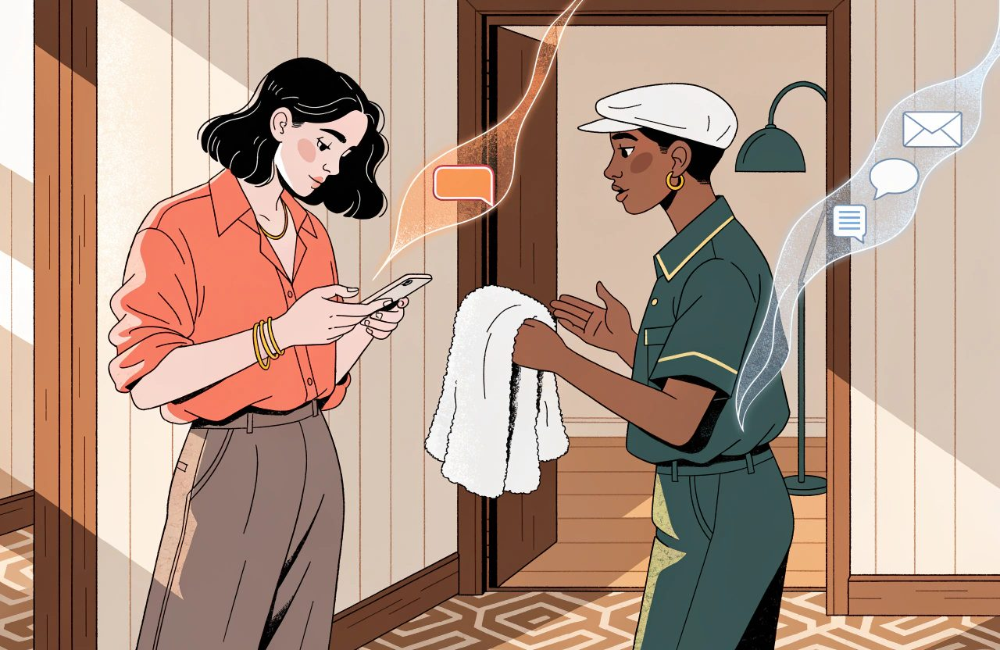
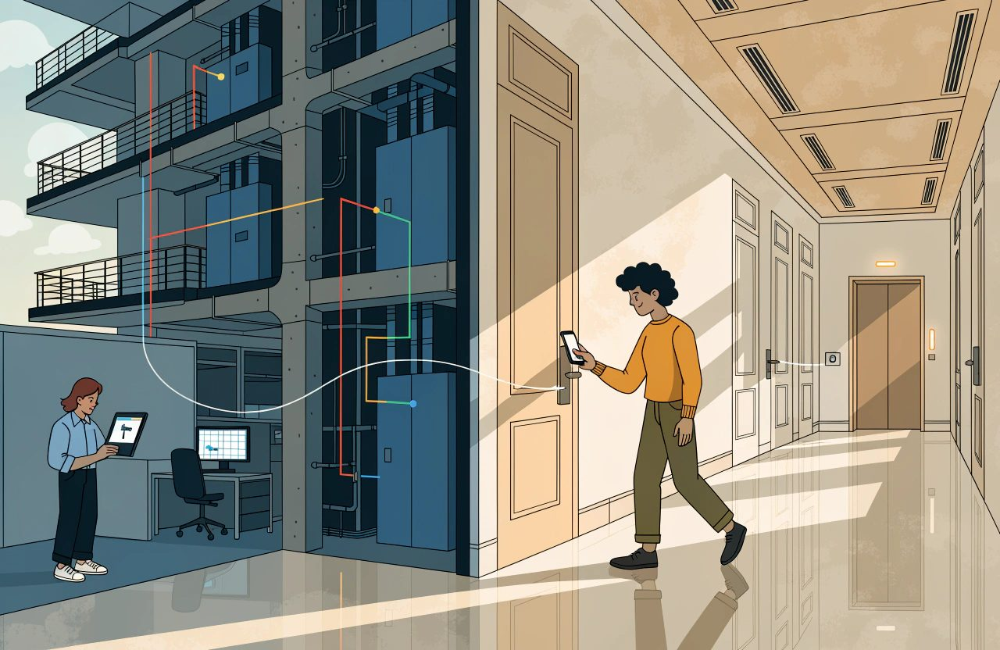
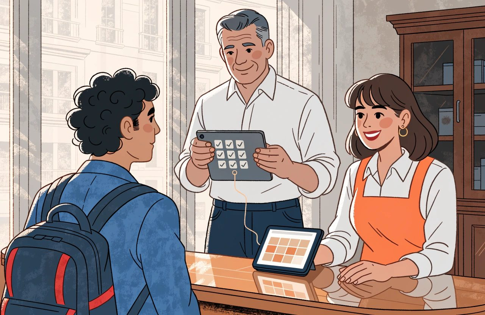

# The Complete Guide to Hotel Guest Technology and CRM

*Winning a new guest is the expensive part. Recognising one you already have is the cheap part.*

A guest checks out on Sunday morning.

It is their fourth stay with you.

Reception wishes them a safe journey, then asks how to spell their surname.

Nothing was broken.

The systems worked. The booking arrived. The room was clean. The invoice was right and the card was charged.

And the hotel still missed the point.

The person at the desk was one of the most valuable relationships it has.

**Most hotels do not have a guest problem. They have a guest record problem.**

*The same person, five times over. Every one of those records is correct, and together they describe nobody.*

The same human being exists five times across your estate. Once in the property management system, the PMS, from a direct booking. Once from an online travel agency, under a stand-in email address. Once in the booking engine. Once in the spa diary. And once in a spreadsheet somebody keeps for the Christmas mailing. Every one of those records is correct.

Together they describe nobody.

The software has not quietly solved this while you were not looking. One industry study of connected hotel databases counted it. Roughly one profile in eight carried an agency email rather than the guest's own. Only about half carried a phone number. Suppliers keep shipping features that try to match guests to themselves. They do that because the problem keeps being there.

This domain is about closing that gap.

Not with sentiment.

Not by buying software that promises a single view of the guest. By understanding four things. What a guest record is. How identity gets broken. What the law lets you do with it. And which of the tools sold under this heading take work off the guest rather than hand it to them.

Winning a new guest is the expensive part.

Recognising one you already have is the cheap part. That is true of each single act of recognition, which is what makes it worth doing. Building the machinery underneath it is not cheap at all. Be honest about that. Most hotels spend heavily on winning guests. Then they leave recognition to the memory of whoever is on shift.

## The Short Version

- Most hotels do not have a guest problem. They have a guest record problem. The same person can exist five times across your estate. Every record is correct. Together they describe nobody.
- Service messages and marketing messages stand on different ground. A service message is about a booking the guest made. A marketing message needs a lawful reason you have written down. That reason is what Article 6 of Regulation (EU) 2016/679, the GDPR, calls a lawful basis. Put an offer inside a confirmation and the safe assumption is that the whole message counts as marketing.
- Identity is the core CRM problem. No shared number for a person exists across your systems. Matching means rules that combine several fields into a confidence score. Merge the confident cases and send the doubtful band to a human.
- Preferences are not one kind of data. A nut allergy is health data. Article 9 of Regulation (EU) 2016/679, the GDPR, puts health data in a special class. For a hotel the usual ground for holding it is the guest's clear and explicit consent. Keep those preferences out of the marketing database.
- Reviews feed guest trust and platform ranking through two different machines. The displayed score is usually a plain average. Recency and volume do their work on the ranking side. Replying to reviews has the better measured effect.
- In-stay technology has one test. Does it take work off the guest, or move work from your staff onto the guest? A mobile key answers that test as a building programme, not a software connection.
- Loyalty at an independent hotel competes on recognition, not on currency. Judge the programme against what would have happened anyway. Comparing members with similar non-members overstates the effect badly.

## Guest Journey and Communication

The guest journey is a run of moments where your hotel can say something useful. Searching. Booking. Waiting to arrive. Arriving. Staying. Leaving. Deciding whether to come back. Technology touches every one of them. In most hotels it says the same bland thing at four of them, and nothing at all at the rest.

Two rules separate a messaging programme from a nuisance.

They are my own working rules, not laws of nature, but I would defend them in any hotel.

**One message, one job.** A confirmation confirms. A message before arrival prepares the guest. If it earns the right, it can also sell something that fits a stay already paid for. A message after the stay asks for feedback, or invites a return. Not both. And never in the same breath as a correction to an invoice. A message trying to do three jobs does none of them. It also trains the guest to stop opening the next one.

**Time messages against the stay, not against the calendar.** Seven days before arrival. The morning of departure. Thirty days after check-out. A newsletter that goes to everybody on the first Tuesday of the month is a different job with a different purpose. Do not confuse the two.

### Service and Marketing Messages Are Different

Keep service messages and marketing messages apart.

They stand on different ground. A service message is about a booking the guest has made. A confirmation, a change, directions, an invoice. A marketing message asks for their attention on something they never requested.

What the second one demands of you depends on three things. Where the guest is. Which channel you use. And whether they are already your customer. Get the shape of it right and you will ask your own lawyer the right question.

- Across the European Union, marketing email normally needs permission you can prove. The rule sits in Article 13 of Directive 2002/58/EC, the ePrivacy Directive. There is a real and widely used exception in the same article. If you got the address while selling that person a stay, you may market similar things to them. You must have offered a way out when you took the address, and in every message since. That exception is often called the soft opt-in. It is why many hotels lawfully email past guests with no tick box on file. A directive is written into national law country by country, so the detail differs. The UK and other European countries outside the EU run their own versions of the same idea. Check the wording that applies where your guest is.
- In the United States, marketing email generally runs the other way round. The broad pattern there is that you do not need permission first. What you do need is to say who you are, give a working unsubscribe link, and act on it quickly. I am not naming the statute, because US rules sit at both federal and state level and they change. If you market into the United States, have that checked by somebody who practises there.
- The trap is that the United States flips again on text messages, sent by SMS, the short message service. Marketing by text there is generally understood to need written permission first. On that reading it is a higher bar than European email. The detail is set by US law and by litigation, so treat this as the shape of the problem. Ask a US lawyer before you build the programme.

So the honest rule is not *marketing needs consent*.

It is this:

**Every marketing message needs a lawful reason you have written down.**

*A service message is about a booking the guest made. A marketing message needs a lawful reason you have written down.*

That reason is what Article 6 of the GDPR calls a lawful basis. Article 6 lists the grounds you can rely on, and consent is only one of them. Which ground fits changes by country and by channel. Record the one you are relying on, list by list, and record why you chose it.

One thing is settled enough to say plainly. Slipping an offer into a booking confirmation gets better open rates. It is also how a hotel ends up with a legal problem attached to its best-performing email. The general European position here is firm. Once a service message carries marketing content, the safe assumption is that the whole message counts as marketing. Its main purpose does not save it. That brings it inside Article 13 of Directive 2002/58/EC, and inside Article 6 of the GDPR. Enforcement in this area is real, though I am not pointing you at any particular case. American rules are usually described as gentler, and treat the message as commercial instead. If you operate in Europe, treat the confirmation as sacred. If the money in that offer is material, get the wording checked locally.

### Choose the Channel for the Job

The channel matters as much as the words:

- Email carries detail and attachments, and the guest can find it again months later. It is the default for confirmations and invoices.
- Text is short and costs real money per message. It is getting dearer rather than cheaper, as the phone networks add fees. Save it for things urgent to the guest, not urgent to you. And know something suppliers never mention. Business text has no read receipt at all. The networks confirm delivery. They cannot tell you the message was opened. Every "98% open rate" figure in circulation traces back to a press release, not a study. You are buying a channel you cannot measure.
- Messaging apps feel personal. They also set an expectation that you will reply. Their cost runs backwards compared with email. On WhatsApp you can write freely only inside a window the guest opens by messaging you first. That window is currently twenty-four hours. Outside it you may send only messages approved in advance, and you pay for each one. Marketing messages are capped per person. None of that is law. It is the platform's own business policy, and the platform can change it whenever it likes. That changes who enforces it, not whether you have to follow it. Data protection law still applies on top. So the channel is cheap when the guest starts the conversation and expensive when you do. Build a programme of outbound messages on it and the sums will not look like the demo.
- App alerts reach only guests who installed your app and left notifications switched on. That is a smaller group than any supplier demo suggests. The only public hotel figures I can find are from 2017 and 2018. They put app use at around one guest in five. Nobody has published a current number. Meanwhile the phone makers have made notification permission harder to get, not easier.

**If a channel can receive a reply, staff it or do not use it.** The worst outcome in guest communication is an automatic message that invites a reply into an inbox nobody opens.

### Two Failures That Quietly Break Guest Communication

Two failures cause most of the damage.

Neither one shows up on a dashboard.

The first is the masked address. That is a forwarding address the platform hands you instead of the guest's own. This is not an occasional quirk of a few agency bookings. Booking.com, the Expedia brands and Airbnb all mask by default. For most European hotels that means the bulk of agency business arrives with no real address on it. Some routes pass no email at all. Bed banks and wholesalers, who buy rooms from you and resell them, are the main offenders.

Two things get confused here, and the difference matters day to day. The forwarding address itself usually keeps working. What runs out is the platform's messaging window. You have a limited period after check-out to reach the guest through the platform, and that period differs by platform. So the failure is not normally that your message vanishes. It is that the address belongs to the platform. The platform's rules decide what you may send through it. Those rules are contract terms rather than law, and they still bind you. And holding the address is not permission to market to anybody. Marketing needs a lawful basis of its own under Article 6 of the GDPR. It also quietly inflates your contact list with addresses that will never produce a direct booking. An honest count of the guests you can reach leaves them out.

Do not assume European platform law has fixed this. As of August 2026 the large agencies still do not hand over private guest email addresses as a matter of course. Where new rights of access do exist, they generally depend on the traveller agreeing. I am not going to point you at a specific provision here, because this area is moving. Check the current position for your platform and your territory before you plan around it.

The second failure is email that never arrives.

The usual explanation is wrong, and that changes what you should look for.

The received wisdom runs like this. Mail that cannot prove who sent it gets quietly filtered and never bounces. Quiet filtering is real. It is not what happens to a hotel that has proved nothing. The big mailbox providers now refuse that mail outright and tell you why. Gmail sends back a specific error saying the sender is unproven. Microsoft used to file failing bulk mail as junk. It now refuses it, and has enforced that since May 2025. These are mailbox provider policies rather than law. Nobody fines you for failing them. Your mail simply does not arrive. Refused mail bounces. You will see it.

The genuinely invisible failure is a different one. A hotel publishes a DMARC record. That stands for domain-based message authentication, reporting and conformance, and it is the third of the three records below. The hotel sets it to watch only. It puts no reporting address inside it. Nothing is enforced and no reports are sent anywhere. The hotel believes it has done the work. It has wired a switch to nothing.

### SPF, DKIM and DMARC Are Different Jobs

So learn what the three records actually do. Treating them as one thing is why hotels set up the first and stop. All three are settings published against your domain name. They tell mailbox providers whether mail claiming to be from you is genuine.

- SPF, the sender policy framework, lists which servers are allowed to send using your domain.
- DKIM, domain keys identified mail, signs the message so the receiver can check that a domain took responsibility for it. It is not a list of who may send. It is also the one most often left half configured.
- DMARC ties the other two to the address the guest actually sees. It tells receivers what to do when those do not line up. And it sends you reports. Put a reporting address in it and read them.

Keep bulk sending apart from the mailbox your reservations team uses for one-to-one email. Do it with a subdomain of your main domain, something like mail.yourhotel.com. Do not buy a lookalike domain for the job. A fresh domain starts with no reputation at all. It breaks the link back to your real name. And it looks exactly like the pattern used to impersonate brands. For a small hotel sending modest volumes, a different sending address on the same domain is usually enough.

Then write in the guest's language. That means more than translation. It is the date format, the order of an address, and whether a phone number appears in a form the guest can dial. Store numbers in the international format. Show them the way the guest's own country writes them.

## CRM and Guest Profiles

CRM stands for customer relationship management.

In a hotel, it means something different from what it means in a sales company. For ordinary individual guests there is no pipeline of deals to push along. There is a crowd of people, and you will never speak to most of them one to one. The job is to know four things about each. Who they are. What they did. What you are allowed to send them. And what they are worth. Group and MICE sales is the exception. MICE stands for meetings, incentives, conferences and exhibitions, and that business does have a pipeline, with deals, decision dates and reasons you won or lost. It is a different craft and it lives in the Sales, Groups and MICE guide.

### Identity Is the Core CRM Problem

**Everything rests on identity. Identity is where it breaks.**

*No system in your hotel holds a shared number for a person. Every link between them has to be built and maintained.*

It is tempting to say your systems do not hold people at all, only transactions. That was true once. It is not true now. Every serious property management system holds a proper record of a person. OPERA has profiles. Mews has customers. Apaleo separates the person who booked from the main guest. Cloudbeds calls it a central store of guest data. Shiji sells a single guest profile. Nor are those records sealed off. Oracle's own point of sale, the till system behind your bar and restaurant, can pull the guest profile onto a restaurant bill, preferences included. Spa systems sync with the major PMS brands.

The real problem is sharper than that, and it is the one that costs money.

There is no shared number for a person. Each system invents its own for the same human being. Any link between them has to be set up, matched and maintained by somebody. The property management system knows a guest by its own number. The booking engine may only ever have seen an anonymous visit. The till attaches a name to a bill if a member of staff remembered to ask. The spa knows an appointment. Every one of those records is valid. Nothing in your estate says they are the same person unless you make it say so.

### Matching Records Without Creating New Errors

Matching those records is the central technical problem in this domain. Every field you might match on fails in its own way:

- Email is the strongest single field. In this industry its biggest failure is the masked agency address. That comes ahead of the ordinary causes: families sharing one address, and the guest who changed provider.
- A mobile number is strong where you have it, and often you do not. Where you do, it fails on shared numbers and on sloppy international formatting.
- Name and date of birth is weak on its own and useful alongside something else. It depends on staff typing it the same way every time.
- A loyalty number is exact when it is there. It is absent most of the time.
- A payment card token is not the identity field it looks like. This one is worth getting right, because the usual worry about it points the wrong way.

Take the last one slowly.

It is the point I see stated backwards most often. A token is a stand-in code that replaces a card number, so nobody has to store the real one. The common fear is that a token breaks when the guest gets a new card. That is precisely the failure the card networks engineered away. A network token survives the card being replaced, reissued or lost. The limit that really rules it out is the one nobody mentions. Tokens are fenced in on purpose. A token is unique to one shopper, at one merchant account, at one payment provider. It cannot be lifted out and used elsewhere. That fence comes from card scheme and payment provider rules rather than from law. It is no less binding on you for that. That is not a shortcoming. It is the entire point of using tokens. So a token can tell you the same card came back to the same merchant account. It cannot join a spa record to a restaurant bill to a booking. That is the job people keep trying to give it. The card networks do publish a code designed to follow a card across different merchants. Even that identifies a card account rather than a person. Joint cards, company cards and one person holding four cards all break it. And pushing payment codes into your marketing database works directly against the reason you replaced the card numbers in the first place.

No single field is reliable enough on its own for the messy case.

In a hotel, the messy case is the normal one. Where you control the number completely, a single field can be enough. A membership number the guest signs in with is the example. Everywhere else, matching means a set of rules that combine several fields and produce a confidence score.

Use two cut-off scores, not one. Above the higher one, merge the records automatically. Below the lower one, do nothing. Between them sits the band of real doubt. That band goes to a human. Squeeze it down to a single line and the score was pointless. That said, this is a design choice rather than an industry law. Some platforms match fully automatically with no review queue, and sell that as the feature. At least one major PMS does the opposite and refuses to merge anything without a person saying yes.

### The Golden Record Is Only as Good as the Merge

The merged result is often called a *golden record*. The phrase is borrowed from the wider business of keeping one clean version of shared data, and it is worth knowing. Do not expect to hear it from the people selling to you. Hotel platforms say unified profile, single guest profile, central profiles or identity resolution. They mean roughly the same thing.

You will be told to insist that merges can be undone, so a bad one can be reversed. The advice is right in spirit. In the most widely installed hotel PMS on earth it is simply not available. Oracle says it plainly. Once a merge finishes, the second profile no longer exists and you cannot undo it. Several well-known guest data platforms say the same. Other systems do work the other way and keep the absorbed record linked rather than deleted. Some rebuild profiles from the original events, so undo means change the rules and run it again.

Ask which of those three you have. Then do the things that work in all of them:

1. Prevent rather than reverse. Where the system lets you mark a pair as "not the same person", use it. The only bad merge you can be sure of fixing is the one you never made.
2. Do the hard matching somewhere you can run again, ahead of the PMS. Treat the merge inside the PMS as the last write and a permanent one, not the first.
3. Take a copy before any bulk merge run. The audit log will tell you a merge happened. It will rarely hold enough to rebuild the record that lost.

And take a bad merge seriously. Two guests fused into one is a failure of accuracy the moment it happens. Keeping personal data accurate is a duty under European data protection law, so log it and assess it like any other data incident. If one guest can now see the other's stay history or invoices, it is worse than that. It is still not automatically something you must report to a regulator. Where that line sits, and how fast you have to move, is set out in national guidance. Agree it with your own adviser before it happens rather than after. Treating every duplicate as a phone call to the authorities will exhaust everybody. So log it, weigh the risk, and escalate if the answer is that somebody's data has been exposed.

### Booker, Guest, Payer and Account Holder Are Different

Keep the commercial roles apart.

Hotels collapse them all the time:

- The booker made the reservation.
- The guest stayed in the room.
- The payer settled the bill.
- The account holder negotiated the rate and receives the invoice.

That fourth one is the omission I would most want back. In corporate and group business the company is the real customer, and the systems know it. There is a company or account record carrying the agreed rate, the credit terms and the invoice. Behind it sit others worth naming when they apply. The travel agent. The source of business that earns commission. The group organiser. And the extra people sharing the room, who often appear on a legally required registration form and nowhere in your marketing database.

These are different relationships. They are not different legal permissions. The distinction matters, because the reason usually given for it is wrong. Your legal right to contact somebody does not come from their commercial role. It comes from what you are doing and why. That is the logic of Article 6 of Regulation (EU) 2016/679, the GDPR. You pick a lawful basis for a purpose, not for a job title. Each role does point at a different purpose, and the purpose is what decides the right. A company paying an invoice has no marketing relationship with you at all, unless something else created one.

A related point holds, with one correction. The person who stayed is the only one who can tell you what the stay was like. The booker can tell you what booking was like. The organiser can tell you what contracting was like. Ask the right person about the right thing. Then ask, separately, whether you are allowed to contact them at all.

A useful profile holds identity, stay history, preferences, permissions and value. It also holds two things that belong on their own shelf. Identity documents taken for legal registration, which have their own rules on how long you keep them. Those rules are national, they differ, and you should look yours up rather than assume. And payment details, which sit with your payment provider rather than with you. Where a supplier handles guest data on your instructions, Article 28 of the GDPR governs the contract between you.

Then there is the part of the profile most hotels never sort out. It is the biggest legal exposure this whole design creates.

### Preferences Can Become Sensitive Data

*This part of the law varies by country and it moves. What follows is how I read the general position, not legal advice for your hotel. The European rules named here are the starting point. Your own country adds to them. Check where you actually stand before acting on any of it.*

*Preferences* is not one kind of data. A nut allergy is health data. A dietary requirement can point at a religious belief. A request for a step-free room points at a disability. Article 9 of Regulation (EU) 2016/679, the GDPR, puts data of that kind in a special class. Article 9 starts by prohibiting the processing of it, then sets out the narrow grounds that lift the ban. So you need one of those grounds to hold this data at all. That sits on top of your ordinary Article 6 basis for the rest of the profile. For a hotel that ground is nearly always the guest's clear and explicit consent. Regulators have also taken the view that an inference counts, whether or not your guess turns out to be right. I am not citing a particular decision for that, so check how it is applied where you are.

This is not theory. It is documented behaviour in mainstream products. A hotel till system can pull the guest's allergy notes onto a restaurant terminal. That is a good feature and exactly what the kitchen should see. It is also special category data arriving at a till, in the Article 9 sense. From there, if you are not careful, it flows on into a marketing system under a permission that does not stretch that far. The consent that let the kitchen keep a guest safe is not consent to sell them a tasting menu.

So separate them by design. Hold the preferences you need in order to serve the guest, under a clear consent and a narrow purpose. Keep them out of your marketing groupings and out of the marketing database. Be able to say who can see them and why. This is the one design decision in this domain most likely to be wrong in your hotel today.

**Permission is not a tick box.** Consent is one of the lawful bases listed in Article 6 of the GDPR, and it has to be earned rather than assumed. Record what was agreed. When. Through what. For what purpose. And the exact words the guest was shown. Then record any withdrawal with the same care, and make withdrawing as easy as giving. A one-click opt-in on a wi-fi page, against an opt-out that means emailing a named officer, is the pattern that tends to get found first.

Collect what you will use and no more. Then decide how long you keep it, set of data by set of data. Accept that in this industry many of those periods are not yours to choose. Guest registration data has legal minimums in some European countries and legal maximums in others. The two pull in opposite directions, and both are set nationally. Periods running from a few months to a few years are common. Six months, a year and three years all turn up in different countries. Some countries also set who may see the register and who may ask for it. I am not putting a figure against a country here, because those instruments change and I have not verified them for this piece. Look the number up for each country you operate in, and write it down. Tax and accounting records usually have to outlive all of them. One blanket rule across the whole group cannot meet that. A schedule per set of data, per country, can.

### Deletion Is a Workflow, Not a Button

*Deletion rights come from European data protection law, and the exceptions to them are often set nationally. What follows is the general shape of it, not legal advice for your hotel. Check the position where you operate before you write your own process down.*

Deletion deserves the same honesty. The practical instinct is right and widely ignored. When a guest asks to be deleted, the request has to reach every system that received a copy. Not just the CRM screen the request landed on. The right itself is Article 17 of Regulation (EU) 2016/679, the GDPR, the right to erasure. A deletion that leaves the guest alive in three other systems is barely a deletion. But state that as an absolute and you teach a standard nobody can meet. In places it is also plain wrong.

- Some data you may not delete. Article 17 of the GDPR carries its own exceptions, and one of them covers data you have to keep to meet a legal obligation. Registration records and tax records normally survive the request on that basis. Which records those are is set by national law, so check your own list.
- You must pass the request on to the systems and companies you shared the data with. The exception is where that is impossible or takes unreasonable effort. Where a supplier only handles the data on your instructions, your contract with them under Article 28 of the GDPR should already say what happens. An agency is different. You cannot force it to delete anything. It holds its own copy and answers for that copy itself.
- A do-not-contact list is the right answer when somebody objects to marketing. It is not a failed deletion. You have to keep a bare record of the person exactly so you never contact them again. Keep it to the smallest amount of data that does the job, and use it for nothing else. Delete that record and you will email them next quarter.
- Backups are normally put beyond use and overwritten on schedule. They are not edited line by line.

So the honest instruction is this:

Know every place the data went. Pass the request on where you can. Write down what you cannot do, and why.

And never delete the record that proves you must not make contact.

### Guest Value Needs Behaviour, Not Memory

Measure a guest's value on what they did, not on the impression they left. The old model is called RFM: recency, frequency and monetary value. How recently they stayed. How often. And how much they spent, counting everything beyond the room. It is crude and it has outlived a great many clever ones. Add length of stay and what the booking channel cost you. Then you can see which guests are genuinely worth keeping, rather than which ones you happen to remember.

Two warnings, because I have seen this used where it cannot work. Frequency only tells you something if enough guests come back, and most hotels have no such base. Analysis of several million hotel guest records from 2024 to 2026 found three things. The great majority of revenue came from first-time guests. A very small fraction of guests ever reached five stays. And most second-time guests never came back a third time. If almost everybody in your database has stayed once, RFM collapses to two letters. The recency of a once-a-year holiday guest is mostly telling you the season. The model earns its place at a city hotel full of business travellers, at a resort with a club, at a casino, or inside a membership base. Elsewhere, use it knowing what it can and cannot see. And check before you promise it. Length of stay and channel cost are rarely held on the profile in a standard PMS or CRM. So the good version of this analysis usually needs work on the data first.

## Reviews and Reputation

Reviews do two jobs at once. They are how a guest decides whether to trust you. They are also an input into where the agency platforms place you in their lists. Every major platform says so in its own documentation. Booking.com lists guest reviews among its ranking factors. Tripadvisor builds its popularity ranking from review quality, recency and quantity. Google says more reviews and better ratings help local ranking. Expedia's default sort order uses review scores and volume. So reputation is a marketing asset and a distribution asset at the same time.

Whether it is also a pricing asset is a weaker claim than it usually sounds, and I would rather be straight about that. The study everyone quotes is from Cornell in 2012, using data gathered around 2009 to 2012. It found that a one-point rise in a hotel's review index was worth roughly nine tenths of a percent on rate. It was worth about one and a half percent on RevPAR, which is revenue per available room. Nobody has repeated the study since. In between came a pandemic, a rewrite of Booking.com's scoring, Google becoming a major place to leave reviews, and ratings drifting upward everywhere. The study also found a smaller price response at the luxury end, not a bigger one. That is the opposite of the idea that there is more headroom higher up. So treat the link between score and rate as real, dated and roughly a straight line. And treat the notion that crossing a score band buys you extra pricing room as my judgement rather than a measured effect.

Understand the mechanics before you set a target. The popular explanation mixes up two different machines.

### Review Score and Ranking Are Different Machines

**The score on display and the ranking system are not the same thing.**

*The score on display and the ranking system are two different machines. Know which one you are aiming at.*

Tripadvisor says its displayed rating is a plain average of all posted ratings. It puts the weighting for recency into its sort orders instead. Google says its score is the average of all published ratings. Booking.com's live partner pages describe the score as an average too. They separately say reviews are archived after thirty-six months, and the score recalculated on what is left.

Recency and volume do matter. They matter on the ranking side, and in the reader's head, rather than inside the score itself. Anybody reading eleven reviews judges the hotel cautiously. That is a real effect and worth managing. It is not evidence that the platform is correcting your number statistically.

I have to flag one live disagreement rather than pretend to settle it. Several hotel technology sources report that Booking.com moved to a three-year score weighted for recency in January 2025. They quote partner guidance. Booking.com's own live partner pages, read this month, still describe an average. I cannot square those from the outside. If your commercial plan turns on which is true, ask your account manager and get the answer in writing.

The lopsidedness is real and worth doing the arithmetic on. Add one review to a set of n. The average moves by the gap between that review and your current average, divided by n plus one. So the damage from a bad score depends on how far below your average it sits. It bites hard in hotels because hotel averages sit near the top of the scale. Take a Booking.com average around 8.5 out of 10. A score of 2 pulls roughly four times as hard as a 10. On Google at 4.5 out of 5, a one-star pulls about seven times as hard as a five-star. There is far more room below you than above you. If your average sat in the middle of the scale the effect would vanish. So state it as a condition, not a law.

Recovery follows from the same arithmetic. Restoring the average after a run of bad scores takes several good ones for each bad one. Roughly four on Booking.com and seven on Google. Two things can rescue you without any of them. Volume dilutes. A hotel with four hundred reviews absorbs a bad month that would sink a hotel with forty. And on Booking.com the bad run eventually drops out of the thirty-six month window by itself. That is not true on Google or Tripadvisor, where the average covers all time.

Tell the difference between reviews you asked for and reviews you did not. Then know where that difference applies. The science is solid. When people choose for themselves whether to review, the ratings pile up at the extremes. In one well-known controlled study, unprompted ratings ran over seventy percent at four stars and above. Asking everybody produced only three percent five-star and seven percent one-star. The people who write unprompted are the delighted and the aggrieved.

The way this is usually framed by platform needs correcting. On Booking.com and Expedia there is no unprompted group at all. Only guests who booked and stayed can review, and the platform sends the invitation itself a couple of days after check-out. The asked-versus-unasked split is a Google and Tripadvisor matter. On the agency platforms your problem is different. It is which of the invited guests bother to answer. Research published in early 2026 found the bias runs in opposite directions on different platforms. Google posters rated lower than they did in surveys. Tripadvisor posters rated higher. Do not pool them without thinking.

### Ask Consistently, Reply Deliberately

*Most of the rules in this part are platform terms rather than law. Platform terms change without notice and differ by platform. Consumer law on reviews also differs by country. Read the current terms, and take advice where money or your listing is at stake.*

Inviting every departing guest, every time, is still the first thing I would do. I want to be precise about why. It is the biggest thing a hotel directly controls, on the platforms where the hotel controls the invitation. In practice that means Google and Tripadvisor. On Booking.com and Expedia you cannot add to their invitations at all. Inviting everybody stops the guests selecting themselves. It does not remove the bias in who replies. And it has to be run evenly. Inviting everybody the same way, whatever happened during the stay, is both the version that works and the version that keeps you out of trouble. Picking who gets asked is banned by the major platforms under their own terms. That is a contract you signed, not a statute. Consumer law in several countries also treats filtered reviews as misleading, though the detail differs and I am not citing it here. Either way the practice has a name. It is called review gating.

One thing has a better-measured effect than inviting, and most hotels can already do it. Research published in 2017 found that hotels which started replying to reviews saw their ratings rise by about a tenth of a star. They also received about twelve percent more reviews. If you want a number to justify the work, that is the number.

**Never reward a review.** The rule is usually stated as "never buy a five-star review". That is true and far too narrow, and the narrow version is what gets hotels into trouble. The major platforms ban all rewards, not only the ones tied to a good score. These are platform terms rather than law. Tripadvisor's published policy bans any review connected in any way to the offer or promise of a benefit, and names prize draws. Google and Trustpilot publish much the same rule. Terms are versioned, so read the current ones for the platforms you actually use. So take the manager running a monthly prize draw for anyone who reviews, good or bad, confident it is fine because it never asks for five stars. That manager has breached all three. Note also that the law in most places is narrower than the platform rules, and it is the platform rules that will hit you first. A platform does not need a regulator in order to act. It just acts. Tripadvisor's published penalties include a ranking penalty lasting a year, being barred from awards, and a visible badge on repeat offenders. Inviting a review is fine. Paying for one is not. And a raffle ticket is payment.

Have a policy for replies and write it down. Which reviews get a reply. Within what time. And who signs them. Reply to the negative ones as a matter of course. The research above supports that rule. Do not stretch it into replying to everything. There is evidence that heavy replying to positive reviews has an unhelpful effect on later ratings. The negatives are where the effort belongs.

Write the reply for the next reader. The usual reason given is that the reviewer has gone and will never come back to the page. Nobody has measured that. The better reason is the one the research does support. Your replies are visible to the people who have not written their review yet. Replying changes what they write. Complaints become fewer, longer and more specific, because a vague grumble now has an audience that answers back. So answer the substance. Skip the defensive paragraph about how seriously you take feedback. And never argue with the guest's experience in public.

### The Words in Reviews Are Operational Data

The most under-used part of reputation technology is not the score.

It is the words. Sort a quarter of reviews into themes and you have the cheapest operational audit you will ever run. It will tell you which room numbers generate complaints. Whether the noise problem is the lift or the road. And whether breakfast is genuinely slow, or only slow at nine o'clock. Send those themes to the departments that own them. Reputation then stops being a marketing number and becomes a maintenance schedule.

Mind the sample size before you act on a movement. To pin down how common a theme is to within ten percentage points, you need something like a hundred reviews in the period. A hotel drawing twenty a quarter cannot tell a trend from noise. It should pool a year rather than chase a quarter. Remember too that you are reading the people who chose to write, not your guests.

Run your own survey alongside the public platforms. Its purpose is different. It catches the fixable problem before it becomes a public review, while the guest is still in the building and something can still be done. Keep it genuinely separate from your public invitations. A survey that decides who then gets asked for a public review is the gating described above. The platforms ban it under their own terms, and consumer regulators in several countries take a dim view of it as well. Do not build it.

## In-Stay and Mobile

Test everything in this section against one question:

**Does this make things easier for the guest, or does it move work from your staff onto the guest and call that innovation?**

### Digital Check-in Must Remove Work, Not Duplicate It

*Guest registration duties are national law. They differ by country, they change, and I am not naming any of the instruments here. Treat what follows as the shape of the problem, not as legal advice for your property.*

Digital check-in passes the test when it genuinely shortens or removes the queue. It fails when the guest fills in a form on their phone, arrives, and is asked for the same passport and the same card at the desk.

The two causes people reach for first are real. Checking who the guest is, and getting the card approved. They are not the only ones, and they do not explain almost every case. Whether the room is ready blocks it in its own right. One large chain will not release a key until the room is ready, not merely allocated. A signature on the registration form is another. Then add device binding, where the key is tied to the phone it was issued to. Change handset and the guest walks to the desk. No industry survey counts which of these fails most often. So treat any ranking of them, mine included, as field experience rather than data.

Checking who the guest is needs a stronger warning than the usual one. It is not always a standard you can design towards. In some countries it is close to a ban. In at least one large European market, the national rule requires the manager to identify the guest in person on arrival. That position moved twice during 2025 and ended up broadly where it began. Where a rule of that kind applies, the workable reading is narrow. Remote checking passes only if it happens live, in real time, over a connection that confirms the match. Live video at the door may qualify. Uploading a document to be looked at later usually does not. I am deliberately not naming the instrument or the decisions, because these are national rules and they move. Elsewhere in Europe the picture splits. Some countries still expect a handwritten signature on the day of arrival, at least from foreign nationals. Others run fully digital registers and are relaxed about how you verify. Two neighbouring countries can sit at opposite ends of that range. So a process that is perfectly fine in one property can be unlawful in the one across the border. So before you design the process, ask whether it is legal in that country at all. And do not expect digital identity wallets to rescue you soon. On the European timetable as it stands, hotels are not among the sectors that will be required to accept them. That may change. It has not changed yet, and I would not build a plan on it.

Getting the card approved is also usually blamed on the wrong party. The constraint is not what your payment provider prefers. It is a mix of law and card network rules. Your provider is only where those rules land on you. The two halves are worth telling apart. In Europe, strong customer authentication comes from Directive (EU) 2015/2366, known as PSD2. The detail sits in Delegated Regulation (EU) 2018/389. Those rules cover payments taken remotely, with no card in the room. Card network rules sit alongside them and are not law at all. Whether a given process qualifies for an exemption depends on three things. Your setup. Your card processor. And what the guest's own bank does on the day. The providers say so themselves. Exemptions are not guaranteed.

### Identity, Payment and Holds Are Separate Problems

While you are there, separate three things that all get called *pre-authorisation*.

They are not the same message. A hold placed on the guest's funds. A zero-amount check that the card is valid. And storing a card for charges later. They carry different rules and different consequences. Most of those rules are card network rules rather than law. Your acquirer is how they reach you, and your acquirer is who enforces them.

And know the constraint that actually breaks stays. Almost nobody raises it at the design stage. Holds expire. Depending on the card network, and on whether the card was physically present, the window can be as short as a couple of days. It is commonly under a week. Take a hold three days before arrival for a seven-night stay and it can lapse before the guest checks out. Some providers can extend a hold a limited number of times. The guest's own bank has the final say. Solve identity checks, card approval and how long a hold lives before you buy the software.

### Mobile Keys Are a Building Project

Digital keys need far more systems to agree than the three usually named. The lock itself has to support the radio the phone uses. Above the locks sits a system that manages them. Above that sits a service that issues keys and cancels them. The locks usually need a network of small relay boxes to talk to, which means proper wireless coverage in every corridor. Then the app or the phone wallet. Then the service that loads the key into the wallet. Then the link to the property management system. If your lifts need a reader, that is often the single largest piece of building work in the project. And even the smoothest wallet key usually still needs the guest to install your app once to sign up.

Say that out loud before the budget meeting.

**A mobile key is not a software connection. It is a building programme with a software connection on top.**

*A mobile key is not a software connection. It is a building programme with a software connection on top.*

The timing problem is real and under-appreciated. You cannot issue a key for a room nobody has allocated. Where the platform waits for the room to be ready, it is stricter still. A hotel that allocates rooms late in the morning cannot deliver keys early. That is a change to how you run the hotel, not a setting in the software. Is it the most common reason mobile key projects stall? I cannot show you. There is no survey data either way. The obstacles on record are just as often the expensive ones. Locks that do not support the radio. Corridors with no coverage. Lifts with no readers. Sign-up runs modestly too, commonly twenty to thirty percent in the first year. Take the timing point as my experience. Budget for the building work regardless.

### In-Stay Messaging Has a Simple Test

Messaging during the stay is the thing in this section I would fund first. A guest can report broken air conditioning in one line at eleven at night, and get an answer. That guest is much less likely to write a review about it. Not certain to stay quiet, though, and it is worth knowing why. The best hotel study on this found that putting things right cuts bad word of mouth substantially. It does not bring it back to the level of a guest who never had the problem at all. A recovery is a repair, not an eraser. Getting it right the first time still beats fixing it well.

The condition is the same as before. Somebody has to be reading it. And be careful with the word "cheap". Next to the other things in this section it is cheap. In hard money, an answer at eleven at night means night staff or an on-call rota. That is a fixed cost and it does not shrink with your room count. At a twenty-room hotel it is the whole business case.

Ordering from a phone, digital guest directories and in-room service requests work when somebody keeps them up to date. They embarrass you when nobody does. A digital directory listing a restaurant that closed last season is worse than no directory at all. It was presented as the official answer.

### Upsell Only What Operations Can Deliver

Selling extras belongs here, and it belongs tied to what you can actually deliver. Offer early check-in, late check-out or an upgrade at the right moment and it sells well. The guest is already committed and already thinking about the stay. A few days before arrival, and again at check-in, is the usual starting point. It is a starting point to test, not a proven best answer.

Then split the offers, because they fail differently.

- An upgrade is sold out of the rooms you have. Checking availability as it happens is already standard in the main platforms. So this is a question to ask a supplier rather than a warning about the whole category.
- Early check-in and late check-out are not rooms at all. There is no stock to count down. What limits them is the pattern of arrivals and departures, and the housekeeping schedule. Most property management systems do not offer either as something a selling tool can check. So these are usually set up as manual extras. That is where the sale you cannot deliver actually comes from.

There is a second failure the suppliers are quieter about. These tools price to make the sale, not to protect what the room could have earned. Sell tonight's last suite as a cheap upgrade to a guest already in the house and the tool records a win. If somebody else would have booked that suite at full rate, it is a loss. Knowing what rooms you have is necessary and not sufficient. Put that rule in the brief.

**A selling tool that cannot see what you can deliver is a complaints machine with good sales figures.**

*A selling tool that cannot see what you can deliver is a complaints machine with good sales figures.*

Two constraints apply to everything above.

Never make a digital route the only route. The guest with no app, no data connection or no confidence is still a guest. I hold that as a service rule. Its legal weight is messier than it is usually presented. European accessibility law has covered booking sites and apps since 28 June 2025, and self-service kiosks as products. The instrument is Directive (EU) 2019/882, the European Accessibility Act. E-commerce services are brought into scope by Article 2(2)(f). Article 4(5) then exempts microenterprises that provide services, which in practice means firms under ten staff and two million euro turnover. That covers a lot of independent hotels. Transitional arrangements also let existing equipment run on for a period. It is a directive, so it is written into national law country by country. Check your own country's version of it. The United States has its own hotel-specific rule about reservations. The broad effect is that accessible rooms must be bookable the same way, and at the same hours, as any other. Wider obligations for websites there have been shaped by litigation rather than by one clear rule, and they are inconsistent. I am not naming the US instruments here. If you sell into the United States, have that checked by a US lawyer. Here is the crucial part, as I read it. The rules I am aware of do not require a non-digital alternative. They require the digital route to work for everybody. That is a different duty, and a harder one. So keep the human route because it is right, and because it is cheap insurance. Not because I can point you at a regulation that says you must.

### Guest Wi-Fi Is a Weakening Identity Layer

*The permission rules below come from European data protection law, and they are applied differently in different countries. This is how I read the general position, not legal advice for your hotel. Check yours before you design the sign-in page.*

And treat guest wi-fi carefully, for two reasons that have both changed.

The first is permission, and the precision matters. Providing wi-fi does not usually rest on the guest's consent. It rests on your contract with the guest, and on your own legitimate interest in running the service. Contract, legitimate interest and consent are three of the grounds listed in Article 6 of Regulation (EU) 2016/679, the GDPR. Legitimate interest is the one that covers doing the obvious thing people already expect of you. Consent belongs to the marketing sitting on top. A login page that collects an email address for marketing, with no clear and separate opt-in freely given, is not a marketing list. It is a liability. And making the wi-fi conditional on accepting marketing is the pattern most likely to be found not freely given. Consent that is not freely given is not consent.

The second is that the phone makers are dismantling the whole idea of collecting data this way. Recent iPhone software changes the phone's wi-fi address regularly, by default, on exactly the kind of open sign-in network hotels run. That breaks any attempt to recognise a returning device. The small browser that opens on the sign-in page is now walled off from stored cookies and password managers. Encrypted lookups and private relay services get in the way of the redirect to that page. The direction of travel is towards signing in with saved credentials rather than filling in a form. So wi-fi is still a place to ask permission and still a place to engage. As a way of recognising people, in 2026, it is degraded. A guest data plan built on sign-in page emails and device addresses is built on ground that is being removed underneath it. Expect this to move again within a year.

## Loyalty

Start with an honest position.

If you are an independent hotel or a small group, a standalone programme cannot beat a global chain on currency. Their points are worth more to a guest because they can be spent across thousands of hotels. No amount of design fixes that arithmetic for points you can only spend in one building. Compete on recognition instead.

That is the thing large programmes are worst at.

Two corrections to that, and both strengthen the argument rather than weaken it.

The word "standalone" is doing real work. You can rent the arithmetic. Independents now join alliances and collections that issue a genuinely global currency. One large chain opened its programme to hundreds of independent luxury hotels. The biggest independent alliance covers dozens of brands, hundreds of hotels and tens of millions of members. If your market wants the currency, that is the practical route. It is a distribution and brand decision more than a technology one.

And be clear about who pays for the chain currency the guest values. Franchise disclosure documents put the loyalty charge at around four percent of the qualifying guest bill, on top of the other fees. The big programme is worth more to the guest partly because the hotel owner funds it. That is the same net contribution test this section ends on, applied to somebody else's programme.

### Four Loyalty Models

There are broadly four options.

This is my framing rather than an industry classification, and real programmes mix them freely.

- Points, earned and redeemed. Flexible, familiar, and the most expensive to run.
- Tiers, which grant status and benefits based on what the guest did before. Cheap to run and effective at the top end. Meaningless if everybody qualifies.
- An instant benefit, usually a member rate or a fixed set of member perks. Simplest to explain, and the quickest to shift the booking in front of you. Note the trade. An instant discount moves this booking. A points balance moves the next one. Those are different jobs and the choice is not obvious.
- Recognition only, with no currency at all. Knowing the guest, remembering the preference, and acting on it. Free, and the hardest to do consistently.

### The Member Rate Sits Across Three Domains

The member rate deserves attention. It sits across three domains. And the standard advice about it is now wrong in the market most of my readers work in.

The standard advice goes like this. A member rate is shown only to a closed group. So you can price it below your public rate without breaking parity, because it is not publicly available. Parity is the promise in your agency contracts that you will not sell the same thing cheaper elsewhere. Retire that sentence. It fails on three separate points.

First, "not publicly available" is not the test anybody actually applies. Parity here is contract, not law. The exemption in the big agency agreements covers rates that are unpublished and not marketed online. Those words mean what your agreement says they mean, not what they mean in ordinary English. And "published online" is defined to include showing enough detail for a customer to work the rate out. "Members save 10% when you book direct" is therefore published, on the face of the contract. It does not help that the rate itself sits behind a sign-in. One major agency's European terms contain no membership or closed-group exception at all. They also define publication to include anything shown on channels you own.

Second, in much of Europe the rule you are working around no longer exists. The largest agency's own partner terms now list the whole European Economic Area as a no-parity territory, along with Switzerland, Russia and South Africa. European platform law has also moved in your favour here. Regulation (EU) 2022/1925, the Digital Markets Act, applies to platforms the Commission has designated as gatekeepers. Where a platform carries that designation, your freedom to advertise a cheaper direct rate is better protected than it once was. Whether it covers the platform you are arguing with is worth checking rather than assuming. So a European hotel hiding its direct saving behind a login is losing bookings to solve a problem it does not have. Narrow parity still applies in markets such as the UK, Australia, Japan and Turkey. Narrow parity limits only what you publish on your own website. Wide parity limits what you give every other channel as well, and it still applies across much of the rest of the world. That includes the United States, where the risk in the old advice is higher than it sounds rather than lower.

Third, the way you would actually show a member rate tends to defeat the exemption anyway. The supported way to show one on Google puts the public rate on screen with a line through it and the member saving beside it. Google also requires the programme to be free to join. That is enough detail to calculate the discount, published, to everybody.

So the honest version is this:

A rate behind a fence is still one of the legitimate ways to shift business towards direct. Where parity does bind you, that rate must be genuinely unpublished and unmarketed, as your own agreement defines those words. Read the agreement you signed, for the territory you are in. If the money is material, get a lawyer to read it with you. Contract wording is versioned and changes without notice. So this is not knowledge you can hold for five years.

One practical note, because this is where it breaks in practice rather than in principle. Your loyalty system does not enforce the member rate. The booking engine or central reservation system enforces it, by deciding who qualifies for that rate plan. What the outside world can see is decided by rate mapping in the channel manager. Mapping is the record of which rate on your side equals which rate on theirs. A member rate leaks because somebody mapped it, not because somebody designed it badly.

### Points Are an Accounting Liability, Not Free Currency

Points carry a cost most hotels account for badly. The usual shorthand for it is wrong in a way an auditor will spot at once.

The instinct is right. A point you issue is a debt, and it starts the moment the guest earns it, not when they spend it. What is wrong is the measurement. "Value it at what the redemption will actually cost you" is the old incremental-cost method. The main international accounting standards moved away from it well over a decade ago, and the American equivalent did the same. I am not naming the standards here, and I am not an accountant. Your auditor will tell you which ones apply to your accounts.

Here is the shape of the correct treatment, in plain terms. Say the points give the member something they could not simply have bought. That promise is a separate thing you sold as part of the stay. So you split the price the guest paid. You set the points share aside as revenue you have not earned yet, and you hold it there until the points are used. How much you set aside is based on what the promise is worth to the guest, adjusted for how likely it is to be used. It is not based on what the redemption will cost you. Those are different numbers. The second is smaller, because the first includes your margin.

That difference is not cosmetic for anyone in this trade. Done correctly, the points cost comes off rooms revenue on the stay that earned them. It moves your average daily rate, your ADR, and it moves your RevPAR. Done the shorthand way, revenue is overstated and the debt is understated. The numbers you report to owners are then wrong in a direction that flatters you.

Three things follow that are worth knowing before you spend money on this.

- A franchisee paying a brand loyalty charge carries no points debt at all. The promise belongs to the brand. Applying the rule above would put a liability on your balance sheet that does not belong there.
- A programme whose only benefit is a member rate, free for anybody to join, generally creates no debt either. A discount everybody can have is not a separate promise. The simplest programme is also the cleanest accounting.
- Smaller companies in some countries have recently lost the simplified treatment they used to rely on here. In the UK and Ireland that change took effect for accounting periods starting in January 2026. The industry's own reporting standard revised its loyalty accounts in the same month. Check with your accountant whether it has caught you, because the dates differ by country.

Take that as the shape of the problem, not as the answer for your programme. Whether a given benefit counts, and how you measure it, is a question for an accountant. Find one who has signed off a set of hotel accounts with a loyalty programme in them.

Breakage needs the same correction. Breakage is the share of points nobody ever claims. It is tempting to say a programme planning for high breakage is quietly relying on disappointing its members. The moral instinct is fine. The mechanism is wrong. Estimating breakage is not a design choice you can decline. The standards require you to estimate it, and to look at it again every period. And the estimate sits inside the amount you set aside. So assuming higher breakage means setting less aside and booking more revenue now. The accounting pressure therefore runs towards over-estimating breakage, because that flatters today's numbers. That is a risk to your audit and to the quality of your earnings. It is a better reason to be cautious than the moral one.

While you are designing expiry, check the law where your members live. Some countries ban points expiring through the passing of time alone.

### Measure Loyalty Against What Would Have Happened Anyway

**Judge the programme on evidence, not on sign-ups.** Sign-up counts measure how hard reception pushes. What matters is three things. How many guests come back. What share of bookings arrive direct. And what each member stay contributes after the cost of the benefit. That last one is the right discipline and I would not change it.

The way you measure it does need to change, and this is the part most loyalty reports get wrong. Comparing members against similar non-members overstates the effect, badly. The best study on this corrected for one fact. People who join were already more likely to come back. Once corrected, the measured effect of membership fell to around a seventh of the naive figure. Matching on market, segment, length of stay and rate class cannot fix it. What drives both joining and returning is the guest's existing intention, and you cannot see that in your data. Two things make it worse in hotels. Guests usually join at the moment of a booking they were making anyway, so that stay gets credited to the programme. And people who travel to your city often join because they are frequent, not the other way round.

Two designs fix it, and a single hotel can run either.

1. Compare each member with themselves. Look at what they did before and after the date they joined, using groups that joined at different times. Every member is their own control.
2. Better still, hold the benefit back. Pick a share of members at random and withhold the benefit, not the membership. Then compare. It feels uncomfortable. It is the only clean answer you will ever get.

If members book direct at a clearly better net contribution, and come back more often than they would have anyway, it works. If the programme mostly discounts guests who were coming regardless, it is a rate cut with paperwork attached. The naive report will not tell you which one you have.

Keep the unglamorous point in view.

**The strongest loyalty tool available to a hotel is a guest record accurate enough that the person at the desk knows who just walked in.**

*The strongest loyalty tool a hotel has is a guest record accurate enough that the person at the desk knows who just walked in.*

Everything in the first two sections of this article exists to make that possible.

## Common Questions

### How do you match guest records across different hotel systems?

Matching guest records means combining several fields into a confidence score. Email is the strongest single field. Its biggest failure in this industry is the masked agency address. Phone, name and loyalty number each fail in their own way. Use two cut-offs. Merge automatically above the higher one. Do nothing below the lower one. Send the doubtful band in between to a human.

### What is the difference between a service message and a marketing message?

A service message is about a booking the guest has made. A confirmation, a change, directions or an invoice. A marketing message asks for attention on something the guest never requested. The two stand on different ground. Marketing needs a lawful basis of its own, in the sense used by Article 6 of Regulation (EU) 2016/679, the GDPR. Record the lawful reason for each marketing list you hold, and record why you chose it.

### Can a hotel put a marketing offer in a booking confirmation email?

Slipping an offer into a confirmation lifts open rates. It also attaches a legal problem to your best-performing email. The general European position is blunt about it. Once a service message carries any marketing at all, the safe assumption is that the whole message counts as marketing. That puts it inside Article 13 of Directive 2002/58/EC and Article 6 of the GDPR. American rules are usually described as gentler, and treat the message as commercial instead. Check the position where your guest actually is.

### Why do agency bookings arrive without the guest's real email address?

Booking.com, the Expedia brands and Airbnb all mask the address by default. What you receive is a forwarding address owned by the platform. The address usually keeps working. The platform's rules decide what you may send through it, and those rules are contract terms rather than law. Having the address is not permission to market. That still needs a lawful basis of its own. Bed banks and wholesalers often pass no address at all.

### Can a payment card token be used to recognise a returning guest?

A payment token is not the identity field it looks like. Tokens are fenced in on purpose. One token belongs to one shopper, one merchant account and one payment provider. A token can confirm the same card came back to the same account. It cannot join a spa record to a restaurant bill.

### Are guest preferences such as allergies special category data?

A nut allergy is health data. A dietary requirement can point at a religious belief. A step-free room points at a disability. Article 9 of Regulation (EU) 2016/679, the GDPR, puts data of that kind in a special class. It prohibits processing unless one of a narrow set of grounds applies. For a hotel that ground is nearly always the guest's clear and explicit consent. Keep it out of the marketing database.

### How much does one bad review move a hotel's average score?

One review moves the average by its gap from your current average. Divide that gap by the number of reviews plus one. Hotel averages sit near the top of the scale. So the damage is lopsided. On a Booking.com average near 8.5, a score of 2 pulls about four times as hard as a 10. Volume dilutes, and a hotel with four hundred reviews absorbs a bad month.

### Can a hotel offer a prize draw for guests who leave a review?

Prize draws are banned by the major platforms under their own terms, which are contract rather than law. Tripadvisor's policy bans any review connected to the offer or promise of a benefit. Google and Trustpilot publish much the same rule. A draw open to good and bad reviews alike still breaches all three. Read the current terms, because platforms revise them without notice. Inviting a review is fine. Paying for one is not.

### Why does digital check-in still end at the front desk?

Digital check-in fails when the guest fills in a form and is asked for the same things again at the desk. Identity checks and card approval are the usual causes. Room readiness blocks it too. Some chains will not release a key until the room is ready. A signature requirement or device binding can also send the guest to the desk.

### Does a member rate break rate parity?

A member rate is usually defended as closed, and therefore outside parity. That defence is weaker than it sounds. Parity is a contract term rather than a law, and the contract sets the definitions. Agency contracts typically define published to include showing enough detail to work the rate out. In much of Europe the largest agency now treats the whole European Economic Area as a no-parity territory. Read the agreement you signed, for the territory you are in.

## Key Terms

- **Golden record.** The single merged version of a guest, built from several source records. Hotel platforms usually call it a unified profile, a single guest profile or identity resolution.
- **Identity resolution.** The work of deciding that records in different systems describe the same person. No shared number exists across your estate, so somebody has to build the link and maintain it.
- **Masked email address.** A forwarding address the platform hands you instead of the guest's own. Booking.com, the Expedia brands and Airbnb all mask by default. The address belongs to the platform, and its rules decide what you may send.
- **Soft opt-in.** The exception in Article 13 of Directive 2002/58/EC, the ePrivacy Directive, that lets you market similar things to someone whose address you took while selling them a stay. You must have offered a way out at the time, and in every message since. A directive is written into national law country by country, so the wording that binds you is your own country's.
- **Special category data.** The class of data set out in Article 9 of Regulation (EU) 2016/679, the GDPR, including health, religion and disability. A nut allergy, a dietary requirement and a step-free room request can all fall inside it. Article 9 prohibits processing unless a narrow ground applies. Explicit consent is nearly always the ground a hotel relies on.
- **Network token.** A stand-in code for a card number that survives the card being replaced. Under card scheme rules a token is unique to one shopper, one merchant account and one payment provider. Those are scheme rules rather than law. A token is not a guest identifier.
- **SPF, DKIM and DMARC.** Three separate settings published against your domain name. SPF lists the servers allowed to send. DKIM signs the message. DMARC ties both to the address the guest sees, and reports back to you.
- **Pre-authorisation.** One word covering three different messages. A hold on the guest's funds, a zero-amount check that a card is valid, and storing a card for later charges. Each carries different card scheme rules and different consequences. Holds also expire, sometimes within days.
- **Review gating.** The practice of choosing who gets invited to review, usually by filtering out unhappy guests. The major platforms ban it under their own terms. Consumer law in several countries also treats it as misleading, though the detail differs by country. Invite every departing guest the same way instead.
- **RFM.** Recency, frequency and monetary value. How recently a guest stayed, how often, and how much they spent. RFM needs a base of returning guests, and most hotels do not have one.
- **Member rate.** A rate offered only to members of your programme. Your booking engine or central reservation system enforces who qualifies, not the loyalty platform. Rate mapping in the channel manager decides what the outside world can see.
- **Breakage.** The share of issued points nobody ever claims. The main accounting standards require you to estimate it, and to revisit that estimate each period. Which standard applies to your accounts is a question for your accountant. A higher estimate books more revenue now, so the pressure runs towards over-estimating.

## How This Connects to the Wider Hotel Technology Stack

Guest technology touches almost every part of the hotel, so the boundaries matter.

- **[Hotel Operations and PMS](../hotel-operations-and-pms/)** holds the reservation, room status and usually a guest profile of its own. This domain reconciles and improves that record; it does not replace the operational system.
- **[Distribution and Connectivity](../distribution-and-connectivity/)** determines whether the hotel receives a real guest email address or a masked one. It also decides whether a member rate remains protected or leaks through rate mapping.
- **[Direct Booking and E-commerce](../direct-booking-and-e-commerce/)** wins the booking and usually enforces eligibility for member rates. This domain owns what happens to the guest relationship after the booking exists.
- **[Revenue Management](../revenue-management/)** uses segments and repeat behaviour defined here, and prices the member rate that this domain operates.
- **[Market Intelligence and Analytics](../market-intelligence-and-analytics/)** compares reputation and guest satisfaction against the market. The comparison belongs there; the operational response to what guests actually wrote belongs here.
- **[Payments and Financial Technology](../payments-and-financial-technology/)** owns card tokens, payment security and the payment relationships that can sometimes help recognise repeat activity. Those identifiers are not a universal guest identity layer.
- **[Sales, Groups and MICE](../sales-groups-and-mice/)** brings guests who arrive under someone else's contract. The account holder may be the commercial customer while the individual traveller is still the guest.
- **[Data, APIs and Integration](../data-apis-and-integration/)** moves guest data between systems and governs whether identity matching is even possible.
- **[AI, Automation and Agents](../ai-automation-and-agents/)** applies automated messaging, summarisation and personalisation to this data. The same requirements remain: explainability, limits and trustworthy source records.
- **[Hotel Technology Strategy](../hotel-technology-strategy/)** is where the hotel decides whether a dedicated CRM is justified or whether the existing stack can do enough already.
- **[Emerging Hotel Technology](../emerging-hotel-technology/)** tracks new guest-facing categories before they are stable enough to commit to.

## Related Reading

No supporting articles have been published in this section yet.

As the wider article library grows, the most relevant supporting pieces can be added here in batches.

Guest technology is sold on the promise of a single view of the guest. It is bought by hotels that have not yet decided who wins when two records disagree. Decide that first. And decide it the right way round.

The instinct to name one system that owns the truth is a good instinct pointed at the wrong thing. No hotel system owns all of it, and no supplier sells one that does. Your payment provider is built so that it cannot hand you the card details. Your property management system owns what happened in the house. Your record of what the guest agreed to has to survive independently of both. So do it one kind of data at a time. For each kind, name the system that owns it. Name the direction the data flows. And write the rule that says which record wins when two disagree. That question has an answer. "Which system owns the truth" does not.

The software is the easy part. The rules are the part that makes any of it work.

Get the record right, and recognition stops depending on who happens to be on shift.

I would rather be corrected than agreed with. If something here does not match what you see in your own hotel, tell me, and tell me what you saw.
