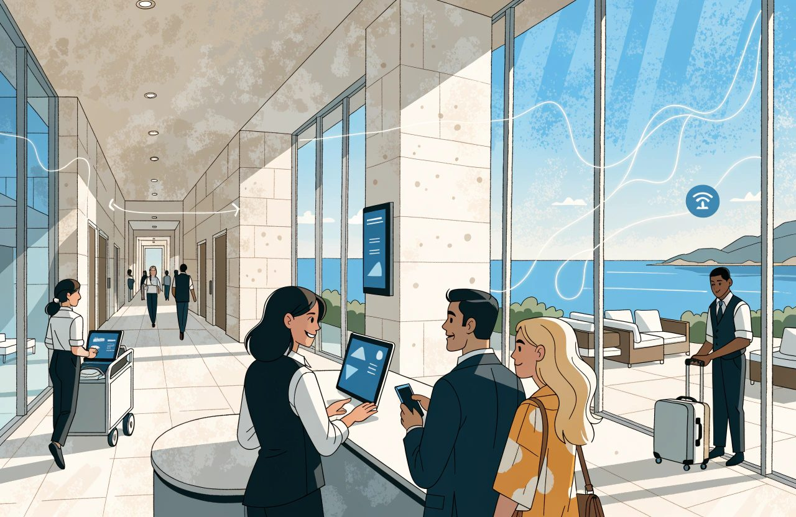
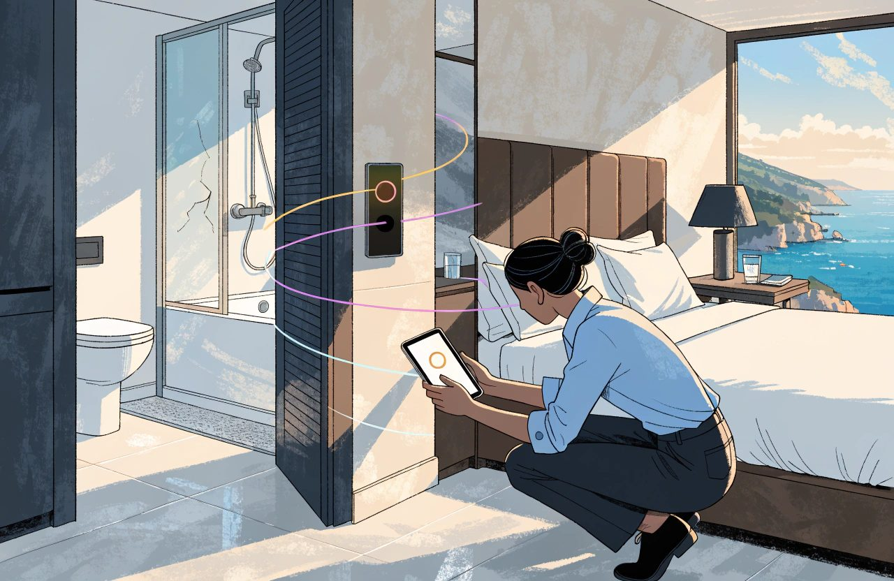
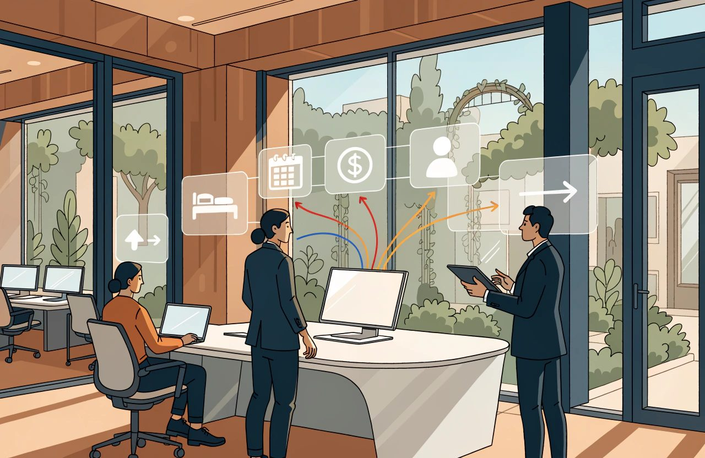
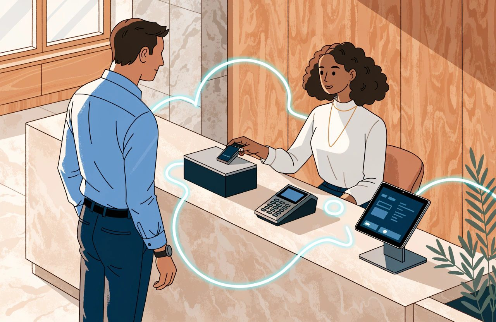
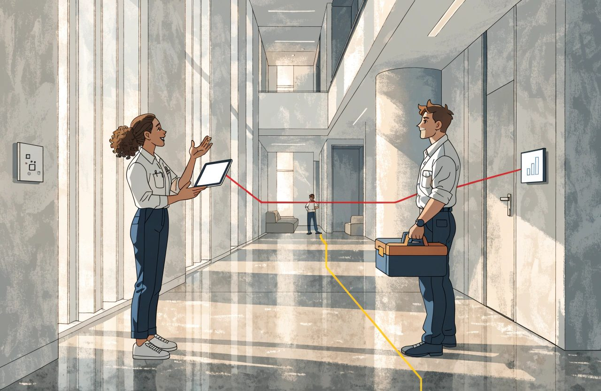

# The Complete Guide to Hotel Operations and the PMS

*Everything in the building is talking to everything else. The PMS is where they agree on what is true.*

A shower tray cracks in room 214 at half past ten.

The housekeeper reports it. Maintenance says two days. By four that afternoon, a guest is standing at reception holding a confirmation for that room.

It was booked twenty minutes earlier, on a channel nobody was watching.

What happened in those few hours is the subject of this guide.

The property management system, the PMS, is the software that runs much of the hotel. It holds your rooms, reservations, guest accounts and daily books. It is the record everyone in the building has agreed to believe.

That is not the same as knowing.

Yet conversations about PMS technology still have a habit of stalling on one question:

*Is it cloud-based?*

Cloud is not the strategy. It is the starting condition.

Knowing that a PMS runs in a browser tells you remarkably little about whether it will serve you on a Saturday in August, with three coaches arriving, a lift out of service and reception already forming a queue.

The word cloud carries less than people think. Two editions of the same product can be built differently underneath. A vendor can share one copy of its software across many customers while giving different hotels different feature sets. Another can run one version of its code in a separate environment for every hotel.

Both can legitimately call themselves cloud.

The questions that matter are less exciting.

What does the PMS connect to?

Can you get your own data out?

Who owns each important piece of information?

And when room 214 becomes unsellable at 10:35, does that fact reach everywhere it needs to go, or does somebody have to remember?

*A cracked shower tray at half past ten. Whether that fact reaches distribution before four o'clock is the whole subject of this guide.*

## The Short Version

- A PMS holds what exists, what is promised and what is owed. The guest profile sits across all three. But it holds a reported version of reality. It stays right only for as long as people and systems keep writing the truth into it.
- Cloud is the starting condition, not the strategy. Ask what the PMS connects to, what happens when the internet stops, and whether you can get your own data out.
- Selling a room type is not the same as assigning a room. Somebody still has to match arrivals, groups, accessibility needs and VIPs to actual doors.
- Legal guest registration and a guest marketing profile are two different activities. The legal grounds and the retention periods differ from one country to the next. Check what your own country requires rather than copying a rule across a border.
- Sellable inventory is not a count of doors. Out-of-order rooms, group blocks, restrictions and overbooking limits all change it. None of them needs a new reservation to arrive.
- The night audit closes the trading day and proves the books balance. Where a PMS has removed it, the question is not whether the old ritual survived. It is where the control went.
- You are not buying today's feature list. Make every supplier perform five things your hotel genuinely does. Then ask how you export all your data if you leave.

## Core PMS Concepts

At its heart, a PMS holds three things:

**what exists, what is promised and what is owed.**

A fourth, the guest profile, sits across all three.

What exists is your building.

Room 214 has a number, a floor and a bed layout. In most hotels it also belongs to a room type, and that room type is what the guest buys. They reserve a Superior Sea View, not room 214. Reception decides which physical room fulfils that promise, and can change that decision right up to arrival.

That model is common, but it is not universal.

Hostels sell beds. Serviced apartments may sell named units. Connecting rooms can draw down several pieces of inventory. Some systems create several virtual room types over the same physical room. A newer model goes further and sells room attributes rather than traditional room types, allowing one physical room to fulfil several possible products.

That remains a minority model in 2026, but it is real and it is developing.

What is promised is the reservation.

A reservation is a claim on accommodation for particular dates, at a particular price, for a given number of people and under defined conditions.

It moves through a life cycle: held, confirmed, arrived, in house and departed, alongside the two familiar failures: cancelled and no-show.

There are other states around it. Waitlisted, denied and walked reservations sit outside that simple sequence. Group blocks have their own statuses and can affect your availability long before an individual guest name is attached.

What is owed is recorded in the folio.

Room charges, taxes, breakfast, minibar and other items are posted there. Payments reduce the balance. Charges can be split, allowing a company to pay the accommodation while the guest settles the extras.

The accounting language matters.

The folio does not suddenly move onto a ledger when somebody checks out. It is already represented on one. While the guest is staying, the balance sits on the guest ledger. At departure it is either settled or, where an arrangement already exists, transferred to the city ledger for later payment.

A guest who genuinely leaves without paying is different. That is a skipper. The unpaid balance may also end up on the city ledger, but one is an agreed billing process and the other is an incident.

Keep them apart.

Around all of this sits the guest profile, carrying information and preferences forward.

But don't automatically assume the PMS owns the master guest profile.

In some hotels that record lives in a CRM. In others it sits in a loyalty platform or a central reservation system, with the PMS holding a copy.

That distinction leads to the principle that governs everything else in this guide.

**The PMS does not need to be the brain. It needs to be a reliable system of record.**

Pricing can live elsewhere. Forecasting can live elsewhere. Messaging can live elsewhere, often better.

What matters is deciding which system is authoritative for each important fact.

I have seen that simplified to:

*When the PMS and another system disagree, the PMS wins.*

For an independent hotel built around a single PMS, that may be exactly the right rule.

As a universal law, it is false.

Connectivity platforms can be configured so that either the PMS or the central reservation system controls room availability. Central systems can own rooms, rates or content. Other platforms send selling limits back into the PMS.

The important point is not that one architecture is correct.

It is that somebody has decided.

**The PMS is right because you chose it, not because it can see.**

*The PMS does not know your hotel. It knows what people and systems last told it.*

It holds a reported version of reality. It stays accurate only for as long as other systems and people keep writing the right things into it.

That is why discrepancy reports exist.

And it is how a room can remain perfectly sellable inside the software while a plumber is standing in the shower.

The real work is deciding who owns each fact and making sure reality reaches the record.

## Cloud and Deployment

Deployment describes where the software runs, who updates it and who is responsible for keeping it available.

You will usually hear three labels.

On-premise: software running on infrastructure at the hotel.

Hosted: broadly, the same kind of software moved into infrastructure somewhere else.

Software as a service, SaaS: the vendor operates the software and you consume the service.

Useful distinctions.

But don't ask them to tell you more than they can.

SaaS does not automatically mean one shared installation serving every customer. A dedicated environment can still be SaaS. A private cloud can still be cloud. Vendors can sell shared and dedicated deployments under different editions of the same product.

So rather than spending an hour debating labels, ask three questions:

- Who operates it, and who is accountable when it stops?
- How many versions or feature sets are live, and how do customers receive changes?
- What can I access and control myself, and what requires the vendor?

The second question matters more than it sounds.

A vendor may genuinely run one core installation and release updates constantly, while still controlling which customers can see which features.

That is normal modern software practice.

Features are tested, piloted, switched on for some customers and later rolled out more widely. Two hotels can therefore use the same underlying platform on the same afternoon and still see different capabilities.

There is nothing inherently wrong with that. Staged releases are one of the ways vendors avoid breaking everybody at once.

It simply changes the buying question.

Don't ask only:

*Are we all on the same version?*

Ask:

*Which functionality will I receive, when will I receive it, and who decides?*

Once hosting is settled, three areas matter enormously in hotel operations:

**offline behaviour, local connections and data access.**

*Your software may be in the cloud. The locks, terminals and tills are still in the building.*

### What Happens When the Internet Stops?

At some point, it will.

The uncomfortable reality is that mainstream cloud PMS platforms generally do not offer a documented way to continue the full check-in process with the PMS genuinely offline.

At least one cloud vendor's emergency procedure still involves printing registration information regularly and recording activity manually.

So test the problem in three pieces:

1. What information can reception still see?
2. What can the payment terminal do independently?
3. How are the transactions and operational changes reconciled afterwards?

Payments add another layer.

A card terminal may be able to accept transactions offline, but that does not make them safe. The commercial risk moves to the hotel. Failed captures, chargebacks and disputes can become your problem, and some transactions may never successfully reach the bank. Where that risk lands is generally set by your acquirer agreement and by the card scheme rules, not by law. Read your own agreement, because acquirers word this differently.

That is not an obscure technical feature.

At full occupancy on a Saturday night, it is a commercial decision.

### What Still Lives Inside the Building?

Cloud PMS does not mean the hotel has become cloud-native.

Door locks, key encoders, phones, tills and card terminals may still be sitting physically inside the property.

The PMS therefore needs a route back into the building.

Keycard systems illustrate the problem nicely. Many remain local. If the cloud PMS cannot communicate with the encoder or the lock system, reception may not be able to create the key.

Some newer cloud-connected lock platforms are changing that architecture, but the wider point remains.

The software may be in the cloud.

The hotel isn't.

### Can You Get Your Data Out?

*These rules vary by country and they move. What follows is how I read the general position, not legal advice for your hotel. Check where you actually stand before acting on any of it.*

This is one of the most important procurement questions in the entire PMS discussion.

Can you extract reservations, guest accounts, profiles and other important operational information in bulk, on demand, in a format you can actually use?

If you cannot, you do not have effective control over your commercial history.

People often describe this as owning your data. Legally, that language is imprecise. As a general rule, European and UK law does not recognise a broad property right in data as such. There are related rights, and there are contracts, but neither is the same as ownership.

What matters is access, control and contract.

For EU hotels, that position changed significantly when the EU Data Act began applying on 12 September 2025. The instrument is Regulation (EU) 2023/2854, and it is worth naming, because a supplier will ask you which rule you mean.

Its switching provisions affect cloud services, and a PMS platform can fall within that. In broad terms, notice can be no longer than two months. The changeover period is thirty days, followed by at least a further thirty days to retrieve data. Contract terms that obstruct switching are banned. From January 2027, switching charges are due to disappear entirely, including charges tied to extracting data. That is the shape of the switching provisions rather than the fine print. Check the current text before you rely on one of those numbers in a negotiation.

For an EU hotel, data portability is increasingly an entitlement rather than merely a favour to negotiate.

Do not confuse that with GDPR.

The portability right in Article 20 of the GDPR, Regulation (EU) 2016/679, belongs to the individual. It does not give the hotel a general right to take every piece of commercial or operational data from one supplier to another. Obligations to return personal data also do not automatically cover things such as rate structures or historical availability. Those you get through your contract, or you do not get them at all.

And at the time of writing the UK has no equivalent to the EU Data Act. UK hotels still need to deal with this contractually. Check the current position before you assume either way, because this is an active area.

Then there is security.

Cloud does not mean secure.

Deployment architecture and security quality are different questions.

Ask where the data is stored. Ask who inside the supplier can access it. Ask whether their access is logged. Ask how privileges are controlled. Ask which security responsibilities belong to the vendor and which remain with the hotel.

Then ask them to put that division in writing.

## Front Office and Reservations

Front office is where the promise meets the building.

A reservation may arrive from an OTA, the hotel's own booking engine, a telephone call, a central reservation system or a negotiated sales agreement.

Whatever the source, the information required by the hotel's processes has to reach the PMS correctly.

Room type. Rate. Number of guests. Tax treatment. Payment method.

Your own list will be longer.

Write it down.

Connections differ in what they send, what they require and what they leave optional. Payment information may be represented by a token, stored somewhere else or absent entirely.

The dangerous errors are often the ones that do not generate an error message.

Send the wrong number of guests and the booking may still arrive successfully.

It can price incorrectly.

Breakfast numbers can be wrong.

Your average rate can be distorted.

Nothing crashes.

The error simply flows downstream.

*Every reservation arrives as data from somewhere else. One wrong field changes the price, the breakfast count and the room.*

Then comes a part of hotel operations that technology conversations often overlook: room assignment.

Selling a room type is not the same as assigning a room.

Somebody still has to match arrivals, connecting-room requests, accessibility requirements, VIPs, groups and operational blocks to actual doors.

Assign too early and every change creates rework.

Leave it too late and reception is solving the puzzle under pressure while the queue gets longer.

A sensible check-in sequence might look like this:

1. Confirm the guest and booking, including rate and departure date.
2. Confirm the physical room is genuinely ready.
3. Handle the payment method correctly.
4. Complete whatever legal guest registration is required, then deal separately with the guest profile.
5. Issue keys and place the reservation in house so connected systems receive the correct status.

The second step is more important than it appears.

In mainstream PMS platforms, housekeeping status does not necessarily decide whether a room is available for sale.

A room can be marked dirty and remain bookable. Some systems warn you if you try to check somebody into it; others allow the user to continue.

Only a deliberate inventory action removes the room from sale.

That distinction becomes critical when maintenance enters the picture.

### Payments Need Precision

*Card scheme rules and payment law both sit behind this section, and they are not the same thing. What follows is how I read the general position, not legal advice for your hotel. Check with your acquirer, and with a lawyer where money turns on it.*

Card holds at check-in are frequently handled badly.

The sensible principle is to authorise the amount you reasonably expect the stay to cost rather than taking a meaningless token hold.

But reasonably expect matters.

Visa's guidance for hotels does not allow an estimated authorisation simply to be padded for hypothetical extras or possible damage. The amount should represent an estimate of the expected bill. If the stay grows, the authorisation can be increased. Once the final amount is known, the unused hold should be released promptly. Note what that is. It is a card scheme rule, not a law. The schemes impose it through your acquirer. That changes who enforces it, not whether you have to follow it.

In Europe there is another layer.

Under PSD2, Directive (EU) 2015/2366, funds can only be blocked where the cardholder has agreed to the precise amount. The estimate therefore needs to be shown and agreed. Card scheme guidance expects that authorisation framework to be established at booking rather than improvised at the desk. That part is a scheme rule rather than law. If the hotel intends to charge the card later without the guest present, the guest generally needs to have authenticated when giving that permission. The detailed rules on strong customer authentication sit in Delegated Regulation (EU) 2018/389. A card simply sitting on file without that verification is not covered by the exemption hotels sometimes assume. Check how your own payment provider applies it, because implementations differ.

This is why payment design should begin during booking, not at reception.

Know the timing as well.

Hotel authorisations can remain open for different periods depending on network and processor. Some card networks allow up to thirty days; others allow seven. Some processors apply their own timetable. These are scheme and processor rules rather than law, and they are not published in one place. Ask your acquirer for the figures that apply to you, in writing.

And remember what an excessive hold means to the guest.

On a credit card, it reduces available credit.

On a debit card, you are holding their actual money.

### Registration Is Not the Same as Marketing

*These rules vary by country and they move. What follows is how I read the general position, not legal advice for your hotel. Check what your own country requires before acting on any of it.*

Legal guest registration and creation of a guest marketing profile are two different activities.

They can have different legal grounds, different information requirements and different retention periods.

Those rules also vary between countries.

European countries do not impose identical guest-registration requirements, and the retention periods differ as well. In some countries the police registration form applies only to guests from outside the European Economic Area. In others it applies to everybody. Retention commonly runs from a few months to a few years. I am not putting a number against a country here. Those numbers are set nationally and they change. One global PMS configuration cannot satisfy several countries at once by collecting everything from everybody. Find out what your own country requires rather than carrying a rule across a border.

Some countries go further than a name and a document number. At least one European country now requires accommodation providers to record specified payment-card details and to keep them for a period of years. Rules of that kind are national, they are recent, and they arrive with little warning. If you trade in more than one country, check each one separately.

That creates a real collision between national reporting obligations and the card industry's wider discipline of minimising stored card information. The two sit in different systems. One is law where you trade. The other is a set of card scheme rules reaching you through your acquirer. Neither excuses you from the other, and only local advice will tell you how to hold both at once.

If you operate anywhere with a rule like that, treat it as a compliance problem, not an extra spreadsheet. Get local advice on what you must record, how it should be protected, and how long you may keep it.

And if your PMS stores card information, interacts with authorisations or is expected to support payment activity during disruption, then the card-industry security standard matters. That standard is PCI DSS. It is not a law. It is a rule set the card schemes impose through your acquirer, and your acquirer is who asks you to evidence it.

Sensitive card data held electronically before authorisation has to be protected, and those requirements have been tightened in recent years. Requirement 3 of PCI DSS is the part covering stored account data, so start there. The card security code is stricter again. The PCI Security Standards Council puts it plainly in its own published FAQ. Its answer is that it is not permitted to retain card verification codes once the purchase they were collected for has been authorised. That covers a card kept on file, and it covers repeat charges.

Consent does not override that rule. The guest cannot agree you out of it, because the guest is not the party the rule answers to. Your acquirer is. If a supplier tells you otherwise, ask them to show you where the standard says so.

Overbooking also eventually arrives at reception.

The decision to oversell may have been made by revenue management.

The guest standing at the desk belongs to operations.

Agree the recovery process before you need it: who can be moved, where they will go, what the hotel will pay and who is authorised to make the decision at eleven at night.

Automation belongs here too.

Automate repetition: pre-arrival registration, authorisations, keys, routine billing tasks.

But keep a boundary.

The value of the person at the desk is not their ability to copy data between fields. It is judgement.

Reading the exhausted family in front of them.

Recognising when the procedure should bend.

Absorbing a small cost to save a guest relationship.

That is what guests remember.

## Housekeeping and Maintenance

The terminology here sounds simple until you compare systems.

Broadly:

- Vacant dirty: the guest has left; the room is not ready.
- Vacant clean: cleaned and potentially ready, sometimes followed by an inspected status.
- Out of service: commonly used for a smaller defect. In many systems the room remains part of sellable inventory.
- Out of order: commonly used when the room should not be sold and is removed from available inventory.

Do not trust the words without testing your PMS.

The exceptions are significant.

Some platforms have no separate out-of-order status. Their out-of-service status removes the room from sale. Others leave out-of-service rooms available but prevent check-in. Some introduce another status such as out of inventory, changing the meaning again.

The labels are not the control.

The behaviour is.

Take a test room, apply each status and look at what happens to availability.

Ten minutes will teach you more than the terminology.

The operational principle underneath is much more important:

**housekeeping changes and maintenance failures can be commercial events.**

If a room is no longer usable, somebody or something must make a deliberate change to the inventory.

Otherwise the building and the selling system drift apart.

Go back to room 214.

*The same fault, reported through the workflow at 10:35. Inventory drops before reception ever hears about it.*

In one version of the morning, the housekeeper writes the cracked shower tray on a paper sheet. Maintenance receives it eventually. The office blocks the room at three. Nobody checks distribution.

At four, reception is apologising.

In the second version, the housekeeper reports the defect through the operational workflow at 10:35. Room 214 is taken out of order for two nights. Sellable inventory for that room type decreases and the update begins moving through the connected systems.

That is the morning to design for.

But don't turn it into magic.

Several things can still happen:

- Vendors rarely promise that inventory updates reach every external system instantly.
- Distribution channels receive availability for a room type, not the story of room 214.
- An intentional oversell setting can offset the reduction.
- Some workflows can subsequently reverse an out-of-order block.
- A system may refuse to block a room already assigned or occupied.

None of that is an argument for the paper sheet.

It is an argument for testing the entire chain.

Use a real room, a real date and the real connected systems. Take it out of sale and watch what happens.

That is the only version of the workflow that matters.

There is also a human consequence.

Housekeepers who report faults into a system that acts on those reports keep reporting them.

Those who report into a sheet that changes nothing eventually stop bothering.

You lose one of the best early-warning networks in the hotel.

That is my experience rather than a published finding, but I have never seen it work the other way.

Two operational habits are worth keeping.

First, run the discrepancy report daily, and look in both directions.

If front office shows a room empty while housekeeping says it is occupied, you may have a stay you are not billing correctly.

If front office says occupied while housekeeping says empty, you may have inventory sitting unnecessarily out of sale.

Hotels tend to notice the first problem faster than the second.

Second, give every out-of-order block an expected return date.

Otherwise temporary lost inventory has a nasty habit of becoming permanent lost revenue.

A final warning on terminology: even the language around room-status discrepancies is inconsistent. Modern PMS platforms and traditional front-office texts can use terms such as sleep and sleeper differently.

When accuracy matters, describe the actual condition.

And one question will matter later when you get to reporting:

Does an out-of-order room disappear from the denominator used to calculate occupancy?

Your PMS may say yes.

The reporting standard may say something else. The standard in question is USALI, the Uniform System of Accounts for the Lodging Industry.

## Rates, Inventory and Availability

Availability is a calculation.

Understanding that calculation helps prevent obvious overbooking.

It also prevents something hotels talk about much less: selling fewer rooms than they actually have.

Start with the physical rooms in a room type.

Subtract rooms that have genuinely been removed from inventory.

Subtract reservations consuming that room type.

Subtract group blocks and allotments that are currently taking inventory.

Then adjust for intentional overbooking.

What remains is approximately what you can sell.

Approximately matters.

Real systems make different decisions about provisional reservations, blocks, room status and oversell controls. Some calculate both a highest and lowest availability depending on which tentative business is included.

There is not always one availability number waiting to be discovered.

*Sellable rooms are not a count of doors. Blocks, restrictions and overbooking all get a vote.*

Group blocks are particularly good at creating confusion.

Rooms can be held for a group and deducted from general availability, held without being deducted, or recorded merely as an enquiry.

Change the status of a block and your availability can change instantly without a single new reservation arriving.

Overbooking can also exist at several levels.

Whole hotel.

Room type.

Potentially channel.

And the value can work in the opposite direction: a negative adjustment can deliberately hold inventory back instead of selling more.

Then come the ways hotels oversell even when the arithmetic itself looks correct.

A room marked out of service that operations cannot actually use.

House-use or complimentary rooms.

Products that draw down multiple pieces of inventory.

Room-type controls that do not reconcile cleanly with whole-hotel inventory.

A channel mapping failure.

An update that reached one system and not another.

Most oversells can be traced to a fairly ordinary cause.

The one that ruins your August will be the exception.

Rates sit alongside inventory, but they are not the same thing.

A rate plan is a product: price plus conditions.

Cancellation policy. Inclusions. Eligibility. Length-of-stay rules.

Derived or linked rates inherit their price from another rate. A non-refundable rate, for example, might always sit a defined percentage below the flexible rate.

That is powerful when configured correctly.

Configured incorrectly, it can quietly discount the wrong product for months.

Restrictions are different again. They influence which demand you will accept rather than simply setting the price.

Minimum and maximum length of stay can shape the pattern of bookings around busy dates. Arrival and departure restrictions control when stays may begin or end. A stop sell closes the relevant rate or room type.

Release periods belong in the same commercial conversation but solve a different problem. A release or cut-off returns unsold contracted rooms from a block to general availability.

Now connect the two ideas.

**Availability and bookability are not the same thing.**

A hotel can have rooms physically available and still be impossible to book because a rate, arrival day or length-of-stay restriction has closed the path.

So when somebody says:

*We're not selling.*

Do not ask only:

*How many rooms are available?*

Ask:

*What is closed?*

That leads back to system ownership.

The question is not simply which system is the single source of truth.

It is:

**Which system owns which truth?**

Two systems writing different answers into the same field for the same date will eventually corrupt each other.

But one system does not need to own everything.

A PMS may own physical room inventory.

A revenue system may own price.

A central reservation system may own selling limits.

A distribution platform may impose a channel-specific ceiling.

That can be deliberate architecture rather than disorder.

Write it down.

For rooms, rates, restrictions and channel-specific controls, name the authoritative system.

Then name the people allowed to change it.

A system-of-record strategy that exists only in somebody's head is not a strategy.

## Reporting and Night Audit

The night audit is one of those hotel processes most people barely think about until it fails.

Traditionally, it closes one business day and opens the next.

Broadly, the process checks unfinished arrivals and departures, open bills and cashiers; posts room and tax charges; deals with reservations that neither arrived nor cancelled; balances financial activity; rolls the business date forward; and produces the reports used to run the next day.

The order varies, and some steps are configurable.

No-show handling, for example, may be automated in one PMS and handled differently in another.

And the night audit itself is no longer universal.

At least one established cloud PMS has removed the traditional audit completely, handling recent operational changes through a different workflow.

That is worth paying attention to.

If a historic control disappears, the important question is not whether the old ritual survives.

It is where the control went.

Two concepts help make sense of the rest.

### Business Date

The hotel's business date does not always have to match the calendar date.

A drink poured at one in the morning may still belong to the previous trading day. The audit is traditionally where the hotel draws that line.

Some platforms instead align the business date with midnight.

That removes one source of confusion and introduces another around late-night activity.

### Trial Balance

The trial balance is the daily test that the accounting entries reconcile.

The casual explanation that revenue equals the money received is not enough.

Not every debit is revenue. Taxes, deposits, transfers and cash paid out can appear without representing a sale.

Not every credit is cash arriving. Discounts, refunds, complimentary stays and ledger transfers complicate the picture.

Nor is a hotel necessarily balancing one simple ledger. Major PMS platforms may reconcile guest balances, city-ledger balances, deposits, packages and inter-property activity together.

When the figures do not agree, the audit has discovered something.

That is the control doing its job.

The operational reports worth knowing include:

- arrivals, departures and in-house guests;
- the daily flash or manager's report;
- no-show and cancellation reporting.

The flash typically contains rooms sold, occupancy, room revenue, average daily rate and revenue per available room.

The formulas sound simple.

Average daily rate is room revenue divided by rooms sold.

Revenue per available room is room revenue divided by rooms available.

The complication is the denominator.

Your PMS may remove out-of-order rooms from the room count when calculating occupancy and RevPAR. Some platforms do that automatically. Others do not. Some make it configurable.

That is how the software reports.

Benchmarking standards are a different matter.

The benchmarking rule, which comes from USALI, says there should be no adjustment to reported room availability for rooms temporarily out of service for less than six months. Only three things come out: seasonal closure, closure of six months or more, and permanent use by the house. That is a reporting convention rather than a law, but your comparison breaks if you ignore it.

That creates a very practical problem.

A hotel can take the occupancy percentage directly from its PMS, send it into benchmarking and unintentionally make itself look stronger than the properties it is comparing itself with.

Run both versions where necessary.

Know which number you are quoting.

The definitions also moved recently. The industry accounting standard is USALI, and its 12th Revised Edition took effect on 1 January 2026. Check which edition your own reports and your benchmarking provider are built on, because they may not match.

And remember that rooms sold and rooms occupied are not identical: occupied rooms can include complimentary rooms.

No-shows can create another oddity. Depending on the treatment, revenue can exist without a corresponding sold room night, moving ADR in a way that surprises anyone comparing the no-show report with the morning flash.

Now imagine the audit fails at 2:30 in the morning.

There are two operational responses.

We'll look at it tomorrow.

Or:

Here is the recovery procedure and the vendor's out-of-hours number.

Writing the second one takes very little time.

Modern cloud systems may not stop reception working just because an audit step fails. The business date may continue to roll and staff may continue operating.

But that does not make the failure harmless.

You can end up with unposted revenue, incomplete statistics and a financial mess that somebody has to unwind later.

Quite enough reason to have the procedure.

## PMS Selection and Migration

Buy the direction, not only the feature list.

*You are not buying today's feature list. You are buying the next ten years of your operation.*

You are buying where the vendor is going and how well it understands the operation it is trying to support.

Both usually outlast whatever feature happens to win the demonstration.

My own bias, stated as bias: a vendor that has never understood a night audit can build one that demonstrates beautifully and fails under pressure in December.

I cannot prove that as a universal rule.

I have watched variations of it enough times to price it into the decision.

Test systems against your actual operation.

Choose five things your hotel genuinely does.

A half-board supplement.

A group reservation with a rooming list.

A long-stay guest billed weekly.

Then make every supplier perform them live.

Do not ask whether the system can theoretically support them.

Watch somebody do them.

Software should follow your commercial logic.

That does not mean preserving every historic process.

Nearly every successful system change alters workflows. Hotels that demand exact replicas of every old habit often end up paying for custom configuration, and excessive customisation is one of the ways systems become hard to upgrade, difficult to connect and eventually painful to replace.

Separate what matters from what is merely familiar.

If the process reflects something commercially distinctive about your hotel, make sure the software can support it.

If the process exists only because your previous PMS forced everybody to do it that way, migration may be the cheapest opportunity you will ever get to kill it.

Then test the connections.

A PMS is not an island.

An API, or application programming interface, is the doorway other software uses to communicate with it.

A partner logo on a website tells you that some kind of door exists.

It does not tell you how wide the door is.

It does not tell you what it costs to use.

It does not tell you how frequently somebody may walk through it.

And it does not tell you whether another system is already standing in the doorway.

The difference between platforms can be enormous.

Some vendors advertise open access with no connection fee and credentials a hotel or partner can configure directly.

Others charge per transaction, impose request limits, enforce timing rules or constrain how event feeds can be consumed across a group.

Those technical restrictions can create real architecture and cost consequences.

Most of them are documented.

Read them before you sign.

And do not assume there is one mature hotel technology standard solving this for everybody.

Open travel formats have not produced a single universal integration model. Major PMS vendors continue to operate their own platforms, APIs and connection ecosystems.

So don't stop at:

*Do you have an API?*

Ask:

*Can the system I actually want to use do the things I need through it, and what will it cost?*

Then plan the migration before the contract is signed.

That is where hotels most easily lose their history.

For every category of data, decide what comes with you, what is archived and what you are prepared to leave behind.

Future reservations.

Guest profiles.

Balances and ledgers.

Historical stays and bills.

Rate configuration.

Then:

1. Inventory the data.
2. Decide what migrates, what is archived and what is dropped, with senior sign-off.
3. Export everything possible from the old platform before cutover, and keep a copy you control in a documented format you will still understand years later.
4. Move during lower occupancy if you have the choice, with tight control over rate and configuration changes.
5. Validate the new system immediately after go-live: room counts, guests in house, deposits, integrations and the first financial close.

Sometimes you will not get a perfect migration window.

Contracts end. Suppliers withdraw products. Projects slip.

If you are forced to move during a difficult period, increase the checking rather than pretending the risk disappeared.

For EU hotels, the Data Act, Regulation (EU) 2023/2854, gives the data-extraction part of this process additional legal weight. Use that leverage while negotiating rather than discovering your rights when the relationship has already broken down. Have the switching and exit clauses read by someone who knows the regulation before you sign.

And before you buy any PMS, ask one final question:

**Show me how I export all my data if we leave.**

Then watch what happens.

## Common Questions

### What does a hotel PMS actually do?

A PMS holds three things: what exists, what is promised and what is owed. It carries the rooms, the reservations, the guest accounts and the daily books. The guest profile sits across all three. It is the record everyone in the building has agreed to believe.

### Is a cloud PMS better than an on-premise one?

Cloud is the starting condition, not the strategy. Two products can both be cloud and be built very differently underneath. The useful questions are what the system connects to, who owns each important piece of information, and whether you can get your own data out.

### What happens to a cloud PMS when the internet stops?

Less than most people assume. Mainstream cloud platforms generally do not offer a documented way to complete a full check-in with the PMS genuinely offline. Test three things: what reception can still see, what the payment terminal can do on its own, and how the transactions are reconciled afterwards.

### What is the difference between a room and a room type?

The room is the physical space. The room type is the product the guest buys. Most guests reserve a Superior Sea View, not room 214. Reception decides which physical room fulfils that promise, and can change that decision right up to arrival.

### What is the difference between out of order and out of service?

Out of order commonly removes a room from sellable inventory. Out of service commonly describes a smaller defect, with the room often still sellable. But the labels are not the control. The behaviour is. Some platforms have no separate out-of-order status at all. Take a test room, apply each status and watch what happens to availability.

### How is hotel availability calculated?

Start with the physical rooms in a room type. Subtract rooms genuinely removed from inventory, reservations consuming that room type, and group blocks currently taking inventory. Then adjust for intentional overbooking. What remains is approximately what you can sell. Approximately matters, because systems make different decisions about provisional reservations and blocks.

### What is a rate plan?

A product, not a price. It is the price plus its conditions: cancellation policy, inclusions, eligibility and length-of-stay rules. A derived rate inherits its price from another rate. That is powerful when configured correctly, and quietly expensive for months when it is not.

### What is the night audit, and is it still necessary?

Traditionally it closes one business day and opens the next. It checks unfinished arrivals and departures, posts room and tax charges, balances the financial activity, rolls the business date forward and produces the reports used to run the next day. At least one established cloud PMS has removed it completely. The question is not whether the old ritual survived. It is where the control went.

### What should you test before buying a PMS?

Choose five things your hotel genuinely does. A half-board supplement. A group reservation with a rooming list. A long-stay guest billed weekly. Make every supplier perform them live rather than confirm they are possible. Then ask how you export all your data if you leave, and watch what happens.

## Key Terms

- **Property management system, or PMS.** The software holding rooms, reservations, guest accounts and the daily books. The hotel's operational record.
- **Room type.** The product a guest buys. The physical room is assigned separately, often close to arrival.
- **Out of order.** A status that commonly removes a room from sellable inventory. Test the behaviour rather than trusting the label.
- **Out of service.** A status commonly used for a smaller defect, where the room often stays in sellable inventory.
- **Business date.** The hotel's trading day, which does not always match the calendar date. A drink poured at one in the morning may still belong to the previous day.
- **Trial balance.** The daily test that the accounting entries reconcile.
- **Rate plan.** A price plus its conditions: cancellation policy, inclusions, eligibility and length-of-stay rules.
- **Derived rate.** A rate that inherits its price from another, such as a non-refundable rate held a fixed percentage below the flexible rate.
- **Restriction.** A control over which demand you accept rather than what you charge. Minimum and maximum length of stay, arrival and departure rules, and stop sells.
- **Release, or cut-off.** The point at which unsold contracted rooms return from a block to general availability.
- **Discrepancy report.** The daily comparison between what housekeeping found in a room and what the system believes about it. Read it in both directions.
- **API.** The doorway other software uses to talk to the PMS. A partner logo tells you a door exists. It does not tell you how wide it is, what it costs, or who is already standing in it.

## How This Connects to the Wider Hotel Technology Stack

A PMS does not operate in isolation. The decisions and records described above move into almost every other part of the hotel technology stack.

- **[Distribution and Connectivity](../distribution-and-connectivity/)** carries rooms, rates and availability out to booking channels. Mapping, certification and rate parity sit there. In an independent hotel the PMS will often be the authority on room inventory, but a central reservation system may legitimately be the master in a brand or group environment.
- **[Direct Booking and E-commerce](../direct-booking-and-e-commerce/)** owns the website and booking engine. The moment a direct reservation lands in the PMS, it becomes an operational record.
- **[Revenue Management](../revenue-management/)** decides price and, depending on the architecture, may also own restrictions or oversell limits. Occupancy, pickup, out-of-order rooms and no-shows all depend on the operational record being right.
- **Market Intelligence and Analytics** turns PMS output into comparison, benchmarking and forecast. Bad operational data becomes bad analysis. The occupancy denominator discussed above matters here because it changes what you benchmark.
- **Guest Technology and CRM** depends on the profile created through booking and check-in. In many hotels the master guest profile lives outside the PMS. Duplicate profiles are therefore not just an administrative nuisance; they carry a marketing cost.
- **Payments and Financial Technology** handles card authorisations and the movement of money. The bill may live in the PMS, but the payment moves through another system, and the night audit is where the two must reconcile.
- **Sales, Groups and MICE** brings rooming lists, blocks, cut-off dates and event billing into the PMS. Group blocks also sit inside the availability calculation, which is why group business and oversell problems often meet in the same argument.
- **Data, APIs and Integration** is the layer underneath every connection in this article. It determines what the PMS can exchange, how quickly, under what limits, and whether you can get usable data back out.
- **AI, Automation and Agents** can only be as trustworthy as the record beneath them. AI built on bad room status, reservation or availability data simply multiplies the error faster.
- **Hotel Technology Strategy** weighs a PMS replacement against every other demand on the technology budget.
- **Emerging Hotel Technology** covers operating models and technologies that are real but not yet settled enough to treat as standard practice.

## Related Reading

- **Why Your Hotel's Future Runs on a Cloud PMS**

As the wider article library grows, this section can expand with the most relevant supporting pieces rather than becoming a catalogue.

A PMS earns its place by being boringly reliable about what exists and who has been promised it.

And by allowing everything around it to read and write that truth without a fight.

It is right because you decided it should be.

It stays right only for as long as everything around it keeps telling it the truth.

Judge it on the shower tray in room 214.

On the queue at four.

On the audit at half past two.

And on what happens to your history the day you leave.

I would rather be corrected than agreed with. If something here does not match what you see in your own hotel, tell me, and tell me what you saw.
