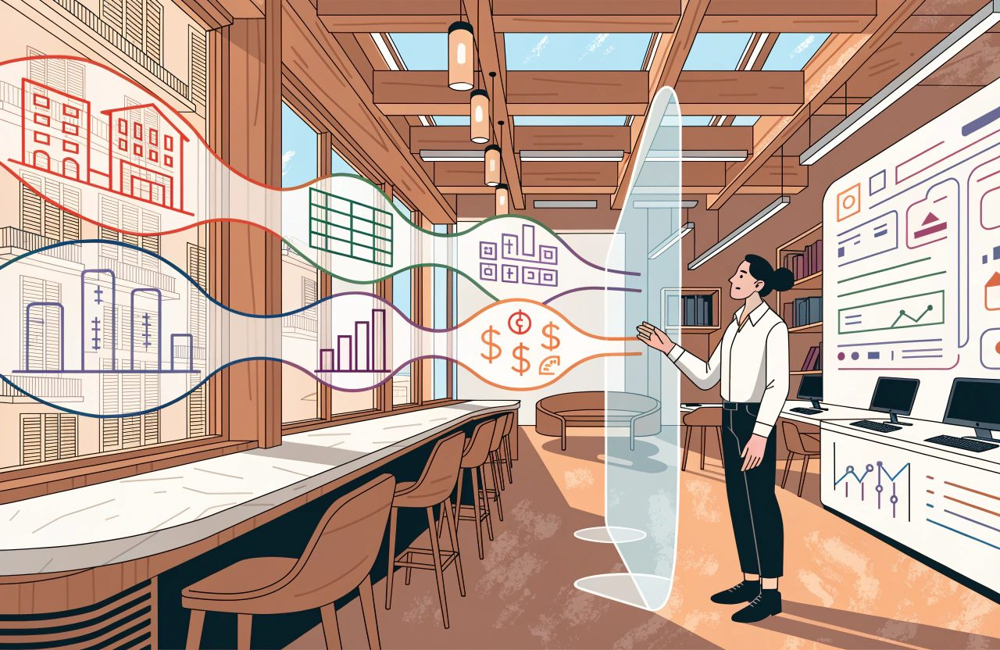

# The Complete Guide to Hotel Market Intelligence and Analytics

*Seeing the market clearly is a skill, not a feed to be watched. Every decision that follows starts with a number that means what you think it means.*

It is a Tuesday in June. You are looking at Saturday 15 August.

Your competitor is showing 210 and you are showing 185.

Now what?

Nothing yet.

You have a number on a screen.

This guide follows that number. Where it came from, what it is worth, what it can and cannot tell you, and what has to be true before you let it move a price. By the end, that Saturday will have produced a decision with a name and a date on it. Everything in between is the work that makes the decision worth taking.

Start with what you do not know.

You do not know what the 210 includes. Is it the room only, against your room plus half board? Is it priced for two adults or one? Was it captured on a channel you do not even sell through? Is there a single room left at that price? You do not know whether anybody paid it.

There is a worse possibility, and almost nobody checks it.

You do not know whether your competitor set that price at all. Booking.com and Expedia are online travel agencies, or OTAs: the big booking sites that sell your rooms and take a commission. Booking.com's own partner pages say it plainly. Under Booking Sponsored Benefit the site pays part of the room cost itself. The help page tells hotels they "may notice your rates appear lower on our platform than the rate you set". Expedia says it funds One Key rewards so that the cost does not touch your revenue strategy.

So the 210 you are staring at may be a 230 with somebody else's money on top.

From the outside, a discount funded by the booking site and a discount funded by the hotel look identical. Same screen, opposite meaning.

Then check the 185.

That is your number, and you are trusting it. In my experience the most common data error in this whole subject is not the competitor's price. It is your own. A broken link between your system and the booking site. A price that was supposed to follow another price and stopped following it. A stop sell nobody lifted. Hotels check the other side of the screen in detail, then simply assume their own side is right.

That is the gap.

**Market intelligence is treated as a feed to be watched, when it is a skill to be practised.**

Watching it costs you money.

Practising it earns you money.

This subject is about seeing the market clearly.

Acting on what you see is a different job. That job is revenue management.

It is tempting to draw that as a line between departments, with one team observing and another team pricing. It is not one. It is not how hotels actually work. Every serious revenue management system now feeds shopped competitor rates straight into its pricing logic. There is no human moment in the middle where somebody inspects the number before it moves a price. And in most hotels in the world, the same person shops, reads and prices inside the same ten minutes.

So the line is not between two teams.

It is between two jobs, and the order matters.

First establish that a number means what you think it means.

Then let it move a price.

Automation makes that discipline more important, not less. When nobody looks at the number, nobody catches it.

There is a second reason the order matters. What you choose to look at decides what you are able to price. Suppose you check that Saturday for two adults, room only, cancellable, on a single booking site. You have already decided that your pricing will be led by the price a single guest pays when booking on a website. You have made your pricing by customer type, by length of stay and by channel invisible to yourself. Every decision you make after that is limited by that one choice.

**A number that is precise and wrong is more dangerous than no number at all.**

*Your competitor is showing 210 and you are showing 185. A number that is precise and wrong is more dangerous than no number at all.*

You act on it.

## The Short Version

- Market intelligence is a skill to be practised, not a feed to be watched. Seeing the market clearly comes first. Acting on what you see is a different job, and that job is revenue management.
- A shopped rate is an asking price, not a sale. Part of it may be discounted with the booking site's money. From the outside the two look identical. Same screen, opposite meaning.
- Your own number is the one to check first. In my experience the most common data error is not the competitor's price. A broken link. A rate that stopped following another. A stop sell nobody lifted.
- The word compset covers two jobs that conflict. Your shopping set should flex with guest substitution. Your benchmarking set has to stay stable. Its value is a series that stays comparable over time.
- Like-for-like capture is the discipline. Occupancy, meal plan, room type and length of stay. Channel, taxes, cancellation terms, and the moment the price was seen. A perfect comparison is not possible.
- An index tells you your share of a market. It does not tell you whether you made money. Read it beside last year, budget and profit. Then go and buy the profit half.
- Definitions come before dashboards. Most of them are already written for you in the accounting and benchmarking standards. Every report should end in a decision. Give that decision a name and a date.

## First Question: Who Is the 210?

Before the price means anything, you have to know whose price it is, and why that hotel is on your screen at all.

Rate shopping means collecting competitors' public prices automatically, at regular intervals, and storing them so you can read the movement over time.

That is the core of it.

It records asking prices.

The products have moved well past that core, and buying decisions still get made on the old description. A current rate intelligence service returns much more than a price. It tells you whether the rate is sold out. The minimum stay attached to it. Whether a meal is included. Whether it can be cancelled. Whether value added tax, VAT, and city tax are inside the figure. The room name. The maximum number of guests. And the exact moment the price was seen. Other parts of the same service tell you whether your price matches across channels, where you rank, and what demand looks like. Some tools make test bookings to trace where a leaked rate came from. So treat "it records asking prices" as the least a rate shopper does, not the most.

But the tool only watches the hotels you told it to watch.

### The List Is a Judgement, Not a Map

If that list is wrong, everything you work out from it is wrong too.

Your competitive set, or compset, is the group of hotels you measure yourself against. It is a commercial judgement, not a list of nearby hotels. In my experience most are chosen badly: by distance, by star rating, or by whoever the general manager mentions in meetings. I have no survey to prove that, and I am not going to pretend I do. Distance and class are not worthless. The benchmarking providers use both. But neither one tells you which hotel the guest books instead when your price is 20 too high.

The right test is substitution.

A guest opens a booking site with your dates, budget and reason for travelling.

Which hotels appear on the same screen and could take that booking instead of you?

Those are your competitors. They may sit further away than the hotel across the road, and carry a different star rating. A resort with a private beach and a resort without one are not substitutes for a family in August, whatever the map says.

Which is worth pausing on, because it is your Saturday. In August that beach decides the booking. Run the same test for a Tuesday in November and you may get a different list of hotels entirely.

Know the limits of that test. It is built around a guest looking at a booking screen. Some resort markets run mainly on allotments: blocks of rooms contracted to tour operators twelve to eighteen months ahead. Much of that demand never touches a booking screen at all. Rates for groups, and for meetings, incentives, conferences and exhibitions, the MICE trade, are quoted privately and never published. If a third of your business arrives that way, everything in this section sees one half of your market and nothing else. That is not a reason to skip it. It is a reason to stop treating it as a picture of the whole market.

### One Word Doing Two Jobs That Conflict

Now for the distinction that causes more confusion than almost anything else in this subject.

The word *compset* is doing two different jobs, and the rules do not agree with each other.

*The word compset is doing two different jobs. One list should flex with the season. The other has to hold still for years.*

The shopping compset is the list of hotels whose public prices you watch. You choose it. You can change it when you like. It should flex with substitution. In August the resort with the private beach is your competitor. In November it may not be.

The benchmarking compset is the group of hotels whose actual results are added together, so your performance can be compared against theirs. Its entire value is a series that stays comparable over time. So it has to be stable, and the provider will not let you treat it casually.

CoStar requires at least four participating hotels besides yours. At least three of them must not be affiliated with each other, and they must come from at least two unaffiliated companies. Changing the set means moving at least two participating hotels that have been open at least five months. Amadeus runs different rules again. Your own hotel must appear in every set. There is a thirty-day cooling-off period after a change. And one customer is capped at three sets.

There is a harder limit underneath. These products report whole-hotel results: occupancy, average room rate, revenue per available room. There is no competitor data broken down by customer type on sale anywhere. So you can shop a set built for one customer type. You cannot benchmark against one. Build a leisure set and a corporate set expecting a leisure score and a corporate score, and you will not get them.

Build both deliberately, and do not manage them on the same cycle.

1. Split the shopping sets by customer type first. Your leisure and corporate competitors are often different hotels, and one blended list serves neither. Then accept that your benchmarking set is a single blended one, because that is all the data allows.
2. Four to eight hotels per set. The minimum of four is not my opinion. It is the provider's rule, written into the terms you signed. It exists because one closure or one missing month distorts a small group. The maximum of eight is my judgement, and no provider publishes an upper limit. My reasoning is that above eight you stop measuring yourself against competitors and start measuring yourself against the whole town. If your tool can weight the set by hotel size, that is the better control, and it is the one most hotels never touch.
3. Write down why each hotel is in. If you cannot say why, take it out.
4. Review the shopping set every season. A shopping compset that never changes is one nobody is thinking about. Do not review the benchmarking set on the same cycle. That set is a record built up over years. Rebuilding it every quarter destroys the year-on-year comparison you need for everything else.

*A note on the rules above. The set sizes, the cooling-off periods and the change limits come from the benchmarking providers, not from law. They sit in the agreement you signed, every provider writes them differently, and they change. Read the current rules in your own agreement before you plan a set around them.*

## Second Question: Is the 210 the Same Product as the 185?

You now know whose price it is. You still do not know whether it is comparable with yours.

A shopped rate is comparable only if it was captured on the same terms as yours. Go back to the Saturday and check it against this list before you touch a price.

- Occupancy. Two adults against one is not a price difference. It is a different product.
- Meal plan. Comparing your room-only rate against a competitor's half-board rate is the classic error, and it happens constantly. You conclude you are expensive, drop 15, and you were cheaper all along.
- Room type. The lowest rate in the hotel and the lowest rate in a room category are two different questions. Good tools show both separately for exactly this reason.
- Length of stay. Ask for one night where the competitor demands three, and you get nothing back, or a rate nobody can book.
- Channel. The same hotel does not show one price everywhere.
- Inclusions. Taxes, city fees, resort fees, currency. Note which currency the price was captured in, and when it was converted. A stale exchange rate invents a price difference that does not exist.
- Tax display. This one depends on the country, not on the hotel. Google's own policy requires base price plus fees in the United States and Canada, and base plus taxes plus fees elsewhere. Separately, several markets tightened their own rules on displayed prices from 2025 onwards. Those changed what a shop returns there, not only what a guest sees. So a 2026 shop is not comparable with a 2024 one.
- Cancellation terms. Read a non-refundable rate against your cancellable rate and you are treating a discount as if it were the price.
- Who the price was shown to. Rates are routinely varied by device, by whether the user is signed in, by loyalty membership, by country and by language. Google's rules for hotel rates carry a field for each. A price you cannot see is still a real price.
- Who funded the discount. Covered above, and it belongs on this list. A member discount is your competitor's money. A discount sponsored by the booking site is the site's. They look identical.
- Capture time. Prices taken at different hours on a moving date are not one snapshot. Add freshness to that. Shops fail, get blocked and come back half empty, and some tools carry the last known price forward without telling you. Every rate is a price that was seen at a moment, not a price that is true now. You can satisfy every other condition on this list and still be pricing against a three-day-old number.

Those are the minimum, not the complete list.

And there is one item you cannot fix by shopping harder. Google's rules allow a hotel to offer a rate to a random percentage of users, described in Google's own specification in exactly those terms. Two identical shoppers can be shown different prices by design. Shopping more often does not solve that.

On the price comparison sites, a perfect comparison is not possible. So build your process to work with imperfect data rather than to wait for perfect data.

*The display and targeting rules described above are platform rules written by Google and the booking sites, not law. They are rewritten regularly and the wording differs by market. Check the current specification rather than this article, and read your own contract rather than a summary of it.*

## Third Question: Did Anybody Pay It?

Suppose the 210 survives every check. Same room type, same occupancy, same board, same channel, captured this morning.

It is still only an asking price.

Rate shopping tells you what a hotel is asking. It does not tell you what sold. Those are different questions, and hotels confuse them daily. A competitor showing 260 all week may have sold nine rooms.

That limit is the one most people know. There is a second one, it comes first, it is larger, and it is much less discussed.

A growing share of asking prices cannot be shopped at all. Rates for signed-in users, for mobile, for specific countries, and for closed groups only appear when the request carries the matching details. Booking.com's own data feed returns a separate public price field alongside the real one, which means the platform itself admits the public price is not the real one. Add group and MICE rates, which are never published, and allotment rooms, which never reach a booking screen.

The error always runs the same way. Published rates look high against what members, package guests and contracted guests actually pay. Fix only the asking-versus-sold problem and you will still conclude you are expensive when you are not.

### The Empty Hotel That Is Not Empty

That leads to a tempting conclusion, and one I have drawn myself.

Availability looks like the answer. Your competitor's 210 sits untouched through June and July. The Saturday is getting closer and the rate has not moved. That feels like an unsold hotel.

As a general rule it is wrong. It is worth understanding why, because the thinking behind it is still useful.

- Some hotels do not move price at all. A study across eight European capitals found roughly one hotel in nine held a completely static rate across the whole booking window. Their flat rate tells you about their pricing policy, not their occupancy.
- Direction is not universal. In that same study prices fell towards arrival on business-led dates and rose towards arrival on leisure-led ones.
- Some contracts guarantee that a room can always be booked at a given rate. A rate that persists there is a contract, not a demand signal.
- Allotment and contracted rooms sell out at an unchanged price, because the price was agreed a year ago.
- "Only two rooms left" counts only that channel. The large booking sites have given consumer authorities undertakings about this kind of scarcity message. In broad terms, they have agreed to make clear that such a statement refers only to the offer on their own site. So read it as a count of the rooms that one site is holding, not of the hotel.

The usable version is narrower, and it takes more work. You need price and availability captured together over time. You need the whole competitor group moving as well. And you need to exclude the hotels you know never move price, the channels with guaranteed availability, and the contracted blocks.

Then a rate that never moves while everything around it does is a real signal.

On its own, it is a guess with a number attached to it.

## Fourth Question: What Is Coming, and From Where?

The shop has now told you everything it can about that Saturday, which is less than you hoped.

It cannot tell you how much business is coming to the destination, from which countries, or how far ahead it intends to book. For the Saturday that is the difference between holding 185 and moving it.

Market and demand data looks at the other side of the deal.

Keep three families apart.

### Historical Market Performance

This is the real, completed results of a panel of hotels, a group that agrees to send in its actual numbers, added together. Usually occupancy, average room rate and revenue per available room, by month or by day. It is the past, reported to a common standard, and it is the basis of most benchmarking.

Its weakness is coverage. If the panel is six hotels and two of them stop reporting, your market appears to move when nothing in the market has actually changed. Providers know this. That is why they enforce the minimum membership rules described earlier, and will switch off a set that falls below them.

Two practical things follow. In a small secondary market or on an island, you may not be able to get a benchmark at all, because there are not enough participating hotels that are not you. And in any market, a set that quietly loses a reporting hotel is a set whose past figures no longer mean what they used to. Ask your provider how you will be told.

### Forward-Looking Demand Signals

Search volumes for your destination. Booking intent. Airline seats scheduled into your airports. Bookings already on the books at other hotels, shared across a panel. These describe demand that has not reached your reservation system yet.

Be careful with the tempting version of this, which is that forward data is the only kind worth paying for. The thinking behind it is right. The data most worth paying for is the data you cannot produce yourself. Your own bookings on the books you can see for free. Other hotels' bookings you cannot. So the real dividing line is your data against everybody else's. That is not the same line as historical against forward. Historical panel data is worth paying for. So is rate shopping. And one of the forward signals in that list is other hotels' bookings on the books, which makes the point on its own.

Then be careful not to treat everything in that family as the same kind of evidence.

- Committed demand is business already booked. Panel products report it as rooms on the books, and as pickup, the bookings added since the last report. Worth knowing that the main forward benchmarking product reports rooms and occupancy on the books and the pickup between reports, and carries no rate at all. It will not answer a rate question.
- Intent is a search or a click. It tells you about interest, not commitment. And the rate at which interest turns into bookings is not stable across markets or seasons.
- Capacity is a supply number, not a demand number. Scheduled airline seats are the clearest case. An airline putting more seats into your airport is not demand. It is the possibility of demand. Useful as background. Dangerous in a forecast if you treat it as arrivals.

### The Marathon on Your Saturday

Now the third family, and the one hotels most often buy and least often use.

Event and calendar data. Congresses, concerts, sports fixtures, trade fairs, and public and school holidays in the countries your guests come from.

Suppose there is a marathon on your Saturday. Consider two entries in an events calendar.

"City marathon, 14 to 16 August."

"City marathon, 14 to 16 August. Around 8,000 runners, a third of them travelling from outside the region, most with one companion, booking two to three months out, staying two nights."

The first is a date in a diary.

*An events calendar that gives you only a date changes nothing. The version that moves a price is something you build, not something you can buy.*

The second is a forecast input.

Only the second one tells you anything about your 185. Eight thousand runners booking two to three months out means the demand for your Saturday is arriving right now, in June, while you are looking at the screen. A date in a diary tells you nothing about when to move.

If your events calendar only produces the first, it is not helping you price.

Be honest about where the second one comes from, because it is not a subscription. Event data suppliers will sell you predicted attendance, a rank for the event, even predicted spending broken out by accommodation. What no supplier publishes, as far as I can establish, is where the attendees come from, how far ahead they book, or how long they stay. Nor do they publish how accurate their attendance predictions have been, which is its own reason for caution. Market demand data gives you the countries guests come from and the most-searched length of stay, but for the market and the date, not for the event.

So the enriched entry is something you build, by joining two datasets to your own history. It is a project worth doing. It is not something you can buy ready-made.

For group business the best forward data is already inside your own hotel. Your own sales office knows the block sizes, the bookings taken against them and the cut-off dates. So does the local convention bureau. No data supplier knows more than they do.

Three habits separate the hotels that use this data from those that merely subscribe.

- Record where the guests come from, not only how many. Ten thousand extra arrivals mean something different if they are two-night city breakers rather than fourteen-night families.
- Read when the bookings arrive, not only how many arrive. Demand arriving three weeks out and demand arriving six months out call for different responses, and only one is still available to you.
- Separate the market's demand from your own. Your compset can be full while the destination is soft, and the reverse happens too. I cannot tell you which way round it happens more often, and neither can anybody else I have read. What I can tell you is that assuming the two move together is how a hotel ends up discounting into a market that was fine.

One more caution, an expensive one. Averaged market data hides the mix. A market whose average rate fell may have had a strong month. One large cheap group may have pushed out higher-paying individual guests, in a handful of hotels, on a handful of dates. The average is accurate and useless. When a market number surprises you, ask which part of the business moved, not by how much.

**Market data does not make decisions. It removes excuses.**

## Fifth Question: August Is Over. How Did You Do?

You held 185. The Saturday came and went.

Now somebody wants to know whether that was right, and the answer arrives as a score.

Start with two definitions, because every score below is built on them.

- Average daily rate, ADR, is your room revenue divided by the number of rooms you sold. It describes only the rooms you managed to sell, which is why it looks good even on a night when you sold very little.
- Revenue per available room, RevPAR, is your room revenue divided by the number of rooms you had to sell. It is also occupancy multiplied by ADR. It counts the rooms you failed to sell.

Nobody disputes those formulas. What is disputed, constantly, is what you are allowed to put into them.

The reporting rules are stricter than most hotels realise. Most of them come from the Uniform System of Accounts for the Lodging Industry, the USALI, now in its 12th Revised Edition, effective from 1 January 2026. The benchmarking providers layer their own reporting guidelines on top of it.

Room revenue excludes taxes. Resort and destination fees are not room revenue at all, and belong in miscellaneous income. Free rooms are excluded from rooms sold. A guest who books and never arrives, a no-show, counts as revenue but no room night is recorded. Rooms out of service for less than six months do not reduce your available rooms.

Add all that up and one thing follows. Occupancy multiplied by ADR only equals RevPAR when both sides use the same rulebook. Build an "adjusted occupancy" in a spreadsheet by taking broken rooms out of your room count, multiply it by ADR, and the answer is not the RevPAR your benchmark is comparing you against.

### Fair Share and the Benchmarking Indices

Benchmarking compares you against your benchmarking set. The comparison is expressed as an index against fair share. Fair share is the idea that supply, demand and revenue would be spread evenly across the hotels in the group.

Get the arithmetic right, because a surprising amount of training material states it wrongly. Fair share is a share of demand, and demand here means room nights sold. Say you have 100 rooms in a set of 500 rooms in total. You hold 20 percent of the rooms. So your fair share is 20 percent of the room nights that set sold. It is not 20 percent of the set's occupancy. Occupancy is already a percentage, and taking a fraction of a percentage produces nothing. For a set running at 70 percent it would give you a "fair share" of 14 percent, which is not a quantity of anything.

### Two Details That Change the Score

Two details decide whether your numbers match your provider's, and almost nobody checks either.

The first is whether your own hotel is counted inside the set's figures or left out of them. It matters more than it sounds. If you are part of the number you are being measured against, the score gets pulled towards 100 and can never show a difference as clearly as one that leaves you out. I cannot settle this for you from published sources, and I am not going to guess in print. The providers do not appear to agree with each other. One of them points in both directions at once. Its definition of fair share covers "all properties in a selected group", which suggests you are counted. Its rules for choosing a set count four participating hotels not including yours, which suggests you are not. The other provider requires your hotel to be in every set. The clearest statement I could find about how the standard report actually behaves is in a training deck from 2018, and nothing current restates it.

So ask your provider in writing, and put the answer in your definitions document. Do not attach anybody's bonus to a score before you have.

The second is how the set's occupancy and rate are worked out. They are weighted by hotel size: all the competitors' rooms sold, divided by all the competitors' rooms available. They are not the average of your competitors' percentages. With four to eight hotels of different sizes, those two calculations come out materially different. Rebuild the score in a spreadsheet the wrong way and you will not match your report.

Here are the scores themselves, with the names the industry actually uses. You will meet the abbreviations before you meet the words.

- Occupancy index, or market penetration index, MPI: your occupancy divided by the set's, times 100.
- Rate index, or average rate index, ARI: your ADR divided by the set's ADR, times 100.
- RevPAR index, or revenue generating index, RGI: your RevPAR divided by the set's, times 100.

A score of 100 means you took exactly your fair share.

Above it, you took more than your share of the rooms would predict. Below it, less.

Read it as performance against the set, not as something you are owed.

*The reporting rules in this section come from accounting and benchmarking standards, not from law. Standards get revised, providers apply them differently, and national accounting and tax rules sit on top of them. Check the edition your own accountant and your own benchmarking return actually use.*

## Sixth Question: The Index Went Up. Did You Make Money?

Say the score came back well. Your August index is up.

Here is where it goes wrong.

An index answers: *did we win or lose share?*

It does not answer: *did we make money?*

*An index answers whether you won share. It does not answer whether you made money. The two move apart more often than anybody admits.*

Those two move in opposite directions far more often than anybody admits.

Consider two Octobers. In the first, your RevPAR index reads 112, up nine points. It rose because the market fell harder than you did. Your own RevPAR was down five percent. The set's was down twelve. You won nine points of share in a month where your revenue fell, your fixed costs did not move, and your rooms profit fell with the revenue.

Index up, business worse.

You will also hear a version of that story in which the hotel takes an extra 900 room nights through a high-commission channel and still ends up behind on profit. Be careful with that one. Do the arithmetic before you use it in front of a controller, because it usually does not hold.

Take a room sold at 150. Commission at 18 percent is 27. Housekeeping, linen and utilities are perhaps 25. Breakfast food is perhaps 7, and remember that is per guest, not per room. Card costs are around 3. Add those up and about 62 of the 150 has gone. That leaves roughly 88 a night, so about 59 percent of the revenue reaches profit. Genuinely extra business at those numbers makes money. For volume like that to reduce profit, commission would have to run past 70 percent of the rate.

What does produce index-up and profit-down is one of three things. The market falling faster than you, as above. New business pushing out better-paying business you already had, which means you were near full and it was never extra at all. Or a fixed cost that jumps: reopening a floor, hiring temporary staff through an agency, overtime, or a local charge that steps up to a higher band. Those are the mechanisms. Ordinary volume with ordinary costs behind it is not one of them.

In the second October, your index falls to 94 because a competitor opened 200 rooms and discounted to fill them. Your rate held. Your costs held. Your profit rose.

Index down, business better.

That second reading is sound for a month. Do not stretch it across years. A score that falls year after year while margin rises looks to a buyer or a lender like an owner taking cash out of a hotel and not investing in it. They will judge you on future RevPAR share whether or not you think it measures the right thing.

So read an index as one input among four, not as the whole commercial answer.

1. The index tells you your share of a market.
2. Same time last year tells you your own direction of travel.
3. Budget and forecast tell you whether you are meeting the commitments you made.
4. Contribution and profit tell you whether any of it was worth doing.

Be precise on the fourth, because the wrong measure cannot answer the question. Three measures can settle a specific decision, because you can trace them to a channel or a type of business. Net ADR, meaning the rate left after distribution and payment costs. Contribution per occupied room. And rooms profit.

One measure cannot: GOPPAR, gross operating profit per available room. It is a whole-hotel figure struck after the costs that belong to no single department, so it will never tell you whether one piece of business was worth taking. Gross operating profit is also the operator's measure. The owner is usually asking about a figure further down the accounts, either net operating income or earnings before interest, tax, depreciation and amortisation. Those come after management and franchise fees, the reserve for replacing furniture and equipment, ground rent, insurance and property tax.

If you run several hotels, watch one more thing. Two of your own hotels sitting in the same set can both show rising scores while the group as a whole loses rate.

That fourth lens does not appear on a standard benchmarking report, and it does not appear in the RevPAR index pack the revenue team circulates on a Monday. That is the accurate version of a claim you will hear stated far more strongly. It is not true that profit is missing from benchmarking. CoStar sells profit and loss benchmarking alongside its revenue product, and defines total revenue per available room, TRevPAR, and GOPPAR inside it. HotStats does nothing but benchmark profit against a competitor set. Kalibri Labs publishes COPE RevPAR, contribution to operating profit and expenses per available room. That is room revenue less the cost of winning the booking, divided by available rooms: the net contribution measure, sold as a product.

If your index report has no profit line on it, that is a decision somebody made about your report. It is not a limit of the industry. Go and buy the profit reporting as well.

### Two Integrity Rules

First, do not change a compset to improve a score. It is the easiest number in hospitality to make look better than it is, and your colleagues will know you have done it.

There is a harder reason than embarrassment, and it is the one that should stop you. Your index against a named set is often written into brand management agreements as a performance test. It turns up in franchise agreements. It turns up in the conditions on your loans, sometimes with termination and default rights attached. Whether yours does any of that is a question about your own documents. Go and read them, and if the answer matters, have somebody qualified read them with you.

Which also means the set may not be yours to change at all. In a branded or managed hotel it often is not. If it must change, restate the history beside it and say what changed. Check first that restating is even possible. Providers publish rules about changes and cooling-off periods rather than promising to rebuild your history, and in some contracts the set belongs to a region rather than to you.

Second, be careful benchmarking a period you did not trade normally. Take a hotel closed three weeks for refurbishment. The reporting rule in general use is that rooms out of service for under six months do not reduce your reported room count. So the score still gets calculated, and it is not wrong. It measures the consequence of that closure with total accuracy. You had those rooms on your books and you did not sell them.

What it is not is a read on your commercial position.

Do not hide it. Do not send it round on its own either, because somebody will make a pricing decision about a month in which part of the hotel was closed. Write the closure next to the number. And take the same care in reverse. A competitor's abnormal month distorts your score just as effectively, and nobody sends you a note about theirs.

**Compare like with like, or do not compare.**

## Seventh Question: Why Does Nobody in the Room Agree?

The Saturday now has a score attached to it. The meeting should be short.

It is not, because two people in the room are holding different ADRs for the same August and neither can say why.

Business intelligence, BI, means bringing data from separate systems into a shared analytical view, defining every number consistently and presenting it so a person can decide something.

That used to mean copying everything into one big database. It no longer has to. The major data platforms all sell the ability to read data where it sits, without moving it, and some hotel groups now work that way. What did not change is the part that matters.

One agreed set of definitions.

One place people go to settle an argument.

**What has to be brought together is the meanings, not the technology.**

*What has to be brought together is the meanings, not the technology. One agreed set of definitions, and one place people go to settle an argument.*

The technology can be solved. That does not make it easy. Joining hotel systems together is genuinely hard. There is no common data format across property management systems, the PMS, the system that holds your rooms and reservations. Matching up room types and rate plans across the PMS, the central reservation system, the channel manager and the revenue system is a permanent job that is never finished. Reservations get changed, and often there is no reference number that stays the same, so they are hard to follow. Hotels trading in more than one currency make all of it worse.

But it is solvable with money and time. The definitional work is what actually fails, and no budget fixes it.

BI is where market data, booking data and operational data finally meet. Most hotels I have worked with have all three and join none of them. The rate shopper sits behind one login. The reservations sit in the property management system. The market benchmark arrives as a monthly document. The housekeeping record is kept in a spreadsheet nobody outside the floor ever sees.

Each is coherent on its own. Together they answer what none of them can answer separately. Why a week with strong bookings converted badly. What a room type out of order for eleven days cost you at market rate.

Whoever decides what a number means decides who wins the argument. If ADR means one thing in the revenue report and another in the finance report, and nobody in the room can say which is which, the meeting stops being about the market. It becomes about whose spreadsheet is right.

### Most of Your Definitions Are Already Written

Here is the part I would put differently from most advice on this subject.

This is not an invitation to invent your own definitions. Several of these questions already have answers, and they were not written by you. The Uniform System of Accounts for the Lodging Industry reached its twelfth revised edition, adopted from 1 January 2026. The benchmarking reporting guidelines sit on top of it. Between them:

- Taxes are out of room revenue. Resort and destination fees are out of room revenue too, and go to miscellaneous income.
- Free rooms are excluded from rooms sold.
- Whether booking site revenue is reported gross or net is set by the booking model, not by preference. Net for wholesale rates and for rates paid at the time of booking. Gross for rates paid later.
- Recognising revenue is an accounting policy, not a dashboard setting. Under the accounting standards in general use, room revenue is recognised across the nights of the stay. A deposit taken at booking is a debt you owe until then.

So the job is not "settle your definitions". It is narrower and more useful. Adopt the standard definitions where a standard exists. Write down only the places you genuinely need to differ. And know, for every number you circulate, whether it can be compared against the benchmark or is only for internal use.

What is genuinely yours to decide is a shorter list, and it still has to be written down once, for the whole hotel.

- Is a cancellation removed from the day it was made, or from the night it was for?
- Which exchange rate do you convert at, and as at when?
- How do rooms used by the hotel itself behave in your own reporting, as opposed to what you send the benchmark?
- Which versions of ADR after costs do you keep, and what is each one called?

That distinction is the one that gets missed, and it costs real money. The problem you are solving is comparability, not just consistency. An ADR that includes resort fees can be perfectly consistent across all your own reports and still be impossible to compare with the benchmark you are measured against. You will have written down a rule that produces a number you cannot defend.

Two reports can legitimately show different ADRs. A finance ADR, a benchmark submission ADR and an ADR after the cost of winning the booking are three different tools for three different jobs. What is not legitimate is nobody being able to name which is which, and get from one to the other. Give each one a name. Write down once how they connect.

**That definitions document is worth more than the dashboard it feeds.**

*These are accounting standards, not law. They are revised over time, and national accounting and tax rules sit on top of them, including how revenue is recognised and how tax is treated. Agree the current edition with your own accountant before you rewrite a definition.*

## Last Question: What Happened to the Decision?

Go back to the Saturday one last time.

A report should end in a decision. A report nobody acts on is a cost. Somebody builds it, somebody circulates it, somebody half-reads it, and nothing changes. Before you commission one, name the decision it supports and who makes it. If you cannot name both, do not build it. Reporting for control and compliance is a genuine exception, and it covers far fewer reports than most hotels keep.

This is the loop I use, and it works because every step has an owner.

1. Pull the raw data. Take it from every source, unedited, and save a copy marked with the date you pulled it. This is the step people get wrong. Your sources change under you. Bookings change. Forecasts get overwritten. Restrictions get lifted. If you only ever hold today's version, you cannot reconstruct how the Saturday was tracking back in June, or what the forecast said on the day you decided to hold 185. Steps two and five then stop working.
2. Prepare and analyse. Clean it, apply the agreed definitions, and cut it down to what you can act on.
3. Discuss and build an action list. Meet, and produce a list of proposed actions, not observations.
4. Execute the approved list. Each action approved by a named person, executed by a named person, against a date.
5. Track the actions. Come back to that list at the next meeting and record what happened.

Step five is the one that gets dropped.

Drop it and the revenue meeting becomes a description of what happened, with nothing decided. Without tracking you cannot tell a good decision from a lucky one.

The loop assumes more than one person, and in a lot of hotels all five names are the same name. That does not make it useless. When you are approving your own actions, the written record is the only difference between a decision and a vague memory of a decision. Write it down anyway.

So here are the two versions of your Saturday, as they appear in the minutes.

"Rate index down four points in August."

"Rate index down four points in August, driven by the two August Saturdays we held at 185 against a compset showing 210 on a half-board basis we had not matched. Board basis corrected in the shopping set. Saturdays repriced for September, reviewed on 15 September, owner RB."

The first is a finding.

The second is a decision with a name and a date attached.

Only one of them is worth the eleven weeks you spent looking at that number.

**Dashboards do not improve hotels. Decisions do.**

*A report nobody acts on is a cost. Name the decision it supports and who makes it, or do not build it.*

## Common Questions

### What is rate shopping in hotels?

Rate shopping means collecting competitors' public prices automatically, at regular intervals. Storing them lets you read the movement over time. A current service returns far more than a price. Sold-out status, minimum stay, meal plan, taxes and the exact moment the rate was seen come with it.

### What is a compset in hotels, and how do you choose one?

A compset, or competitive set, is the group of hotels you measure yourself against. Choosing one is a commercial judgement. A list of nearby hotels is not the same thing. The right test is substitution. Which hotels appear on the same booking screen and could take that booking instead of you?

### What is the difference between a shopping compset and a benchmarking compset?

A shopping compset is the list of hotels whose public prices you watch. You choose it, and it should flex with substitution. A benchmarking compset is the group whose actual results are added together. That set has to stay stable. Providers set rules on its size and on how often it may change. Those are provider rules in your own agreement, not law, and each provider writes its own.

### How many hotels should be in a competitive set?

Four to eight hotels per set works. The minimum of four is the provider's rule, not a legal requirement, and providers can change it. It exists because one closure or one missing month distorts a small group. The maximum of eight is my judgement, not an industry rule. Above eight you stop measuring against competitors and start measuring against the whole town.

### Why do competitor rates look cheaper than mine?

Competitor rates often look cheaper because the comparison is not like for like. Check occupancy, meal plan, room type and length of stay first. Then check channel, taxes and cancellation terms. Then check who funded the discount. Booking sites pay part of the room cost on some rates.

### Does a competitor's availability tell you how well they are selling?

Availability is a signal, not proof. One study across eight European capitals found a static rate at roughly one hotel in nine. Contracts, allotments and guaranteed availability also hold a price still. Capture price and availability together over time. Exclude the hotels you know never move price.

### What is the difference between ADR and RevPAR?

ADR, average daily rate, is room revenue divided by the rooms you sold. RevPAR, revenue per available room, is room revenue divided by the rooms you had to sell. RevPAR counts the rooms you failed to sell. ADR looks good even on a night when you sold very little.

### What does an index score of 100 mean in hotel benchmarking?

A score of 100 means you took exactly your fair share of the set. MPI compares your occupancy against the set's. ARI compares your ADR, and RGI compares your RevPAR. Above 100 you took more than your share of the rooms would predict. Below it, less.

### Can a benchmarking index go up while the business gets worse?

An index can rise while the business gets worse. The two move apart more often than anybody admits. Your RevPAR index can gain nine points because the market fell harder than you did. Meanwhile your revenue and your rooms profit both fell. Read an index as share, not as the commercial answer.

### Is rate shopping legal under competition law?

Collecting published competitor prices and pricing against them is ordinary commercial behaviour. Exposure comes from something else. Exchanging information that is not public. A group of competitors all relying on the same pricing system, and accepting almost every price it recommends. Reports that name individual competitors. Data combined from so few hotels that one hotel's figures can be worked out from it. This area has been moving in several countries at once, and where it has got to depends entirely on where you trade. None of it is a reason to stop benchmarking. Take the question to a lawyer in your own country, and treat none of this as legal advice from me.

## Key Terms

- **Rate shopping.** Rate shopping is the automatic collection of competitors' public prices at regular intervals, stored so the movement can be read over time.
- **Compset.** A compset, or competitive set, is the group of hotels you measure yourself against. Substitution, not distance or star rating, is the test.
- **Shopping compset.** A shopping compset is the list of hotels whose public prices you watch. You choose it, and it should flex by season and by customer type.
- **Benchmarking compset.** A benchmarking compset is the group whose actual results are pooled for comparison. Provider rules, not law, govern its minimum size and how often it may change.
- **Like-for-like comparison.** Like-for-like comparison means a shopped rate was captured on the same terms as yours. Occupancy, meal plan, room type, length of stay, channel, inclusions and cancellation terms all count.
- **Allotment.** An allotment is a block of rooms contracted to a tour operator twelve to eighteen months ahead. Much of that demand never reaches a booking screen.
- **Average daily rate, or ADR.** Average daily rate is room revenue divided by the rooms you sold. Room revenue excludes taxes, and resort fees belong in miscellaneous income. Those definitions come from the USALI, 12th Revised Edition, effective 1 January 2026.
- **Revenue per available room, or RevPAR.** Revenue per available room is room revenue divided by the rooms you had to sell. Occupancy multiplied by ADR equals RevPAR only when both sides use the same rulebook.
- **Fair share.** Fair share is your share of the room nights the benchmarking set sold, taken from your share of its rooms. Fair share is not a fraction of the set's occupancy.
- **Benchmarking indices.** Benchmarking indices compare you against your set, and are scored against 100. MPI covers occupancy, ARI covers ADR and RGI covers RevPAR.
- **Net ADR.** Net ADR is the rate left after distribution and payment costs. Net ADR, contribution per occupied room and rooms profit can each be traced to a channel or a type of business.
- **GOPPAR.** Gross operating profit per available room is a whole-hotel figure struck after costs that belong to no single department. GOPPAR cannot tell you whether one piece of business was worth taking.

## How This Connects to the Wider Hotel Technology Stack

Market intelligence establishes what is true enough to act on. Almost every other commercial subject depends on it.

- **[Hotel Operations and PMS](../hotel-operations-and-pms/)** supplies rooms sold, occupancy and much of the operational record. Revenue often needs transformation before it is benchmark-ready, and recently closed data may still change after the trading day.
- **[Distribution and Connectivity](../distribution-and-connectivity/)** decides much of what a rate shopper can see. A competitor price usually becomes visible only after it has been distributed somewhere public, while private and conditional rates can remain invisible. Your own distribution error is also often the first thing to check.
- **[Direct Booking and E-commerce](../direct-booking-and-e-commerce/)** supplies search, website and conversion data. Market demand is more useful when read beside what guests actually did on your own channels.
- **[Revenue Management](../revenue-management/)** is the other half of this. Market intelligence works out what the signal means, and revenue management decides what to do about it. Automation only makes that first step more important.
- **[Guest Technology and CRM](../guest-technology-and-crm/)** adds repeat behaviour, profile data and lifetime value, turning a market-share number into a customer-value question.
- **Payments and Financial Technology** owns the cost of taking the money: payment fees, currency conversion and chargebacks. Distribution commission is covered elsewhere, but net contribution needs both.
- **Sales, Groups and MICE** contributes forward demand that public market feeds often miss: enquiry volume, block sizes, pickup against blocks, cut-off dates and conversion of enquiries into business.
- **Data, APIs and Integration** is the dependency underneath almost every joined report in this article. API connections help, but file-based integration still matters where direct connectivity is weak.
- **AI, Automation and Agents** can spot anomalies and create modelled signals faster, but those outputs should still be distinguished from observed data.
- **Hotel Technology Strategy** covers how to select and pay for rate shopping, benchmarking and BI tools, while **Emerging Hotel Technology** tracks new data sources before they are stable enough to price against.

## Related Reading

Rate Shopping and Compset - 10 Things to Look For in a Rate-Shopping Tool

This list grows. New Knowledge Articles are added in batches rather than one at a time.

Seeing the market is a skill, and it is not the same skill as pricing. Choose the compset as a commercial judgement, and know which of your two compsets you are talking about. Capture like for like, and accept that on some channels a perfect comparison is not possible. Read an index as share, not as profit, and go and buy the profit half rather than assuming it does not exist. Then put market data beside your booking and operational data under one set of definitions, most of which somebody else has already written for you. Every decision you make next door starts from something true, or it does not start from anything.

The hotels that struggle here are not short of data. They are short of definitions, and short of the discipline to close the loop on what the data told them.

I would rather be corrected than agreed with. If something here does not match what you see in your own hotel, tell me, and tell me what you saw.

This guide is also published on LinkedIn, where you can react, comment and share it: [The Complete Guide to Hotel Market Intelligence and Analytics](https://www.linkedin.com/pulse/complete-guide-hotel-market-intelligence-analytics-bedenham-5p8mf/).
