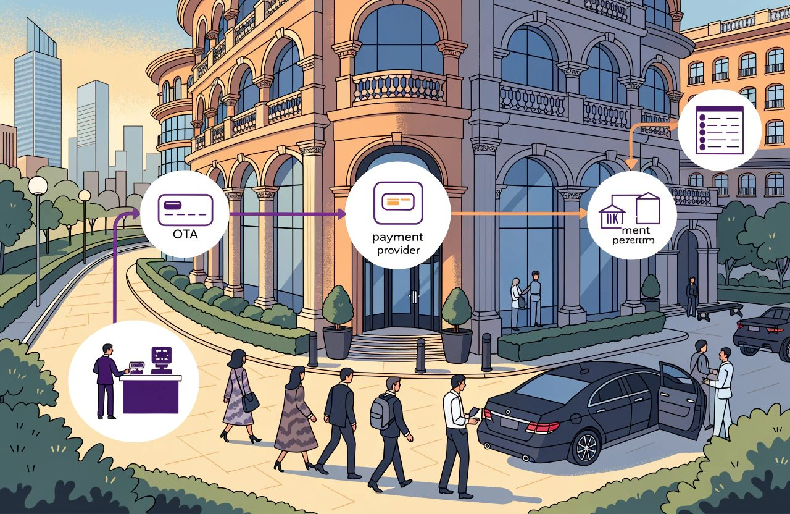
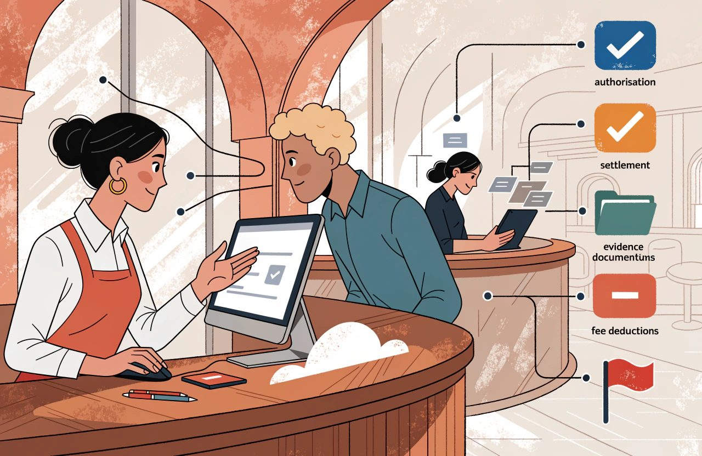
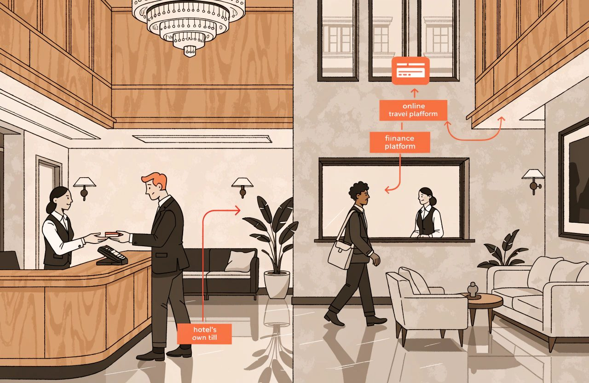
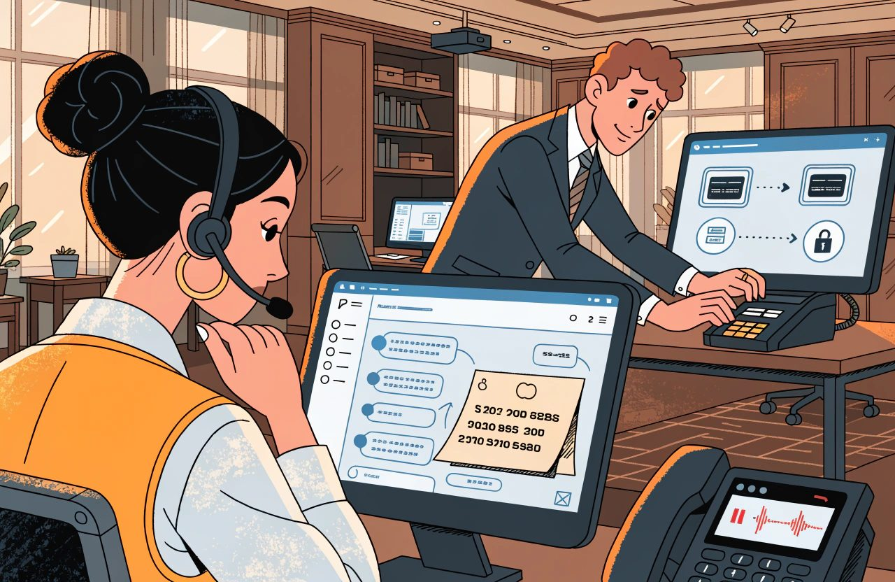
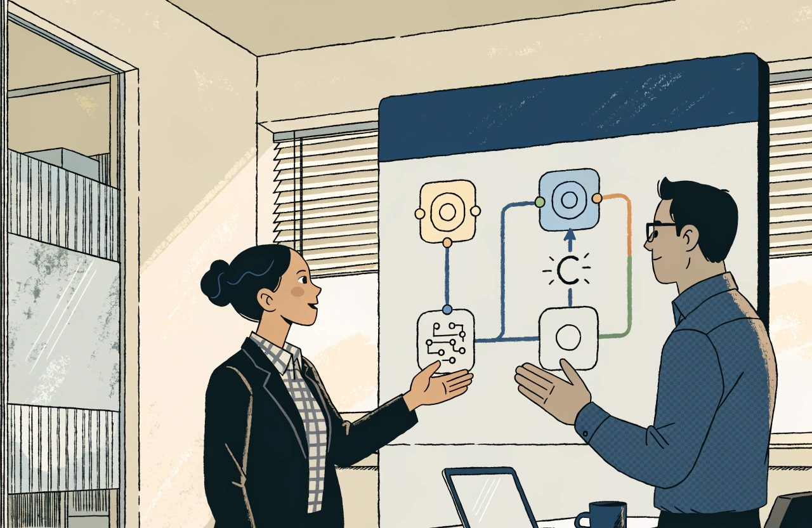
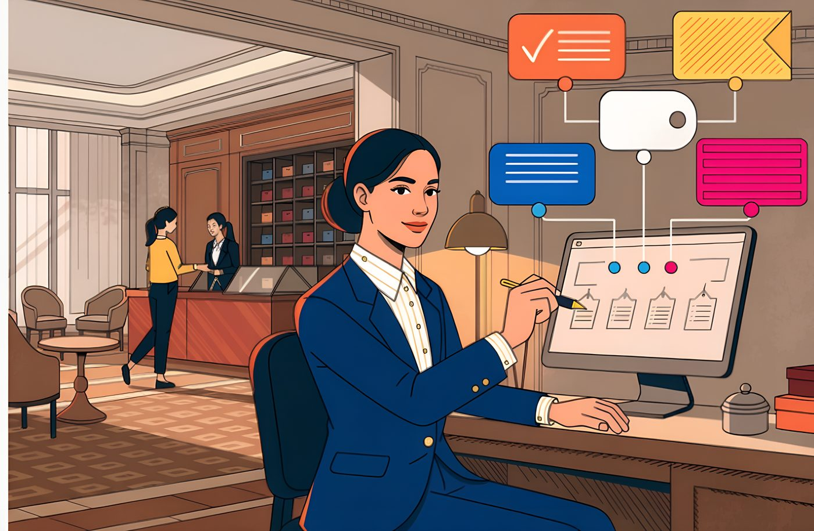

# The Complete Guide to Hotel Payments and Financial Technology

*Every commercial decision made elsewhere in the hotel arrives here to be tested. The test is whether the money can be taken, matched and defended.*

A hotel can sell out a Saturday, deliver every room, satisfy every guest and still be short at the end of the month.

Not because anything was mispriced.

Because the money behaved differently from the booking.

This is the subject most commercial people skip.

Pricing is interesting. Distribution is strategic.

Payments feel like plumbing. Then a non-refundable rate turns out to have no usable card behind it. A card the travel agency issued for the booking is refused three days after departure. A guest disputes a charge with their bank, wins, and the money is taken back. Nobody can produce evidence of the policy the guest agreed to when they booked.

**A rate plan is a commercial promise. The payment method is what makes that promise enforceable.**

*A booking can be correct while the money behaves differently. Authorisation, settlement, evidence, fees and disputes each run on their own track.*

A non-refundable rate with no card you can actually charge is a flexible rate with firmer wording.

The card is only half of it.

The other half is evidence. Can you show what the guest was told, and that they agreed to it? A perfect card on file will not win an argument about a policy nobody can prove was shown.

What follows is the mechanics. How a card payment actually works and where it fails. Why you should never be able to read a whole card number on your own screen. What matching the money is really for. How disputes are won and lost on evidence. And where money sits in your books before it counts as revenue.

Two notes on what this covers. Cash handling is not here. It is a subject about operations and controls rather than payment technology. And more than anything else in this set, the answer here depends on where you are. Card network rules. The rules on proving who the cardholder is. The caps on card fees. The law on charging guests for card use. The tax treatment. All of it changes from country to country, and from card network to card network. Sometimes it changes from one bank contract to the next. Where that matters I say so. I am not going to give you one country's answer and call it the rule.

## The Short Version

- A rate plan is a commercial promise. The payment method is what makes it enforceable. A non-refundable rate with no chargeable card is a flexible rate with firmer wording.
- Merchant of record decides who carries the risk. Where the OTA collects the money, you generally hold a debt rather than a card dispute you can fight. What you actually hold is set by your contract with that platform, so read it.
- Authorisation, capture and settlement are three separate events. Approved is not the same as paid. Hotels lose money in the gap between them.
- PCI scope shrinks mainly when nobody in the hotel can read a whole card number. Outsourcing and tokenisation both reduce scope. Neither ends your obligation. What your own scope actually is depends on your setup, and your acquirer or your assessor decides it, not this article.
- Reconciliation needs one reference that appears on every document. Count on your own trading day. Park the difference in a clearing account somebody owns.
- Chargebacks are won on evidence built at the time of booking. Sort that evidence by the dispute reason, because a no-show file is not a service file.
- A deposit is not revenue. Revenue builds as the stay is delivered. Tax can fall due on the deposit long before that, though when it falls due is set nationally. Take that one to your accountant.

## Payment Fundamentals

Start with who is in the room.

Knowing which party is refusing the payment saves a great deal of time.

### Who Is Actually in the Payment Chain

Most hotel card business runs over Visa and Mastercard. There, four parties are involved.

- The cardholder, who may or may not be your guest.
- The merchant, meaning the business being paid. Usually you. Not always. More on that shortly.
- Your own payment bank, which takes the payment on your behalf and pays the money on to you. In most countries it has to be licensed and supervised to do that, though the licence and the regulator differ from country to country. The trade calls it the acquirer, and so will I.
- The cardholder's own bank, which decides whether to approve the payment. The trade calls it the issuer.

Across all four sits the card network itself, setting the rules everyone else follows. The trade calls a card network a scheme, and I will use that word from here. This arrangement is the four-party model. It is not industry slang. EU payments regulation is built around the same four parties, which is why the term turns up in the rules and not only in sales decks. The exact definitions sit in the legislation, so use the term for what it is, a description of who is in the chain.

It is not the only model. In a three-party scheme the network is also the cardholder's bank and yours. American Express and Discover both describe themselves that way. That is why the costs of an Amex payment do not break down the way a Visa or Mastercard payment does. An Amex conversation is a different conversation.

In practice, more than four parties are usually involved.

Hotels get into trouble because the middle of that list is sold to them as one thing.

Learn the parts.

- The acquirer holds the licence, deals with the scheme, and owns your merchant ID. That is the account number all your card business is filed under.
- The processor moves the payment.
- The gateway connects your own systems to all of it. No money passes through it at all.
- A payment service provider, a PSP, is whoever sells you some or all of the above as one relationship. That is who most hotels actually deal with. In everyday use it is a sales category rather than a licensed role, though some countries do use the term in their own rules. So ask what licence the company in front of you actually holds.
- A payment facilitator, or payfac, signs you up underneath its own licence instead of getting you one of your own. You become one merchant inside its account. This is common when you take payments through a booking engine or a property management system, the PMS, that includes payments. In that arrangement you usually have no direct relationship with an acquirer at all. What a payfac may and may not do varies with its licence and its country, so ask which one it holds.

Two questions cut through the marketing:

*Who do I have a contract with? Who holds the licence?*

Often those are two different companies. The answer decides a great deal. Who owns your merchant ID. Who polices whether you follow the rules. Who is allowed to hold back some of your money as security. And whose overall dispute record your problems get counted in. All four of those come from the contract you signed, not from any statute, so get a copy of it.

Now the part that is missed most often. It quietly changes the meaning of half of this article.

### Merchant of Record Changes Who Carries the Risk

*Most of what follows sits in contracts and card scheme rules rather than in law. The terms differ by platform, by country and by contract, and they change. This is how I read the general position, not legal advice for your hotel. Check your own agreements before you act on it.*

When a guest books with you directly, you are the merchant. The same is true when an online travel agency, an OTA, sends you the booking and you charge the guest's card yourself. Everything below is then yours.

The large OTAs also run programmes where they take the money themselves. Expedia Collect, Booking.com's payment product, Agoda and their equivalents all work this way. On those bookings the OTA, not you, is the business the guest actually paid. The trade calls that business the merchant of record. The OTA charges the guest. The OTA's name appears on the card statement. The OTA takes the dispute. What comes to you is either a card number the OTA created for that one booking, or a payment with its commission already taken off. On that business you generally have no cardholder, no card and no card dispute to defend.

What you hold instead is a debt. The OTA owes you money. If the guest complains and wins, the OTA will usually take the money back from you under your contract with it, and on its own timetable. What it may take back, and when, is written in that contract rather than in scheme rules. That is not a card dispute you can fight with a file of evidence.

Which commercial model you sign is a distribution decision. Who the merchant of record is, and therefore who carries the dispute, follows from it. The two get decided in different meetings.

**Work out, channel by channel, whether you are the merchant.**

*Work out, channel by channel, whether you are the merchant. A hotel with heavy OTA-collect business is running two payment businesses at once.*

It is the first question, not a detail. A hotel with a lot of OTA business where the OTA takes the money is running two payment businesses at once.

Three separate events then get spoken about as one.

That confusion costs real money.

### Authorisation, Capture and Settlement Are Different

Authorisation is the request. You ask the cardholder's bank to approve an amount and, as people usually put it, to reserve it. Nothing is actually set aside. On a credit card it cuts what the cardholder can still spend. On a debit card it locks real money in a real current account. That is why a hold taken at check-in for extras brings complaints from guests paying by debit card and shrugs from guests paying by credit card. Same mechanism. Completely different experience.

Capture is when you claim the money you had approved. To you it is the moment the sale becomes collectable. To the guest it is not the moment they were charged. Their balance dropped when you authorised, perhaps weeks earlier. What they see later replaces the hold rather than adding to it. That is the whole answer to "why have you charged me twice", and a front desk that cannot give it will lose an argument it should win.

Settlement is the money actually moving. Strictly, it is the leg between the banks. The payment into your own account is a separate step, on your acquirer's timetable, usually in a batch and usually with the costs already taken off. Published standard timings often sit around three working days, with a longer wait for the first payment on a new account. Some countries also set rules on how quickly funds must be made available, and those rules differ. But the timing that governs you is set by your contract. Read yours, and ask for the current schedule in writing.

Because those three are separate, *the card was authorised* and *we have been paid* are different statements.

**The gap between them is where hotels lose money.**

### Authorisations Have a Clock

Authorisations expire. How fast depends on the scheme and on what sort of business you are. These limits are scheme rules, not law, and they reach you through your acquirer. Hotels, vehicle rental and cruise are treated as a special case, and their approvals last far longer than a shop's. Published scheme merchant guidance has put hotels at around thirty days. The comparison is five days when the card was physically present and ten when it was not. The major payment service providers repeat the same figures. Get the current number from your acquirer rather than quoting it back at them. These rulebooks are reissued regularly.

Thirty days covers a stay and a hold for extras. It does not cover the gap between booking and arrival. Worldwide, guests book about a month ahead on average. So the two are about equal, and equal is not a safety margin. An approval taken when the guest books is worthless by the time they arrive four months later. That is why charging a long way ahead depends on something else. It depends on a card the guest has agreed you may charge again later, held safely by your provider. The trade calls that a stored credential.

For the stay itself there are proper tools, and hotels that ignore them make their own trouble. At check-in, authorise an estimate of the whole bill. That is an estimated authorisation. Then top the approval up as the guest's bill grows, which is an incremental authorisation. The guest's running bill has a name in hotels: the folio. Topping up keeps you covered without a queue of separate holds piling up. Remember too that releasing a hold is the cardholder's bank's business, not yours. You can and should cancel an approval you did not use. How fast the guest sees the money is decided by their bank, under its own rules and its own local law. That is why the same cancelled hold clears overnight for one guest and takes a week for another.

### Card Present and Card Not Present

A card physically present at your desk and a card that is not are treated differently by everybody. Card present and card not present are the terms. Be careful how you state the difference.

On cost, card not present is generally dearer. Visa's US price lists show a clear gap between its card-present and card-not-present hotel rates. That gap is regional, not a law of nature. Part of what you pay is a slice that goes to the cardholder's bank, and that slice is called interchange. In the UK and the European Economic Area, the EEA, interchange is capped by regulation on ordinary consumer cards used at home. The caps usually quoted are 0.2% for debit and 0.3% for credit, however the payment was taken. I am giving those as the widely used figures rather than as a citation, and the rules behind them differ between the UK and the EEA. So the extra cost of a card not present largely disappears on domestic business and comes back on cards from abroad. Check the current caps and their exact scope for your own country before you build a price on them.

Now to who carries the loss when a payment turns out to be fraud. "Card not present means it is yours" is close enough to true for the three cases hotels care about. A number read out over the phone. A card sent with an agency booking. A charge taken after the guest has left. In none of them can the cardholder be checked. As a general rule, though, it is not true. Your booking engine can put the guest through their own bank's identity check. That is the step where the bank asks them to confirm it really is them. The system behind that step is called 3-D Secure. In the EU this is not only a scheme feature. Strong customer authentication is set out in PSD2, Directive (EU) 2015/2366, with the detail in Delegated Regulation (EU) 2018/389. Outside the EU the picture differs, so check what applies where you trade. Where a payment qualifies, scheme rules can also move the cost of fraud onto the guest's bank. And a card in front of you is no shield. A card typed in by hand at your desk generally leaves the loss with you, like any other payment where nobody checked who the cardholder was. Who carries a fraud loss is decided by scheme rules and by your acquirer contract, not by law. The detail differs by scheme and by country.

### Alternative Payment Methods

Cards are not the only way to pay. Bank transfer suits groups and company accounts. Direct debit is common for long stays and contracts, though I would call that habit rather than proven advantage. Digital wallets and local payment methods are where the money you can measure is.

The best public evidence comes from Stripe, which tested more than fifty methods. Adding a payment method that suited the market lifted revenue by about 12% on average. It lifted conversion, the share of shoppers who go on to book, by 7.4%. Apple Pay came in around 22%. The biggest gains were not wallets at all. They were local bank methods: Alipay, BLIK, iDEAL. Direct debit made almost no difference to conversion. In the Netherlands, bank transfer is about 62% of online shopping against 14% for cards. None of that is data from hotel booking engines, so read it as a direction rather than a forecast.

The lesson holds anyway.

**A booking engine that offers only cards, in a market where cards are the second choice, is losing bookings invisibly.**

Which methods to accept is mostly a question about your markets, not a technology preference. Mostly. One limit is worth naming. Your payment service provider has to support the method. Your booking engine has to show it. And your property management system has to be able to record it on the folio as its own kind of payment. Many cannot, and file anything unfamiliar under a general "other". That one shortcut wrecks the matching work described later in this article. Check it before you add methods, not after.

### Understand What You Are Paying For

Taking cards costs money. On Visa and Mastercard business, what you pay is called the merchant service charge, and it has three parts. Interchange, which goes to the cardholder's bank. The scheme's own fees and the cost of processing. And your provider's margin. That three-part split is the standard description used by regulators and by the industry, and it is what pricing sold to you as "interchange plus" is quoting. The exact terms vary by country, so check how your own provider labels each part.

A blended rate hides all three behind one number and is simple to budget. Itemised pricing shows each part. It is harder to read and far easier to challenge. Most small hotels are on a blended rate, so the three parts are hidden by design.

Company cards and cards from outside your region usually cost more. In Europe there is a specific reason. The caps are generally understood to cover consumer cards issued inside the region. They generally leave out company cards and payments between regions. In the UK, interchange on a company credit card is commonly reported at several times the consumer cap. Take all of that as the general shape rather than as a legal position, because the scope of the caps is set nationally and it moves. So a hotel with heavy corporate or international business on a single blended rate is usually subsidising somebody. Test that against your own mix of cards and your own fee schedule rather than assuming it.

One point about where you trade belongs here, because it shapes the whole discussion without ever being said. Whether you may pass card costs on to the guest depends on your country. In the UK and the EEA, surcharging on most consumer cards is generally prohibited. In parts of the United States and in Australia it is generally allowed, within caps and provided you disclose it. Scheme rules sit on top of the law here, and they can restrict what the law permits. The detail is national, it is drafted narrowly, and it changes. If you have only ever worked in one of those worlds, do not assume the other. Get the position for your own country in writing before you add a single surcharge.

### Currency and Dynamic Currency Conversion

Currency is its own decision. The currency you price in, the currency the guest pays in and the currency that lands in your bank need not be the same. Every conversion has a cost, and somebody carries the risk of the rate moving.

Then there is the offer to charge the guest in their own currency instead of yours.

It is called dynamic currency conversion, and it deserves blunter language than it usually gets. The research is not ambiguous. Mark-ups have been measured at around 7.6% on average, and customers came off worse in the overwhelming majority of cases. The hotel usually takes a share of that mark-up. That is exactly why it is offered. Know which side of that trade you are on.

Treat it as a rules problem too, not only an ethical one. The rules here are card scheme rules, not law, and they reach you through your acquirer. They say the cardholder must genuinely choose. You may not push them towards it, tick the box for them, convert automatically, or put it as a yes-or-no question. Penalties are set by the schemes and have been reported in the tens of thousands of dollars per breach. Some countries also regulate how the choice and the rate must be shown, so check your own market. If your card terminal or your booking engine nudges, that is a rule being broken, not a clever margin. Get the current wording from your acquirer before you rely on any of it.

### Payment Timing Belongs in the Rate Design

Finally, decide when money moves. For ordinary individual bookings, decide it once per rate plan rather than booking by booking. A deposit when they book. The balance before arrival. The whole amount up front. Payment on departure. Or a card held only as a guarantee.

**That decision belongs with the person who designs the rate.** Which makes it a shared border with revenue management rather than a setting for finance to fill in. Of everything here, that is the point I would defend hardest. The commercial terms and the way the money is collected are one design, and they are almost always drawn up by two people who never meet.

Group and contract business is the exception, and a large one. There the timetable lives in a signed contract, with deposits in stages and a cut-off date, not in a rate plan. That is why it sits with sales, groups and events, or as the industry says it, MICE: meetings, incentives, conferences and exhibitions.

## Cards, Tokenisation and PCI

*These rules change with every release of the standard, and some countries add legal duties on top of them. What follows is how I read the general position, not legal advice for your hotel. Check where you actually stand with your acquirer or your assessor before acting on any of it.*

The security standard for card data is PCI DSS, the Payment Card Industry Data Security Standard. It is not a law. It is a set of rules the card schemes impose on you through your acquirer, or through your payment facilitator if you sit under somebody else's licence. Ignore it and what normally follows is a contract problem and a bill, not a criminal charge.

That difference matters, and it is misread in both directions. Do not hear "not a law" as "not serious". A few places have written the standard, or something close to it, into their own law. Some US states are the usual examples. Whether yours has done so is worth checking locally rather than assuming either way. More to the point for hotels, when card data leaks the bill that arrives is usually a data protection one. Large hotel groups have been fined many millions by data protection regulators after card data breaches. Others have settled with consumer protection regulators. Those settlements have run to many years of independent security audits. I am describing the pattern rather than citing any particular case, because the detail differs by country and the figures get revised on appeal. The point stands either way. Neither kind of bill is a fine from a card scheme.

### Reduce PCI Scope Deliberately

The practical goal is not compliance for its own sake.

It is to make less of the standard apply to you. Arrange things so that real card numbers never touch your systems or your staff, and far fewer requirements land on you. The trade calls that reducing your scope.

Be precise about that, because the comfortable version is wrong in a way that is catching hotels out right now. Handing the work to a provider reduces your scope. So does tokenisation, which I explain in a moment. Neither ends your obligation. The PCI Council says so plainly: tokenisation does not remove the need to keep your compliance up and prove it. What survives, however little card data you touch, is the running of it. Your policies. Your training. Your plan for when something goes wrong. Above all, the checks you run on the providers you handed the work to. The more you outsource, the more that last one matters.

There is a live change worth knowing about too. Since March 2025 the simplest self-assessment route for online sellers carries an extra condition. You have to confirm that your payment page cannot be attacked through the scripts running on it. Fail that and you cannot use the short form at all. This is a scheme standard rather than law, and it is reissued regularly. So take the current version, and the current form, from your acquirer or your assessor rather than from this article. The attackers have moved to the payment page itself. So a hotel that concludes "our payment box is hosted by the provider, the standard barely applies to us" is exactly wrong about where today's risk sits.

Here is the most useful test in this section:

**If anybody in your hotel can read a whole card number, your PCI scope is far larger than your form says it is.**

*If anybody in your hotel can read a whole card number, your PCI scope is far larger than your form says it is.*

On a screen. On a printed agency booking. In a reservations inbox. In a free-text notes field in the property management system. In a call recording. On a piece of paper in a drawer at reception.

Put telephone bookings and call or screen recording on that list deliberately. They are one of the largest pieces of scope left in hotels and almost nobody raises them. A recorded call where a guest reads out a card number will normally count as stored card data. How that lands on your own scope is a question for your assessor or your acquirer. It is worth asking before your next self-assessment, not after it.

Card numbers arriving by email are the classic version of this, and they usually arrive because somebody helpfully asked for one. Two corrections to how that is normally put. First, a card number in an inbox is generally a failure of scope and control rather than a breach in itself. Whether a particular incident counts as a reportable breach is a question for your data protection adviser, and the answer differs by country. Second, it is no longer where I would look first. In a hotel in 2026 the stray card numbers are at least as likely to sit elsewhere. In free-text notes in the property management system. In booking details delivered down a channel connection. The industry data on how hotels actually get broken into puts attacks on internet-facing systems and phishing well ahead of leaked card numbers. So treat email as a serious scope problem rather than the leading cause of hotel breaches.

### Tokenisation Solves Storage, Not Every Risk

Tokenisation is what fixes the storage problem. The card number is swapped for a token, a meaningless string of characters that stands in for it. Your systems hold the token. Your provider holds the card number and can match one to the other.

Be accurate about what tokenisation protects. A stolen token is useless for getting back to a card number. It is not necessarily useless as a way to take money. The PCI Council's own name for what a hotel typically holds is a high-value token. It exists precisely so it can be charged with the cardholder nowhere in sight. So anybody who can make it charge can make money out of it. Your stored token, plus the passwords your systems use to reach your payment provider, is a working payment method. Guard those passwords, the keys and the access to your payment platform as fiercely as you would once have guarded a drawer full of card numbers.

Tokens do useful work beyond security. They let you take a balance later, charge a guest who books and never turns up, and add an extra after departure. A guest who books and never turns up is a no-show, and the word runs through the rest of this article. Tokens also let you see that two stays were paid with the same card. That is a practical way to recognise a returning guest without anybody storing a card number. It is a direct link to the guest record in guest technology and CRM, customer relationship management. Treat it as a clue, not as proof of identity. Households share cards. Company cards are shared more widely still. And phone wallets can produce different tokens for the same card.

Not all tokens behave the same, and the difference is commercial rather than technical.

A token held in your provider's own vault means nothing to anybody else. A token issued by the card scheme itself, a network token, is attached to the card account rather than to the piece of plastic. So it can keep working after the card is replaced on expiry or loss. Visa reports about 4% more payments approved when a network token is used. That is a better argument for them than anything I could build from first principles.

Where the usual explanation goes wrong is in selling network tokens as the portable alternative to provider tokens. They are not tied to the card alone. They are tied to the card account plus whoever asked for the token, who is called the token requestor. If your payment service provider asked for it, your network tokens are no more portable than the ones in its vault. At least one major provider states plainly that its network tokens work only on payments it handles itself. A hotel can hold its own token requestor ID, but realistically only large groups and the big platforms that sit across several providers do.

So the sharper question is not *which kind of token do we have?*

It is:

**Whose name are our network tokens registered under, ours or yours?**

*Whose name are our network tokens registered under, ours or yours? Very few hoteliers ask, and the answer decides whether stored cards can move.*

Ask it. Very few hoteliers do.

On changing provider, the risk is real and usually overstated. Tokens themselves generally do not move between providers. The card numbers behind them often can. The major providers publish a formal process for exactly this, subject to your new provider's security standing and a process that takes real time. Some things genuinely do not travel, and tokens created by a phone wallet are one. So the risk of losing the ability to charge the bookings already on your books is real. But it is mostly a matter of contracts and planning rather than a technical impossibility. Ask what happens to your stored cards if you leave. Get the answer in the contract. Allow months rather than weeks.

### OTA Virtual Cards Need Their Own Process

Virtual cards from travel agencies deserve their own section. In my experience they cause more failed charges than anything else in this subject. I have found no published data ranking the causes, so take that as experience rather than a statistic.

A virtual card is a card number created for one booking, for a set amount, and usually usable only between two dates. Get the model right, because the version most hotels are taught is wrong in a way that costs money. It is a pot of money inside a window of dates. It is not a card you can use only once.

- Charge more than the balance left on it and it declines. Charge less and the remainder usually stays available.
- A second charge against a remaining balance is often perfectly valid. Booking.com's own partner documentation says you can charge a virtual card repeatedly until the balance reaches zero. Some programmes issue genuinely multi-use cards, active for months. Corporate travel cards from providers such as Conferma do.
- The date the card becomes usable is the end that actually causes declines. Many cards cannot be charged before arrival at all. Expedia says so explicitly.
- Expiry is usually far longer than hotels assume. Booking.com has allowed twelve months after check-out. Expedia requires charges within 180 days of check-out. The urgent limit is the start of the window, not the end.
- The amount often leaves out taxes and fees you are expected to collect from the guest directly. That is a different failure wearing a decline's clothes.

None of that is a fault in your system. Most of it goes away if you read the terms attached to the booking and charge on schedule. That is still the single most valuable fix available to most reservations teams. Not all of it, though. A changed or extended stay can push the amount past what the card allows. Dates set by the OTA cannot be overridden by you. A card that needs reissuing needs the OTA to reissue it.

These programmes also change without announcing it. So treat every specific number above as something to check against the partner documentation you actually work with. A queue of expired virtual cards is still, mostly, a loss you inflicted on yourself.

## Automation and Reconciliation

**Reconciliation means proving that what you charged, what your provider passed on and what your bank received are all the same money.**

*Reconciliation means proving that what you charged, what your provider passed on and what your bank received are all the same money.*

### Reconciliation Is More Than a Three-Way Match

The familiar version is a three-way match, and it is a good starting picture.

- Your own records say what was charged against which booking.
- Your provider's report says what was authorised, captured, refunded and reversed after a dispute.
- Your bank statement says what actually arrived.

Two additions turn that picture into something that balances.

The provider's side is usually two documents, not one. The transaction report from your gateway or your payment service provider tells you what happened to each payment. The settlement file from your acquirer tells you what went through and what was deducted. They can come from different companies on different timetables. Matching one of them to your bank is not the same job as matching the other.

And if the OTA takes the money on some of your business, there is a fourth document. The OTA's statement is its own thing, with its own lines for commission, cancellations and amounts withheld. On that business it is the authority on what you are owed, not any card report. A hotel with both kinds of business needs both reconciliations, kept apart.

One practical thing has to exist first, and it is almost never asked for:

**a reference that stays the same and appears on every document.** Your booking number, the provider's payment reference and the line on the settlement file have to be linkable to each other. If nobody owns that link, reconciliation becomes a matching exercise done by eye. Which is exactly why it gets postponed.

It breaks for predictable reasons, and knowing them turns a monthly argument into a routine. Payments arrive in batches that do not respect your trading day. The money lands days after you claimed it. Fees are sometimes taken off before the money arrives and sometimes billed separately. So the figure before costs and the figure after costs each look wrong against the other. Refunds and disputes arrive later and reverse earlier amounts. Converting currency creates small differences that are real, not rounding. And a hotel with more than one merchant account will find its money arriving in separate streams that have to be pulled apart before anything matches.

### Your Trading Day and the Provider's Day Are Not the Same

The most persistent cause of mess is the join between your night audit and your provider's own cut-off. The night audit is the nightly close that ends your trading day. Your property management system runs it when you tell it to. Your provider closes its day on its own schedule, in its own time zone.

Here I would correct the advice you will hear most often. It sounds sensible right up to the point where you try to close a month on it. "Reconcile on the provider's dates" is the wrong instruction. Your books close on your calendar and nobody else's. Take a provider's cut-off into your accounts and you shift revenue and cash from one month into another. That is precisely what an auditor goes looking for. It also assumes there is one provider calendar. A hotel with several merchant accounts, providers and currencies has several.

Do two things instead.

First, find out whether the calendars can be lined up at all. Some payment platforms built into hotel systems let you set the end of the payment day to match your night audit. If yours does, that removes the problem rather than managing it. Second, where they cannot be lined up, keep counting on your own trading day and park the difference deliberately.

That parking place has a name, and naming it makes the rest of the process easier to manage. Between the moment you claim the money and the moment it arrives, your acquirer owes you. That is money owed to you, and it belongs in a holding account of its own. Accountants call it a clearing account or a card receivables account. Somebody has to match it off and watch how old the leftovers are. See reconciliation as clearing and ageing that account rather than ticking off a report. Then "unmatched items need an owner and an age" stops being a slogan and becomes a procedure.

### Automate Collection and Reconciliation Carefully

Automation belongs here.

In my judgement, reconciliation is one of the highest-return automations in hotel finance because it removes a task nobody enjoys and everybody postpones. I have no industry data ranking finance automations, so weigh that as an opinion formed from watching it work. Charge deposits automatically on the rules attached to the rate plan. Take balances a set number of days before arrival. Charge no-shows the following morning rather than whenever somebody remembers.

Be clear-eyed about where that ability lives, because it is something you buy rather than something you decide to do. Few property management systems can hold a payment timetable against a rate plan and run it unattended. In most hotels it lives elsewhere. In a payment platform. In a piece of software bolted between the two. Or in a person with a spreadsheet and a diary. Ask which, in writing, before you promise it to your finance director.

### Retry Logic Must Follow Current Provider Guidance

How you retry a failed charge matters more than it sounds. It is also where the simple version of the story will make you build the wrong thing.

Hotels are usually taught that there are two kinds of refusal. A soft decline is temporary and worth retrying. A hard decline means a dead card. That is gateway vocabulary rather than how the schemes actually work, and different providers file the same refusal code in different places. One of the major schemes uses four groups instead: never retry; cannot approve at this time; cannot approve on the details provided; and a catch-all. The most common refusal of all, "do not honour", sits in the catch-all. Neither of the two buckets the simple story offers. These groupings are scheme rules, not law, and they move. Codes have been shifted from one group to another, so retry rules built from a list somebody copied out by hand will rot silently.

Build yours on your provider's current guidance to the refusal codes instead. Ask them to tell you when the groups change. And stay inside the number of attempts the rules allow. Those limits are scheme rules, and the exact number is set by the scheme and passed to you by your acquirer. Going beyond it is not merely futile. Acquirers pass on a fee for every failed attempt, and those fees have been rising on both major schemes through 2026. Ask your acquirer for the current limit and the current fee. Retrying a dead card is a cost, not a chance.

One safeguard has to go in with the retries. Every attempt needs its own reference stamped on it. Then a lost connection between your property management system, your payment platform and your provider cannot turn into a second live charge. The trade calls that reference an idempotency key. Most double charges in hotels are not fraud and not fat fingers. They are retries sent without one.

Then escalate.

After the automated attempts, a human contacts the guest.

**Silence is not a payment strategy.**

One last piece of vocabulary saves real money:

**cancelling a charge is not the same as refunding it.** If the money has not yet moved, you can usually cancel the charge outright. That is called a void. It costs nothing and it generally never appears on the guest's statement at all. A refund is a new payment in the other direction, against one that already went through. It has its own cost, its own delay and its own line for the guest to be confused by. Hotels routinely refund what they could have voided, then have to reconcile both. Teach the front desk the difference and give them the cut-off time.

Whatever remains unmatched needs an owner and an age. An unmatched item at three days old is admin. The same item at ninety days is usually a write-off nobody has admitted to yet. Not as an accounting rule. As a warning about what happens to items nobody owns.

## Chargebacks and Fraud

*Almost everything in this section is card scheme rules and acquirer contract terms, not law. The detail differs by scheme, by country and by contract, and the rulebooks are reissued. This is how I read the general position, not legal advice for your hotel. Check your own position before acting on it.*

### A Chargeback Is a Process, Not a Single Event

A chargeback is the cardholder's bank taking a payment back because the cardholder disputed it. This is a card scheme process, not a court process. The right to reverse the payment comes from the scheme rules and from your acquirer contract, not from consumer law. The money leaves your account first and you argue afterwards, usually against a deadline measured in days. Consumer protection law in your own country may give the guest separate rights on top of that.

Two things to settle before you build a process around that.

First, check whether the dispute is even yours. If the OTA was the merchant of record, the chargeback goes to the OTA. What reaches you is a bill or a deduction under your commercial agreement, on the OTA's timetable and under its evidence rules rather than the scheme's. That is a conversation with your account manager. The evidence below is still worth having, but you are not defending a card dispute.

Second, the deadline that binds you is almost never the scheme's. The schemes allow themselves weeks under their own rules. Your acquirer will typically give you a shorter window, often somewhere around five to ten days, because it has its own deadline to meet. That window comes from your contract with the acquirer, not from law. Find out what yours is, in writing, and build to it.

It also helps to know that a dispute is a sequence, not an event. Depending on the scheme and the reason, it can run from a request for information, to the chargeback, to your response. Then come two further rounds, which the schemes call pre-arbitration and arbitration. Despite the name, arbitration here is a scheme process rather than a legal one. The scheme decides, under its own rules, and those rules are reissued. Each stage has its own deadline and its own cost. Get the current stages and timings for your own schemes from your acquirer. On a single room night there is a point where fighting costs more than the money at stake. Decide where that point is in advance, in money, rather than in the heat of one argument.

In my experience, hotels lose disputes on evidence far more often than on the rights and wrongs. I cannot cite that. No scheme or acquirer publishes how often hotels win, and the best public numbers cover every industry together. Treat it as my observation. The picture across all industries is sobering enough: merchants win a minority of the disputes they contest.

The claims are familiar. The cardholder says they did not authorise it. That they never got what they paid for. That they cancelled. That they were charged twice. In each case the question is not whether you were right. It is whether you can show it, in the form the bank's stated reason for the dispute asks for.

That last clause is usually left out, and it changes what you should collect. Sort the evidence by the dispute you are actually facing.

### Match the Evidence to the Dispute

For a cancellation or no-show dispute, which is what hotels mostly get, what wins is documentary.

- The cancellation policy as it was put in front of the guest at the moment of booking, with a record that it was shown and accepted.
- Evidence that the guest received it, not only that your website displayed it. Published scheme guidance on guaranteed reservations is explicit on this point. Where the merchant cannot prove the cardholder received the policy, the cardholder's bank generally keeps its dispute rights. That is a scheme rule rather than a rule of law, and it is reissued from time to time.
- The booking confirmation, timestamped, sent to the address the guest gave, carrying the policy and the confirmation number.
- The confirmation number you issued, and where the guest cancelled, the cancellation number you gave them.

For a "you never gave me what I paid for" or "I was charged twice" dispute you need the operational records. The registration record the guest agreed at check-in. The folio showing what they consumed. Anything showing the guest was there. Those same documents are close to worthless in a no-show dispute, by definition. Which is why one undifferentiated evidence list is not enough.

Underneath all of it sit scheme rules written specifically for hotels. These are not laws. They are rules the card schemes impose through your acquirer, and they bind you by contract rather than by statute. Break one of them and you can lose the dispute however good the rest of your file is. Broadly, and as I read the published merchant guidance, the schemes require this. A guaranteed booking must be explained when it is made, with the cancellation deadline stated. You must give the guest a confirmation number. You must issue a cancellation number when a guest cancels. You must hold the room. And you must cap a no-show charge at a set amount, conventionally one night plus tax. The schemes also publish their own rules for no-show disputes. Those rules broadly hand the cardholder the win in four cases. If they cancelled. If they used the room. If they were charged more than the posted rate. Or if they were never told a no-show fee would apply. Take that as the shape of the requirement, not as the wording of any current rulebook.

I am giving those as the shape of the requirement rather than as exact figures, deliberately. The published merchant guidance on the cancellation window and the one-night cap is old, and the rulebooks get reissued. Get the current numbers for your schemes from your acquirer, in writing. Then set your policy and your booking flow to them. An out-of-date number baked into your process is worse than no number at all.

**Build the evidence at the time, because it cannot be assembled afterwards.**

*Build the evidence at the time, because it cannot be assembled afterwards. Then sort it by the dispute you are actually facing.*

That principle is the most valuable thing in this section.

A cancellation policy buried far down the page and never actively agreed leaves you in a much weaker position, often one you cannot defend at all. That is true both for a card dispute and, in most places, for the question of whether the guest agreed to the terms. Contract formation is a matter of national law, so take that second half from a lawyer where it matters. This is one of the few places where a small change to the booking screens directly protects revenue.

Some disputes are the cardholder misremembering, or a family member using the card, or simple regret. It is still a lost payment and a fee. High dispute rates also attract attention from your acquirer, and the remedies are expensive. What your acquirer may do about it, including holding back your money, comes from your contract with it. Read that part of the contract before you need it.

Here is the part that surprises people. Both major schemes watch the share of your payments that end in a dispute, and a dispute counts whether you win it or not. As I read their published programmes, they count disputes raised rather than disputes lost. These are scheme monitoring programmes, not legal duties, and the thresholds change. So the only way to protect that ratio is for the dispute not to happen. Ask your acquirer where your own thresholds sit today.

### Prevention Protects the Dispute Ratio

Which is why prevention deserves more of the budget than fighting does.

The cheapest tools are often the ones hotels skip.

- Make the name that appears on the guest's bank statement recognisable, with a phone number somebody answers. That name is called the billing descriptor. A large share of "I did not authorise this" starts as a guest failing to recognise a line on a statement. Fixing it is free and almost nobody checks it.
- Use the services your provider offers for heading a dispute off early. They let the guest's bank show the cardholder the detail of your charge, or settle the case, before it becomes a chargeback. Under the schemes' current programmes, some cases resolved that way are left out of your dispute ratio, which answers the point above directly. Whether yours are excluded is a question for your acquirer, and the answer changes.
- Put the guest through their bank's identity check where you can. In the EU that check is required for many payments under PSD2, Directive (EU) 2015/2366, and Delegated Regulation (EU) 2018/389. Elsewhere it may be optional, so check your own market. Where the payment qualifies, that generally moves the cost of a fraud dispute away from you. Remember that it does nothing for the cancellation and no-show disputes that make up most of a hotel's volume.
- Use the address check and the security code check your provider offers, with two caveats. Only banks in a handful of countries support the address check, so a mixed international guest list produces a lot of results that prove nothing. And the security code cannot be kept once the payment has been authorised. The card schemes treat it as sensitive authentication data. That is PCI DSS Requirement 3, and the PCI Security Standards Council states it plainly in its own published guidance. So the code exists on the payment taken at booking. It is never there on a charge you take later without the guest in front of you.
- Watch for bursts. The same card attempting many bookings, or many cards from one source in a short period.

### Hotel-Specific Payment Fraud

Then there are the frauds aimed specifically at hotels, which are worth naming.

- The advance payment refund trick. A large group books, pays, cancels, and asks for the refund to go to a different card or account. Refund to the card or account that paid. Always. That policy defeats this fraud precisely, and it deserves to be stated as an absolute rather than a preference.
- The broken-into mailbox, used to harvest card details customers send in. Which is one more reason those details should never be sent to you. The higher-value target is usually the finance mailbox and the login to your payment provider's portal rather than the reservations inbox.
- The redirected payment. An email that appears to come from a supplier, a partner or a colleague asks for bank details to be updated. Never change where money is sent on the strength of an email or a phone call. Check back on contact details you already had, and make two people approve the change.

One honest qualification to that absolute rule, because a hard rule with no stated exception gets broken quietly instead of managed. Sometimes the original card is gone. It has been closed or has expired, and the refund fails. The scheme rules generally allow for this, and your acquirer will tell you how. You try the original account first, and where that genuinely fails you may use another route, with the risk sitting on you. Money laundering rules in your own country may also have something to say about paying a refund to a third party. Check that before you write the policy. So the policy stands as written, with one addition. Another route is used only after a documented failure, approved by a named person inside your own business, and never because the payer asked for it. The moment the request comes from the other side of the transaction, the answer is no.

That last group of frauds is not really a payments problem. It is a process problem that empties bank accounts. Which is why a small, boring rule about checking back belongs in a technology guide.

## Invoicing and Accounting

*Accounting standards and tax rules differ by country, and they change by legislation. What follows is how I read the general position, not accounting or legal advice for your hotel. Check your own position with your accountant and your tax adviser before acting on any of it.*

The folio is the running record of what a guest owes.

The invoice is the document that formalises it.

Between them sit the ledgers.

Get one thing straight before the definitions:

**none of those documents decides when money becomes revenue.** Under the main international and US accounting standards, the general principle is that you count revenue as you deliver what you promised. Room revenue builds up night by night, whether or not an invoice exists and whether or not the guest has paid. I am giving the principle rather than the standard, because which standard applies to you depends on where you report and how. Your accountant will tell you which one that is. The folio, the invoice and the ledgers record and track the position. They do not determine it. That distinction is the difference between a finance conversation and an argument.

### Guest, City and Deposit Ledgers

The ledgers are still worth knowing, because they are how the position gets tracked and how your property management system talks about it. A ledger is simply a set of accounts of one kind, kept together.

- The guest ledger holds balances for guests currently in the house. A folio is an account inside it, not a stage before it.
- The city ledger holds amounts owed by companies, agencies and other accounts that are not registered guests. By convention it is the non-guest ledger rather than strictly the after-departure one. A corporate account with nobody in the building is city ledger from day one. It is money owed to you by another name, and in many hotels the money your card provider owes you sits here too.
- The deposit ledger, properly the advance deposit ledger, holds money you have taken for stays that have not happened.

Treat that as common hotel vocabulary rather than a universal structure, because the software does not agree. Oracle's OPERA carries four ledgers, including one for packages. Cloudbeds has a deposits ledger and no city ledger. Apaleo uses none of the three terms and deliberately does not move a deposit from one ledger to another. Even the front-office textbooks disagree about where advance deposits and card receivables belong. So use the words with your own system's manual open.

What does not vary is the shape, and that is the useful part. Each of those ledgers holds the detail. Its total appears as a single line in your main accounts, the general ledger, and that line is called a control account. Proving that the detail adds up to the control account is what the night audit is really for. If you have only ever thought of the night audit as a timing nuisance, that is the job it exists to do.

### Deposits, Revenue and Tax Are Different Timelines

The deposit ledger is the one commercial teams misread.

**A deposit is not revenue.** It is money you are holding while you still owe somebody a stay, and as a general rule it becomes revenue as that stay is delivered. That is the general principle in the main accounting frameworks, not a rule I can hand you for your own accounts. A hotel counting prepayments as trading performance is reporting its future as its present. That flatters a quiet quarter and punishes the next one.

There are real exceptions to the general rule, and your accountant will raise them. A no-show becomes revenue at a single moment rather than across a stay, and property management systems post it that way at the end of the day. Cancellation fees follow their own treatment. Money paid up front on a non-refundable rate, where the guest never arrives and never will, is counted on a different basis again. Loyalty points earned on the booking are a separate promise altogether.

One overlap catches hotels out repeatedly. Tax can fall due on a deposit when you receive it, even though the revenue itself waits. Value added tax, VAT, is widely reported to work that way in many countries. The rules that decide when tax falls due are national, and I am not going to give you one country's answer. Several cloud platforms carry a dedicated account for tax on prepayments for exactly this reason. Ask your tax adviser when the tax point falls where you trade. If your deposit handling posts that tax into revenue, you have two problems rather than one.

### Commission and Net Versus Gross Reporting

Commission is the other recurring source of disagreement. Depending on the arrangement, an agency does one of two things. It invoices you for its commission after the stay. Or it pays you an amount with its cut already removed, and no invoice ever appears. The two produce different reported revenue for identical business. So any comparison of channel performance has to put them on the same basis first. That observation is right and it matters. The reason usually given for it is not.

The paperwork is not what decides it. In your statutory accounts the question is whether you are the principal, selling in your own right, or an agent selling for somebody else. Broadly, it turns on whether you control the room before it reaches the guest. That is a judgement about the contract, not about how the cash arrives. Advisers in this industry generally argue that hotels are the principal even when the OTA takes the money. That is a general view of the sector, not a determination about your business. The hotel sets the price, carries the risk of the empty room and delivers the stay. It is your auditor's call against your actual agreements.

Where the difference genuinely bites for commercial teams is in comparing yourself with other hotels, and that has its own rules. The industry benchmarking guidelines ask for wholesale and prepaid internet business to be reported net, after the middleman's margin. Pay-later business is reported gross, at the full amount. Those guidelines are an industry reporting standard rather than law, and they are revised. So check which edition your own reports and your comparison set are built on. So identical business really does report differently in the reports you compare yourself with. There is also a practical problem nobody solves neatly. On business sold at a net price you often do not know what the guest actually paid. This connects directly to net contribution in revenue management, and the instruction stands. Put the numbers on the same basis before you compare, and know which basis each one is on.

### Tax Is a Country-by-Country Problem

Tax deserves care and humility. Accommodation tax, city or tourist tax, and the treatment of packages vary from country to country. They change by legislation, not by preference.

Two principles are worth holding, as rules of thumb rather than laws. Set tax up in one place rather than burying assumptions about it across several systems. And make sure a tax you collect on behalf of an authority is never sitting inside your revenue line.

Both need a qualification. The second turns on who the tax is legally charged to, not on what it is called. Where a tax is charged to the operator rather than collected from the guest, it belongs inside your numbers. Treating it as money passing through would be wrong. Some well known taxes are commonly described as working that way, including the general excise tax in Hawaii and the French tourist tax on the fixed-rate basis. I am giving those as examples of the pattern, not as advice on either regime. Who a tax is legally charged to is a question for a local adviser, and it is worth asking.

The first principle is already partly impossible on some channels. In the United States, marketplace rules make platforms responsible for collecting and paying over the tax on some accommodation sales. The answer differs state by state, and I am not going to give you one state's version as the rule. In the EU, the VAT in the Digital Age package, generally shortened to ViDA, is expected to treat short-stay accommodation platforms as the seller for tax later this decade. Take the date and the detail from your tax adviser rather than from me. Where the platform collects, your single point of configuration has a hole in it that you did not choose. Know where those holes are instead of assuming your property management system is the whole truth.

### Charge-Code Mapping Is Financial Architecture

The join between the property management system and the accounting system is where a great many finance complaints about hotel technology originate. The cause I see most often is mapping: the agreement about which charge in the hotel system lands in which account in the general ledger. Somebody adds a new charge code without mapping it. The daily transfer then either fails or, worse, drops it into a holding account nobody reviews until year end. Own that mapping deliberately, and review it whenever the rate structure changes.

Two honest caveats. Plenty of the same complaints come from timing differences, deductions by your card provider, OTA commission, tax withheld at source and the tax split on deposits. So I would not claim mapping is nearly always the culprit. And the picture of a nightly export dropping into a holding account describes a hotel sending its figures across in overnight batches. Newer cloud platforms talk to the accounting system through a live connection and post each transaction to its proper account as it happens. They behave differently. Ask how yours works rather than assuming the classic failure.

The stronger way to think about it is this:

**your list of charge codes is the blueprint for everything built on top of it.**

*Your list of charge codes is the blueprint for everything built on top of it. Your reporting, your tax and your main accounts all inherit it.*

Your reporting, your tax, your comparisons with other hotels and your main accounts all inherit it. It deserves an owner, and it almost never has one.

Finally, keep a record of changes with the reasons in it. Who reversed the posting, when, and why. The same argument that applies to a rate change applies to a financial adjustment. The system will record that something changed. It will not record why unless you require it to.

Go one step further than most hotels do and set out who is allowed to do what, as well as keeping the record. Who can refund. To which card or account. Up to what amount. How long after departure. And what the system forces them to type before it lets them. In finance the stakes are higher, because the person asking the question later may not be your successor. It may be your auditor.

## Common Questions

### What is a merchant of record in hotel payments?

The merchant of record is the business the guest actually paid. On a direct booking that is you. Where the OTA collects, the OTA charges the guest and takes the dispute. You hold a debt instead of a card payment, on the terms of your contract with that platform.

### Why does an OTA virtual card decline?

A virtual card is a pot of money inside a window of dates. Charging more than the balance left declines. Charging before the card's start date also declines, and that is the usual cause. Expiry is normally months after check-out. The exact terms are set by the platform that issued the card, and they change without notice, so read the ones attached to your booking.

### What is the difference between authorisation, capture and settlement?

Authorisation is the request to the cardholder's bank to approve an amount. Capture is when you claim that money. Settlement is the money moving between the banks. The payment into your own account is a separate step again.

### How long does a hotel card authorisation last?

Hotels are treated as a special case, so approvals last far longer than a shop's. Published scheme merchant guidance has put hotels at around thirty days. These are scheme rules rather than law, and they are reissued. Thirty days covers a stay, not the gap between booking and arrival. Get the current figure for your own schemes from your acquirer.

### Does tokenisation make a hotel PCI compliant?

Tokenisation reduces your scope. Tokenisation does not end your obligation, and the PCI Council says so plainly. Your policies, your training, your incident plan and the checks you run on providers all survive. The more you outsource, the more that last one matters.

### Are network tokens portable between payment providers?

Network tokens are tied to the card account plus whoever asked for the token. Where your payment service provider asked for them, they are no more portable than vault tokens. Ask whose name your network tokens are registered under. Very few hoteliers do.

### What evidence wins a hotel chargeback?

Evidence has to match the reason the bank gave. For a cancellation or no-show claim you need the policy as shown at booking, proof the guest received it, the timestamped confirmation and the cancellation number. For a service claim you need the registration record and the folio. What each scheme will accept is set in its own rules, so get the current list from your acquirer. Build the file at the time.

### What is the difference between a void and a refund?

A void cancels a charge before the money has moved. A void costs nothing and generally never reaches the guest's statement. A refund is a new payment in the other direction. Hotels routinely refund what they could have voided, then reconcile both.

### How do you stop chargebacks rather than fight them?

Prevention protects the ratio, because the major schemes' monitoring programmes generally count disputes raised rather than disputes lost. Make the name on the guest's statement recognisable, with a phone number somebody answers. Use the early resolution services your provider offers. Put guests through their bank's identity check where the payment qualifies.

### Should a hotel offer dynamic currency conversion?

Dynamic currency conversion offers to charge the guest in their own currency. Mark-ups have been measured at around 7.6% on average, and customers came off worse in most cases. Card scheme rules, rather than law, say the cardholder must genuinely choose. Nudging them breaks those rules, and your acquirer is the one who enforces them. Some countries add their own rules on how the choice is shown, so check your own market.

## Key Terms

- **Merchant of record.** The merchant of record is the business the guest actually paid. On OTA-collect bookings that is the platform rather than the hotel.
- **Acquirer.** The acquirer is your own payment bank. The acquirer holds the licence, deals with the scheme and owns your merchant ID.
- **Issuer.** The issuer is the cardholder's own bank. The issuer decides whether to approve a payment and when to release a hold.
- **Interchange.** Interchange is the slice of your card costs that goes to the cardholder's bank. Interchange is capped by regulation on ordinary consumer cards inside the UK and the EEA, under separate rules in each. Company cards and cards from other regions are generally outside those caps.
- **Payment facilitator.** A payment facilitator signs you up underneath its own licence. You become one merchant inside its account, usually with no direct acquirer relationship of your own. What it is licensed to do differs by country.
- **Tokenisation.** Tokenisation swaps the card number for a meaningless string of characters. Your provider holds the real number and can match one to the other.
- **Network token.** A network token is issued by the card scheme and attached to the card account. A network token can keep working after the plastic is replaced.
- **Virtual card.** A virtual card is a pot of money inside a window of dates, created for one booking. A virtual card can often be charged more than once.
- **Chargeback.** A chargeback is the cardholder's bank taking a payment back after a dispute. It runs on card scheme rules rather than on law. The money leaves your account first and you argue afterwards.
- **Clearing account.** A clearing account holds the money your acquirer owes you between capture and arrival. Reconciliation is really the work of clearing and ageing that account.
- **Idempotency key.** An idempotency key is a unique reference stamped on every payment attempt. Most double charges in hotels are retries sent without one.
- **Charge-code mapping.** Charge-code mapping is the agreement about which hotel charge lands in which general ledger account. Reporting, tax and benchmarking all inherit it.

## How This Connects to the Wider Hotel Technology Stack

Payments touch every subject that involves a commercial commitment, so the boundaries matter.

- **[Hotel Operations and PMS](../hotel-operations-and-pms/)** owns the guest balance during the stay and feeds the accounting records, but it is not the only financial system in the building. Payment providers, point-of-sale systems, sales systems and the back office all hold parts of the truth.
- **[Distribution and Connectivity](../distribution-and-connectivity/)** determines how a booking arrives and which payment method comes with it, including OTA virtual cards. The distribution model also determines who the merchant of record is.
- **[Direct Booking and E-commerce](../direct-booking-and-e-commerce/)** owns the booking journey up to the payment step. The payment method, hosted fields and checkout experience are therefore a shared conversion decision.
- **[Revenue Management](../revenue-management/)** designs the rate plans whose commercial terms this domain has to enforce. A non-refundable rate is only as strong as the payment method and evidence behind it.
- **[Market Intelligence and Analytics](../market-intelligence-and-analytics/)** reports channel performance, but only after commission, net rates and payment costs have been placed on a comparable basis.
- **[Guest Technology and CRM](../guest-technology-and-crm/)** can use payment tokens as a clue that the same card returned, but never as a universal identity record.
- **[Sales, Groups and MICE](../sales-groups-and-mice/)** brings contracts, deposit schedules and some of the largest individual sums at risk in the hotel. Payment timing there lives in the contract rather than in a public rate plan.
- **[Data, APIs and Integration](../data-apis-and-integration/)** decides whether payment and financial data can be matched automatically. Stable references between booking, transaction and settlement records are essential.
- **[AI, Automation and Agents](../ai-automation-and-agents/)** can help with reconciliation and fraud detection, but the same requirement remains: decisions and exceptions must be explainable.
- **[Hotel Technology Strategy](../hotel-technology-strategy/)** covers provider selection, contracts, reserves, stored-card portability and the licensed entities behind whoever sold the product.
- **[Emerging Hotel Technology](../emerging-hotel-technology/)** tracks new payment methods before they are stable enough to commit to.

The hardest border inside this domain is between day-to-day matching of money and period-end statutory reporting. They are related, but they are not the same job.

## Related Reading

No supporting articles have been published in this section yet.

As the wider article library grows, the most relevant supporting pieces can be added here in batches.

Payments are the layer commercial teams discuss least and depend on most. Every commercial decision made elsewhere arrives here to be tested. The test is simply whether the money can be taken, matched and defended.

Get the payment method right at the point of booking and most of the collection problems go away. Be honest that the rest of this domain does not. The cut-offs, the settlement lag, the fees, the currency differences, the mapping and the recognition are all still there. None of them is fixed by a good card on file. That is the second job. It is the one that decides whether your numbers are true.

I would rather be corrected than agreed with. If something here does not match what you see in your own hotel, tell me, and tell me what you saw.
