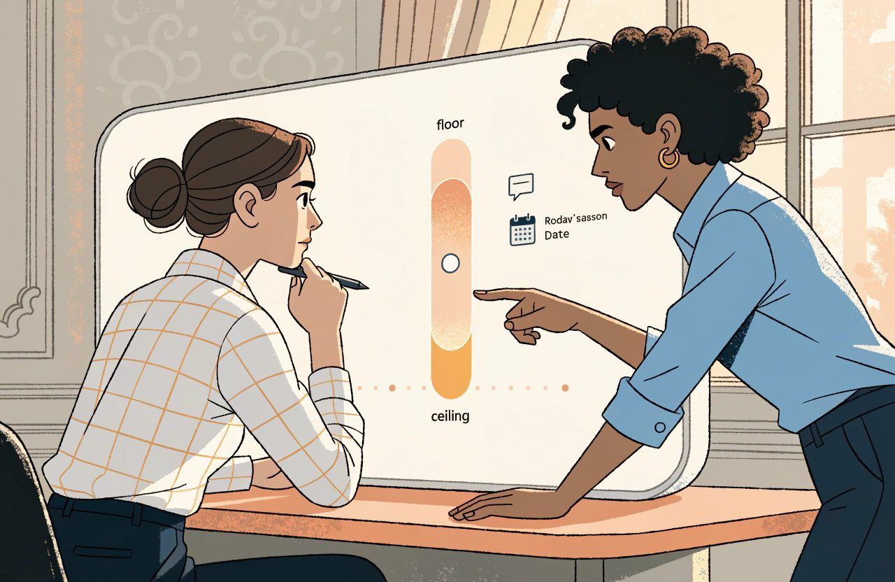

# The Complete Guide to Hotel Revenue Management

*Every rate in that calendar was a decision. The hotels that win are the ones that can still explain them.*

A hotel that sells out in August has not proved anything.

It has raised a question:

*What could you have charged, and how long did it take you to find out you were wrong?*

Most hotels treat revenue management as a job title.

One person. One screen. One set of rates. A monthly meeting where everybody nods.

That is the smallest version of it.

The larger version is a way of running a hotel commercially. Every decision that touches demand, sales, guest value or profit is made on purpose, and every one of those decisions can be explained later to somebody who was not in the room.

That is the gap.

Almost every hotel can tell you what its rates are.

Very few can tell you why.

The rate is stored. The reasoning is not.

**And the reasoning carries all of the value.**

*Almost every hotel can tell you what its rates are. Very few can tell you why.*

**Occupancy is not success. Your average room price is not a strategy.**

Everything below follows from those two sentences.

One thing up front, because it shapes everything after it. The hotel I picture when I write is European, independent or part of a small group, in a resort or a city. It sells rooms by how many people are in them and by which meals are included. That is where my experience is. Where the American or the branded multi-hotel version works differently, I say so. Where I am giving you my own working model rather than an industry standard, I say that too.

## The Short Version

- Occupancy is not success. Your average room price is not a strategy. RevPAR is a starting point, not a conclusion.
- The rate is stored. The reasoning behind it is not. Three months later, a price with no reason cannot be judged or defended.
- Pickup is movement and pace is position. A date can book well for three days and still sit behind last year. Where the two disagree, the disagreement is the signal.
- Every hotel has several booking curves, never one. Build them from your own data, this year. The old stereotypes about leisure and corporate lead times are out of date.
- Governance is a boundary, not supervision. Agree a floor and a ceiling with the owner in advance. Put a review date on every short-term move. Inside that boundary, trial and error is the method.
- Judge every segment on what it leaves you, not on the headline rate. Take off commission and the cost of winning the booking. Count the direct side honestly too.
- Automation is not there to be cleverer than your revenue manager. It reviews prices as often as they should be reviewed. Insist on guard rails, exception approval and a stored reason. A stale minimum stay holds demand back while every rate still looks correct.

## Foundations and Definitions

*The definitions below come from accounting and benchmarking standards, not from law. Those standards are revised, and markets apply them differently. Check the edition your own accountant and your own benchmarking provider actually use.*

Revenue management is selling a product that cannot be stored, in a building you cannot make bigger, at the price that produces the best commercial result over a period you choose.

A room night that goes unsold is not carried forward.

It is gone.

- Occupancy is rooms sold divided by rooms available. Volume, nothing more.
- ADR, the average daily rate, is room revenue divided by rooms sold. Say it out loud as "the average price of the rooms you sold". It counts only the rooms you sold, which is why it flatters a quiet night.
- RevPAR, revenue per available room, is room revenue divided by rooms available. It is the same as occupancy multiplied by average daily rate. It refuses to ignore the rooms you failed to sell.
- TRevPAR, total revenue per available room, counts every kind of revenue, not just rooms. Rooms, food and drink, spa, transfers, and the odds and ends line where resort fees, cancellation fees and room hire sit.
- GOPPAR, gross operating profit per available room, is what is left after the hotel's running costs.

The sums are the easy part.

The definitions inside them are where hotels quietly stop being comparable. Bad source data poisons everything downstream, so these details matter.

- Rooms available normally includes rooms that are out of order. The benchmarking guidance in general use says you make no adjustment for rooms out of service for under six months. That is a reporting convention rather than a rule of law, and the body that publishes it can change it. Check the current definition in the guidance your own benchmarking return actually uses. Close a wing for a refurbishment and it still counts against you.
- Free rooms and rooms used by the hotel itself are not rooms sold.
- Room revenue is counted after tax, rebates and refunds come out. Resort and destination fees count as other income, not room revenue, so they never reach your average room price. Those definitions come from the Uniform System of Accounts for the Lodging Industry, the USALI, in its 12th Revised Edition, effective from 1 January 2026. Tax itself is national, so check how your own taxes are treated before you set your numbers beside anybody else's.
- Room revenue is counted before commission comes out. Every headline number in this industry counts the money before you pay the channel. Hold on to that. The rest of this section depends on it.
- Revenue per available room equals occupancy times average room price only when both are worked out the same way. Take out-of-order rooms out of one sum and not the other, or mix rooms occupied with rooms sold, and the two sides quietly stop matching.

Gross operating profit per available room is where the usual shorthand goes wrong. People describe it as taking out the cost of servicing the business, which is far too narrow. Then they call it the number the owner cares about, which it is not. It is the best measure of operating profit the hotel has, and it is the number management is judged on. Below it sit management fees, rent, property taxes, insurance, the fund set aside to replace furniture and equipment, interest and debt repayments. Ask a general manager how the hotel is doing and you will hear occupancy, average room price and revenue per available room. Ask an owner and you will hear about the cash left after everybody else has been paid.

### Why RevPAR Is Not the Whole Answer

Consider two hotels of a hundred rooms. One sells ninety rooms at 100. The other sells sixty at 150. Ninety times 100 is 9,000. Sixty times 150 is also 9,000. Both report revenue per available room of 90. They are not the same business. The second cleaned thirty fewer rooms, served thirty fewer breakfasts and paid commission on less volume.

But finish the thought honestly. The example proves that revenue per available room is incomplete. It does not prove that the quiet hotel wins. Those thirty extra rooms also buy breakfasts, drinks and spa treatments. In a full-service hotel they may well produce more total revenue per room and more profit per room. Now reverse the channels. Sixty rooms sold expensively through agencies, against ninety sold direct, and the answer flips again. One number cannot settle it. That is the point.

**Revenue per available room is a starting point, not a conclusion.**

*Two hotels can report the same RevPAR and be completely different businesses. One number cannot settle it.*

What you actually want is the revenue that survives the cost of getting it. Take the gross rate. Take off commission. Take off what you spent winning the booking. Take off the cost of collecting the money.

I have called that *net contribution* for years. It is my working term, not a standard one, and that four standards already exist. Kalibri Labs uses COPE, contribution to operating profit and expenses, and COPE RevPAR. HotStats uses Net RevPAR. HSMAI uses NRevPAR, net revenue per available room. They do not agree on which costs come out. HSMAI's own research found that even total revenue per room and profit per room are used by only a small minority of hotels. So the discipline that matters is not the label. It is writing down which costs you deduct, and then never quietly changing it.

### Displacement: What Did You Give Up?

Displacement is the other half of the same idea. It is what you gave up to take the booking. A group at a soft rate across a strong period costs you money while arriving in the accounts as revenue.

That idea gets named in a lot of articles and explained in very few. So here is the method.

1. Take the forecast for every date the group touches, before the group.
2. Work out how many of the group's rooms fit under the demand you already expect, and how many sit on top of it. Only the ones on top displace anything.
3. Value what they displace at the rate you expect to achieve on those dates. Not at your published top rate, and not at last year's.
4. Add the group's other revenue: meeting rooms, food and drink, bar, parking. Take off the cost of servicing it.
5. Compare. Then decide, and write down which way it went and why.

Make those trade-offs on purpose.

A group that loses on the arithmetic can still be the right answer for a relationship, or for a quiet stretch either side of the season.

What you cannot defend is not having done the sum.

## Demand and Forecasting

Two words get confused constantly in hotel meetings. Before I define them, a warning: the industry does not agree on the second one.

### Pickup and Pace Are Not the Same Thing

Pickup is movement.

It is the rooms booked for a stay date within a window you choose: yesterday, the last seven days, since the last review.

It answers: *what happened?*

Pace is position.

It is the business already booked for that stay date, compared with the same point before arrival in an earlier year or plan.

It answers: *where are we?*

That is the more precise pair, and it is how I use the words. But check what your own systems mean by them before you quote them in a meeting. Two of the largest revenue management suppliers define pace as the speed at which bookings arrive. That is much closer to what I have just called pickup. And the comparison is not automatically last year. Pace reports commonly compare against budget first and last year second, and most let you pick any period you like. Last year, budget and forecast answer three different questions. Say which one you mean.

**Pickup and pace disagree, and the disagreement is the signal.**

*Pickup is movement. Pace is position. Where the two disagree, the disagreement is the signal.*

A date can show three strong days of bookings and still sit behind where it was this time last year. A date can be ahead of last year with no new bookings at all.

That second case tells you demand has stopped arriving. It does not tell you why. Price is the first thing to suspect, and often the right one, but it is only a suspicion. Test it against the others before you move. A restriction you forgot you applied. A room type closed off. A channel that has quietly stopped delivering. An event that moved to another weekend. A competitor who opened a new wing. Or a market where everybody is flat. Cutting the rate on a date held back by a stale minimum stay fixes nothing and costs money.

### Build Booking Curves from Your Own Demand

Underneath both sits the booking curve: how demand arrives over the weeks and months before arrival.

Every hotel has several, never one.

That is the load-bearing observation in this section.

What you should not do is build them from the old stereotypes. Leisure books far out, corporate books the night before and stays one night. That picture is out of date on both sides. Corporate bookings now arrive earlier, not later, and business guests stay longer than they did before the pandemic, particularly in Europe. Leisure has gone in two directions at once. Searches inside four weeks have risen sharply, and so have bookings placed six months or more ahead. Groups still book furthest of all, sometimes years out. So build your curves from your own data, this year, and do not inherit mine.

Build the forecast in layers.

1. Business already confirmed, by stay date and by type of guest.
2. The further bookings you expect, each type on its own booking curve.
3. Expected cancellations and guests who never turn up, again by type.
4. Known blocks, group options and events, with a realistic view of how many rooms the group will hand back unsold.
5. Compare against how many rooms you have, and mark the dates where demand is greater.

One practical limit on layer two. Split your booking curves as finely as your data can carry and no finer. Divide a two hundred room hotel into fourteen types of guest and most of them will have four bookings a week in them. At that point you are forecasting noise with great precision. Group them together until the pattern is stable, then split again when volume allows.

Step five is the one people skip. And the whole build produces something that forecasting guides routinely leave unnamed. Layers three and four exist to tell you how far you can safely overbook. You have just worked out how many rooms you expect to get back from cancellations, no-shows and groups handing rooms back. That number is the argument for selling more rooms than you have.

Overbooking is also one of the cleanest examples of the governance argument running through this article.

Treat it that way. Agree the maximum you will oversell, per date and per room type, in advance, with the general manager and with the owner. Agree in advance what happens when you get it wrong and have to send a guest to another hotel. Which hotel. At whose cost. Who makes the call at eleven at night. And what the guest is given. Review the position as the date approaches. An overbooking policy nobody agreed in advance is not a policy. It is a person guessing with somebody else's money.

### Constrained and Unconstrained Demand

Then the idea underneath all of it. Constrained demand is what you saw while your own controls were switched on. Unconstrained demand is what people actually wanted. Those are not the same thing, and the gap is bigger than most hotels assume.

It is bigger for two reasons. The first is the guests who could not book because you had nothing left. The second is the guests who could have booked and refused the price. Most hotels count neither, and the second is invisible almost everywhere.

And this does not only happen on sold-out dates. Every rate you closed, every minimum stay, every date you shut off hides part of what you would have learned. A date that sold out three weeks before arrival records the ceiling you hit. It never records the demand that arrived afterwards and left in silence. A date with a five-night minimum on it hides the same thing more quietly.

## Pricing Decisions and Governance

You will hear it said that hotel systems never record why.

That is too strong now.

The more accurate version is also more useful.

### Systems Record Actions Better Than Reasons

Your distribution and operational systems genuinely do not record why. A property management system, the PMS, is the software that runs the hotel: rooms, bookings, guest bills. Its change log gives you the date, the time, the action, a description and the user. A channel manager, the software that pushes your prices out to the sites that sell you, sends values and nothing else. The sharpest example I know is a well-known cloud PMS. It has a reason field on booking changes and on service orders. It did not put one on price changes.

Revenue management systems are a different story, and they have moved fast. Features that explain the price have been shipping since 2022. In the summer of 2026 two more suppliers launched them within weeks of each other, one publishing an explanation for each date of why the price changed. Others show you the reasons when you hover over a date. Older systems have had override notes and reason codes for years, some of them compulsory. If you are buying a system today, explanation is a live race between suppliers. Make them compete on it.

But hold the distinction that matters.

**Explaining why the machine set a price is not the same as recording why a person decided something.**

None of those features tells you why your revenue manager overruled the recommendation. None of them records why a minimum stay went on three weeks before a big city event. None records what the commercial meeting agreed on Monday, or what it expected to happen. Where a field for human reasoning does exist, it is usually optional free text that nobody ever reads back. That gap is real, and no product launch has closed it.

Consider two records of the same action.

"Deluxe sea view, minus 12 percent, 14 to 18 March."

"Deluxe sea view reduced 12 percent for 14 to 18 March after the conference cancellation put 40 room nights back on sale. Reversal reviewed on 1 March."

The first is a fact.

The second is a decision.

Three months later, the first tells your successor almost nothing. The second can still be judged and defended.

And let us be honest. Asking a revenue manager to stop mid-flow in a noisy week and write up the reasoning behind every move is unrealistic. In my experience the manual effort rarely survives a busy season. That is not a discipline problem. It is a systems problem. It is why the reason field that does exist sits empty in most hotels I have seen.

### Governance Means Boundaries, Not Permission for Every Move

Governance is the other half.

Not supervision.

It is the boundary inside which the revenue manager acts without asking permission.

- A lowest and a highest price for each room type and each period, agreed in advance with the owner.
- The point at which a move needs a second pair of eyes, stated as a number, not a mood.
- A review date on every short-term move, so temporary decisions do not become permanent.

Set the limits and the daily negotiation disappears. Trial and error inside that boundary is not a risk. It is the method.

What breaks it is interference from outside the boundary. Decisions on single dates are the revenue manager's job and always will be. An owner or a general manager reaching past the agreed line to change one Saturday is a different thing. They do it without the context and without leaving a record. It removes the reasoning behind every neighbouring date and leaves nobody able to explain the week.

**A price without a reason cannot be trusted, learned from or defended.**

*Agree the floor, the ceiling and the review date in advance. Inside that boundary the daily negotiation disappears.*

## Rate Structure and Restrictions

The rate sheet is the commercial foundation of the hotel.

It is not administration.

Nearly every price a guest sees starts there and inherits every mistake in it.

Rubbish in, rubbish out, at scale.

### What Happens Between the Rate Sheet and the Guest

*Price display rules vary by country and they move. What follows is how I read the general position, not legal advice for your hotel. Check where you actually stand before acting on any of it.*

Two things sit between your rate sheet and the guest. Know both before you trust the word "every".

The first is the channel. Prices get changed on the way out more than hoteliers expect. The platform funds a discount and shows it to selected customers. You fund a loyalty discount yourself. Deal programmes pile on top of each other. The channel does its own sum for how many people are in the room. A merchant seller sets its own margin. Currency gets converted. A price comparison site builds its own total from your base rate plus tax and fees. One large online travel agency, an OTA, says so in its own partner help: your rates may appear lower on the platform than the rate you set. So the honest version is this. You control the money you receive far more reliably than you control the price the guest sees.

The second is the law. What a guest must be shown is now regulated separately from what you loaded. Several large markets tightened their rules on displayed prices from 2025 onwards, and short-term lodging is caught by them. The direction is the same in each case. The total price a guest has to pay, including any compulsory fee, must be the number shown most prominently. Showing compulsory fees separately, further down the page, is increasingly not enough. The detail differs by country. So do the dates, and so do the penalties. European price display rules point the same way. There is also a separate European duty that catches personalised pricing. Where the price a guest sees has been personalised on the basis of automated decision-making, the trader has to say so. That duty was added to the Consumer Rights Directive, Directive 2011/83/EU, as Article 6(1)(ea). It was inserted by the Omnibus Directive, Directive (EU) 2019/2161, and member states have applied it since 28 May 2022. If your pricing system sets an individual price for an individual guest, that is worth checking before you switch it on. This matters here because this section is about supplements. Whether a supplement is compulsory or optional now decides whether it can sit outside the headline price at all, in several of the largest markets you sell to. That is a rate structure question long before it becomes a legal one. Build the structure without asking it and you can be fully in order on your own rate sheet, and out of order on the shelf. Whether you actually are, in any given market, is a question for somebody qualified there.

### What a Complete Rate Structure Contains

With that said, a complete rate structure covers all of the following.

- Room hierarchy. Room types ranked by value, and the price gap between each step.
- How rates are built. A base rate, and the rates worked out from it.
- Pricing by number of guests. One to four adults, plus family combinations with one or two children.
- Child policies. Age bands, sharing rules, supplement or reduced price.
- Meal plans. Room only, bed and breakfast, half board, full board, all inclusive, with adult and child supplements set separately.
- Fixed periods versus prices that move. Seasons, weekday splits and minimum stay patterns are the fixed frame. Day-to-day pricing moves inside it.
- Restrictions. Shortest and longest stay, no arrivals on this date, no departures on this date, and stop sell, which closes the date entirely.
- Which price list feeds which channel, and how.

That is the European resort model. It is the most demanding version of the problem to build, which is why it is worth teaching. It is not universal. Plenty of American and city-centre setups price per room, add a supplement for an extra person, and have no meal plan hierarchy at all. Pricing by number of guests is something you have to switch on with the major online travel agencies rather than the default. On at least one of them, meal plans are a label on a rate rather than a structure with its own supplements. Take the checklist and cross out what your market does not use. The two lines nobody gets to cross out are restrictions and which price list feeds which channel.

### Four Important Qualifications

Four notes on that list, because the standard version of each is taught a little wrong.

How a rate is built is not one question, it is four, and flattening them teaches a muddle. What kind of rate is one: best available, promotional, package. What the cancellation and payment terms are is another: flexible, non-refundable, deposit. Who sells it and who gets paid is a third: you pay commission, you sell at a net price, or the channel sells as merchant and sets the guest price itself. Whether it is public or negotiated is a fourth. A single rate is all four at once. "Non-refundable" is not a sibling of "commissionable".

Contracted rates are no longer fixed on paper. A negotiated corporate rate can be a fixed amount. It can equally be worked out from your best available rate, with a discount or a formula, which most major systems now support. That changes how you manage the account and how it behaves in a strong period. Find out which kind yours are.

Building rates from a base rate is a convenience, not a principle. It makes maintenance manageable, and it is how most selling systems are set up. It is not a law of pricing. Two of the leading revenue management suppliers sell its removal by name, letting you price room types, guest types and channels independently. Some platforms make it optional, or limit how many steps deep it can go. So use it because it saves you work, not because you think prices have to work that way.

Room hierarchy is under quiet challenge too. There is a growing argument for selling the guest a floor, a view or a balcony rather than a room category. That would take the ladder apart. It is being advocated more than it is being adopted, and most platforms cannot price it yet. Worth watching, not worth planning around this year.

And release is not a restriction. It is a contract term: the date on which rooms a partner holds but has not sold come back to you. It does not travel in the same messages as minimum stay and no-arrivals rules. Calling it a restriction will confuse whoever has to set it up.

### Somebody Must Own the Rate Sheet

One more thing belongs on that list because it brings the governance argument back in.

Somebody has to own the rate sheet. Structural changes and day-to-day changes are different animals and should not be made the same way. Adding a room type, changing a meal supplement or moving a season boundary reaches into every channel and every future booking. That needs a named owner, a version, a date and a second pair of eyes. Moving Tuesday's price does not. Most hotels treat both as "loading rates" and then wonder why the structure drifts.

### Percentage Changes Do Not Behave the Same Everywhere

Now the point that still catches experienced people. A percentage discount does not behave the same way everywhere.

Take a rate where the price for each number of guests, and each meal plan, is worked out from the base rate. Cut the base rate and the half board and all inclusive prices move too. Commission is then charged on the reduced supplements as part of the total booking value. Now take a rate set up as a price for two adults with breakfast, where the supplements are contracted and added afterwards. The same instruction touches the base only. Same action, two outcomes, same afternoon.

This is usually described as two kinds of channel. That is the wrong noun, and it sends people looking in the wrong place. It is a property of how the rate plan is set up, not of which platform it goes to. Both of the largest online travel agencies support both models. A hotel can be running one on one rate plan and the other on the next one along. So check the setup, rate plan by rate plan, before you move a percentage.

## Segmentation and Channel Mix

A segment is a group of demand that behaves the same way.

Not demand that merely arrives through the same channel. Behaviour means how much price matters to them, how far ahead they book, how long they stay, how often they cancel, and what they spend once they are in the building.

### Segment, Channel and Source Are Different

Keep three ideas apart.

- Segment is who they are and how they behave: leisure, corporate, group, tour operator, long stay.
- Channel is the route the booking travelled: your own booking engine, an online travel agency, a global distribution system, the telephone, somebody walking in off the street.
- Source is where the demand came from: a paid search advert, an email to a past guest, a contracted account, a wedding block.

That is my model for analysis. I find it genuinely useful.

But do not mistake it for industry terminology. It is not. Two standards already occupy the same ground, and your hotel reports into both of them.

The uniform accounting standard is the Uniform System of Accounts for the Lodging Industry, the USALI, now in its 12th Revised Edition and effective from 1 January 2026. It splits individual room revenue by type of rate: retail, discount, negotiated, qualified, wholesale. The main benchmarking standard is a separate thing, published by a benchmarking provider, and it splits by the shape of the transaction. Fewer than ten rooms a night is transient. Ten or more under a signed agreement is group. A committed block of over thirty days at an agreed rate is contract. Nine business travellers from one company on one night are transient. Eleven are group. That is a test of the deal, not of the behaviour, and it is the one your accountant and your benchmarking return use.

There is a vocabulary collision as well, and it will bite you during setup. In one of the most widely used property management systems, the field called "source code" means mail, telephone, fax, central reservations, travel agency. That is what I have just called channel. Market code and origin code carry the other two ideas. Take my three words into that system unchecked and you will map them to the wrong fields.

Two more corrections in the same area. Airline crew is not a behavioural segment in reporting terms. Under the benchmarking definitions in general use, crew rooms code to contract. Long stay is usually a contract arrangement too. And my model runs alongside the standards, not instead of them.

### Do Not Recode a Booking to Match Your Theory

Which changes how to use the best example in this section. A corporate guest booking your public rate through an online travel agency is corporate demand arriving through an expensive route. Under those standards that booking is individual retail agency business, and it should stay coded that way. Both standards are revised from time to time, so check the current definitions in the editions your accountant and your benchmarking provider actually use. Re-coding a booking to match who you think the guest is will break your accounting, your benchmarking return and your revenue system's own demand model, all at once.

Do this instead, alongside the standard reporting. Match agency arrivals against your list of negotiated accounts, by company email domain, by company name, by repeat guest profile. What you are looking for is how many guests already had a rate with you and paid you commission anyway. That number is usually larger than anyone expects. It is a conversation with the account, not a coding exercise.

Look at the mix of demand for each hotel separately. A city property and a resort in the same group do not share one model.

Then judge every segment on what it leaves you, not merely on the headline rate. Gross rate, less commission, less the cost of winning the booking, less the cost of taking the money. Multiply by the average length of stay. Add what they spend on site.

A booking at 180 through a channel taking 18 percent commission returns about 148. Eighteen percent of 180 is roughly 32. That is less than a direct booking at 165, and the gap is real. But count the direct side honestly. The version of this comparison you usually see puts commission on one side and a card fee on the other. That flatters direct by leaving out exactly the costs it has just told you to count. Direct has a booking engine fee. A share of paid search and price comparison spend. A share of the brand and email marketing that produced the booking. Any loyalty discount you funded yourself. And the cost of card payments the guest later disputes. Both bookings are worth having. Which you would rather hold on a tight date is a mix question, and it is only answerable with your own numbers.

On which: be careful with the published figures for what it costs to win a booking. The numbers everybody quotes for the cost of direct come from data gathered in 2017 and 2018. Nobody has published a comparable independent study since. So the honest position is that the industry does not currently know what direct costs, on average, in 2026. Measure your own rather than borrow a number that is eight years old.

Mix is managed with restrictions and availability, not only with price. Closing a low-value segment on a high-demand date is not disloyalty. It is why the partnership works on the other three hundred days.

I stand by that as strategy. But it is incomplete as instruction, and the missing half can cost somebody a contract. So here it is.

### Channel Mix Is Often Negotiated Before the Season

For roughly half the segments named above, the lever was set when you signed the contract. It is not available to you on the day. A last room availability clause, usually written as LRA, normally means the negotiated rate stays open whenever you have a room to sell, right down to the last one. Non-last-room-availability is the term that lets you close it on peak dates. These are contract terms, not rules of law, so the wording in your own agreement decides what they actually mean. Read the clause you signed rather than the industry shorthand. It is won or lost when you bid for the account, not in a supplier website in October. Tour operator rooms held inside the release period are the operator's to sell, not yours. Group blocks are held until the agreed cutoff date. Contract business by definition comes with a committed rate, and often payment whether the rooms are used or not.

**The real skill is not closing segments in season. It is negotiating the closures before the season.**

*A segment is demand that behaves the same way. The route it arrived by is a different question.*

Blackout dates. Terms that let you close the last rooms. Shorter release periods. Tighter cutoffs. Do that at contract time and the tight dates look after themselves. Skip it and you will spend October discovering what you signed.

One European footnote, because it changes what you are allowed to do with price. You are much freer to price your own channels differently from an online travel agency in Europe than you used to be. Three things caused that. In 2024 the largest OTA group was formally designated under the Digital Markets Act, Regulation (EU) 2022/1925. That is a European Union law which puts extra obligations on the biggest platforms once they are designated as gatekeepers. European case law moved the same way in the same year on rate parity clauses, which are the contract terms requiring you to match the platform's price everywhere. And several member states banned those clauses outright, each under its own national law. That freedom is uneven. It depends on the market, on the platform, and on whether the clause you signed is a narrow one or a wide one. Check yours before you build a strategy on it. The detail sits in the Distribution and Connectivity guide.

## Pricing Automation

Manual pricing has a fixed shape.

Open the tool that shows competitor prices. Check what booked. Check where you stand against last year. Decide. Load the change. Confirm it arrived everywhere.

Now multiply that by every room type, meal plan, number of guests and date in your window.

The work outgrows the person. In my experience the near dates get done and the far ones get left. The far ones are where the easy money is.

**Automation is not there to be cleverer than your revenue manager.**

*Automation is not there to be cleverer than your revenue manager. It closes the gap between how often prices should be reviewed and how often anyone can.*

It closes the gap between how often prices should be reviewed and how often a person can realistically review them.

### Rules, Models and the New Third Family

Think of it as two families. This is a teaching simplification rather than a map of the market. Rules are instructions you write yourself: if occupancy on this date passes this level, raise the price by this much. Predictable, checkable, and blind to anything you did not think of. Models forecast demand and set the price from it. They are stronger on pattern, and have historically been weaker at explaining themselves, although that gap is closing fast enough that I would not buy on it today. My preference, and it is a preference rather than a finding, is models running inside rules.

A third family is arriving and does not fit either box: systems that act first and then tell you what they did. Watch it. Do not plan the next two years around it.

Whatever you use, insist on three things.

1. Guard rails. Lowest and highest prices enforced by the system, not by memory.
2. Exceptions. Recommendations outside normal behaviour wait for a human to approve them.
3. Explanation. Every price carries the reason it exists, stored with the change.

The third one used to be a wish. It is now a shipping feature at several suppliers, which makes it a much stronger thing to ask for. Do not accept a demo of it. Ask to see it on a real date. And ask what happens to the explanation when a human overrules the recommendation.

A system that cannot tell you why it dropped your Saturday rate is asking for trust it has not earned.

The first time an owner questions a number, it gets switched off.

### Where Pricing Automation Goes Wrong

Watch two ways this goes wrong.

The first is the feedback loop. Your system follows a competitor down while the competitor follows you. Commercially that is a race nobody wins, and it is the reason lowest prices exist.

It is also, as of 2026, a legal question. This is the one part of this article where I would tell you to stop reading me and call a lawyer.

The line that matters is roughly this, and it is a general principle rather than a finding about your hotel. Watching published competitor rates and making your own decision is ordinary competitive behaviour and always has been. The risk lies elsewhere. It is in feeding private, forward-looking data about your own prices and occupancy into a shared engine that your competitors also feed, and then accepting nearly everything it recommends. Litigation in the United States has run both ways on close to those facts. In one 2026 case, price-fixing claims against a group of hotels were allowed to go forward. What was pointed at was the pooling of private data, and very high obedience to the recommendations. Another case in 2025 went the other way. There, no such pooling was alleged and the hotels had kept their own judgement. So the American position is genuinely split right now, and I am not going to summarise it as though it were settled. One American settlement in a related industry drew the line at using competitors' private data in live operation. It allowed models to be trained on data more than a year old. At least one American state went further from 2026, with a law that does not lean on the public versus private distinction at all. Competition regulators in Europe and the United Kingdom have named pricing by software as an active area. None of that is European law you can rely on, and none of it is a ruling about your hotel.

I am not qualified to tell you where your hotel sits in that. Neither is your supplier's sales team. What I would do is straightforward. Ask any pricing supplier, in writing, exactly what data of yours goes into their model. Ask whether other hotels' private data comes back out in your recommendations. Ask how old that data is. Keep the answer. Then have somebody qualified look at it, in your own country. If your revenue system takes competitor rates from published prices, and your team makes the decisions, that generally sits on the ordinary side of the line. That is where most independent hotels are. Generally is not certainly, which is why the sentence before this one ends where it does.

The second failure is quieter: the stale restriction.

A minimum stay or closed date was applied for a reason that has since expired, holding demand back while every rate looks correct. It is the one I find most often and the one nobody looks for. A wrong price shows up on a price comparison report. A wrong restriction does not.

In my experience restrictions cost more unexplained revenue than prices do. I should be clear that I cannot prove that, and I have not found anybody who has measured it either way. Take it as experience rather than as a finding. Then go and check your own restriction calendar, which is the useful half of the sentence anyway.

## Commercial Strategy and Culture

Revenue management is a function.

**Revenue culture is when the whole hotel understands how its decisions affect demand, sales, guest value and profit.**

That is not a slogan.

It is a list of people.

- Reception decides whether somebody walking in off the street gets the screen rate or the rate that fits the night, and whether an upgrade is sold or given away.
- Housekeeping decides how fast rooms come back on sale, which is a revenue decision in uniform.
- Maintenance decides how long a room type stays out of order, and so what you can sell.
- Sales decides which group enquiries get the sum done on them before a rate is quoted.
- The general manager decides whether the revenue meeting reviews decisions or negotiates them.

### Revenue Culture Shows Up in Behaviour

Which brings us to discounting. When a hotel discounts by reflex, my experience is that the cause is rarely the pricing model. It is that nobody feels able to defend the price. That is a cultural problem, not a pricing one, and no system fixes it.

There is a tension there with what I said earlier about record keeping being a systems problem. It is worth naming. Both are true, and they are different failures. The tool cannot make a person brave. It can stop the reasoning walking out of the door with them.

### Revenue and Marketing Should Share the Same Demand View

There is one opportunity most hotels still leave on the table.

Run a simple booking report against the same point last year: number of bookings, room nights, revenue, average length of stay, how far ahead people booked, and the average room price, split by month. Send it to marketing. It tells them which months look short rather than which ones feel quiet, and roughly how far ahead to place spend.

Read it as a starting line, not as a forecast. Booking habits move, events move, and last year was not a controlled experiment. Put it next to your current forecast, the event calendar and whatever else you know about demand. Then it becomes the most useful page marketing gets all month.

In my experience, marketing teams are often guessing at those answers while revenue already has them on a screen.

The wall between revenue management and marketing is, in my opinion, one of the largest remaining sources of waste in most hotels.

Tear it down and watch what happens.

Judge the function honestly. Monthly, quarterly and annually, on results and on the reasoning behind them. Not on one soft Tuesday.

## Common Questions

### What is the difference between ADR and RevPAR?

ADR is room revenue divided by rooms sold. RevPAR is room revenue divided by rooms available. ADR counts only the rooms you sold, which flatters a quiet night. RevPAR refuses to ignore the rooms you failed to sell.

### What is the difference between pickup and pace?

Pickup is movement. It is the rooms booked for a stay date within a window you choose. Pace is position. It is the business already booked, compared with the same point last year or against budget. Check what your own systems mean by each word.

### Is RevPAR a good measure of hotel performance?

RevPAR is a starting point, not a conclusion. Two hotels can report the same RevPAR and be very different businesses. One sells ninety rooms at 100. The other sells sixty at 150. The quiet hotel cleans fewer rooms and pays less commission. It also sells thirty fewer breakfasts. One number cannot settle it.

### How do you work out the displacement cost of a group booking?

Start with the forecast for every date the group touches, before the group. Work out how many group rooms sit on top of the demand you already expect. Only those rooms displace anything. Value them at the rate you expect to achieve, not at your top rate. Then add the group's other revenue and compare.

### How much should a hotel overbook?

Overbooking limits come out of your own forecast. Count the cancellations, no-shows and rooms groups hand back. That number is the argument for selling more rooms than you have. Agree the maximum in advance, per date and per room type. Agree with the owner what happens when you get it wrong.

### What is the difference between segment, channel and source?

Segment is who the guests are and how they behave. Channel is the route the booking travelled. Source is where the demand came from. Keep the three apart when you analyse demand. But do not mistake that model for industry terminology, because your accounting and benchmarking standards split the business differently.

### Is a direct booking always worth more than an OTA booking?

Direct is usually worth more, but count it honestly. A booking at 180 through a channel taking 18 percent commission returns about 148. Direct has costs too: a booking engine fee, a share of paid search, brand and email spend, and disputed card payments. Both bookings are worth having. Which one you want on a tight date is a mix question.

### Why does the same percentage discount give different results on different rate plans?

The answer depends on how the rate plan is built. Take a plan where guest numbers and meal plans are worked out from the base rate. Cut the base and the half board price moves too. Now take a plan with contracted supplements added afterwards. The same instruction touches the base only. Check the setup, rate plan by rate plan.

### Do revenue management systems record why a price changed?

Revenue management systems increasingly explain why the machine set a price. Several suppliers now ship that feature, and more launched in 2026. But explaining a model is not the same as recording why a person decided something. No system tells you why your revenue manager overruled the recommendation. That gap is still open.

### Is it legal to price from competitor data?

Watching published competitor rates and making your own decision is ordinary competitive behaviour. The risk sits elsewhere. The exposure is feeding your own private, forward-looking data into a shared engine your competitors also feed. Accepting nearly every recommendation adds to it. Courts in the United States are split on this right now, and that is not European law. Ask your supplier in writing what data goes in, then take proper legal advice.

## Key Terms

- **ADR, or average daily rate.** Room revenue divided by rooms sold. Say it out loud as the average price of the rooms you sold. ADR ignores the rooms you failed to sell, so it flatters a quiet night.
- **RevPAR, or revenue per available room.** Room revenue divided by rooms available. RevPAR equals occupancy multiplied by average daily rate, but only when both sums use the same definitions.
- **TRevPAR, or total revenue per available room.** Every kind of revenue divided by rooms available. Rooms, food and drink, spa, transfers, and the odds and ends line holding resort fees, cancellation fees and room hire.
- **GOPPAR, or gross operating profit per available room.** Profit per available room after the hotel's running costs. GOPPAR is the number management is judged on. Management fees, rent, property taxes, interest and debt all sit below it.
- **Net contribution.** The gross rate, less commission, less the cost of winning the booking, less the cost of collecting the money. Net contribution is the author's working term rather than a standard. COPE, Net RevPAR and NRevPAR cover similar ground and do not agree on which costs come out.
- **Displacement.** What you gave up to take a booking. A group at a soft rate across a strong period costs you money while arriving in the accounts as revenue.
- **Pickup.** The rooms booked for a stay date within a window you choose. Pickup answers the question of what happened.
- **Pace.** The business already booked for a stay date, compared with the same point before arrival in an earlier year or plan. Pace answers where you are. Some suppliers use the word for the speed at which bookings arrive, so check yours.
- **Booking curve.** How demand arrives over the weeks and months before arrival. Every hotel has several booking curves, never one. Build yours from your own data rather than from inherited habits.
- **Unconstrained demand.** What guests actually wanted, before your own controls were applied. Constrained demand is only what you saw with rates closed and minimum stays switched on. The gap between the two is bigger than most hotels assume.
- **Last room availability, or LRA.** A contract term keeping a negotiated rate open whenever you have a room to sell. Non-LRA is the version that lets you close the rate on peak dates. Both are won at contract time, not in season. The shorthand varies between agreements, so read the clause you actually signed.
- **Stale restriction.** A minimum stay or closed date left in place after the reason for it expired. A stale restriction holds demand back while every rate still looks correct, and no price report shows it.

## How This Connects to the Wider Hotel Technology Stack

Revenue management sits in the middle of the commercial side of the hotel, so the boundaries matter.

- **[Hotel Operations and PMS](../hotel-operations-and-pms/)** owns the booking, room status and operational record. In an independent hotel the PMS is often the main system of record, while a central reservation system may hold that authority in a group environment. Revenue systems also write rates, availability and restrictions back into that stack.
- **[Distribution and Connectivity](../distribution-and-connectivity/)** carries rates and availability to market. Revenue decides the price; distribution carries it and may transform how the guest finally sees it.
- **[Direct Booking and E-commerce](../direct-booking-and-e-commerce/)** owns the booking engine and website experience. Channel-mix strategy is decided here; the conversion tools live there.
- **Market Intelligence and Analytics** supplies competitor pricing, benchmarking and performance analysis. Reading a competitor-rate report is not revenue management; deciding what to do with it is.
- **Guest Technology and CRM** owns the guest profile, repeat behaviour and relationship data that sharpen segmentation. The profile itself may live across several systems, so the boundary is about accountability rather than storage.
- **Payments and Financial Technology** governs deposits, prepayment and the strength of non-refundable terms. A rate is only as strong as the payment mechanism behind it.
- **Sales, Groups and MICE** owns blocks, options and the rooms groups hand back. Displacement analysis is the shared border, and neither side should quote group business alone.
- **Data, APIs and Integration** moves forecasts, rates, restrictions and decisions between systems. Most automation ambitions eventually meet this layer.
- **AI, Automation and Agents** covers model-driven pricing and the capture of decision reasoning. Technically it may live elsewhere, but commercially the consequences belong here.
- **Hotel Technology Strategy** covers whether to buy an RMS and how to judge one, while **Emerging Hotel Technology** tracks pricing approaches that are not yet stable enough to plan around.

## Related Reading

Pricing Decisions and Governance - The 'Why' Behind Every Rate: Revenue Management's Missing Record - The Price Is Not Enough: Why Explainable Pricing Will Win

Pricing Automation - The End of Manual Pricing

Commercial Strategy and Culture - Revenue Managers Are Sitting on Marketing Gold

This list grows. New Knowledge Articles are added in batches rather than one at a time.

The hotels that win this are not the ones with the cleverest pricing model. They are the ones where the reasoning behind every rate is captured, the boundaries are agreed in advance, and the whole building knows its decisions show up in the revenue. Occupancy is a number. Explained, defensible decisions are the asset.

Get the record of why right, and the rest of this domain becomes teachable.

I would rather be corrected than agreed with. If something here does not match what you see in your own hotel, tell me, and tell me what you saw.
