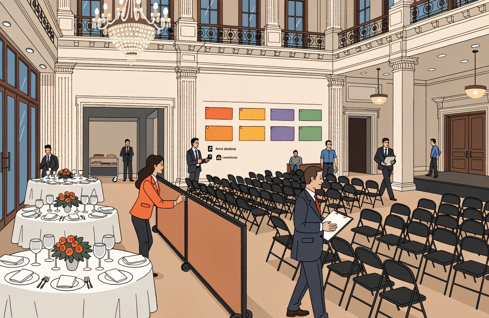

# The Complete Guide to Hotel Sales, Groups and MICE

*Most hotel technology serves business that books itself. This subject is the other kind.*

Most hotel technology serves business that books itself.

Somebody searches, compares, clicks and arrives. You can measure it. You can automate it. More and more of it happens with no human on either side.

This subject is the other kind.

**Business that is asked for rather than simply bought.** A company wants forty rooms across three nights in October, and a room to run a workshop in. A tour operator wants a block of rooms held for a whole season. A wedding party wants a quote by Thursday.

You may assume none of this can be bought online. And that no software prices it. That was true for a long time. It is not true now. Let us close that gap before we go further.

Hilton sells and confirms group bookings of up to twenty-five rooms on its own website. Groups360's GroupSync has passed a million group room nights booked online. That is across roughly 6,500 hotels, including Hilton, IHG, Accor and Omni. It added Marriott across thirty brands in 2023. Cvent Instant Book sells meeting space and rooms on live rates and availability. Choice rolled it out across every hotel it runs.

Pricing software has caught up too. Group pricing ships in at least three revenue management systems. IDeaS G3 works out a group's revenue, profit, and what business it pushes out. Duetto sells BlockBuster. Cendyn's GroupRev produces a lowest, a best and a highest rate to bid. Those are the same suppliers much of this audience already runs.

So the useful dividing line is not human sale versus machine sale.

It is **business you negotiate versus business you simply put on sale.** Guests who book one room at a time are called transient business in the trade. This subject is everything else.

What is still genuinely manual is the big and the complicated. Large blocks of rooms. Conferences over several days. Weddings. Tour operator contracts. That is most of the money here, and it is where the rest of this guide lives.

In many hotels this is also the business with the biggest sums at stake and the thinnest process around it. Where a hotel has a revenue manager, everyday room pricing gets reviewed daily. That is somebody's actual job. Plenty of hotels have nobody doing it. More than half of US hotels are small businesses. The average American hotel runs around sixty rooms.

But look at the hotels that do employ a revenue manager. A group quote worth two weeks of ordinary room revenue goes out on a Friday afternoon. It is sent by whoever picked up the phone. It comes from a template last updated by a colleague who has left.

That contrast is why this subject repays attention. It is my experience, not a measurement. Nobody publishes how often hotels review group pricing.

MICE is the trade label for the events end of this. It stands for meetings, incentives, conferences and exhibitions. Get that right, because it is exactly the sort of thing a reader checks. The main bodies in the meetings trade all use exhibitions for the E: the International Congress and Convention Association, the IMEX trade shows, and Meeting Professionals International. Those same bodies now prefer a broader label anyway. Business events, or the meetings industry. If you are writing for event planners, use their words rather than yours.

The acronym matters less than the distinction underneath it.

This is negotiated business.

**And in negotiated business, the margin is decided before the guest arrives.**

*Business that is asked for rather than simply bought. A wedding, a corporate account and a tour series all arrive as a conversation.*

By what you quoted. How fast. On what terms. And whether anybody checked what it pushed out.

## The Short Version

- Negotiated business is asked for rather than simply bought. Groups, corporate accounts, events and tour operator contracts are priced by a person, not by a search box.
- Group is a contract type, not a behaviour. The industry accounting standard, USALI, already sets out five sub-types to be reported separately. It is a standard, not a law. A hotel reporting group as one line cannot say which groups are good business.
- Displacement decides whether a group is worth taking. Compare what the group leaves you against what the business it pushes out would have left you. Take costs off both sides.
- A rate agreed and not loaded correctly is a rate that does not exist. Know where the rate lives. Then try booking it the way the client would.
- Meeting space is stock and it goes off like a bedroom does. Setup and teardown time is real occupancy. A printed tariff ignores both facts.
- Every quote needs an expiry date. Every option needs a named owner and a release date. Expired options get released, not left sitting.
- Allotments live or die on the release period. Set yours against how far ahead your guests really book. Then vary it by season.

## Group and Corporate Business

*The reporting rules in this section come from an industry accounting standard, not from law. Standards get revised, and hotels in different countries apply them differently. Check the edition your own accountant and your own benchmarking return actually use.*

Two things get filed together here and behave nothing alike.

### Group and Corporate Are Different Kinds of Business

A group is a block of rooms held under one agreement. They usually arrive and leave together. The person you deal with is usually not the guest.

A corporate account is different. It is a rate you agree with a company. That company's travellers then book against it, one at a time, all year.

One is a single deal. The other is a standing agreement that feeds you individual bookings. That split is clean. It matches how the industry accounting standard treats both, and that standard is named a few lines below. It is the most useful thing in this section.

Now the argument I would have with your group report. It is not an argument with the accounting standards. They already agree with me.

Group is a recognised type of business. The hotel industry has a standard accounting rulebook, the Uniform System of Accounts for the Lodging Industry. Everyone calls it USALI. The current version is the 12th Revised Edition, effective from 1 January 2026. It is an industry standard rather than a law, and it is revised over time. In USALI, group sits at the top level, next to transient and contract business. And it comes with five sub-types the standard requires you to report separately. Corporate. Association or convention. Government. Tour or wholesale. And SMERF, which stands for social, military, educational, religious and fraternal.

The benchmarking firms STR and CoStar define a group by the contract, not by the guest. Ten or more rooms a night, sold under a signed agreement. That is a provider definition, set in their own reporting guidance, and providers can change it.

Read that again, because it is the point.

**The definition is about how the rooms were bought. There is no behaviour in it.**

A conference group, a sports team, a tour series and a wedding party behave nothing alike. They differ on how hard they push on price. On what they spend beyond the room. On how often they cancel. On how much work they make for you. The standard already tells you to report them separately.

So a hotel that reports group as one line is not simplifying an industry convention. It is ignoring one. Nobody will prosecute you for that. You simply lose the ability to answer the question. That is why so many hotels cannot say whether groups are good business.

### Displacement: What Did the Group Push Out?

The habit that matters most here is displacement. Displacement is the business you push out by taking the group. Give a company forty rooms and you give up the individual bookings those rooms would have held. So the question is not whether the group revenue looks good on its own. It is whether it beats what you gave up.

Doing that honestly needs four things. The fourth is the one almost everybody misses.

- A forecast for those dates that you actually believe. Without one you are doing sums on a guess.
- The total value of the group, not the room rate. Rooms times nights, plus meeting space, food, drink, bar, parking and anything else that arrives with them.
- The value of the individual bookings you push out, at the rate you would really have got.
- The same treatment on both sides. Take the costs off the group too, not just off the business it displaced. Then compare what each one leaves you, not what each one brings in.

That fourth point sounds like accounting fussiness. It is the difference between a method that works and one that quietly says yes to everything.

Two things go wrong.

The first is uneven maths. Most spreadsheets subtract the cost of winning the individual bookings, then count the group at full value. But groups cost money to win as well. Agencies that find venues for companies are paid by the hotel, out of the group's room revenue. That deduction usually never appears in the sum at all.

I am not going to quote you a commission percentage. I could not find one worth trusting. The figures everybody repeats date from the chain commission cuts of 2018 and 2019. Nothing solid has been published since. Use your own contracts, not an industry number.

The second is that a pound of one kind of revenue is not a pound of another. Food and drink made a 29.1% profit margin across 866 US hotels in the first half of 2025. That is the property firm CBRE's number. Room revenue keeps far more than that. Cornell's research on meeting space put room hire at 85 to 95% profit, against 30 to 35% for food and drink. Those particular figures are old. The gap has not closed.

So 20,000 of group catering and 20,000 of displaced room revenue are not the same business. A spreadsheet that adds up revenue will tell you they are.

Here is the arithmetic. The percentages are examples. Replace them with your own. The figures are in whatever currency you work in.

A company asks for 40 rooms across three nights. That is 120 room nights, at 85 each. Your forecast says you would have sold 100 of those 120 nights anyway, one guest at a time, at 145.

Compare revenue and the group wins:

- Group: 120 nights at 85 is 10,200, plus 4,000 catering and 600 bar. Total 14,800.
- Displaced: 100 nights at 145. Total 14,500.
- Group ahead by 300.

Now compare what you keep, and it loses:

- Group rooms, 10,200 at 80% kept: 8,160.
- Group catering and bar, 4,600 at 30%: 1,380.
- Less the cost of winning it. Agency commission at 8% of group room revenue: 816.
- Group leaves you 8,724.
- Displaced rooms, 14,500 at 80%: 11,600.
- Less the cost of winning those bookings, at an average 12%: 1,740.
- Displaced business would have left you 9,860.
- Group behind by 1,136.

Same group. Same date. Same forecast. One method takes it. The other turns it down, or sends you back to ask for 95 a night. The only figure in there I can source is the food and drink margin. Everything else comes from your own accounts. That is the work most hotels skip.

One honest objection, because it is the good one. This method is weakest exactly where group decisions get made. A block asked for twelve months out is judged against a forecast nobody would trust for tomorrow's room price. And early business has a value the sums miss. A group confirmed nine months out tells you something about that period. It changes how you price everything around it.

**Use displacement to shape the decision, not to settle it.** Where the forecast is thin, say so out loud. Then price for the uncertainty instead of pretending it away.

A group at a low rate on a weak date is often excellent business.

The same group on a date that would have filled anyway is a discount you volunteered.

The rate on its own tells you almost nothing.

**Quoting without a forecast is guessing with a calculator.**

*Compare revenue and the group wins. Compare what you keep and the same group can lose.*

Two things then decide how much of the block you actually get.

### Wash, Cut-off and the Rooms You Actually Get

Wash is the gap between rooms held and rooms taken up. Block eighty and get sixty, and twenty rooms have washed. Most groups wash to some degree. Once you have kept the records, the amount becomes fairly predictable by account and by type of group. Duetto, IDeaS and Cendyn all model it. This is not an exotic idea.

Not every group washes, though, and the exceptions hurt. Some groups fill the block. Some go past it. And if the organiser has agreed to pay whether or not the rooms are used, the shortfall is already theirs. That depends entirely on what your contract says, and on whether the clause stands up where you signed it. An attrition clause does much the same job, and there is more on that below.

That precondition also fails where you need it most. Once you have kept the records is no help for the groups whose wash you cannot predict. Weddings. SMERF business. Any account booking with you for the first time.

Wash assumptions cut both ways too. Sell the rooms you expect to wash, and you are overbooked when the group turns up in full.

A hotel that holds every block at face value, and never allows for wash, is usually holding rooms it will not sell. And turning away business it could have had. Usually, not always. The reason is a few paragraphs down. Check what your own system does with a held block before you decide you have a problem.

One word trap. Event planners and company buyers use wash to mean something else. To them it is the deliberate act of cutting the block down before the penalty bites. Same word, opposite side of the table.

The cut-off date is the day unsold rooms come back to you and go on general sale. Oracle's OPERA manual says it plainly. On the cut-off date, every unbooked room in the block goes back into the hotel's own pool, during the overnight run.

**This is a commercial term, not a paperwork one.**

Set it too late and the rooms come back with no time left to sell them. Negotiate it on purpose. Then enforce it. It binds only because it is written into the agreement, so make sure it is in there, in words both sides read the same way.

Two practical points. Instead of a fixed date you can use a rolling one, so many days before arrival. That is the common alternative and it is far easier to apply across a season or a run of dates.

And the automatic release is a setting, not a law of nature. In OPERA, the overnight routine that does it has to be switched on. Otherwise the cut-off date sits on the contract looking official while nothing moves. Test that yours actually fires.

### Fixed and Dynamic Corporate Rates

On the corporate side, the rate is the part you control most directly. It is not the whole relationship. An account also brings demands on traveller safety, reporting, payment terms, green credentials and service. Any of those can matter more to the buyer than a few units of rate.

The rate is usually agreed once a year. It takes one of two shapes. A fixed amount, or a percentage off whatever your public price is that day.

A fixed rate gives the client certainty and hands you the risk. In a strong year they pay last year's price for a room you could sell twice over. A percentage moves with you. It is also harder for a company's buyers to sign off.

The data still backs that. Cvent looked at the 2026 bidding season. About 85% of accepted corporate rates were fixed, slightly up on the year before. Business Travel News surveyed hotel buyers in 2026 and found only 7% mainly negotiate the moving kind. They resist it for the reason above. It is hard to approve a rate you cannot write down.

Do not treat it as either-or, though. The typical company programme is now a mix. The same Business Travel News survey found 64% run both. The Global Business Travel Association, the GBTA, surveyed buyers in April and May 2026. In 49% of programmes the moving discounts had grown. In 17% the fixed rates had grown. Travel managers use fixed rates in their big markets and moving ones in the smaller markets.

That is the shape to negotiate towards.

**Fixed where you have the volume and confidence. Moving where you do not.**

Which you offer depends on two things. How confident you are about demand. And how much the account actually delivers. You can answer both from your own records before you sit down.

## RFPs and Rate Negotiation

*Everything in this section is contract terms and programme rules, not law. Buyers, agents and suppliers each write their own, and they rewrite them. What binds you is the document you signed, so read that before you rely on anything here.*

A request for proposal, an RFP, is how companies and their agents ask hotels for rates. The annual round is real, and it still dominates the calendar.

It is not the only route. Plan your year around it and you will miss business. GBTA research published in August 2025 asked 278 buyers. Only 47% negotiate hotel rates through RFPs alone. And 36% negotiate entirely outside any formal RFP. Among companies with fewer than 5,000 staff, 69% avoid RFPs altogether. GBTA now describes hotel buying as moving away from an annual exercise, towards something that never stops.

The consequence is local and immediate. A lot of the companies on your doorstep will never send you a document. Go and ask them, rather than waiting for a deadline.

### TMCs and Consortia Are Different

Get the middlemen right. They are usually described as alternatives. They are not.

A travel management company, a TMC, books travel on a client's behalf. A consortium is a network of travel agencies. It negotiates rates that its member agencies can then sell. Different animals.

And the big TMCs run their own hotel programmes across many clients. American Express GBT's Preferred Extras programme has hotels bid in. It asks for a minimum discount off your best flexible rate, and a promise to keep rooms open at it. Then it offers the results to its clients worldwide. Those are programme terms set by the buyer, not legal requirements, and they get rewritten from season to season. So the same TMC can be your client's booking agent and a rate hunter in its own right.

Expect a machine on the other side of the process too. GBTA's 2026 research found 54% of companies hand some or all of their hotel RFP work to TMCs or consultants. Artificial intelligence was used in 32% of their most recent hotel RFP rounds. And 69% expect to use it in the next one.

### Read the Terms Before the Rate

An RFP asks for more than a number. Read the terms before the rate, because the terms are where the cost hides:

- The rate itself. Fixed, moving, or a mix across your markets.
- Availability terms. Last room availability, or LRA, is the one most often misunderstood, including by the hotels handing it over.
- What is included. Breakfast, internet, parking, late checkout.
- Commission to the middleman, plus the fee charged on the booking route itself.
- Reporting duties, and how much business they promise to send.
- Blackout dates, the dates you switch the rate off. That is a normal box for you to fill in, not a favour you have to ask for. It only protects you if it ends up in the signed document, so check that it did.

### LRA Is Not the Last Room in the Hotel

LRA deserves its own paragraph, because the usual definition is wrong. It does not mean you must honour the corporate rate while any room in the hotel is still for sale. It applies only to the room types named in the contract. And it bites only while those room types are still on sale at your best flexible rate. It sits alongside the blackout dates you filled in yourself. IHG's own reservations glossary says exactly that. That is one company's definition, not a legal one. What LRA means for you is whatever your own contract says it means, so read that first. Business Travel News puts it more bluntly. LRA rarely means the last room in the hotel is available to the company.

You will also hear LRA called the most expensive thing you can give away in a corporate deal. On the evidence I would not rank it that highly. One analysis of around 7,300 bookings found LRA rates available only 14% more often than rates without it. There was still a 12% chance the traveller could not get the rate. And 44% of hotels charged a premium for LRA anyway. The value gap was only 5 to 11%.

Meanwhile agency commission of 8 to 12%, plus a booking fee, lands on every single reservation.

The real point still holds. LRA is expensive, and hotels hand it over without ever pricing it. Just do not let it distract you from the costs that arrive on every booking.

Decide whether to bid at all on evidence. Every account claims volume. Your own records show what it actually delivered last year. On which dates. At what average rate.

Be careful with the next step. How much of it would have come anyway is not in your records. Nobody can know it. You are estimating. Estimate it anyway, and say plainly that it is an estimate when you present the case.

An account that fills your quiet midweek nights is worth a discount. An account that turns up only in your peak weeks, below your public price, with last room availability attached, is an organised way of losing money to a logo you like on the wall.

### A Contracted Rate That Is Not Loaded Does Not Exist

Then comes the failure that costs the most and gets discussed the least.

**A rate agreed and not loaded correctly is a rate that does not exist.**

*A rate agreed and not loaded correctly is a rate that does not exist. Book it the way the client would.*

You may have been told to set the rate up in three places. Your property management system, the PMS, which is the system that runs your rooms and your reservations. Your central reservation system. And every route the client will book through. That describes one setup, not all of them.

Think of it as one home and many outlets instead. The rate lives in exactly one place. In a chain, that is usually the central reservation system, which pushes it outward. In Oracle's OPERA Cloud it runs the other way. The part that talks to booking channels pulls the rate down from the PMS, and Oracle says you do not need to maintain it there by hand. Plenty of independent hotels have no central reservation system at all. Apaleo and Cloudbeds are PMS only. And the global distribution systems, the GDS, that travel agents book through are usually reached through a separate connectivity supplier.

So the rule is simple:

**Know where the rate lives. Then check it reaches every route the client will really use, with the right conditions, inclusions and dates.**

And know which routes cannot carry it at all. Apaleo states plainly that its Booking.com and SiteMinder connections cannot handle company rates. That is a supplier's own documentation, and documentation dates. Check the current position with your own supplier before you promise a route to a client. That is a sharper version of the same problem. The rate is not loaded wrongly. The route was never able to carry it. No amount of checking the loading will show you that.

Then check it by trying to book the rate the way the client would. This is the recommendation in this section I would argue for hardest, and the evidence is unusually good.

Joint research by GBTA and the corporate booking firm HRS found that one check in six turned up a gap between the contract and the system. The wrong rates ran on average 14% above the contracted price. Of more than 23,000 rates examined, a quarter were wrong or missing detail on what was included. Breakfast was missing or mispriced in 16% of bookings.

Those figures date from 2017 and I could not find a fresh study, so treat the exact numbers as history. The failure has not gone anywhere. A whole product category exists to re-check rates continuously, and it exists because of this.

Check what an account delivers during the year, not at renewal. Compare promised volume against delivered volume every quarter. That turns the next negotiation from a chat about the relationship into a conversation about evidence. Quarterly is my preference, not a standard. What matters is that it happens before renewal week.

## Quotations and Proposals

Speed is a weapon in this part of the business. My experience is that the first believable proposal frames the deal. It sets the shape of what is being compared. Everything later gets read against it. Answer a group enquiry within hours, with a document that is correct, and you compete on different ground from the hotel that answers in three days.

Take that as experience, not as a measured effect. I looked for independent evidence that answering first wins hotel group business. I found none. It is worth saying where the claim is weakest, too. For a big, complicated conference, the fit of the venue, the site visit and the relationship probably matter more than your reply time. Speed pays hardest in the busy middle. Small meetings. Small blocks. Short notice. That is the bulk of most diaries, which is why it is still worth organising around.

### A Quote Is a Commercial Document, Not Automatically a Contract

Treat a quote as a serious commercial document.

It is the basis of whatever agreement you end up with.

Do not treat it as the agreement itself.

At most, a quote is an offer that becomes a contract when the client accepts it. In many legal systems the law does not even treat a price quote as an offer. It treats it as an invitation to negotiate. That is the general pattern rather than a rule that holds everywhere. That is why so many hotel proposals say plainly that nothing binds either side until a signed agreement comes back. That wording is not decoration.

Where the sums are large, have a lawyer in your own country read your template. What follows is commercial practice, not legal advice.

The quote should state all of this, every time, without the client having to ask:

- Rooms, room types, rates and dates, with the arrival and departure pattern.
- What is included and what is not.
- Meeting space, layout and timings if there are any.
- Any minimum spend on food and drink.
- The payment schedule and deposit terms.
- Cancellation terms, and attrition terms: what they pay if fewer rooms turn up than promised.
- Force majeure: what happens when neither side can go ahead.
- The cut-off date for unsold rooms.
- How long the quote itself stands.

Force majeure is French for greater force. It covers the events neither side can control. It is on that list because its absence looks glaring next to cancellation and attrition. And because the years since 2020 removed any excuse for leaving it out. Fair warning. Some senior hospitality lawyers say the clause is unnecessary, because the general law already covers genuine impossibility. Put it in, and let your own lawyer make that argument if they want to.

### Attrition Needs to Reflect the Loss

Attrition deserves explaining, because hotels leave it out and then wish they had not.

Attrition terms say what the client owes when the group turns up smaller than promised. The usual shape is not a sliding scale. It is a shortfall you allow for free, plus a charge on the rooms below that. The client commits to filling, commonly, 80 to 90% of the block. Then they pay on whatever falls short of that line. Sliding scales do exist. They are the exception, not the norm. None of this shape is fixed by law. It is drafting practice, and practice differs by market and by client.

Get this right in your template. The two shapes produce very different numbers on the same shortfall. The client's lawyer will know which one they are reading.

With no attrition clause at all, you usually carry the whole risk of a group that books eighty rooms and brings fifty. Whether anything else in your contract helps you there is a question for whoever drafted it. A cancellation policy only protects you against the group that calls the whole thing off. That is a different problem, and an easier one to see coming.

Now the part that usually gets left out. It changes how you write the clause.

An attrition clause only shares the risk if it survives a challenge. Many legal systems draw a line between a clause that compensates you and a clause that punishes the client. The general pattern runs like this. A charge that is out of all proportion to what you actually stand to lose can be treated as a punishment. Where it is treated that way, a court may refuse to enforce it. Courts also tend to look at what the clause does, not at what you called it in the heading. Naming it a genuine estimate does not make it one. Where that line sits, and how hard it bites, differs from country to country. That is a question for a lawyer where you contract, and not for me.

Practice in other markets points the same way. Attrition charges tend to hold up where the sum is written as your genuine estimate of lost profit rather than as a punishment. There is often a second expectation stacked on top. You are expected to try to resell the rooms, and to credit back whatever you get for them. That is the general shape rather than a rule you can rely on everywhere.

So the clause most likely to fail you is the one that charges full room revenue on rooms you went on to resell. You would be charging twice for the same night, and that is exactly what reads as a punishment. Write the sum as your genuine estimate of lost profit. Say you will try to resell. Credit back what you recover. Then have the whole thing reviewed for every country you actually contract in.

If you spend money on a lawyer anywhere in this subject, spend it here. Do not assume two countries will give you the same answer, because often they do not. One template used across several countries is one template that has never been tested in most of them. And the difference only shows up on the day you finally try to use the clause.

### Every Quote Needs an Expiry

The expiry date on a quote matters more than it looks, though not for the usual reason.

*Every quote needs an expiry date. Every option needs a named owner and a release date.*

You are usually not trapped by a quote with no date on it. In many legal systems an offer can be withdrawn any time before it is accepted, even where you named a deadline. And an offer with no deadline is generally treated as lapsing after a reasonable time. What counts as reasonable takes account of how fast the thing being sold moves in value. Hotel rooms move fast. That is the general position rather than a promise about yours, so check it where you contract before you rely on it.

The reason to put an expiry on every quote is commercial. You price a proposal against a soft October. It sits in an inbox until October turns strong. Then you either honour a price you should not, or you burn goodwill withdrawing it. Either way the client feels misled. An expiry date costs nothing and removes the whole conversation.

### Options and Tentative Holds Need Owners

Options and tentative holds are the quiet leak in this subject. A tentative hold is a block of rooms pencilled in for a client who has not yet committed. And the leak is a management problem, not a software one.

You may assume a tentative hold automatically takes rooms off sale. In the leading sales and events software the default is the opposite. Oracle's OPERA manual uses Tentative as its example of a status that does not take rooms out of stock, and Definite as its example of one that does. OPERA Cloud treats meeting space the same way as bedrooms. Cloudbeds says the same. Lead and Tentative holds do not reduce what the hotel has to sell. Only Definite does. Mews has three states, confirmed, optional and inquired, and each does something different to availability.

So find out what your own statuses actually do. The answer decides which problem you have. If tentative holds do take rooms off sale, a stale option is a room you cannot sell. If they do not, the problem is quieter and arguably worse. Nothing warns you. Availability looks healthy. And the diary quietly commits you to answers you have forgotten giving.

Stacking options is not a fudge either. Hotels avoid it because they assume the system cannot cope. It can. OPERA Cloud ships an event waiting list. It orders waiting events by date and space, then by priority. A single task promotes a waiting event and demotes the one holding the slot. UK venues have run second options and joint first options for years. Use them. And tell the client which position they hold.

None of that changes the practical rules, which are the useful part. Every option gets an expiry date. Expired options are actually released, rather than left sitting because nobody wants to make the call. One named person owns the chasing. A diary full of tentative blocks from enquiries that went cold is a hotel selling itself out on paper, whether or not a single room moved.

### Version Control Beats Pretty Templates

Version control is the last piece, and it is dull. A proposal gets revised four times across two contacts. Then somebody asks which version you sent them. That question has to have an answer. A quoting tool that keeps every version, and records what went to whom and when, beats one with prettier fonts.

And whatever writes the document should pull live availability and today's rates as you write it. Not whatever was true when the template was last saved. Keep the line clean. Live when you write it. Then fixed for the period you stated. A quote that quietly re-prices itself after you sent it is a different and worse problem.

## Events and Meeting Space

**Meeting space is stock, the same as rooms are.**

*Meeting space is stock, the same as rooms are. An unsold Tuesday afternoon is gone for good.*

It goes off the way a bedroom does. An unsold Tuesday afternoon is gone for good. It can be sold more than once a day. And when it is taken it pushes out other business.

The comparison stops at the unit. A bedroom is one room. A ballroom splits and joins. What you are selling depends on how you set it up. The same four walls can produce very different amounts of sellable space.

Cornell's research on meeting space, by Kimes and McGuire, makes the point well. This is harder than pricing bedrooms. Space pulls on bedroom sales and on food and drink demand at the same time. They measured one ballroom running at 133% afternoon occupancy. That is only possible because the unit is not fixed.

Yet meeting space is still often priced from a printed tariff that has not changed in years. By people who would never dream of pricing a bedroom that way.

Two things are true at once. The tools exist. IDeaS has priced meeting space since it bought Smart Space in 2017. Duetto launched OpenSpace in 2024 to price space by demand. iVvy, Amadeus and Event Temple's partners all sell into the same problem. And the practice has barely moved. In April 2026 the hospitality finance body HOSPA was still writing that fixed meeting room prices are one of the fastest ways to lose revenue. I will not give you an adoption figure. Nobody publishes one.

### Value the Whole Event, Not Just the Hire Fee

The first fix is to stop valuing a meeting room by its hire fee. Make the fix properly, though, or you swap one bad number for another. What an event is worth is what it leaves you, not what it turns over. Room hire. Catering. Bedrooms that come with the event. The bar. Those lines turn into profit at wildly different rates. Food and drink made 29.1% profit across 866 US hotels in the first half of 2025. Room hire is close to pure profit. Add the revenue lines together and you will always overrate the catering-heavy event and underrate the one that fills bedrooms.

Be careful with audio-visual too. In most hotels the sound and the screens are run by an outside firm on an exclusive deal. You earn a commission on that spend, not the revenue. Count what the delegates spend on it as hotel value and you can overstate an event several times over. I cannot give you a reliable commission figure here either. The numbers that circulate come from people with an interest in the answer. Read your own contract with the supplier.

Done that way, the conclusion holds and gets stronger. Give a room away to win a busy two-day conference with a hundred bedrooms and it can be the best decision of the quarter. Give the same room away for a meeting of six who eat nothing and you have given away a room.

### Packages Hide the Margin

The day delegate rate, or DDR, is the common package in the UK, Ireland and much of Europe. It is one price per person per day. It bundles the room hire, the catering and basic equipment. Its overnight cousin is the 24-hour delegate rate, which adds the bedroom and dinner. That one matters if you care about the bedrooms an event brings. You should.

Know that this is regional language. Two current US meetings-industry glossaries leave DDR out altogether. The nearest US version is the Complete Meeting Package, a fixed price per person per day. Do not shorten it to CMP in front of an American planner. Over there CMP means Certified Meeting Professional. You will spend ten minutes working out that you were discussing two different things.

Whatever you call it, the package is easy to sell and easy to compare. That is its strength and its weakness. It invites a fight over one number, and it hides where your margin actually sits. Know what each part of it leaves you before you discount the whole.

Minimum spend is one alternative, not the alternative. It suits space you could easily have sold to somebody else. The room is yours if the event spends enough to justify holding it. In practice it is added to a hire fee more often than used instead of one.

The real range is wider than two options anyway. An hourly room fee. A hire fee plus a minimum spend on food and drink. Per-person packages. Day rates. Prices that move with demand. Prices built up from cost. All are in use.

And note this. Minimum spend, and the food and drink minimum in your contract template, are largely the same device in British and American words. Do not let them appear as two unrelated terms in your own documents.

Diary discipline mirrors the group block problem. It needs the same check first. Find out whether space you have held actually comes off sale. Then manage it as a commercial promise either way. Options need expiry dates. Somebody has to own the chasing.

### Setup and Teardown Consume Inventory

**Time spent setting up and clearing down is real occupancy.** A four-hour meeting in a room that needs two hours either side is an eight-hour booking. Price it as four and it costs you.

The systems already agree. OPERA Cloud holds setup time and tear-down time as separate fields. It describes them as the time given to staff to set the room up, or put it back to normal. Tripleseat blocks the room from setup to teardown when you switch that feature on. Cornell's research uses the same two-hours-either-side example. If your tariff is priced by the half day, that eight-hour hold has already broken it.

### Bedroom and Event Inventory Must Agree

Joining the systems up is where the technology usually disappoints, though the gap is narrower than it was. State the requirement carefully. It is not that your event system must agree with your PMS. It is that your event system, and whichever system is in charge of guest rooms, must hold the same view of the same rooms. Because they are the same rooms.

Sometimes the system in charge is the PMS. Sometimes it is the central reservation system. Cvent Passkey can send group bookings to either. And sometimes the question never arises, because the sales and events module is built into the PMS and shares one pool of rooms with it. In OPERA Cloud one block status governs bedrooms and meeting space together.

Where there really are two systems, the failure is real and expensive. The same block exists twice, or not at all. The error shows up on arrival day. Tripleseat publishes separate best-practice guides for two different Oracle connections. Both are built around what to do when blocks or availability go wrong. That tells you how often this happens. If your two systems do not talk, insist on one manual check at a set point, owned by a named person. Do not trust everyone to remember.

### Small Meetings and Large Events Need Different Processes

Finally, separate the economics of small meetings from large conferences. Small meetings are a volume business. Frequent, booked at short notice, sensitive to price, and largely self-service if you let them be. Large events are projects. Long lead times, heavy negotiation, and a lot of displaced business. Run both through one process and you serve neither.

What blocks automation at the small end is mostly not the technology. Business Travel News found 53% of buyers demand competing bids even for small meetings. That kills instant booking on its own. And it quoted the hotel side of the problem just as plainly. The revenue managers will not release the space, so there is nothing in the systems to book. If you want the small end automated, you have to put real space and real prices into it.

## Contracted and Allotment Business

*Contract terms vary by country and by partner, and they move. What follows is how I read the general commercial position, not legal advice for your hotel. Have your own contracts read where you actually sign them.*

Contracted business here means rooms promised to a partner in advance. Usually tour operators and bed banks, which are wholesalers that buy rooms and sell them on. It also covers repeat series bookings and long-standing corporate deals.

One warning before the mechanics, because this word is already taken. In STR and USALI reporting, contract means one specific thing. A block held steadily for more than thirty days, at a set rate, paid for whether it is used or not. Airline crew and permanent residents are the usual examples. That definition comes from the reporting standards, the USALI 12th Revised Edition among them, effective from 1 January 2026. That is much narrower than what follows. Take my meaning into a benchmarking conversation and you will talk past your analyst.

### Free Sale, Allotment, On Request and Commitment

Four arrangements exist, and hotels confuse them constantly:

- Free sale. The partner sells with no limit on numbers until you tell them to stop. Most exposure, least paperwork. In practice there is normally a time limit as well, so it is not open-ended.
- Allotment. You hold a set number of rooms for the partner to sell. Whatever is unsold comes back to you at an agreed point. Also called a soft allotment.
- On request. The partner can only take the booking once you confirm it. Slowest to sell through, and the safest thing to offer on a date you cannot predict.
- Guaranteed, or committed. The partner pays for the rooms whether they sell them or not. Also called a hard allotment, or a commitment. In Greek and Spanish contracting you will hear allotment against commitment, or contingente against garantia. Same thing, different words. Worth knowing which one is on the table. And worth remembering that the label settles nothing on its own. What you are owed, and when, is whatever the signed contract actually says.

Do not assume committed contracts are exotic. Greek trade press in February 2026 treated them as a normal option hoteliers weigh up each season. Wholesale advice routinely describes moving from soft to hard allotments as the volume justifies it. Nobody publishes a market share either way, and two rounds of research could not find one. So I am not going to tell you how common it is. What I will say is that in Mediterranean resort contracting it is not rare. Calling it rare is how a hotelier ends up never asking for it.

A fifth model is arriving, and it is not really an allocation at all. The partner takes live rates and availability straight off a connection and holds nothing. More on where this is heading below.

### Release Period Is a Commercial Lever

The release period is the deadline for handing unsold rooms back.

**It decides whether an allotment is an asset or a slow leak.**

*The release period decides whether an allotment is an asset or a slow leak.*

The documented norms sit around fourteen to twenty-one days, negotiable out to twenty-one or thirty, with peak periods treated separately. Set yours against how far ahead your guests actually book, not against last year's contract.

It fails in both directions. Say your market books three weeks ahead and you agreed a seven-day release. Unsold rooms come back too late to sell at a sensible price. The partner had a free option all season and you carried the risk.

But turn it round. If your partner's guests book about twenty days out, a three-day release does nothing for either of you. Independent revenue consultants make exactly that argument.

Then vary it by season. A release period that works in February is wrong in August.

Contracted rates are usually fixed, agreed six months to a year ahead. That certainty is what the partner is buying. In a strong year it costs you. Your partner sells your rooms at last year's price while your own channels get far more.

Your protection is what you negotiate at the start. Blackout dates. Minimum stays over peak periods. The right to shut sales off, which the trade calls a stop sell. And a release period short enough to get the rooms back in time to use them. None of those protect you unless they are written down and signed. A practice everybody follows is not a term you can enforce.

Put a date on the word usually, because this is the sentence in this guide most likely to age badly. Moving wholesale rates already exist. The large bed banks support them. TUI is publicly shifting away from fixed seasonal contracts, towards rooms it can price and package as it goes. Plenty of wholesalers still cannot do it at all. Expect that to change faster than the contracts do. Ask each partner what they can do now, not what they did last year.

### Stop Sells Are Only as Fast as the Connection

Stop sells are the day-to-day reality of this relationship. They are where your connections either help you or fail you. The usual comparison is a stop sell emailed to a partner who types it in by hand, against one sent down a live connection. The first takes as long as somebody's inbox takes. On a date that has suddenly turned strong, that difference is worth real money.

The second one is much faster. It is not instant, and it is worth knowing why. The gap between minutes and hours is the thing you are actually negotiating.

Nothing here is immediate. Google's own documentation says an availability update sent to it shows to users within fifteen to twenty minutes. Where Google comes and fetches instead, it takes around five. HBX runs a stored-copy service, which is exactly what tour operators and package sellers read from. It refreshes hourly and calls itself a snapshot of a moment in time. Sabre only lets approved partners send updates in. Booking.com publishes no timing at all. And some hotel availability feeds can only be fetched a few times a day.

Notice the three shapes in that list, because they fail differently. Push means you send the update. Pull means the partner comes and fetches it, on their timetable. Cache means they are reading a copy somebody fetched earlier. A stop sell that is correct in your system can be hours old by the time it reaches a guest on a package website.

So here is the useful version of the advice. Ask every partner three questions. Do you push, fetch on a timetable, or read a stored copy? How long does a stop sell take to appear? Do you confirm you received it, so I know it landed? Those answers are negotiable, and most hotels have never asked for them. It is a much better conversation than picking a connection because somebody said the words real time.

Then measure four things, per partner and per season. Rooms held. Rooms sold. At what rate. And how many unsold rooms came back too late to sell. Those four numbers make the next negotiation straightforward. Without them it is a conversation about how long you have known each other.

### A Contracted Rate Can Become a Public Ceiling

One warning belongs here, and the usual way of putting it has the direction wrong. A contracted rate is a floor only in the sense of what you get paid. The moment it shows up on a public website it works as a ceiling. It caps what you can realistically charge in public. And it resets what a guest believes your hotel costs. That is a stronger argument than calling it a floor, and it is the one to make inside your own business.

Note what usually leaks, too. Not the wholesale price you agreed, the net rate, but a reseller's marked-up version of it, turning up on a site you never signed with. Whether that breaches anything depends on your distribution terms and on who actually did it. Often you have no contract at all with the site showing the rate, which is the awkward part.

The scale is real. A study of more than 2,000 hoteliers, run in August 2025, found 98% had lost revenue to misused rates in the previous year. The average loss was 6% of revenue. Incidents ran at around eight a month. It also found 49% of wholesale sales reaching partners the hotel never intended, and 48% of unauthorised resellers posting rates publicly.

Read those numbers knowing who published them. The company behind the study is itself one of the largest wholesalers. The direction is not seriously disputed, though. Marriott appointed a single distributor for its wholesale rates in 2019, precisely to get control of this.

**That makes contracted business a shared border with distribution, not just a commercial arrangement.**

## Common Questions

*Some of the answers below touch on contract law. They are general, and countries differ on all of it. Treat them as the start of a conversation with a lawyer in your own country, not as advice for your hotel.*

### What is the difference between a group and a corporate account?

A group is a block of rooms held under one agreement. Guests usually arrive and leave together. The buyer is not the guest. A corporate account is a rate agreed with a company. Travellers from that company then book against it one at a time, all year.

### What is displacement in hotel group business?

Displacement is the business you push out by taking the group. Give a company forty rooms and you give up the bookings those rooms would have held. The question is not whether the group looks good alone. It is whether it beats what you gave up.

### How do you work out whether a group is worth taking?

Four things are needed. A forecast for those dates that you believe. The total value of the group, not the room rate. The value of the bookings you displace, at the rate you would really have got. Then take the costs off both sides. Compare what each one leaves you.

### What is wash, and what is a cut-off date?

Wash is the gap between rooms held and rooms taken up. Block eighty and get sixty, and twenty rooms have washed. The cut-off date is the day unsold rooms go back on general sale. In OPERA the overnight release has to be switched on. Test that yours fires.

### Should a corporate rate be a fixed amount or a percentage discount?

Fixed rates still dominate. Cvent found about 85% of accepted corporate rates for 2026 were fixed. Business Travel News found only 7% of buyers mainly negotiate the moving kind. Another 64% run both. Use fixed where you have the volume and the confidence. Use moving where you do not.

### What does last room availability actually mean?

Last room availability, or LRA, applies only to the room types named in the contract. It bites only while those types are on sale at your best flexible rate. It does not mean the last room in the hotel. Your own blackout dates still apply. That is the common industry meaning, not a legal definition. What LRA means for you is whatever your own contract says.

### Why does an agreed corporate rate fail to show up when the client books?

A rate lives in one system. It has to reach every route the client uses. Some routes cannot carry company rates at all. GBTA and HRS found one check in six turned up a gap between contract and system. Test by booking the rate the way the client would.

### Is a hotel quotation a contract?

A quote is not automatically a contract. At most it is an offer that becomes one when the client accepts. In many legal systems the law treats a price quote as an invitation to negotiate rather than as an offer. That is why proposals say it plainly. Nothing binds either side until a signed agreement comes back.

### What is an attrition clause, and how should it be written?

Attrition terms say what a client owes when the group turns up smaller than promised. The client commits to filling, commonly, 80 to 90% of the block. Write the charge as your genuine estimate of lost profit, not as a punishment. Say you will try to resell. Credit back what you recover. A charge far larger than your real loss is the one most likely to fail.

### How long should a tour operator release period be?

Documented norms sit around fourteen to twenty-one days. Negotiation runs out to twenty-one or thirty, with peak periods treated separately. Set yours against how far ahead your guests actually book. A three-day release is no use if the partner's guests book twenty days out.

## Key Terms

*These are working definitions in common industry use, not legal ones. Where one of these terms appears in your own contract, what it means there is whatever that contract says.*

- **MICE.** Meetings, incentives, conferences and exhibitions. The main meetings bodies all use exhibitions for the E, and now prefer business events or the meetings industry.
- **Negotiated business.** Business you negotiate rather than simply put on sale. The opposite is transient business, which is guests booking one room at a time.
- **Displacement.** The business you push out by taking a group. Judged on what each side leaves you after costs, not on what each side brings in.
- **Wash.** The gap between rooms held in a block and rooms actually taken up. Event planners use the same word for cutting a block down before the penalty bites.
- **Cut-off date.** The day unsold rooms in a block return to the hotel's own pool. A rolling version, so many days before arrival, is easier to apply across a season.
- **Tentative hold.** A block of rooms pencilled in for a client who has not committed. In OPERA and Cloudbeds a tentative status does not take rooms off sale. Only a definite one does.
- **Attrition clause.** The term setting what a client pays when fewer rooms turn up than promised. Usual shape is a free shortfall allowance, then a charge below that line. It should reflect what you actually lose, rather than punish the client.
- **Last room availability, or LRA.** A promise to keep the corporate rate open while the contracted room types are on sale at your best flexible rate. Not the last room in the hotel. The scope is whatever your contract sets, so it differs between buyers.
- **Allotment.** A set number of rooms held for a partner to sell, with whatever is unsold returning at an agreed point. Also called a soft allotment.
- **Release period.** The deadline for handing unsold allotment rooms back. Documented norms sit around fourteen to twenty-one days, and it should vary by season.
- **Stop sell.** The instruction to shut sales off with a partner or channel. Speed depends on whether the partner pushes, fetches on a timetable, or reads a stored copy.
- **Day delegate rate, or DDR.** One price per person per day, bundling room hire, catering and basic equipment. The 24-hour version adds the bedroom and dinner.

## How This Connects to the Wider Hotel Technology Stack

Negotiated business crosses more internal borders than almost any other kind of hotel business, so the boundaries matter.

- **[Hotel Operations and PMS](../hotel-operations-and-pms/)** holds group blocks, rooming lists and billing instructions once negotiated business becomes an operational stay. In some setups, allotments and release rules live elsewhere.
- **[Distribution and Connectivity](../distribution-and-connectivity/)** owns how contracted partners receive rates, availability and stop sells. The delivery method itself can be a negotiated term: channel manager, direct connection or manual loading into the partner platform.
- **[Direct Booking and E-commerce](../direct-booking-and-e-commerce/)** owns enquiry forms and the growing self-service path for small meetings and small room blocks.
- **[Revenue Management](../revenue-management/)** supplies the forecast that displacement analysis depends on. Sales should not quote a group alone, and revenue should be honest about how uncertain a forecast is a year out.
- **[Market Intelligence and Analytics](../market-intelligence-and-analytics/)** supplies the market view used to estimate what displaced business would have been worth.
- **[Guest Technology and CRM](../guest-technology-and-crm/)** receives guest profiles that arrive under someone else's contract. Those records are often the hardest to reconcile and the easiest to misuse for marketing. In Europe, using them for marketing needs a lawful basis under Article 6 of the GDPR, Regulation (EU) 2016/679. A rooming list does not arrive with one attached.
- **[Payments and Financial Technology](../payments-and-financial-technology/)** governs deposits, payment schedules and some of the largest individual sums at risk in the hotel.
- **[Data, APIs and Integration](../data-apis-and-integration/)** decides whether event systems, reservation systems and contracts share one view of the same rooms, and which system wins when they disagree.
- **[AI, Automation and Agents](../ai-automation-and-agents/)** can draft proposals, summarise enquiries and flag displacement risk. Automated RFP responses already exist, but the commercial judgement still needs boundaries.
- **[Hotel Technology Strategy](../hotel-technology-strategy/)** covers whether dedicated sales and events software is justified or whether the existing stack can be extended.
- **[Emerging Hotel Technology](../emerging-hotel-technology/)** tracks new meetings and events technology before it is stable enough to commit to.

## Related Reading

No supporting articles have been published in this section yet.

As the wider article library grows, the most relevant supporting pieces can be added here in batches.

The rest of hotel commercial technology has spent a decade getting faster at business that books itself. The easy thing to say about this subject is that it was left with the tools it had. That is not true. And the true version is a better argument.

The tools arrived. Pricing software for meeting space became a product category of its own. Instant group booking passed a million room nights. Sales and events systems got proper block links into the PMS. In June 2025 Amadeus shipped a feature that reads an emailed RFP and drafts a reply for that specific hotel. One early customer described handling RFPs almost without a human.

What has not arrived is use. Business Travel News found 48% of buyers use no meetings tools at all. Only 12% use RFP platforms. Just 2% use instant-booking marketplaces. That is the gap. And it is the kind of gap you can close yourself, rather than waiting for a supplier to close it for you.

Which puts a clock on it. The enquiry answered in two hours instead of two days is still an advantage. So is the block quoted against a forecast instead of a feeling. They are advantages because almost nobody does them, not because the software is missing. The first of the two is already being automated. Take it while it is still worth taking.

**Quote from evidence, put an expiry on everything, and know what you gave up.**

*Quote from evidence, put an expiry on everything, and know what you gave up.*

I would rather be corrected than agreed with. If something here does not match what you see in your own hotel, tell me, and tell me what you saw.
